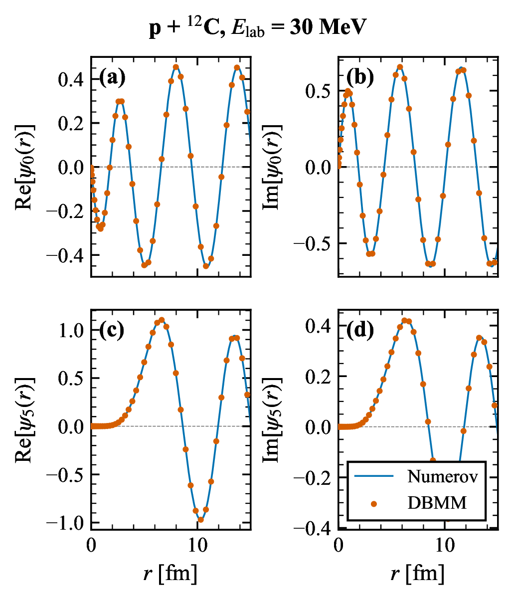
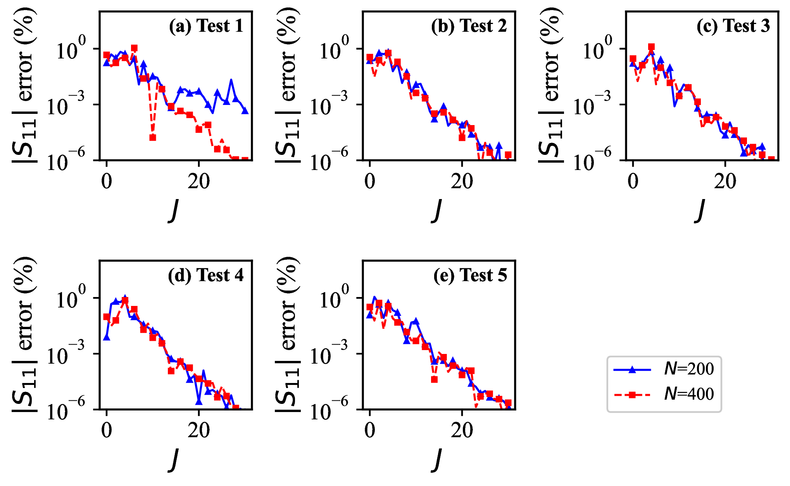
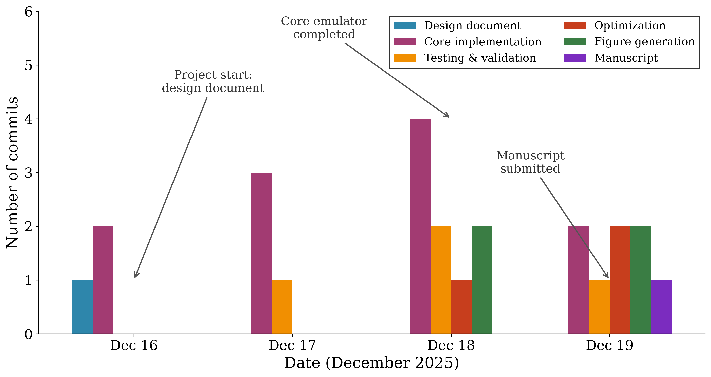

# Vibe Research 在直接核反应理论中的实战

LLM-Assisted Research in Low-Energy Nuclear Theory

**Jin Lei (金磊)** 
同济大学物理科学与工程学院 / Tongji University

安徽大学核物理报告会 · 2026 年 4 月 25 日

Dec 2025 – Apr 2026 · 16 papers · 11 on arXiv · 2 published + 1 accepted by Phys. Rev. C + 1 accepted by Phys. Lett. B

⚠ 免责声明: 建议尚不具备独立科研能力的低年级研究生现在离场. 本报告的内容如果被没有 Expert Filter 的人照搬, 大概率会毁掉整个科研生涯.

<!--
Central message: 今天的焦点不是"16 篇"这个数字, 而是让它在一个成熟子领域里变得可能的那套研究者与工具的分工, 以及它对整个核物理可能意味着什么.

开场: 各位老师下午好, 感谢王思敏老师的邀请. 过去四个月, 2025 年 12 月到今天, 我在大语言模型的日常协助下完成了十六篇论文, 十一篇已经上了 arXiv, 两篇已在 Phys. Rev. C 发表, 一篇刚被接收. 今天不来炫耀数字, 来讲清楚这个数字怎么来的, 以及它背后那套我称为 Vibe Research 的工作流.

Time: 0:00 to 0:30
过渡: 先给你们一个非常不对称的对照实验.
-->

---
layout: default
---

# ● 一个不对称的对照实验

2024

~3 months

单通道散射 emulator 
复杂度: <strong>1 channel</strong> 
工具: GPT-4 网页版 
执行者: 同济博士生 (同济本校保研, GPA top), GPT-4 辅助

[Liu, Jin Lei, Ren, Phys. Lett. B <strong>858</strong>, 139070 (2024)]

2025-12

4 days

CDCC reduced-basis emulator 
复杂度: <strong>37 channels, 18 parameters</strong> 
执行者: 我 + Claude Code CLI (agentic) 
没有学生参与

[Jin Lei, Phys. Rev. C 113, 044610 (2026)]

<v-click>

**同济保研博士生 3 个月 vs 我 + AI 4 天. 复杂度还高了一个量级.** 
学生: 反馈慢、不可控、需要情绪价值、push 狠了觉得你是法西斯. AI: 花钱, tokens 够, 立刻出结果, 情绪价值还拉满.

</v-click>

<!--
Central message: 这是一个天然对照. 同一个导师, 同一套物理, 同一类问题. 变量是谁在写代码: 同济保研的博士生 vs 我+AI. 结果: 复杂度 ×10, 时间 ÷20.

讲: 左边卡片是 2024 年的单通道散射 emulator, 发在 Phys. Lett. B. 当时是我带的博士生 Liu 做的, 同济本校保研上来的, GPA 排名很靠前, 用 GPT-4 网页版辅助. 三个月. 右边卡片是 2025 年 12 月我自己做的 CDCC 耦合道 emulator, 37 个耦合道, 18 个光学势参数, 复杂度大一个数量级. 用 Claude Code CLI, 没有学生参与. 四天. 已发表于 PRC.

关键观察: 不只是速度问题. 学生写代码不可控, 动不动就做别的事, 你让他做一件事非常难, 得到一个正确的反馈更难, 而且这个反馈周期会被拉到无限长. 你 push 狠了, 学生觉得你是法西斯; 不 push, 三个月过去了还在原地. 还要给他提供情绪价值. AI 不需要这些. 只要花钱, tokens 足够, 迅速得到结果, 而且情绪价值拉满——它永远不会觉得你要求太多.

这不是说学生没有价值, 是说在编码执行这个维度上, agentic AI 已经完全超过你能招到的最好的学生. 导师的时间应该花在物理判断和方向把控上, 不是花在催代码上.

Time: 0:30 to 2:00
过渡: 为什么这四天能发生? 从一个长期被回避的事实说起.
-->

---
layout: default
---

# ● 计算物理的真实瓶颈

<v-clicks>

一个计算物理项目的智力内核通常在<strong>几天到几周</strong>内结晶:

一个物理想法 · 一个新算法 · 一个数值不稳定性的来源 · 一个物理诠释

把这个内核变成一篇发表的论文通常需要<strong>几个月到几年</strong>:

内存分配 debug · 库文档查阅 · 图表格式调整 · 论文撰写 · 审稿回复

**一个长期被回避的事实:** 一个研究者一辈子能做完的物理远少于他能想到的物理. 真正的约束从来不是"想什么", 而是"做完什么". Implementation overhead 占据了总工作量的绝大部分. 智力内核只是少数份额.

</v-clicks>

<!--
Central message: 计算物理有一个不太公开讨论的结构性事实, 智力内核只占总时间 20%, 其余 80% 是 implementation overhead.

讲: 我想先把一件大家心里都明白但很少公开讲的事说出来. 在计算物理里, 从想出一个 idea 到把它变成一篇论文, 绝大部分时间不是花在"想物理"上, 是花在"让物理变成工作代码和合格论文"上. 我自己粗略估, 一个典型方法学论文里, 真正的物理思考不到 20% 时间. 剩下 80% 是 boilerplate, debug, 查 library, 调图, 写样板段落, 回 referee.

这个 80/20 分布过去被当成自然规律, 因为这些工序必须由研究者本人做. 但它不应该是自然规律, 因为这 80% 里真正需要物理判断的工序非常少. 绝大部分是机械劳动.

Time: 2:00 to 3:30
过渡: 这个瓶颈在直接核反应这个子领域尤其极端.
-->

---
layout: default
---

# ● 直接反应: 一个极端案例

<v-clicks>

**理论骨架: 几十年前已定型**

DWBA · ADWA · CDCC · R-matrix · Faddeev · IAV breakup 
形式框架在 1960s 到 1990s 之间全部成形. 此后: 完善, 而非突破.

**实验数据: 增长速度超过理论家的处理能力**

FRIB · RIKEN · GANIL · HIAF · FAIR · NSCL 
全球 RIB 设施产出反应数据的速度远超理论端的消化能力.

**理论家: 停滞或萎缩**

低能核理论博士产出 20 年来持平. 资深理论家陆续退休. 
可用于将数据转化为物理的有效人力: 持平或下降.

**结构性后果:** 可以问的物理远多于能做完的物理. 传统的解法("培养更多学生")回报递减, 二十年来越填越窄.

</v-clicks>

<!--
Central message: 直接核反应不是过气子领域, 是劳动力短缺限制的子领域. 理论不缺, 数据不缺, 缺的是翻译数据的人.

讲: 让我具体到直接反应. 理论骨架这一块, DWBA ADWA CDCC R-matrix Faddeev IAV breakup, 从 1960s 到 1990s 之间全部成形. 之后是完善和扩展. 这不是贬义, 是说一个成熟框架. 数据这一块, RIB 设施每年产出以近乎指数的速度增长. 理论家这一块, 过去二十年博士产出基本持平, 资深研究者陆续退休.

结构性的后果是: 可以问的物理远多于能做完的物理. 过去用"培养更多学生"填这个缺口, 但这条路越填越窄, 因为核理论的资源增长比不上实验端.

Time: 3:30 to 5:00
过渡: 面对这个瓶颈, 围绕 LLM 出现了两个极端, 两个都错了.
-->

---
layout: default
---

# ● 两个极端, 都错了

怀疑派

"LLM 摧毁科学严谨性."

虚构引用 · 错误物理 · 随机鹦鹉 · 不可验证.

  

<strong>对的:</strong> LLM 确实会犯错, 需要人工验证. 
<strong>错的:</strong> 把"需要监督"等同于"不能使用".

热情派

"AI Scientist 能做端到端研究."

自主生成论文 · 每篇 $15 · 不需要研究者. 
[Sakana AI, 2024]

 

<strong>对的:</strong> LLM 能起草代码和文章. 
<strong>错的:</strong> 把"能起草"等同于"能决策".

<v-click>

**中间立场: Vibe Research = 协作, 不是自动化.** 
人的判断始终居中. LLM 处理摩擦. Expert Filter 不可简化.

</v-click>

<!--
Central message: LLM-for-science 的讨论被两个极端占据, 两边都没被真正做研究的人充分检验过. 正确立场在中间, 是一种精确的人机分工.

讲: 两边各自有一部分对. 怀疑派说"需要验证"对, 但不等于"不能用", 等于"不能盲用". 热情派说"能写样板代码"对, 但不等于"能做决策". Sakana AI 的 AI Scientist 我读过, 证明了 LLM 能端到端出论文, 每篇 $15, 但那些论文都是现有方法的增量变体, 没有新洞见. 这和我的经验一致: LLM 不会帮你想出新东西, 它让你更快做完那些本来想做但没时间做的东西.

Time: 5:00 to 6:30
过渡: 下一页先交代 "vibe" 这个词的来源.
-->

---
layout: default
---

# ● 先交代一下: "Vibe" 从哪来?

"There's a new kind of coding I call <strong>vibe coding</strong>, where you fully give in to the vibes, embrace exponentials, and <strong>forget that the code even exists</strong>."

— Andrej Karpathy, 2025 年 2 月 
OpenAI 联合创始人 · 前 Tesla AI 负责人

**Vibe Coding 的原味** (消费级):

- 自然语言描述需求, 语音也行
- 接受 AI 生成的代码, **不逐行审读**
- 出错就把报错丢回去继续改
- 写个周末小工具, "跑得起来就行"

一年内进入主流词汇

- Collins 英语词典 **Word of the Year 2025**
- Merriam-Webster 2025 年 3 月收录
- 一条推特 → 行业术语

**但科研不能照抄:** 
"forget the code" 在消费级 app 里可行, 在 Phys. Rev. 上不可行. 物理错误不会报错, LLM 会自信地给你一个看起来对的错结论.

<v-click>

所以今天讲的不是 Vibe Coding, 是 <strong>Vibe Research</strong> — 借 Karpathy 的加速直觉, 但把"放弃理解代码"换成"放弃手写代码"; 物理判断必须由研究者亲手把关.

</v-click>

<!--
Central message: "Vibe" 不是我造的词, 是 Karpathy 2025 年 2 月的推特引爆的. 我借了这个词和它背后的加速直觉, 但改掉了一条关键约束.

讲: 很多老师可能第一次听到 vibe 这个词, 先花一分钟交代来源. Andrej Karpathy, OpenAI 联合创始人, 前 Tesla AI 负责人, 2025 年 2 月一条推特: "有一种新的写代码方式, 我叫它 vibe coding, 完全跟着感觉走, 相信指数增长, 忘了代码还存在". 他当时在用 Cursor + Claude 语音指令写一个菜单生成器, 出错就把 error message 丢回去, 从不读 diff. 一年之内这个词进了 Collins 年度词和 Merriam-Webster.

但这套消费级玩法直接搬到科研就是灾难. 物理错误 LLM 不会报错, 它会自信地给你一个看起来合理的错结论. 所以我借了这个词和它的加速直觉, 但把"放弃理解代码"改成"放弃手写代码, 保留理解物理". 这就是为什么下一页要给 Vibe Research 一个精确定义, 而不是直接用 vibe coding.

Time: 6:30 to 8:00
过渡: 下一页, Vibe Research 的精确定义.
-->

---
layout: default
---

# ● Vibe Research: 精确定义

<strong>人的判断力 × LLM 实现速度</strong>

人保留的 (不可替代)

- 问题选择 (解决什么)
- 物理判断 (这合不合理)
- 数值直觉 (这对不对劲)
- 结果解释 (这意味着什么)
- 最终筛选 (什么进论文)

LLM 加速的

- 文献综合: 周 → 天
- 样板代码: 天 → 秒
- 算法实现: 周 → 小时
- Debug: 假设和诊断在秒级完成
- 图表和初稿: 天 → 小时
- 审稿回复: 天 → 小时

<v-click>

"Vibe Research 不是让 AI 替你做物理. 是把物理之外的一切交给 AI, 再把省下的时间用来做更多的物理."

</v-click>

<!--
Central message: 关键不是让 AI 变聪明, 而是把 what 和 how 严格分开. 研究者始终处于 what 的位置, LLM 承担 how 的全部劳动.

讲: 左栏是研究者永远不能外包的部分, 依赖物理品味和领域直觉, LLM 没有. 右栏是 LLM 可以大规模加速的, 依赖 pattern matching 和代码合成, LLM 比我们强得多.

最重要那句话放在收尾: Vibe Research 不是让 AI 替你做物理, 是把物理之外的一切工序交给 AI, 再把省下的时间用来做更多的物理. 这句话把"是否放弃科学"和"是否加速科学"分开了.

Time: 6:30 to 8:00
过渡: 这个分工的流程图.
-->

---
layout: default
---

# ● Expert Filter (专家过滤器)

<v-clicks>

**传统流程:** 
Idea → 几个月 coding → 结果 
迭代缓慢. 90% 时间花在 implementation 上.

**AI 协作流程:** 
Idea → AI coding (小时) → **Expert Filter** → 结果 
快速迭代. 90% 时间花在判断上.

**悖论:** LLM 不是民主化研究. Expert Filter 放大专家优势. 非专家得到同样的输出, 但无法区分信号与噪声.

</v-clicks>

<!--
Central message: Expert Filter 是新工作流的关键结构, 不是可选项. 反直觉的推论是 LLM 不是民主化研究, 是放大专家优势.

讲: 左图两半, 左是传统工作流, idea 后面接几个月 coding 得到结果, 循环慢. 右是 AI 协作工作流, idea 后面接几小时 AI coding, 然后 Expert Filter, 过不了回去 iterate, 过了得到结果. Expert Filter 这一层不能省. 去掉它你会发表一堆物理上错的东西. 只要 filter 在位, 迭代周期从月变成小时.

反直觉推论: LLM 不会让非专家变成专家. 恰恰相反, Expert Filter 需要领域知识和物理直觉, 非专家没有. LLM 让有品位的人更快, 不让没品位的人变聪明.

右图标签: 三个 box, 分别是传统流程的问题、新流程的结构、Paradox 观察.

Time: 8:00 to 9:30
过渡: 讲完了思路, 接下来两个具体案例. 第一个是一个数值方法.
-->

---
layout: default
---

# ● 案例一: DBMM, 问题
## Direct Boundary Matching Method

核散射问题有一个长期存在的技术痛点: **边界条件处理是繁琐的.**

<v-clicks>

<strong>现有的绕行方案:</strong>

1. **R-matrix method** · Bloch operator 保证厄米性, 然后两步匹配 Coulomb 函数
2. **Complex Scaling** · 旋转 $r \to r e^{i\theta}$ 使散射态变为 $L^2$ 衰减函数
3. **Lorentz Integral Transform** · 通过 Lorentzian kernel 将连续谱转为束缚态, 再反演

**共同代价:** 每种方法都需要额外的形式化机器 (Bloch operator, 坐标旋转, kernel 反演). 代码复杂度和推导长度都增加. 应用到新系统意味着每次都要重新打通整套框架. 
**根本原因:** 散射态的振荡和不衰减渐近行为与束缚态的 $L^2$ 表示相冲突.

</v-clicks>

<!--
Central message: 散射问题的数值处理有一个长期痛点, 需要借助额外形式化机器把连续谱嵌入 L^2 空间. 现有方法都 work 但都带来形式化代价.

讲: 散射问题在数值上有一个根本尴尬, 波函数在无穷远处不衰减, 但所有好用的数值方法都假设无穷远衰减. 过去几十年发展了几种绕过这个尴尬的方法. R-matrix 用 Bloch operator 保持厄米性再两步匹配库仑波函数. Complex scaling 把坐标旋到复平面让散射态变成衰减的 L^2 函数. LIT 用 Lorentzian kernel 把问题变成 bound-state. 每一种都 work, 但都需要额外形式化机器, 代码复杂, 推导冗长, 每次应用到新系统都要重新打通一遍.

Time: 9:30 to 11:00
过渡: DBMM 的想法是绕过这些机器.
-->

---
layout: default
---

# ● 案例一: DBMM, 简洁的想法

**把出射波边界条件直接写进矩阵方程的最后一行.** 
不需要 Bloch operator. 不需要坐标旋转. 不需要 kernel 反演.

<v-click>

**设定:** 径向 Schrödinger 方程在 $[0, R]$ 上, 用 Lagrange-Legendre 基 $\hat f_j(x)$ 在 Gauss-Legendre 网格点上展开.

**内部行** $i = 1, \dots, N-1$: $\sum_j M_{ij} c_j = b_i$, 标准离散化 Schrödinger.

**最后一行** ($i = N$) 直接编码出射波边界条件,

$$\sum_{j=1}^N B_j c_j = 0, \quad B_j = \left.\frac{d\hat f_j}{dx}\right|_{x=1} - R\gamma_s \hat f_j(1), \quad \gamma_s = k\frac{H_\ell^{+\prime}(\eta, kR)}{H_\ell^+(\eta, kR)}$$

一次矩阵求解. 无需后处理匹配步骤.

</v-click>

<v-click>

**形式上的推论:** 矩阵的每一行对应一个清晰的物理陈述. 内部行说 "Schrödinger 在此处成立." 最后一行说 "出射波在 $r = R$ 处成立." 形式本身自解释. 直接推广到耦合道, 不需要任何额外技巧.

</v-click>

<!--
Central message: DBMM 在技术上非常简单. 就是把出射波边界条件直接嵌进矩阵最后一行. 不要 Bloch operator, 不要坐标旋转, 不要 kernel inversion.

讲: 前 N-1 行是标准的离散 Schrödinger 方程, 在 Lagrange-Legendre 网格点上. 最后一行是出射波边界条件, 写成关于系数 c_j 的一个线性约束: 导数在 r=R 处减去 γ_s 乘以函数值等于零. γ_s 是出射库仑-汉克尔函数的对数导数. 整个方程组变成一个 N×N 非对称复矩阵, 一次线性求解就拿到完整散射波函数和 S 矩阵.

结构的副作用很漂亮: 矩阵的每一行对应一个清晰的物理陈述. 前 N-1 行说"内部 Schrödinger 成立", 最后一行说"r=R 处出射波成立". 形式本身自解释. 耦合道推广也是自然的, 不需要额外机器.

Time: 11:00 to 12:30
过渡: 这个想法对不对? 用 p+12C at 30 MeV 做标准验证.
-->

---
layout: default
---

# ● 案例一: DBMM 验证
## p + ¹²C, E_lab = 30 MeV, 与 Numerov 对照

$|S_\ell|$ 和 $\arg(S_\ell)$ 随 $\ell$ 变化

复 $S_\ell$ 平面上的 Argand 图

径向波函数 $\psi_\ell(r)$, $\ell = 0, 5$

<v-click>

**结论:** $|S_\ell|$ 与 Numerov 符合到 $2.5 \times 10^{-5}$, 相位符合优于 $0.01°$, 覆盖所有分波. 波函数在每个网格点上吻合, 从内部到渐近区. **矩阵的每一行对应一个清晰的物理陈述, 这种自解释结构正是让 POD-Galerkin 在案例二中保持简洁的关键.**

Jin Lei, Phys. Rev. C 113, 024614 (2026)

</v-click>

<!--
Central message: DBMM 与 Numerov 的 benchmark 达到 5 个数量级的符合. PRC 级别的验证.

讲: 三张图并排. 左图是 S 矩阵元素的模 |S_l| 和相位 arg(S_l), 横轴是部分波 l. 圆圈是 Numerov 参考, 方块是 DBMM. 两条线完全重合, l=0 到 10 全部符合. 中图是 Argand 图, S 矩阵在复平面的轨迹, 低 l 在单位圆内吸收强, 高 l 接近单位圆弹性散射. 右图是径向波函数实部虚部, 上面 l=0, 下面 l=5, 实线 Numerov, 圆圈 DBMM 在 Lagrange 网格点上取值, 在整个径向范围完美符合.

量化: |S_l| 差 2.5×10^-5, 相位差小于 0.01 度. 论文已发表于 Phys. Rev. C 113, 024614 (2026).

Time: 12:30 to 14:30
过渡: DBMM 是一个求解器. 把它当砖头就能盖更高的建筑. 第二个案例就是这么搭起来的.
-->

---
layout: default
---

# ● 案例二: CDCC 计算瓶颈

<v-clicks>

**CDCC** (Continuum-Discretized Coupled-Channels): 直接反应的主力方法. 将三体散射转化为有限维耦合道. 严格处理 breakup 对弹性和反应截面的反馈.

**一次现代 CDCC 计算:**

- $N_{\mathrm{ch}} \sim 30$ 到 $50$ 个耦合道
- $J_{\mathrm{max}} \sim 30$ 个分波
- $\sim 10^4$ 维复线性系统
- **单次完整计算: 几十分钟到几小时**

**对 Bayesian UQ 来说, 这是一堵墙.** MCMC 和 nested sampling 需要 $10^4$ 到 $10^6$ 次 likelihood 评估. 几十分钟乘以几十万次等于 $O(10^6)$ CPU-hours. 不是慢, 是实际上不可行.

</v-clicks>

<!--
Central message: CDCC 是直接反应的标准工具, 但它的计算代价让它和现代贝叶斯不确定性量化不兼容.

讲: CDCC 是这个子领域过去三十年的主力方法. 把连续谱离散化成 momentum bins, 再把三体散射变成有限维耦合道问题, 通常 30 到 50 个通道, 约 30 个部分波. 一次完整计算大约 10^4 维复线性系统, 在 workstation 上几十分钟到几小时.

这个代价本身不是大问题. 真正的问题是你不能用它做贝叶斯不确定性量化. 现代贝叶斯方法需要 10^4 到 10^6 次 likelihood 评估. 按每次 30 分钟算, 至少 5000 CPU-hours, 上限 50 万 CPU-hours. 这不是慢, 是 practically prohibitive. 这就是为什么直接反应社区长期不能对光学势做严格的贝叶斯 UQ, 对 halo nuclei 这种对光学势敏感的系统是一个长期空白.

Time: 14:30 to 16:00
过渡: 解决的思路是 reduced basis emulator. 但先花一分钟讲清楚 emulator 是什么.
-->

---
layout: default
---

# ● 什么是 Emulator?

<v-clicks>

**一句话:** 精确求解器的快速近似代理 (fast surrogate).

用少量精确解"学"出低维表示, 使新参数点的计算从**分钟级压缩到毫秒级**.

Offline (一次性投入)

1. 在参数空间采样 $N_s$ 个点 
2. 每个点运行完整求解器 
3. 从 $N_s$ 组精确解中提取低维结构

代价高, 但只做一次

Online (每次新参数)

1. 投影到低维空间 
2. 求解 $n_b \times n_b$ 小系统 ($n_b \ll N$) 
3. 重建完整解

毫秒级, 可重复 10⁶ 次

**为什么核物理需要它?** Bayesian UQ 需要 $10^4$–$10^6$ 次 likelihood 评估. 
Emulator 让每次评估从 30 min → 30 ms, 使贝叶斯推断从不可行变为常规操作.

</v-clicks>

<!--
Central message: Emulator 的核心是 offline-online 分离. Offline 花一次性大代价建低维 basis, online 每次新参数只做小系统求解.

讲: 在讲具体方法之前, 先花一分钟把 emulator 这个词说清楚. Emulator 就是精确求解器的快速近似代理. 比如你有一个 CDCC 求解器, 跑一次要半小时, 而你做贝叶斯推断需要跑几十万次. 直接跑, 50 万 CPU-hours, 不现实. Emulator 的思路是: 先花一次性的代价, 在参数空间采样几百个点, 每个点跑完整求解器, 得到几百组精确解. 然后从这些解里提取低维结构, 一个 reduced basis. 之后每来一组新参数, 只需要把方程投影到这个低维空间, 求解一个很小的线性系统, 毫秒级出结果. 10 万次评估从 50 万 CPU-hours 变成几十分钟.

Time: 16:00 to 17:00
过渡: 这个思路在核物理里有三条主要技术路线.
-->

---
layout: default
---

# ● 核物理 Emulator: 三条路线

<v-clicks>

**Eigenvector Continuation** 
Furnstahl, Garcia, Millican & Zhang (2020)

不同参数点的精确解构成非正交变分基, 通过 **Kohn 变分原理**求 K-matrix. 在 NN 散射和 $\alpha$-${}^{208}$Pb 中验证. 核结构领域 (NCSM) 也广泛使用.

**POD-Galerkin / RBM** 
Liu, Jin Lei & Ren, PLB (2024) **Jin Lei, PRC 113, 044610 (2026)** ← 今天的案例

SVD 提取主模式 (proper orthogonal decomposition), **Galerkin 投影**将耦合方程降维. 源自计算流体力学, 代数结构清晰, 天然适配矩阵求解器.

**机器学习代理** 
GP emulators; BANNANE (2026)

Gaussian process, 神经网络等统计模型拟合输入-输出映射. BANNANE 首次实现跨核素 ($Z, N$) 仿真, 突破连续参数限制.

**共同点:** 都不是 black box. 都利用物理方程对参数的**连续依赖性**, 用数学降维而非暴力拟合.

</v-clicks>

<!--
Central message: 三条路线各有侧重, 但都基于同一个物理直觉, 即参数连续变化时解也连续变化, 可以用少量样本张成的低维空间捕捉.

讲: 核物理里 emulator 主要有三条路线. 第一条, eigenvector continuation, Furnstahl 组 2020 年开创. 思路是把不同参数点的精确散射解当作变分基, 通过 Kohn 变分原理算 K-matrix. 在 NN 散射, 带电粒子散射, 含复光学势的体系都验证了. Molchanov 等人把它用到 NCSM 里, 做了 4He 6Li 6He 的贝叶斯推断, 采样 250 万次.

第二条, POD-Galerkin, 就是 proper orthogonal decomposition 加 Galerkin 投影. 这条路线从计算流体力学借来, 代数结构非常清晰. 我们 2024 年的 PLB 走的这条路, 今天要讲的 CDCC emulator 也是, 而且直接搭在 DBMM 之上继承矩阵结构.

第三条, 机器学习. Gaussian process emulator 用了好几年, 今年的 BANNANE 用神经网络做到了跨核素仿真, 不仅变连续参数还能变质子数和中子数.

三条路线技术不同, 但共同点是: 都不是 black box, 都利用物理方程对参数的连续依赖性, 用数学降维.

Time: 17:00 to 18:15
过渡: 我们的 CDCC emulator 走第二条路线. 具体怎么做?
-->

---
layout: default
---

# ● 案例二: 基于 DBMM 的 POD-Galerkin

<v-clicks>

**Offline (一次性)** 
1. 在采样参数处求解 $N_s$ 次完整 CDCC 
2. 将 snapshot 收集到矩阵 $C_{\mathrm{snap}}$ 
3. SVD 截断, 保留 $n_b$ 个主要模式 
4. 预计算与参数无关的矩阵

**Online (每组新参数)** 
1. 在 $\boldsymbol\theta_*$ 处构建势能矩阵 
2. Galerkin 投影到 $n_b$ 维基上 
3. 求解 $n_b \times n_b$ reduced system 
4. 重建完整解, 输出 $d\sigma/d\Omega$

**基石:** reduced system 继承了 DBMM 的矩阵结构. DBMM 不是一个平行项目, 而是让 POD-Galerkin 在耦合道问题上保持简洁的数值基础.

</v-clicks>

<!--
Central message: reduced basis emulator 结构不是新的, POD + Galerkin 在流体力学用了几十年. 新的是它第一次应用到 CDCC, 而且直接搭在 DBMM 之上, 继承 DBMM 的矩阵结构, 避免 Bloch operator 的麻烦.

讲: 这张图是 Paper B 的 Fig 1. 分 offline 和 online.

Offline 蓝色左半: 参数空间里 Latin hypercube 采 Ns 个样本, 对每个样本跑完整 CDCC, 拼成 snapshot matrix, 做 SVD 留 nb 个 dominant modes. 这几个 modes 就是 reduced basis. 最后把不依赖参数的矩阵元预算存起来. 一次性投入大约 11 小时 (200 × 31 部分波 × 6.5 秒, 48 核).

Online 绿色右半: 新参数 θ_* 只需要构建依赖参数的势能矩阵, Galerkin 投影到 nb 维 basis, 求解 nb × nb 小系统, 重建回完整空间. 30 毫秒每部分波.

关键: 矩阵结构继承自 DBMM. 用 Bloch operator 的 R-matrix 框架 POD 的代数会变得很麻烦. DBMM 的每一行自解释, POD 投影就变成干净的矩阵运算. 所以 DBMM 不是平行项目, 是让 POD-Galerkin 在耦合道问题上变干净的那块基石.

Time: 18:15 to 19:30
过渡: 用这个结构算一个具体系统, 58Ni(d,p) at 21.6 MeV.
-->

---
layout: default
---

# ● 案例二: 测试问题

**体系:** $d + {}^{58}\mathrm{Ni}$ 弹性散射和 breakup, $E_d = 21.6$ MeV

<strong>物理设定</strong>

- 氘核作为 $n+p$, 连续谱离散化为 $s, p, d$ 波到 12 MeV
- $J_{\mathrm{max}} = 30$ 个分波, $N_{\mathrm{ch}} = 37$ 个耦合道
- 每个 $J$ 的矩阵大小 $\sim 5000 \times 5000$ 复数

<strong>参数空间</strong>

- 18 个光学势参数同时变化
- 9 个 $p + {}^{58}\mathrm{Ni}$, 9 个 $n + {}^{58}\mathrm{Ni}$
- Woods-Saxon volume, surface 和 Coulomb
- 在 KD02 全局参数化基础上变化 10% 到 50% [Koning-Delaroche, NPA 713, 231 (2003)]

<strong>训练</strong>

- $N_s = 200$ 个样本, Latin hypercube 采样
- 每个 $J$ 独立 reduced basis ($n_b \sim 5$ 到 $50$, 随 $J$ 变化)
- SVD 容差 $\epsilon_{\mathrm{tol}} = 10^{-6}$
- Offline 代价 ≈ 11 小时, 48 核 (Xeon Gold 6248R)
- 摊到 $10^5$ 到 $10^6$ 次 Bayesian 评估上, offline 代价可忽略

<strong>为什么这是真正的测试</strong>

18 维同时变化的参数空间正是 naive surrogate 方法 (RBF, 少参数 EIM) 崩溃的区域. 也是 halo nuclei 光学势 UQ 真正需要的维度.

<!--
Central message: 这个测试系统不是玩具例子. 58Ni(d,p) 21.6 MeV 是典型 (d,p) 转移反应, 18 维同时变化参数空间恰好是现有 emulator 最薄弱的区域.

讲: 物理 setup 是氘核打 58Ni 弹性和 breakup, 21.6 MeV. 氘核作为 n+p 两体, 连续谱离散化成 s p d 波到 12 MeV, 得 37 个通道. 部分波到 J=30, 每个 J 的矩阵 5000×5000 复数.

参数空间 18 维, 9 个 proton-target 9 个 neutron-target, 基于 Koning-Delaroche 的 KDU3p 全局参数化, 变化 10% 到 50%.

训练 Latin hypercube 200 样本. 每个 J 独立 reduced basis, nb 从 5 到 50. SVD 容差 1e-6. Offline 约 11 小时 48 核. 摊到 10^5 到 10^6 次贝叶斯 evaluation 上可以忽略.

为什么是真测试: 18 维参数空间是现有 surrogate 方法崩溃的区域. 也是 halo-nucleus 光学势 UQ 真正需要的维数.

Time: 17:30 to 18:30
过渡: 结果.
-->

---
layout: default
---

# ● 案例二: 结果
## 220× 加速, 亚 0.1% 精度

分波弹性 $\sigma_J$ 随 $J$ 变化, 5 组测试. Exact (黑) 与 emulator ($N_s=200$ 蓝, $N_s=400$ 红) 完全重合.

$|S_{11}^J|$ 相对误差随 $J$ 变化. 大多数 $J$ 低于 0.1%, 典型 $10^{-4}$ 到 $10^{-2}$%.

<v-click>

**结论:** 对 5 组独立测试参数, **37 channels, 18 parameters**: emulator 在分波截面, S-matrix 元素, 波函数系数 $c_1(r)$ 和角分布上与完整 CDCC 吻合. 总截面误差: **0.005 到 0.043 %**. 时间: **6.5 s → 30 ms 每分波**, ≈220× 加速.

</v-click>

<!--
Central message: 5 个独立测试参数组精度亚 0.1%, 加速 220 倍. 不是 cherry-picked 的单点结果.

讲: 左图 5 个测试组的分波弹性截面 σ_J vs J. 黑实线 exact CDCC, 蓝 emulator Ns=200, 红 emulator Ns=400, 三条完全重合肉眼分辨不出.

右图 5 个测试组的 |S_11^J| 相对误差. 大多数部分波低于 0.1%, 典型 10^-4 到 10^-2%. 增加到 Ns=400 只有边际改善.

量化: 总弹性截面误差 5 个测试组在 0.005% 到 0.043%, 平均 0.016% at Ns=200. 时间: 全 CDCC 每部分波 6.5 秒, emulator 30 毫秒, 加速 220×.

Time: 18:30 to 20:00
过渡: 这个性能在 emulator 领域处在什么位置? 同期另外两个工作做同类事情. 对比.
-->

---
layout: default
---

# ● 案例二: 外部对比
## 同一时间窗口, 同一 LLM 时代, 同一子领域

| | **Catacora-Rios et al.** | **Liao et al.** | **This work** |
|---|:---:|:---:|:---:|
| **arXiv** | 2512.08097 | 2512.09429 | 2512.17687 |
| **Method** | Petrov-Galerkin + EIM (on FRESCO) | Eigenvector Continuation, RBM (on CCFULL) | POD + Galerkin + DBMM |
| **Target** | $^{48}$Ca / $^{208}$Pb inelastic (n,n') | $^{16}$O + Sm, W sub-barrier fusion | $d + {}^{58}$Ni, full CDCC |
| **Channels** | 2 to ~5 | 2, 3, 4 (three systems) | **37** |
| **Parameters** | 10 (WS + one $\beta$) | **2** ($\beta_2$, $\beta_4$) | **18** (full OP) |
| **Speedup** | ~30× | 200 to 400× | ~220× |
| **Accuracy** | ~1% median | matches exact curves | **< 0.1%** |

<v-click>

**同样四个月. 同一 LLM 时代. 同一子领域. 产出截然不同.** 
差别不在谁能用 LLM. 所有人都能用. 差别在工作流.

</v-click>

<!--
Central message: 这一页是全场最硬的数据点. 不是"我觉得 vibe research 好", 是同一时间窗口同一 LLM 时代同一子领域里三个工作的直接对比. 诚实地看: 不是我更快, 是我在 "通道数 × 参数维度 × 精度" 这个三维 scale 上同时推进, 而另外两组各自只在其中一个维度上优化.

讲: 2025 年 12 月这个月里还有两个团队在做非常类似的事. Let me describe them precisely.

Catacora-Rios 团队 (MSU FRIB + Ohio State, 论文作者包括 Nunes 和 Furnstahl) 用 Petrov-Galerkin 投影加上 EIM (empirical interpolation method) 处理 non-affine 参数依赖, 这个 emulator 搭在 FRESCO 代码之上. 他们的应用是 48Ca(n,n')48Ca(2+) 和 208Pb(n,n')208Pb(3-), 属于 inelastic scattering 加 collective excitation. 通道数从 2 到约 5 个, 参数 10 个 (Woods-Saxon 9 个 + 一个形变参数). 加速约 30 倍, 是"一个半数量级". 典型精度 1% 左右, median error 在 10^-3 到 10^-1 之间, 取决于 basis size.

Liao 团队 (Sun Yat-sen + Kyoto + RIKEN) 用 eigenvector continuation, 这个方法数学上就是 reduced basis method 的一个特例, 搭在 CCFULL 代码之上. 应用是 16O + 144Sm, 16O + 154Sm, 16O + 186W 三个 sub-barrier fusion 系统, 目的是从 fusion 截面提取目标核的形变参数 (β2, β4). 参数只有两个. 通道数分别是 2, 3, 4 对应三个系统. 加速 200, 300, 400 倍, 精度和 exact 几乎看不出差异.

我的工作: 37 个通道, 18 个参数, 220 倍加速, 亚 0.1% 精度. 同一个月上 arXiv.

重点: 这三个工作不是直接可比的, 因为问题维度不一样. Liao 的 400× speedup 比我快, 但他们的参数空间是 2 维. Catacora-Rios 的参数维度 10 维接近我, 但通道数只有 2 到 5, 而且精度差我一个数量级. 我这边处理的是"通道数 ×10, 参数 ×2, 精度 ×10"同时推进. 我的等效问题复杂度量级比两者都高一到两个数量级.

真正关键的是: 同一时间窗口同一 LLM 时代. 三个团队都可以用 Claude 或其他 LLM. 差别不在谁能用 LLM, 在如何使用. 我的假设是: 我的工作流让我能在四天做完通常三个月的任务, 这个时间优势让我能去选更深的技术路线 (用 DBMM + POD, 让矩阵结构一开始就是干净的, 不需要 EIM 那层近似, 也不需要 FRESCO 那样的外部依赖).

这个对比不是贬低其他两组工作, 他们都扎实. 是定量说明: 同样的工具不同的工作流, 能覆盖的问题 scale 不一样.

Time: 20:00 to 22:00
过渡: 那四天到底是怎么过的? 看 git 历史.
-->

---
layout: default
---

# ● 那四天
## Git commit 历史, 2025 年 12 月 16 日至 19 日

<v-click>

**时间线显示:** 设计文档 → 核心实现 → 测试与优化 → 图表生成 → 论文提交. **四个自然日.** 几千行代码. 每个 prompt, 每次代码迭代, 每个 debug 步骤都在本地 git 历史里.

</v-click>

<!--
Central message: 这不是 post-hoc 重构的故事. Git 历史是 immutable evidence.

讲: 这张图从 git commit 历史 reconstruct 出来. 横轴 12 月 16 到 19 日共 4 天, 纵轴每日 commit 数, 每个 commit 按类型着色.

Dec 16: 项目开始, 设计文档加一些核心实现的雏形.
Dec 17: 核心实现全面展开, 3 个核心实现 commit.
Dec 18: 核心 emulator 完成, 测试验证 + 图生成.
Dec 19: 优化 + 最终图表 + manuscript 提交.

全部 3354 行 Fortran 90 代码, 完整 git 历史和对话记录都在本地版本控制里. 每个 prompt 每次代码 iteration 每次 debug 步骤都在 log 里. 这不是事后重构的故事, 是 immutable 的记录.

强调一点: 这四天没有熬夜. 每天正常工作时间. 是流程改变的故事, 不是我突然变勤奋的故事.

Time: 22:00 to 23:30
过渡: 这四天是否只是运气? 不是. 和 2024 年同一个人的类似项目对比.
-->

---
layout: default
---

# ● 内部对比
## 2024 vs 2025: 同济保研博士生 vs 我 + AI

| | **2024 项目** | **2025 项目** |
|---|:---:|:---:|
| **内容** | 单通道散射 emulator | 耦合道 CDCC emulator |
| **通道数** | 1 | 37 |
| **参数数** | 少量 | 18 |
| **复杂度** | 基线 | **~10× 更难** |
| **执行者** | 博士生 (同济本校保研, GPA top) + GPT-4 网页版 | 我 + Claude Code CLI (agentic) |
| **工作模式** | 学生写代码, 复制粘贴问 LLM | LLM 直接写代码、运行、调试 |
| **提交用时** | ~3 个月 | **4 天** |
| **加速** | 1× | **~20×** |
| **发表** | Phys. Lett. B 858, 139070 | Phys. Rev. C 113, 044610 (2026) |

<v-click>

**复杂度 × 10, 时间 ÷ 20, 等效加速 ≈ 200.** 
同一套物理. 同一个导师. 变的是谁在写代码.

</v-click>

<!--
Central message: 同一个导师, 同一套物理, 执行者从同济保研的博士生换成我+AI. 复杂度 ×10, 时间 ÷20, 等效加速 ×200.

讲: 2024 年我带的博士生 Liu 做单通道 emulator, 同济本校保研的, Phys. Lett. B. 在同济能找到的最好的学生就是本校保研的, 这个学生绩点排名很靠前, 很认真. 用 GPT-4 网页版辅助, 复制代码过去问问题复制回来. 三个月.

2025 年 CDCC 版本, 我自己做. 复杂度大一个量级, 37 通道 18 参数. 工具换成 Claude Code CLI, 和本地文件系统 git shell 直接集成. LLM 是 proactive 的, 它可以直接读文件写代码跑测试看结果重新写代码. 四天.

这不是说学生不努力. 是说在编码密集型的计算物理任务上, agentic AI 的执行效率已经超过同济保研的博士生. 这个事实对我们怎么带学生、怎么分配任务有很大影响.

Time: 23:30 to 25:00
过渡: 如果这真是工作流的改变, 应该能在不同方向上复现. 看 14 篇的 subfield 分布.
-->

---
layout: default
---

# ● 不是偶然
## 4 个月 14 篇论文, 3 个子领域, 5 位合作者

数值方法与求解器 (5)

· DBMM [2512.07111] ⭐ PRC 
· RB emulator CDCC [2512.17687] ⭐ PRC 
· HPRMAT GPU R-matrix [2512.11590] 
· ECS PINN scattering [2602.04553] 
· BiLNN global optical model [2512.22500]

反应理论与机制 (6)

· Coherent Absorption [2601.08245] w/ Liu, Ren 
· Deletion Does Not Measure [2603.24253] w/ Liu 
· Exact CC Green function [2604.00471] w/ Liu, Ren 
· Channel couplings redirect [2604.05600] w/ Liu, Ren 
· Knockout quenching [2602.12690] 
· IAV breakup generalization [draft]

统计推断与 EFT (3)

· Intrinsic Info Limit OP [draft] 
· Bayesian Calibration [draft] w/ Furnstahl 
· Info Geometry of EFT [draft] w/ Hu, Phillips, Furnstahl

<v-click>

**工作流可泛化.** 不只是一个方向上多发论文, 而是横跨纯理论 (Green function), 计算工具 (GPU solver), 统计方法 (Bayesian calibration), EFT (information geometry). **三个子领域, 五位合作者, 同一条 pipeline.**

</v-click>

<!--
Central message: 14 篇不是在一个方向上连发 14 次, 而是横跨三个子领域七个合作者. 证据说明 vibe research 不是某个 trick 在一个问题上的巧合, 是可泛化的 protocol.

讲: 14 篇按技术类型分三组.

左蓝: 数值方法和求解器 5 篇. DBMM 和 RB emulator 是今天的两个主要案例. HPRMAT 是高性能 GPU R-matrix solver. ECS PINN 用 exterior complex scaling 让 physics-informed neural networks 能处理散射. BiLNN 是 Bidirectional Liquid NN 做的可微全局光学模型. 全部 solo.

中绿: 反应理论和机制 6 篇. 这里有和 Tongji 本地 Liu Ren 组的合作. Coherent Absorption 分析 CDCC 里吸收的相干结构. Deletion Does Not Measure 说明在 projected dynamics 里删除一个通道不等于测量它的贡献. Exact Green's Function 严格构造耦合道 Green 函数并证明唯一性. Channel couplings redirect 分析 channel coupling 如何把被吸收的 flux 从外部损失转移到融合. Knockout quenching 是 solo, 从 double Feshbach projection 导出 composite-projectile 有效三体 Hamiltonian. IAV breakup 是第 14 篇草稿, 推广经典 IAV sum rules.

右紫: 统计推断和 EFT 3 篇. Intrinsic Information Limit 在光学势提取上的信息论上界. Bayesian Calibration 和 Furnstahl 合作的高维贝叶斯标定. Info Geometry of Power Counting 和 Hu Phillips Furnstahl 四人合作, 研究 EFT 为什么 predictive 的信息几何基础.

三组加起来 14 篇, 四个月, 涉及三个子领域主要合作者 OSU Ohio Texas A&M 加 Tongji 本地.

核心观察: 14 篇横跨数值方法纯理论统计推断 EFT 多个方向. vibe research 的工作流不是某个特定技巧在某个特定问题上的巧合, 是可以跨越子领域边界的 protocol.

Time: 25:00 to 27:00
过渡: 有人会问 LLM 会不会出错? 会. 具体怎么出错 我自己见过什么? 讲一个故事.
-->

---
layout: default
---

# ● LLM 在哪里失败
## Coulomb phase 的故事

<v-clicks>

**在开发 DBMM 期间, Claude 曾生成了一段 Coulomb phase-shift 符号约定错误的代码.**

<strong>LLM 的表现:</strong> 代码整洁, 注释完整, 数值不崩溃, 自信地声称"已对照标准约定验证过".

<strong>我怎么发现的:</strong> 跑 benchmark, 发现低分波偏了约 $\pi$, 几分钟内知道问题在哪. 因为我知道物理正确的 Argand 图长什么样.

**反事实:** 如果我是一个对 Coulomb phase 约定不熟的学生, 我会接受那个自信的断言, 继续工作两到三天, 然后在某个下游结果明显不对时才回头. 那两三天就白费了.

**这就是 Expert Filter 在起作用.** LLM 的错误不是随机 bug, 而是自信且看起来合理的错误. 只有领域知识能过滤它们. 这决定了谁能安全地使用 vibe research.

</v-clicks>

<!--
Central message: 这个故事是 expert filter 的具体非抽象例子. 它展示了 LLM 错误的形态和 human expert 的 catch 机制.

讲: 讲一个具体故事, 因为抽象讨论"LLM 会出错"没意义. 开发 DBMM 时某次 Claude 生成了一段处理 Coulomb phase shift 的代码, 用了错误的符号约定. 代码本身很漂亮, 注释完整, 逻辑清晰. 它还在 comment 里 confidently 写"verified against standard conventions".

我跑 benchmark, 看到低部分波相位偏 π. 不是小偏差, 是明显错误. 我三分钟知道问题在哪, 因为我知道 Coulomb-distorted 散射的 Argand 图长什么样, 知道低 l 的 phase shift 应该怎么接近 Coulomb 极限.

反事实: 假设我是对 Coulomb phase 符号约定不熟的研究生. 我会看代码注释看 LLM 的 confident 声明然后接受. 在错的基础上继续工作两到三天, 直到某个下游结果明显不对才回头 debug. 那两三天白费.

Takeaway 两层: 第一, LLM 的错误不是随机 bug, 是 confident 看起来合理的错误. 最致命的错误类型恰恰最难被非专家 catch. 第二, Expert Filter 不是理论概念, 是实际的 filter 机制, 决定了谁能安全地用 vibe research. 这也是为什么 LLM 放大专家优势而不是民主化研究.

Time: 27:00 to 29:00
过渡: LLM 的常见失败模式除了 confident incorrectness 还有几种.
-->

---
layout: default
---

# ● 四种失败模式

<v-clicks>

<strong>1. 虚构引用.</strong> 
LLM 生成看似合理但不存在的 citation. 期刊名对, 作者名对, 年份接近, DOI 格式正确, 但论文不存在. <strong>每条 citation 必须手工验证. 这不能外包.</strong>

<strong>2. 自信的错误.</strong> 
LLM 不标注不确定性. 错误代码和错误推导的语气与正确的完全一样. Coulomb phase 的故事就是如此. <strong>只有领域知识能过滤.</strong>

<strong>3. 过度工程化.</strong> 
LLM 偏好复杂方案 (可能因为训练数据中复杂代码库过度代表). 它会提议 design pattern, 抽象层, 不必要的灵活性. <strong>简洁性必须由人主动强制执行.</strong>

<strong>4. 上下文漂移.</strong> 
即使有长 context, LLM 也会遗忘早期的设计决定, 在 session 后期产生不一致. <strong>需要显式的 session 管理, 关键约束需周期性重申.</strong>

</v-clicks>

<!--
Central message: 这四种模式不是抽象的, 是在 4 天 DBMM + emulator 开发过程里反复出现的具体现象. 它们决定 Expert Filter 的设计.

讲: 四种失败模式逐个展开.

1 hallucinated references: LLM 在写 related work 或回 referee 时生成看似合理但不存在的 citations. 格式完全正确, 但 paper 不存在. 这种错误不能自动检测, 必须手工逐条 google 验证.

2 confident incorrectness: LLM 不标"我不确定". 它给的错误和正确结果在语气置信度排版上完全没区别. Coulomb phase 那个故事就是这种. 对付只有一条: 只在自己有领域知识的地方放行 LLM 的输出.

3 over-engineering: LLM 偏好复杂方案. 猜测原因是训练数据里 sophisticated code 被 over-represented. 开发中我多次要求 "use the simplest possible matrix assembly", 它给个 simpler 版本但下一步又加新抽象层. Simplicity 是一个需要研究者持续主动 enforce 的原则.

4 context drift: 就算 context window 很长, 长 session 里 LLM 会"忘记"早期的设计决定. 比如一开始设定"每次矩阵计算都要先检查 Hermiticity", 几百 turn 后它可能就不再做这个检查了. 对付办法是 session management, 周期性地重申关键约束.

这四种模式加起来就是为什么 vibe research 不能 fully automate. 必须是 collaboration.

Time: 29:00 to 30:30
过渡: 基于这些失败模式我总结出五条我每天遵守的原则.
-->

---
layout: default
---

# ● AI 辅助研究的五条原则

<v-clicks>

**1. 一切纳入版本控制.** 
Git 历史 (包括 commit messages) 作为可重复性和可追溯性的保障. 所有代码, prompt, 迭代都保留.

**2. 一切都要验证.** 
LLM 输出视为需要人工验证的草稿. 代码, citation, 方程, 数值结果全部过关.

**3. 保存对话记录.** 
当 LLM 交互包含实质性科学讨论 (方法权衡, debug 推理) 时, 将 log 存档作为研究记录的一部分.

**4. 披露 AI 辅助.** 
在论文和致谢中明确说明: 哪个 LLM, 哪个环节, 谁验证的. 透明度让学术社区自行校准信任.

**5. 执行同样的严谨标准.** 
AI 辅助的论文应满足与传统工作同样的审稿标准. 加速不是降低标准的理由.

</v-clicks>

<v-click>

这五条不是 best practices 提案. 是我每天在做的事.

</v-click>

<v-click>

**⚠ 前提: 你必须已经具备独立科研能力.** 
Vibe research 放大的是已有的判断力, 不是替代它. 如果你还不能独立判断一个结果对不对, LLM 只会帮你更快地生产无法自我纠正的错误. 这与年级无关 — 有些高年级研究生同样缺乏这种判断力. 没有 Expert Filter 的 vibe research 不是加速器, 是学术垃圾生产线.

</v-click>

<!--
Central message: 这五条原则从失败模式总结出来, 不是抽象的伦理提案. 它们是让 vibe research 在保速度的同时守住科学可信度的操作守则.

讲: 第一 version control everything. 每次 iteration 每个 prompt 每个设计决定都在 git 里. 这是 reproducibility 的绝对下限.

第二 verify everything. LLM 输出当 draft. 代码跑 test, 文献 google, 推导 symbolic verify, 数值和 known limits 对照. 走不完这关的不算 done.

第三 preserve conversation logs. 包含实质科学讨论的对话 (两个方法的取舍, 一个 debug 的推理链) 我存下来作为 research record 的一部分.

第四 disclose AI assistance. 论文 Acknowledgments 和 Methods 明确说明 LLM 使用: 哪个 LLM 哪个环节谁验证.

第五 apply standard rigor. 最重要也最易被忽视. AI-assisted 的论文要满足和传统论文同样的标准, 数值精度物理合理性文献完整性 reproducibility 全部不降. 加速不是降低标准的理由. 做得好, AI-assisted 论文应该比传统论文更严格, 因为你可以在同样时间内跑更多 benchmark 更多 sanity check.

14 篇论文全部遵守这五条.

最后一个 click 是一个重要警告. Vibe research 的前提是你已经具备独立科研能力. 这和年级无关. 有些博三博四的学生, 对自己领域的基本物理判断仍然不过关, 不能判断一个结果对不对. 这样的人用 LLM 不会变快, 只会更高效地生产无法自我纠正的错误, 也就是学术垃圾. Expert Filter 是整个方法论的前提, 不是可选项. 没有 filter 的 vibe research 比不用 LLM 更危险, 因为产出速度快了但质量控制消失了.

Time: 30:30 to 32:00
过渡: 这五条原则是 what. 接下来讲 how: 我把它们做成了一套 skills.
-->

---
layout: default
---

# ● Vibe Research 作为基础设施
## 是 pipeline, 不是用法

14 篇论文不是 14 次即兴发挥. 每篇都通过同一条 pipeline. 
下面是我实际使用的 skill 工具箱. 个人品味的蒸馏, 不可复制.

规划与文献

<strong>research-planning</strong> 
每个项目的入口. 生成 CLAUDE.md (祈使式项目规范) + README.md + TODO.md (Phase 0 文献 → Phase 4 论文, 带 checkboxes).

<strong>rag-review</strong> 
本地 AnythingLLM 知识库. 文献检索和 related-work 综合.

<strong>todo</strong> 
跨 session 任务追踪. "每天结束时, 更新所有 md, commit push."

物理与 Debug

<strong>debug-physics-first</strong> 
Expert Filter 自动化. Rule Zero: 在任何复杂假设之前先做 5 行 invariance 测试. 对称性是 ground truth.

<strong>jin</strong> 
蒸馏我自己的研究模式和审美. 让 AI 在任何项目里都按我的品味工作.

写作与报告

<strong>prc-writing, prl-writing</strong> 
期刊专用起草, INSPIRE-HEP 检索引用, 严格遵守格式和风格.

<strong>review-writing</strong> 
Hallmarks-style 综述框架, RAG 驱动的文献支撑.

<strong>slidev-talk</strong> 
这份 slides 就是用这个 skill 生成的. 房间里的 meta-evidence.

<v-click>

**关键观察:** Vibe Research 不是一种使用方式, 而是一套基础设施. "4 个月 14 篇" 是一条 pipeline 跑了 14 次, 不是 14 次独立的即兴创作. 四个月来 pipeline 一直在自我升级.

</v-click>

<!--
Central message: 把 vibe research 从抽象落到具体的 skill 工具箱上. 14 篇是 industrial 级产出不是 artisanal.

讲: 上一页是 what, 这一页是 how. 我的 skill 工具箱是个人品味的蒸馏, 每个人需要建自己的, 不可复制.

左栏规划和文献. research-planning 是每个新项目的入口. 生成三个文件: CLAUDE.md 给 Claude Code 的 persistent instructions, 用 imperative form 写 ("Use JAX" 不是 "the project uses JAX"). README.md 项目 public face 像 mini-paper. TODO.md phased tasks with checkboxes 从 Phase 0 literature survey 到 Phase 4 manuscript. 三个文件让每个新项目从一开始就有骨架. rag-review 连接本地 AnythingLLM 知识库. todo 跨会话维持任务状态.

中栏物理和 debug. debug-physics-first 是我对 Expert Filter 的 automate. Rule Zero 是听用户指令, 然后在任何复杂 debug 之前先写 5 行 invariance test. Translation rotation parity permutation time-reversal 这些对称性必须精确成立. 如果违反了 bug 在代码里不在物理里. 这比 trial-and-error 快十倍. jin 是蒸馏我自己研究模式的 skill, 把我的品味和判断标准写成 AI 的 persistent config, 让它在任何项目里都按我的方式工作.

右栏写作和报告. prc-writing prl-writing 期刊专用, 知道各自格式文献风格 INSPIRE-HEP 优先级. review-writing Hallmarks-style framework. slidev-talk 是今天这份 slides 的生成器. 我想强调: 今天这份 deck 本身就是 vibe research 的产物. slidev-talk + Claude 合作生成. 我做 judgment, 机器做 implementation. jin 是蒸馏我自己研究模式的 skill, 让 AI 在任何项目里都按我的品味和判断标准工作.

关键观察: 14 篇不是 14 次灵感是一条流水线跑 14 次. 上个月不能做的事下个月可能就能做, 因为 pipeline 在自己进化.

Time: 32:00 to 33:30
过渡: 这套基础设施对整个核物理意味着什么?
-->

---
layout: default
---

# ● 从直接反应到整个核物理

<v-clicks>

**案例是直接反应的. 结构性诊断不是.**

| 子领域 | 共同处境 |
|---|---|
| **Ab initio 结构** | NCSM, IMSRG, CC, Gorkov 框架成熟. 瓶颈: basis 和 channel scaling |
| **大基壳模型** | 形式成熟. 瓶颈: Hamiltonian fitting + Lanczos 运行时间 |
| **核天体物理网络** | r-process/rp-process 成熟. 瓶颈: rate 汇编 + 不确定性传播 |
| **裂变与聚变动力学** | TDHF/TDDFT 成熟. 瓶颈: adiabatic 和 dynamic coupling 通量 |
| **EDF 泛函开发** | DFT 框架成熟. 瓶颈: 参数 fitting + validation |

**共同结构:** 理论骨架几十年前已定型, 数据持续增长, 理论家人数停滞. 所有方向的真正约束都是"做不完", 而非"想不出".

**共同机遇:** 当 implementation 的摩擦在每个子领域同时下降, 那些因"人手不够"而被集体搁置的问题第一次变得可以完成.

</v-clicks>

<!--
Central message: 直接反应是极端样本, 但整个核物理都面对同一种结构性处境. vibe research 的适用范围不止于 direct reactions.

讲: 视角从直接反应拉远. 整个低能核物理各子方向, ab initio 结构 壳模型 核天体网络 裂变聚变动力学 EDF 泛函开发, 都面对同一种结构性处境. 理论骨架几十年前已搭好. 数据持续涌入. 理论家人数停滞.

每个子方向的具体瓶颈不同. Ab initio 是 basis scaling channel scaling. 壳模型是 Hamiltonian fitting Lanczos 时间. 核天体是 rate compilation 不确定性传播. 裂变聚变是 adiabatic 和 dynamic 耦合通量. EDF 是参数 fitting validation. 但在更高层次上共同处境是一样的: 想得出来的物理远多于做得完的物理. 真正的瓶颈是做不完不是想不出.

当 implementation 的摩擦系数在每一个子方向同时下降, 一个结构性改变会发生. 过去因为"人手不够"被集体搁置的问题第一次有了被完成的现实可能. 大规模理论-实验联合分析. 跨子领域统一拟合. 被审稿周期拖死的老项目. 那些只在某个研究者笔记本里的"等我退休之前做"的项目. 这些都可能在接下来几年变成现实.

Time: 33:30 to 35:00
过渡: 最后一页. 把问题交还给这个房间.
-->

---
layout: center
class: text-center
---

# ● 留给这个房间的问题

核物理长期被称为一门"成熟"的学科, 言外之意是它的黄金时代已经过去.

 

<v-click>

但"成熟"从来不是指物理问题都被回答了. 而是指<strong>这个领域没有足够的人去回答它们.</strong>

</v-click>

<v-click>

如果这个领域产出的真正约束从来不是想象力而是劳动力, 
那么当一个放大劳动力的工具第一次出现时, 
这个领域面对的不是"多几篇论文", 
而是整个学科的重新定位.

</v-click>

<v-click>

核物理会继续作为一门越来越精致的<strong>守成学科</strong>, 
还是会在我们这一代人手里, 重新成为一个<strong>主动设问的前沿</strong>, 
在低能量子多体、元素起源和 Standard Model 精密检验上?

</v-click>

<v-click>

我四个月的 14 篇论文不是答案. 只是一个早期证据. 
它已经在一个子领域开始了. 剩下的问题是, 它会不会从这个房间扩散到核物理的每一个角落.

</v-click>

谢谢 · Thank you

jinl@tongji.edu.cn

<!--
Central message: 整场报告收束在一个问题上. 这个问题不是我的, 是每一个在座的人的. 守成学科 vs 主动设问的前沿, 是一个身份选择不是技术选择.

收束: 我想把这场报告收在一个问题上. 这个问题不是作业, 是我给自己写在黑板上提醒自己的.

核物理长期被描述成一门"成熟"的学科. 这句话我听过很多次, 言外之意都是"黄金时代已经过去".

但"成熟"从来不是指物理问题都被回答了. 成熟只是指我们没有足够的人去回答它们. 这是一个重大的 re-framing. 如果你接受它, 核物理的未来不是"精致地守住已有的工作", 而是"重新成为一个对最深的问题主动设问的前沿".

我过去四个月的十六篇论文不是答案. 只是一个早期证据. 证明这件事在一个子领域已经可行. 剩下的问题是, 它会不会从这个房间出发, 扩散到核物理的每一个角落.

谢谢大家. 问题的话我们可以开始讨论.

Time: 35:00 to 37:00
过渡: 最后给年轻研究者几句话.
-->

---
layout: default
---

# ● 给年轻研究者

**⚠ 免责声明:** 以下建议仅针对**已具备独立科研能力**的研究者 — 能独立判断结果的物理合理性, 能识别 LLM 的自信错误, 能对自己的论文负全责. 与年级无关: 不具备这些能力的研究生使用 vibe research 工作流, 大概率只会更高效地产出无法自我纠正的学术垃圾. **先把 Expert Filter 练出来, 再谈加速.**

**今天就能开始做的三件事:**

<v-clicks>

**1. 挑一个半成品项目, 这个月做完.** 
每个博后和学生都有一个"等有时间再做"的清单. 挑一个物理上有意义、技术上定义明确的. 用 LLM 辅助在一个月内完成并提交. 不要挑最有野心的. 挑最站得住脚的.

**2. 显式地构建你的 Expert Filter.** 
在你的领域, 列出你能检查的东西 (数值范围, 极限行为, 量纲, 对称性). 把每个 LLM 输出通过这个 checklist. 几个月后就会变成本能.

**3. 把参考答案记在脑子里.** 
对你烂熟于心的 benchmark 问题, 记住关键数字. 当 LLM 给出的结果和记忆不符时, 立刻停下. 记忆是最快的 filter.

你不需要成为最好的程序员. 你需要成为最好的验证者.

</v-clicks>

<!--
Central message: 给年轻研究者的 actionable takeaway. 不是鼓励, 是警告+方法.

Time: 37:00 to 38:30
过渡: 谢谢, Q&A.
-->

---
layout: default
---

# Backup B1: 完整 16 篇论文清单

| # | arXiv | Date | Title | Authors |
|---|---|---|---|---|
| 1 | 2512.07111 | 2025-12-07 | Direct Boundary Matching (DBMM) | Jin Lei ⭐ PRC 113, 024614 |
| 2 | 2512.11590 | 2025-12-12 | HPRMAT: GPU R-matrix solver | Jin Lei |
| 3 | 2512.17687 | 2025-12-19 | Reduced basis emulator for CDCC | Jin Lei ⭐ PRC 113, 044610 |
| 4 | 2512.22500 | 2025-12-27 | BiLNN Global Nucleon-Nucleus Optical Model | Jin Lei |
| 5 | 2601.08245 | 2026-01-13 | Coherent Absorption Dynamics | Liu, Jin Lei, Ren ⭐ PRC accepted |
| 6 | 2602.04553 | 2026-02-04 | Exterior Complex Scaling PINN for scattering | Jin Lei |
| 7 | 2602.12690 | 2026-02-13 | Dynamical Origin of Quenching (Knockout) | Jin Lei |
| 8 | 2603.24253 | 2026-03-25 | Deletion Does Not Measure (CC Dynamics) | Jin Lei, Liu |
| 9 | 2604.00471 | 2026-04-01 | Exact CC Green Function | Liu, Jin Lei, Ren |
| 10 | 2604.05600 | 2026-04-07 | Channel couplings redirect absorbed flux | Liu, Jin Lei, Ren |
| 11 | 2604.11226 | 2026-04-15 | IAV breakup generalization | Jin Lei |
| 12 | submitted | 2026-04-11 | Intrinsic Information Limit in OP Extraction | Jin Lei |
| 13 | draft | 2026-04-11 | High-Dim Bayesian Calibration | Jin Lei, Furnstahl |
| 14 | draft | 2026-04-11 | Info Geometry of Power Counting | Jin Lei, Hu, Phillips, Furnstahl |
| 15 | draft | 2026-04 | Inclusive breakup of three-body projectiles | Jin Lei |
| 16 | draft | 2026-04 | Dispersive CDCC elastic effective interaction | Liu, Jin Lei, Ren |

2025 年 12 月至 2026 年 4 月. 11 篇上 arXiv, 2 篇 PRC 已发表, 1 篇 PRC 已接收, 1 篇已投稿, 4 篇准备中. Solo × 9, 同济本地组 × 5, w/ Furnstahl × 2, w/ Hu+Phillips+Furnstahl × 1 (重叠计).

<!--
完整 16 篇清单可追溯可验证. 答问时翻出来.
-->

---
layout: default
---

# Backup B2: DBMM 数学细节

**Lagrange-Legendre 基** 在 $[0, R]$ 上, 网格点 $r_j = R \cdot x_j$, 其中 $P_N(2x_j - 1) = 0$:
$$\hat f_j(x) = (-1)^{N-j} \sqrt{\frac{1-x_j}{x_j}} \frac{x P_N(2x-1)}{x - x_j}$$

**边界值** 在 $x = 1$ 处:
$$\hat f_j(1) = \frac{(-1)^{N-j}}{\sqrt{x_j(1-x_j)}}, \qquad \left.\frac{d\hat f_j}{dx}\right|_{x=1} = \frac{(-1)^{N-j}}{\sqrt{x_j(1-x_j)}}\left[N(N+1) - \frac{x_j}{1-x_j}\right]$$

**矩阵方程** (内部行 $i = 1, \dots, N-1$):
$$\sum_{j=1}^N M_{ij} c_j = b_i, \quad M_{ij} = T_{ij} + \left[\frac{\ell(\ell+1)}{r_i^2} + U(r_i) - k^2\right] \delta_{ij}, \quad b_i = -U_{sr}(r_i) F_\ell(\eta, k r_i)\sqrt{R \lambda_i}$$

**最后一行** ($i = N$) 编码边界条件:
$$\sum_{j=1}^N B_j c_j = 0, \quad B_j = \left.\frac{d\hat f_j}{dx}\right|_{x=1} - R \gamma_s \hat f_j(1)$$

**S-matrix** 从 $r = R$ 处的散射波提取: $S_\ell = 1 + 2 i k f_\ell$, 其中 $f_\ell = \psi_\ell^{sc}(R) / [k H_\ell^+(\eta, kR)]$.

Reference: Jin Lei, Phys. Rev. C 113, 024614 (2026). Full details in Section II.

<!--
Referee 或 expert 听众问 DBMM 数学细节时翻这页.
-->

---
layout: default
---

# Backup B3: POD-Galerkin 数学细节

**Snapshot 矩阵**, 来自 $N_s$ 次完整 CDCC 求解, 在采样参数 $\boldsymbol\theta_k$ 处:
$$C_{\mathrm{snap}}^J = [\mathbf{c}^J(\boldsymbol\theta_1), \mathbf{c}^J(\boldsymbol\theta_2), \dots, \mathbf{c}^J(\boldsymbol\theta_{N_s})]$$

**SVD 截断** (能量准则, $\epsilon_{\mathrm{tol}} = 10^{-6}$):
$$C_{\mathrm{snap}}^J = \mathbf{X}^J \mathbf{\Sigma}^J (\mathbf{W}^J)^H, \quad \mathbf{X}_r^J = \text{first } n_b \text{ columns of } \mathbf{X}^J$$

**Reduced ansatz**, 对新参数 $\boldsymbol\theta_*$:
$$\mathbf{c}^J(\boldsymbol\theta_*) \approx \mathbf{X}_r^J \boldsymbol\alpha^J(\boldsymbol\theta_*), \quad \boldsymbol\alpha^J \in \mathbb{C}^{n_b}$$

**Galerkin 投影** 得到 $n_b \times n_b$ reduced system:
$$\mathbf{M}_r^J(\boldsymbol\theta_*) \boldsymbol\alpha^J = \mathbf{b}_r^J, \quad \mathbf{M}_r^J = (\mathbf{X}_r^J)^H \mathbf{M}^J(\boldsymbol\theta_*) \mathbf{X}_r^J$$

**预计算 (与参数无关):**
$$\mathbf{K}_r^J = (\mathbf{X}_r^J)^H \mathbf{K}^J \mathbf{X}_r^J, \quad \mathbf{b}_r^J = (\mathbf{X}_r^J)^H \mathbf{b}^J$$

**仅势能项在预测时组装:**
$$\mathbf{M}_r^J(\boldsymbol\theta_*) = \mathbf{K}_r^J + (\mathbf{X}_r^J)^H \mathbf{V}^J(\boldsymbol\theta_*) \mathbf{X}_r^J$$

Reference: Jin Lei, Phys. Rev. C 113, 044610 (2026). Full details in Section III.

<!--
听众问 POD + Galerkin 具体代数时翻这页.
-->

---
layout: default
---

# Backup B4: 计算代价

**Table IV of Paper B:**

| Method | Time per partial wave | Speedup |
|---|:---:|:---:|
| Full CDCC (direct solve, DBMM) | 6.5 s | baseline |
| Emulator prediction (after training) | 30 ms | **≈220×** |

**训练代价 (offline, 一次性)**

- $N_s = 200$ 样本 × 31 分波 × 6.5 s ≈ 11 小时, 48 核 (Intel Xeon Gold 6248R, 3.0 GHz)
- SVD 截断: 秒级
- 预计算 $\mathbf{K}_r^J$ 和 $\mathbf{b}_r^J$: 分钟级

**预测代价 (online, 每次评估)**

- 势能构建 + 投影 + reduced 求解 + 重建 ≈ 1 s 每次完整散射计算 (所有 $J$ 合计)
- 对比完整 CDCC: 每次计算数小时

**摊销**

- 200 次评估: 训练代价回本
- $10^5$ 到 $10^6$ 次评估 (Bayesian inference): 训练代价 < 总量的 1%

<!--
计算细节问询时用.
-->

---
layout: default
---

# Backup B5: 工具栈与 Protocol

**核心工具**

- **LLM:** Claude Opus 4.5 (Anthropic), 通过 **Claude Code** CLI 使用
- **集成:** 直接访问文件系统, git 集成, shell 执行
- **语言:** Fortran 90, DBMM 和 emulator (3,354 行)
- **数值库:** LAPACK (ZGESV, ZGEMM, ZGESVD), BLAS (ZGEMV)
- **版本控制:** Git, 完整历史在本地仓库

**Protocol (我实际怎么做的)**

1. **先写设计文档.** 写代码之前, 在 markdown 文件中写 1 到 2 页计划, 和 Claude 迭代直到架构干净.
2. **测试驱动.** 每个模块先写测试再实现. Claude 两者都生成.
3. **每步做物理 sanity check.** Unitarity, Hermiticity, 收敛性, 已知极限.
4. **每次迭代一个 commit.** 每个通过的测试变成一个带详细 message 的 commit.
5. **人工验证关卡.** 每个方程, citation 和数值声明在提交前重新检查.
6. **语言:** 中英文混合. Claude 无缝处理两种语言.

<!--
工具栈细节答问时展开. 特别强调 skill 工具箱是 pipeline 的物化形态.
-->

<!--
Backup B6 已移至正文.
-->
