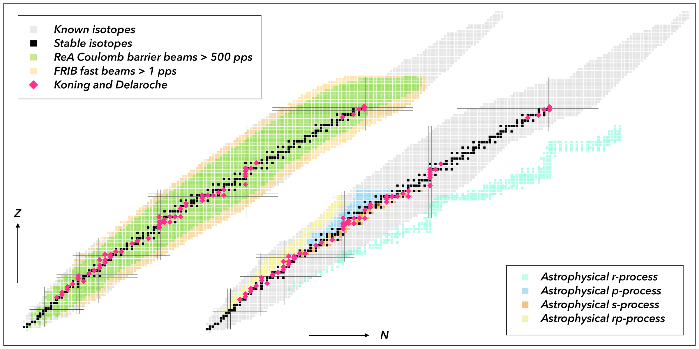
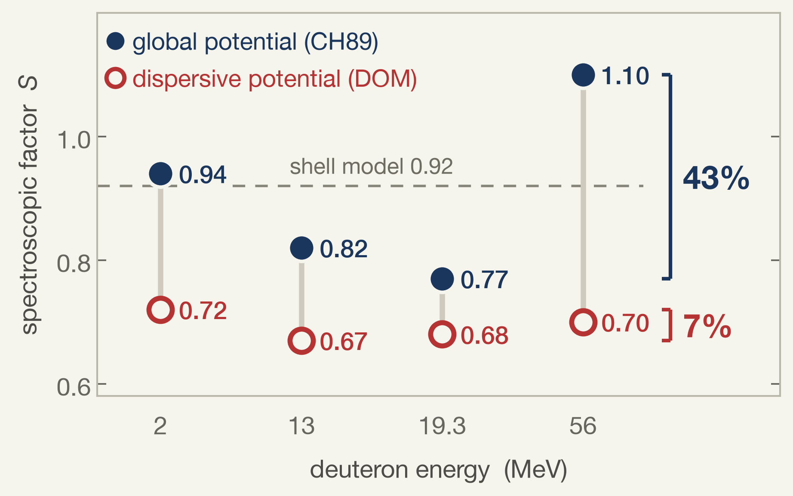
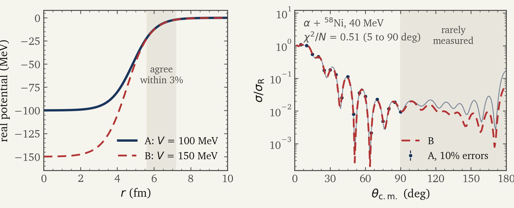
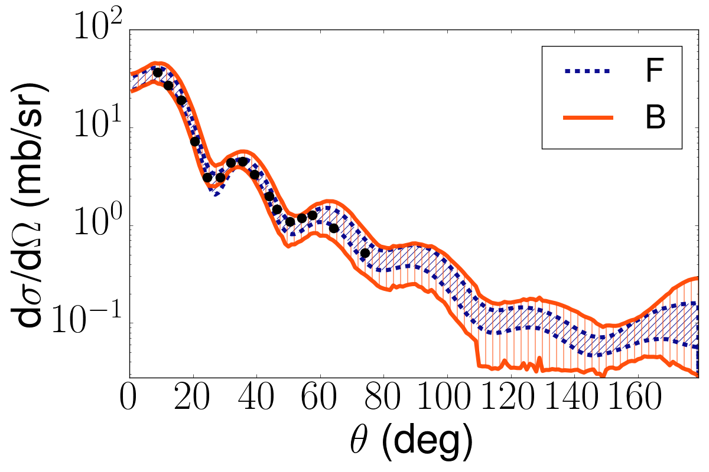
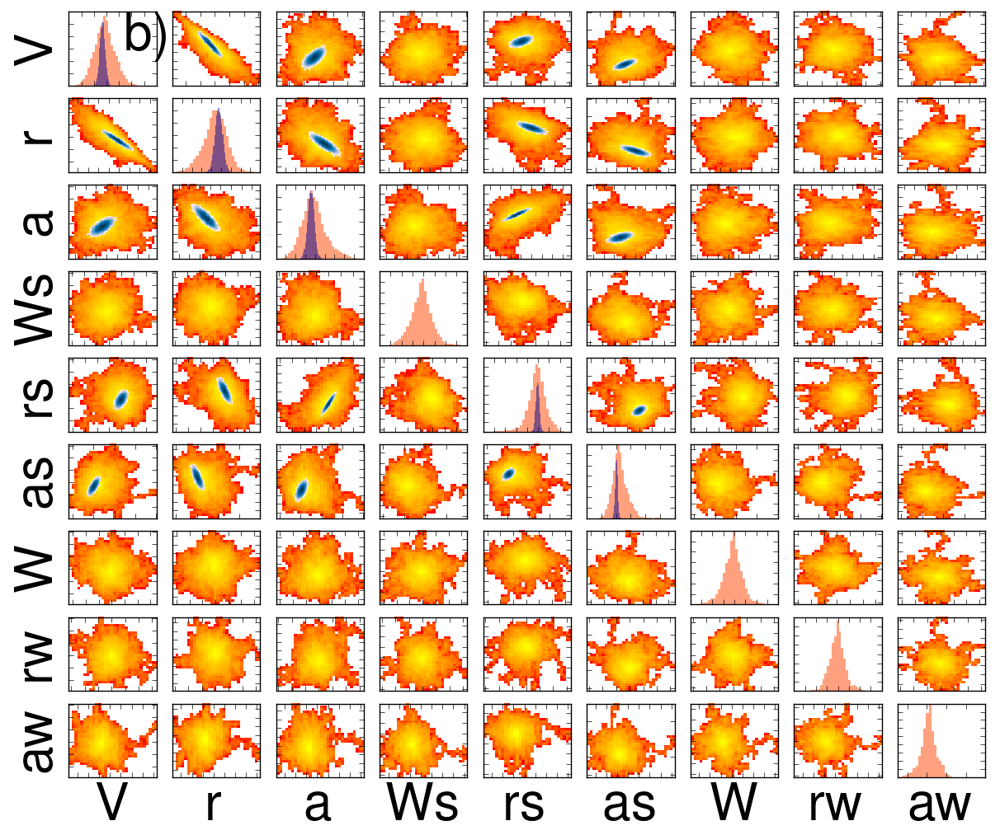
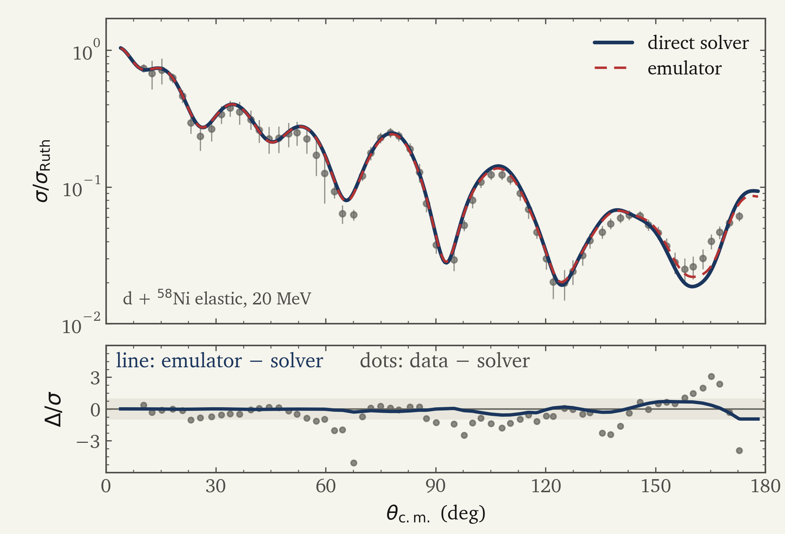
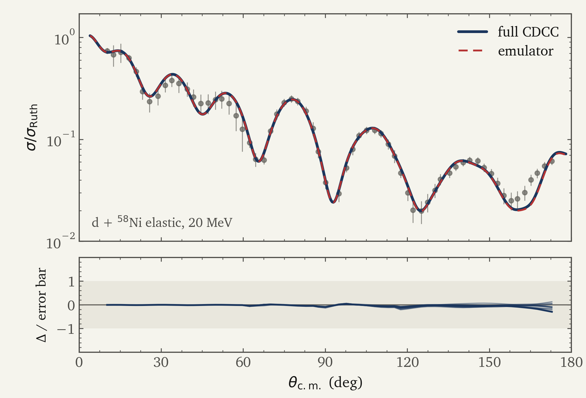
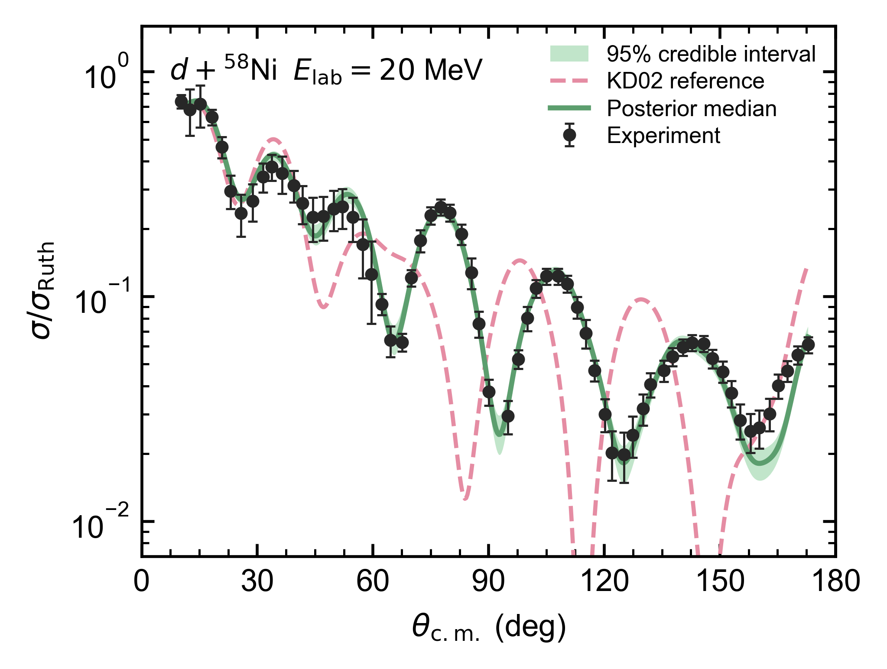
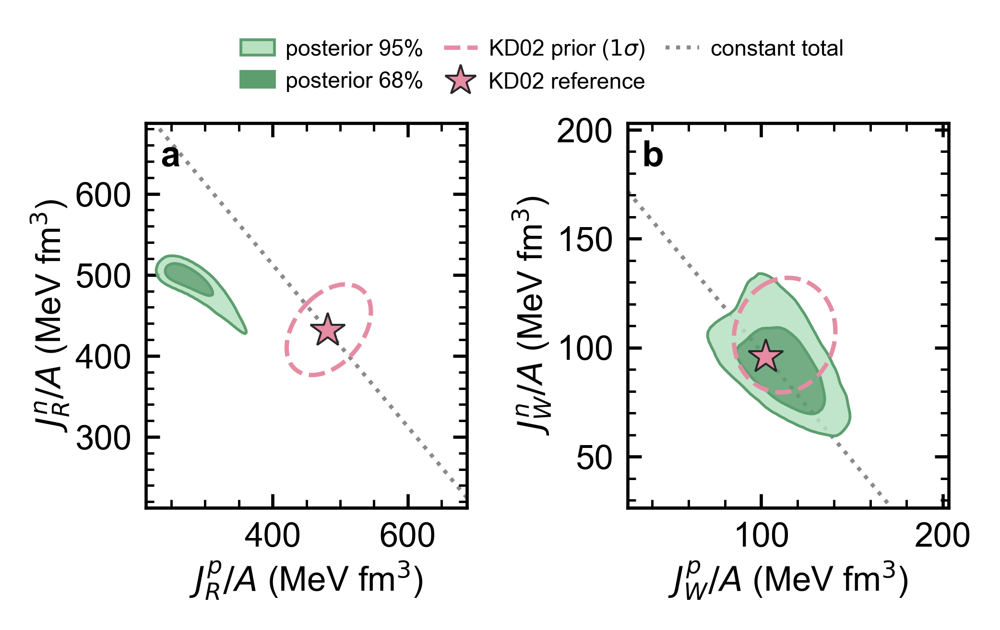

DREB 2026 SHENZHEN · NOVEMBER 2026

<h1 class="cover-title">Full Bayesian calibration</h1>

of coupled-channel reaction models, by differentiable emulation

Jin Lei

Tongji University, Shanghai Southern Center for Nuclear-Science Theory, IMP, CAS, Huizhou

NSFC 12475132 · 12535009

<LiveOnly><CoverUQ /></LiveOnly>

<!--
Central message: what the talk is, in one line, before any machinery.
Say in the first sentence what calibration means here: not one best-fit potential, but the
whole range of potentials compatible with a measured angular distribution, and from it an
error bar on anything computed with them.

Talking points:
- This is a methods talk about how a coupled-channel reaction model gets calibrated,
  and it is deliberately framed as a physics problem rather than a statistics problem.
- Twenty minutes, one argument: the optical potentials in the denominator of every
  extraction are not fixed by the elastic data, full Bayesian calibration is the honest
  way to say what the data do determine, and it is now affordable.

Timing target: 20 seconds.

Transition: start where the audience lives, with the extraction they all perform.
-->

---

I · Why a Bayesian analysis

# Rare isotopes are reached through reactions

Pink diamonds: nuclei used to fit the Koning-Delaroche potential. Left: reach of FRIB beams. Right: astrophysical r-, p-, s- and rp-process paths. Figure from Hebborn et al., J. Phys. G 50, 060501 (2023).

what this means

- Spectroscopic factors, ANCs, capture rates far from stability: read off reactions through a model.
- Its optical potentials there are mostly <b>extrapolations</b> from the stable valley.

“The field is ripe for merging … with experimental data within a <b>Bayesian analysis</b>.”

Hebborn et al., J. Phys. G 50, 060501 (2023), outlook.

The question is not only the best potential, but <b>how wrong it can be</b>.

<!--
Central message: the big picture. The rare-isotope programme measures reactions on nuclei far
from stability, and every number it extracts goes through a reaction model whose optical
potentials were fitted near stability.

Figure explanation (Hebborn et al. 2023, Fig. 1 of the optical-potential white paper):
- Both panels are the chart of nuclides. Black: stable isotopes. Pink diamonds: the nuclei
  whose data were used to fit Koning-Delaroche.
- Left: green and yellow are the reach of FRIB reaccelerated and fast beams.
- Right: the astrophysical process paths; the r process runs far on the neutron-rich side.
- The authors' own caption: the diamonds highlight "the dramatic extrapolations made".

Talking points:
- Spectroscopic factors, asymptotic normalizations, neutron-capture rates for the r process:
  far from stability all of them are reaction-model outputs.
- Elastic data are scarce away from stability, so global potentials are mostly extrapolated
  there (the white paper: fitted primarily to stable nuclei).
- So the question is not only "what is the best potential" but "how wrong can it be", and
  the community white paper names Bayesian analysis as the route (outlook section). The
  BAND collaboration was set up for exactly this across nuclear physics.

Timing target: 1 minute 15 seconds.

Transition: to see why the error bar matters, look at what an extraction actually does.
-->

---
clicks: 4
class: scene-slide
---

I · Why a Bayesian analysis

# Extracting S means normalizing a calculation

One measured angular distribution, two global nucleon potentials: ⁴⁸Ca(d,p)⁴⁹Ca at Ed = 10 MeV.

<LiveOnly><TransferScene :step="$clicks" :height="372" /></LiveOnly>

<!--
Central message: S is measured divided by calculated, and the calculated part carries the
optical potential. A real case, computed for this talk.

Setup (figures/run_dp48ca.py, figures/make_dp48ca.py):
- Data: Brown, Denning, Macgregor, NPA 153, 145 (1970), EXFOR F0910020 (relative angular
  distribution, c.m.), put on an absolute scale with the same paper's 36.6 mb/sr at 12.5 deg
  lab (F0910027; 10 percent systematic).
- Calculation: finite-range ADWA (Johnson-Soper, U_n + U_p at E_d/2), post form with remnant,
  2p3/2 neutron in a WS well (r0 1.25, a 0.65). The ONLY change between the two curves is the
  global nucleon potential, KD02 or CH89. Converged to 0.1 percent.
- S fitted over theta_cm <= 25 deg (the forward peak).

Left panel: every length is in fm from this calculation (figures/export_dp48ca_scene.py).
- Glass shell: half-value radius of the KD02 real potential, 4.33 fm.
- Blue cloud: |psi|^2 of the 2p3/2 bound state used in the calculation (m = j, drawn in the plane).
- Gold band: transfer region DEFINED by a radial cutoff scan (FRESCO cutc: remove the transfer
  coupling inside R). 90 percent of sigma survives a cut at 6.5 fm, 10 percent at 9.3 fm, so
  80 percent comes from 6.5 to 9.3 fm (CH89: 6.7 to 9.5). Inside 5.5 fm the net contribution is
  slightly negative (interference). Same diagnostic as the IAV-cut of Liu Junzhe et al.
- Red glow: W(r) of the adiabatic deuteron potential, one log scale for both potentials.
  Rings: W = 1 MeV at 6.8 fm (KD02) and 7.2 fm (CH89).
- Particles: a deuteron at impact parameter b survives with the eikonal T(b) = exp(-(2/hbar v)
  int W dz) of the potential shown (T(7 fm) = 0.69 KD02, 0.47 CH89; straight line, no Coulomb)
  and transfers with a probability following the cutc profile. Event rates are illustrative.

Say once, aloud, before anyone asks: the absolute S here (about 0.5) is lower than the ~0.8 to
1.1 of the next slide because the bound-state well is held fixed at r0 1.25, a 0.65; only the
ratio between the two potentials is the point.

Click 0: the measurement. Protons counted versus angle.
Click 1: the neutron is captured well outside the nucleus (gold band), into the blue orbital.
  Right: the two S = 1 calculations; CH89 is 14 percent lower at the peak (64.0 vs 74.5 mb/sr).
Click 2: KD02 absorption. Click 3: CH89 absorption, further out. Real parts nearly equal.
  Swapping only the deuteron-channel potential moves the peak 74.5 -> 65.7 (12 percent); only
  the proton channel, 74.5 -> 72.6 (2.5 percent). The difference is the deuteron absorption.
  The two cutc curves agree outside 9 fm: the difference is built between 6 and 8 fm.
Click 4: normalize each to the data: S = 0.49 (KD02) and 0.58 (CH89), 17 percent apart. The
  scaled curves are indistinguishable.

Caveats if asked:
- CH89 at 5 MeV (the nucleon energy in the deuteron channel) is outside its fitted range
  (10 to 65 MeV): it is an extrapolation, which is itself the point of slide 2.
- Absolute S here is about 0.5; it depends also on the bound-state well (r0, a), which is held
  fixed. The slide is about the ratio, not the absolute value.
- Deuteron spin-orbit dropped in the adiabatic potential, same for both.

Transition: one reaction at one energy; the next slide shows the published systematics across
four energies.

Timing target: 1 minute 30 seconds.
-->

---

I · Why a Bayesian analysis

# The extracted answer depends on the potential

48Ca(d,p)49Ca g.s., measured at four deuteron energies, each analyzed with two optical potentials.

CH89 · across four energies

43% spread

S of one state, 49Ca g.s., moves with beam energy alone.

DOM · across four energies

7% spread

Flat across energies; CH89 sits 13 to 57% above it at the same energy.

S: Nguyen et al., PRC 84, 044611 (2011), Table II. Shell model: Tsang, Lee, Lynch, PRL 95, 222501 (2005).

Same data, same state: swapping the potential alone changes S by <b>13 to 57%</b>.

<!--
Central message: one published example shows the extraction moving under the optical
potential alone.

Figure explanation (the two series of the paper's Table II, redrawn at their four energies):
- The blue series is a global nucleon optical potential, read at half the deuteron energy,
  the standard adiabatic choice: 0.94, 0.82, 0.77, 1.1 at 2, 13, 19.3 and 56 MeV.
- The red series is the dispersive optical model (DOM), whose real and imaginary parts are
  linked by a subtracted dispersion relation (their Eq. 9): 0.72, 0.67, 0.68, 0.70.
- Both use the same overlap function, so the entire difference between the series is the
  potential. That is what the caption says and it is the point of the slide.
- The takeaway: at each energy, CH89/DOM = 1.31, 1.22, 1.13, 1.57 (0.94/0.72, 0.82/0.67,
  0.77/0.68, 1.10/0.70), so the potential alone moves S by 13 to 57 percent.
- Accuracy, only if asked: the spread across energies is consistency (CH89 43 percent, DOM 7
  percent), not the precision of one extraction, and neither series is shown to be accurate. Accuracy is distance from a true value, and S is not an observable, so it needs a
  stated reference. Dashed line: large-basis shell model (Oxbash) 0.92 for 49Ca g.s., Tsang,
  Lee, Lynch, PRL 95, 222501 (2005), Table 1 (same paper extracts 0.68 +- 0.07 with a CH89
  adiabatic prescription). DOM sits about 25 percent below the shell model; Nguyen et al. say
  their DOM values are more in line with (e,e'p), i.e. with the usual quenching. So DOM is
  consistent, and whether it is accurate depends on the reference.
- If asked about 2 MeV (below the Coulomb barrier, where little optical-potential dependence
  is expected, yet 0.94 vs 0.72): these are Nguyen et al.'s values, not reanalyzed here; the
  two series also differ in the energy dependence they put into the nucleon potentials. Say
  that plainly and do not improvise a mechanism.
- TRAP if asked: the mean of the four CH89 values is about 0.91, next to 0.92. That is a
  coincidence of four scattered points, not evidence that CH89 is accurate on average. Do not
  say it.
- The brackets on the right of the figure are each series' own spread across the four
  energies: 43 percent for CH89 (0.77 to 1.10), 7 percent for DOM (0.67 to 0.72). Neither is a
  distance between the two series at one energy.
- The closer (e,e'p) agreement in the paper comes after DOM overlap ingredients are also used,
  not for this DOM+WS series. Do not attribute it to the plotted red points.

Talking points:
- 48Ca is doubly magic and this is the textbook (d,p) case, so nobody in the room will
  think the target was chosen to make the point.
- The DOM series is much flatter in energy. Do not claim it is a better elastic fit or that
  dispersion alone causes the stability; the paper does not isolate that.
- Do not overclaim: this is one reaction, and the paper is about transfer. The point here
  is only that the denominator of the ratio is not pinned down.

Timing target: 1 minute 15 seconds.

Transition: so the potential is underdetermined, and the next slide says why, in physical
terms rather than statistical ones.
-->

---

I · Why a Bayesian analysis

# The potential is not determined by the data

FRESCO, illustrative Woods-Saxon potentials, not fitted to real data. B: depth fixed at 150 MeV, radius, diffuseness and absorption refitted to A (points: every 5°, 10% errors). Strong absorption: the data see the surface, and discrete families of potentials fit them. Igo, Phys. Rev. 115, 1665 (1959); Drisko, Satchler and Bassel, Phys. Lett. 5, 347 (1963).

Depths 50% apart, same angular distribution to 90°: the data fix <b>the surface</b>, not the potential.

<!--
Central message: the non-uniqueness is a property of the object, not a failure of anyone's
fitting procedure. Shown here as a real calculation, not a sketch.

Figure explanation (computed with FRESCO, figures/run_igo_ambiguity.py; both potentials are
illustrative, neither is fitted to measured data):
- Left: two real potentials. A: V = 100 MeV, r = 1.25 fm, a = 0.60 fm, volume W = 20 MeV.
  B: depth held at 150 MeV; r = 1.170 fm, a = 0.618 fm and W = 22.5 MeV refitted so that B
  reproduces A's angular distribution. They agree to 3 percent only between about 5.6 and
  7.2 fm, the strong-absorption surface; at r = 2 fm they differ by 49 percent, and the real
  volume integrals per nucleon are 942 against 1193 MeV fm^3.
- Right: alpha + 58Ni elastic at 40 MeV, ratio to Rutherford. Points are A every 5 degrees
  from 5 to 90 with 10 percent errors; the dashed line is B. chi2/N = 0.51 on those 18
  points. Beyond 90 degrees, where alpha data are rarely taken, the two separate
  (chi2/N = 11 over 5 to 175).
- This is the discrete ambiguity of strongly absorbed projectiles (Drisko, Satchler and
  Bassel 1963): V = 100 and 150 MeV are neighbouring families. An intermediate depth,
  130 MeV, does NOT fit (chi2/N = 7.5 with r, a, W free). Say this if asked: the families
  are discrete, the surface is what is fixed.
- Numerics: A and B are stable to 1e-3 and 2e-3 in the cross section under hcm 0.05 -> 0.03,
  rmatch 25 -> 30, jtmax 60 -> 70.
- Control: for n + 208Pb at 20 MeV with KD02 (weak absorption) the same exercise fails even
  for a 10 percent depth change (chi2/N about 2.5 with r and a free). Nucleon elastic
  scattering sees more of the interior. Do not claim the alpha picture holds for nucleons.

Talking points:
- Feshbach projection: the optical potential is what is left of a many-body problem after
  the other channels (the Q space) are projected out, so it is complex, energy dependent and
  nonlocal. Causality links the energy dependence of the real part to the imaginary part.
- Say the conclusion as physics: the data fix the surface, and an extraction that needs the
  potential elsewhere inherits the ambiguity.
- If someone points out that transfer is surface dominated, agree. The extraction still moves
  because energy dependence, nonlocality and the overlap enter beyond the elastic surface
  match. Do not claim the interior is what transfer probes.

Timing target: 1 minute 45 seconds.

Transition: so how has the field answered this? That is the next block.
-->

---

I · Why a Bayesian analysis

# The best-fit band holds only 11 of 16 (d,p) points

the two 95% bands

data points inside the 95% band

11/ 16

F · χ² best fit

16/ 16

B · Bayesian

48Ca(d,p)49Ca g.s., 19.3 MeV. Both bands come from potentials fitted to the same nucleon elastic data; the 16 (d,p) points were not fitted, only normalized at the peak. King et al., PRL 122, 232502 (2019), Fig. 3(a,c).

Same elastic data, same model: <b>the Bayesian band holds all 16</b>.

<!--
Central message: this is the answer to "why Bayesian". A best fit plus a chi-square error bar
is the classical answer, and when it was tested head to head it undercovered badly.

Figure explanation (King et al. PRL 2019, Fig. 3a):
- Black points: 48Ca(d,p) data at 19.3 MeV. Blue dotted band F: frequentist 95% band, from
  the chi-square around the best fit. Orange band B: Bayesian 95% band from the posterior.
- Same elastic data, same model, same assigned 10% errors; the interval constructions differ,
  and some frequentist parameters had to be fixed. Transfer predictions are normalized at the
  peak.
- The Bayesian band is wider, most of all past 80 degrees, where there are no data (they stop near 75).
- The (d,p) points were not used in the fit (only the peak normalization), so they are a
  test set. The figure shows what the two bands look like; the counts on the right come from
  King et al.'s coverage plot. If asked which points miss: King et al. do not list them, and the five sit
  within a marker width of the dashed edge, so do not point at any.

Where 11 and 16 come from (only if asked): King et al. Fig. 3(c) plots, for bands of every
confidence level from 10 to 95 percent, the fraction of the 16 (d,p) points inside. At 95 the
frequentist band holds 69 percent = 11 of 16 and the Bayesian band 100 percent = 16 of 16 (read
from the figure and turned into counts with the 16 points of panel (a); the paper prints no
number). The frequentist points sit below the diagonal at every level, so it is not a 95-percent
accident. The bands come from the parameter samples alone. On the nine elastic sets used in the
fits the same pattern holds: frequentist 44 to 92 percent, Bayesian 76 to 100 percent (Table I).

Talking points:
- King et al. compared the two by counting: how many of the 16 (d,p) points fall inside each
  95% band. The chi-square best-fit band held 11, the Bayesian band all 16.
- If asked (no longer on screen): King 2018 shows the same lesson inside the chi-square world: once angle-angle correlations
  are put into the fit, (d,p) band widths at the peak go from 8.3 to 34 percent to 30 to 158
  percent (their Table VI). The naive error bar was far too narrow.
- Even the Bayesian band holds only 76 percent on one elastic set. Do not claim a posterior
  is calibrated in general.
- Only if asked how the Bayesian band is built: prior times likelihood gives the posterior; push it through the reaction
  model to get a band on the calculated cross section, hence on S.

Timing target: 1 minute 30 seconds.

- The takeaway is scoped to King et al.'s comparison: the band from sampled potentials covered better.
  If asked for the coverage of my own band: the noise-inclusive predictive check has not
  been computed (slide 19 notes); do not quote a number.

Transition: this lesson is what moved the field to Bayesian optical potentials.
-->

---

II · How it is done now

# Bayesian optical potentials: the established programme

<b>2017</b>χ² bands for optical-model fits. <i class="citation">Lovell et al., PRC 95</i>

<b>2018</b>Sampled potentials carried into (d,p): S uncertain by <b style="white-space: nowrap;">±12 to ±50%</b> from the optical potential alone. <i class="citation">Lovell and Nunes, PRC 97</i>

<b>2019</b>Bayesian against frequentist, head to head. <i class="citation">King et al., PRL 122</i>

<b>2019</b>Which measurement reduces the uncertainty. <i class="citation">Catacora-Rios et al., PRC 100</i>

<b>2023</b>Global KD and CH89 with uncertainties (KDUQ, CHUQ). <i class="citation">Pruitt et al., PRC 107</i>

<b>2025</b>Systematic propagation to transfer observables. <i class="citation">Hebborn and Nunes, Front. Phys. 13</i>

<b>2026</b>ELM: a global potential for rare isotopes, with (p,n). <i class="citation">Beyer and Nunes, arXiv:2603.28599</i>

Posterior of nine Woods-Saxon parameters, 48Ca(p,p) at 14 MeV. Orange: Bayesian. Blue: frequentist. Figure from King et al. (2019).

The posterior is the object this programme reports, and its <b>correlations</b> are part of the answer.

<!--
Central message: the Bayesian optical-potential programme exists, works, and is the state of
the art. Give its history in the right order.

Talking points:
- 2017: Lovell et al. was frequentist, chi-square bands, the starting point.
- 2018: Lovell and Nunes, Bayesian (MCMC) optical-potential posteriors, propagated
  to transfer; uncertainties of 25 to 100 percent on the transfer cross section, depending on the reaction
  (their abstract: "Uncertainties in transfer cross sections can vary significantly (25-100%)
  depending on the reaction"; arXiv:1801.06096).
- How the on-screen "±12 to ±50%" is obtained (my conversion, not printed in the paper): their
  Eq. (12) defines eps95 = (sigma_max - sigma_min)/mean at the peak of the (d,p) angular
  distribution, i.e. the FULL width of the 95% band. Table III gives eps95 from 20% (90Zr(d,n),
  ADWA, 5% elastic errors) to 122% (116Sn(d,p), ADWA, 10% errors); the abstract rounds to
  25-100%. Half of the full width: about +-12 to +-50%. S = sigma_exp/sigma_th uses the peak,
  so S inherits it. Elastic data errors assumed 10% or 5%; experimental and structure errors
  are not included.
- 2019: King et al., the head-to-head of the previous slide; Catacora-Rios et al. asked which
  measurement would shrink the posterior most.
- 2023: Pruitt, Escher and Rahman put uncertainties on the two global workhorses, KDUQ and
  CHUQ.
- 2025 and 2026: systematic propagation to transfer (a 48Ca study), and ELM, a global
  potential aimed at rare isotopes with (p,n) charge exchange in the calibration.

Figure explanation (King et al. 2019, Fig. 2b): diagonal panels are marginal posteriors,
off-diagonal ones pairwise correlations. Orange is Bayesian, blue frequentist. Note the
strong Bayesian correlation between real depth V and radius r: that is the Igo ambiguity of
the earlier slide, now as a posterior shape. Other pairs are weakly correlated.

Timing target: 1 minute 30 seconds.

Transition: how do these analyses actually sample the posterior?
-->

---

II · How it is done now

# The recipe: a cheap model and a random walk

how the posterior is sampled

<svg viewBox="0 0 660 240" style="width: 100%; height: 11.2rem;" font-family="Newsreader, Georgia, serif">
<defs><marker id="ar8" viewBox="0 0 10 10" refX="8" refY="5" markerWidth="6" markerHeight="6" orient="auto"><path d="M0 0 L10 5 L0 10 z" fill="#1B365D"/></marker><filter id="sh8" x="-10%" y="-10%" width="120%" height="130%"><feDropShadow dx="0" dy="2" stdDeviation="2.5" flood-color="#1B365D" flood-opacity="0.13"/></filter></defs>
<g filter="url(#sh8)"><rect x="2" y="10" width="148" height="158" rx="10" fill="#FFFFFF" stroke="#c9d3df"/></g>
<path d="M2 46 V20 a10 10 0 0 1 10 -10 H140 a10 10 0 0 1 10 10 V46 Z" fill="#1B365D"/>
<circle cx="20" cy="28.0" r="10" fill="#fff"/><text x="20" y="33.0" text-anchor="middle" fill="#1B365D" font-weight="700" style="font-size:14px">1</text>
<text x="88.0" y="34.0" text-anchor="middle" fill="#fff" style="font-size:17px">propose θ</text>
<text x="76.0" y="142" text-anchor="middle" fill="#4d4c48" style="font-size:14.5px">new parameters,</text>
<text x="76.0" y="159" text-anchor="middle" fill="#4d4c48" style="font-size:14.5px">picked at random</text>
<g filter="url(#sh8)"><rect x="172" y="10" width="148" height="158" rx="10" fill="#FFFFFF" stroke="#c9d3df"/></g>
<path d="M172 46 V20 a10 10 0 0 1 10 -10 H310 a10 10 0 0 1 10 10 V46 Z" fill="#1B365D"/>
<circle cx="190" cy="28.0" r="10" fill="#fff"/><text x="190" y="33.0" text-anchor="middle" fill="#1B365D" font-weight="700" style="font-size:14px">2</text>
<text x="258.0" y="34.0" text-anchor="middle" fill="#fff" style="font-size:17px">solve</text>
<text x="246.0" y="142" text-anchor="middle" fill="#4d4c48" style="font-size:14.5px">one optical-model</text>
<text x="246.0" y="159" text-anchor="middle" fill="#4d4c48" style="font-size:14.5px">calculation</text>
<g filter="url(#sh8)"><rect x="342" y="10" width="148" height="158" rx="10" fill="#FFFFFF" stroke="#c9d3df"/></g>
<path d="M342 46 V20 a10 10 0 0 1 10 -10 H480 a10 10 0 0 1 10 10 V46 Z" fill="#1B365D"/>
<circle cx="360" cy="28.0" r="10" fill="#fff"/><text x="360" y="33.0" text-anchor="middle" fill="#1B365D" font-weight="700" style="font-size:14px">3</text>
<text x="428.0" y="34.0" text-anchor="middle" fill="#fff" style="font-size:17px">compare</text>
<text x="416.0" y="142" text-anchor="middle" fill="#4d4c48" style="font-size:14.5px">σ(θ) against the</text>
<text x="416.0" y="159" text-anchor="middle" fill="#4d4c48" style="font-size:14.5px">data gives χ²</text>
<g filter="url(#sh8)"><rect x="512" y="10" width="148" height="158" rx="10" fill="#FFFFFF" stroke="#c9d3df"/></g>
<path d="M512 46 V20 a10 10 0 0 1 10 -10 H650 a10 10 0 0 1 10 10 V46 Z" fill="#1B365D"/>
<circle cx="530" cy="28.0" r="10" fill="#fff"/><text x="530" y="33.0" text-anchor="middle" fill="#1B365D" font-weight="700" style="font-size:14px">4</text>
<text x="598.0" y="34.0" text-anchor="middle" fill="#fff" style="font-size:17px">accept/reject</text>
<text x="586.0" y="142" text-anchor="middle" fill="#4d4c48" style="font-size:14.5px">keep the new θ</text>
<text x="586.0" y="159" text-anchor="middle" fill="#4d4c48" style="font-size:14.5px">or the old one</text>
<rect x="53.0" y="61.0" width="46" height="46" rx="9" fill="#E4ECF5" stroke="#1B365D" stroke-width="1.6" transform="rotate(-10 76.0 84)"/>
<circle cx="62.1" cy="74.3" r="3.6" fill="#1B365D"/>
<circle cx="85.7" cy="70.1" r="3.6" fill="#1B365D"/>
<circle cx="76.0" cy="84.0" r="3.6" fill="#1B365D"/>
<circle cx="66.3" cy="97.9" r="3.6" fill="#1B365D"/>
<circle cx="89.9" cy="93.7" r="3.6" fill="#1B365D"/>
<line x1="200" y1="70" x2="298" y2="70" stroke="#9aa6b5" stroke-width="1"/>
<path d="M200 70 L200.0 114.0 L201.7 113.9 L203.3 113.9 L205.0 113.9 L206.6 113.9 L208.3 113.8 L210.0 113.8 L211.6 113.7 L213.3 113.6 L214.9 113.5 L216.6 113.3 L218.3 113.1 L219.9 112.8 L221.6 112.5 L223.3 112.0 L224.9 111.4 L226.6 110.6 L228.2 109.6 L229.9 108.4 L231.6 106.8 L233.2 104.9 L234.9 102.7 L236.5 100.2 L238.2 97.4 L239.9 94.4 L241.5 91.3 L243.2 88.2 L244.8 85.3 L246.5 82.6 L248.2 80.2 L249.8 78.2 L251.5 76.5 L253.2 75.1 L254.8 73.9 L256.5 73.0 L258.1 72.3 L259.8 71.8 L261.5 71.4 L263.1 71.0 L264.8 70.8 L266.4 70.6 L268.1 70.4 L269.8 70.3 L271.4 70.3 L273.1 70.2 L274.7 70.1 L276.4 70.1 L278.1 70.1 L279.7 70.1 L281.4 70.0 L283.1 70.0 L284.7 70.0 L286.4 70.0 L288.0 70.0 L289.7 70.0 L291.4 70.0 L293.0 70.0 L294.7 70.0 L296.3 70.0 L298.0 70.0" fill="none" stroke="#1B365D" stroke-width="2.2"/>
<text x="300" y="74" fill="#4d4c48" font-style="italic" style="font-size:13px">r</text>
<text x="262" y="110" fill="#1B365D" font-style="italic" style="font-size:14px">V(r)</text>
<path d="M364.0 60.5 L366.1 63.0 L368.2 66.0 L370.4 69.3 L372.5 72.7 L374.6 76.2 L376.7 79.6 L378.8 82.7 L381.0 85.4 L383.1 87.7 L385.2 89.5 L387.3 90.8 L389.4 91.6 L391.6 92.0 L393.7 92.1 L395.8 91.9 L397.9 91.6 L400.0 91.1 L402.2 90.6 L404.3 90.2 L406.4 90.0 L408.5 89.9 L410.6 90.0 L412.8 90.3 L414.9 90.8 L417.0 91.5 L419.1 92.3 L421.2 93.2 L423.4 94.2 L425.5 95.2 L427.6 96.2 L429.7 97.1 L431.8 97.9 L434.0 98.5 L436.1 99.1 L438.2 99.5 L440.3 99.7 L442.4 99.9 L444.6 99.9 L446.7 99.9 L448.8 99.8 L450.9 99.6 L453.0 99.5 L455.2 99.4 L457.3 99.3 L459.4 99.3 L461.5 99.3 L463.6 99.4 L465.8 99.5 L467.9 99.7 L470.0 99.9" fill="none" stroke="#1B365D" stroke-width="2"/>
<line x1="371.4" x2="371.4" y1="63.8" y2="73.8" stroke="#b53333" stroke-width="1.2"/><circle cx="371.4" cy="68.8" r="2.8" fill="#b53333"/>
<line x1="385.2" x2="385.2" y1="85.9" y2="95.9" stroke="#b53333" stroke-width="1.2"/><circle cx="385.2" cy="90.9" r="2.8" fill="#b53333"/>
<line x1="400.0" x2="400.0" y1="84.9" y2="94.9" stroke="#b53333" stroke-width="1.2"/><circle cx="400.0" cy="89.9" r="2.8" fill="#b53333"/>
<line x1="414.9" x2="414.9" y1="86.7" y2="96.7" stroke="#b53333" stroke-width="1.2"/><circle cx="414.9" cy="91.7" r="2.8" fill="#b53333"/>
<line x1="429.7" x2="429.7" y1="91.1" y2="101.1" stroke="#b53333" stroke-width="1.2"/><circle cx="429.7" cy="96.1" r="2.8" fill="#b53333"/>
<line x1="445.6" x2="445.6" y1="95.4" y2="105.4" stroke="#b53333" stroke-width="1.2"/><circle cx="445.6" cy="100.4" r="2.8" fill="#b53333"/>
<line x1="461.5" x2="461.5" y1="93.9" y2="103.9" stroke="#b53333" stroke-width="1.2"/><circle cx="461.5" cy="98.9" r="2.8" fill="#b53333"/>
<circle cx="562.0" cy="84" r="19" fill="#E4ECF5" stroke="#1B365D" stroke-width="1.6"/><path d="M553.0 84 l7 8 l13 -15" fill="none" stroke="#1B365D" stroke-width="3" stroke-linecap="round" stroke-linejoin="round"/>
<circle cx="610.0" cy="84" r="19" fill="#F6E3E1" stroke="#b53333" stroke-width="1.6"/><path d="M603.0 77 l14 14 M617.0 77 l-14 14" stroke="#b53333" stroke-width="3" stroke-linecap="round"/>
<path d="M153 97.0 L169 97.0" stroke="#1B365D" stroke-width="2" marker-end="url(#ar8)"/>
<path d="M323 97.0 L339 97.0" stroke="#1B365D" stroke-width="2" marker-end="url(#ar8)"/>
<path d="M493 97.0 L509 97.0" stroke="#1B365D" stroke-width="2" marker-end="url(#ar8)"/>
<path d="M586.0 171 C 586.0 205, 546.0 205, 506.0 205 L 156.0 205 C 116.0 205, 76.0 205, 76.0 177" fill="none" stroke="#1B365D" stroke-width="2" stroke-dasharray="6 4" marker-end="url(#ar8)"/>
<rect x="258" y="193" width="144" height="24" rx="12" fill="#F5F4ED"/>
<text x="330" y="210" text-anchor="middle" fill="#1B365D" font-style="italic" style="font-size:15px">repeat many times</text>
<text x="330" y="237" text-anchor="middle" fill="#b53333" style="font-size:16.5px">each step is a random guess; it never uses the slope of χ²</text>
</svg>

<svg viewBox="0 0 40 40" class="why-ic"><circle cx="20" cy="23" r="14" fill="#E4ECF5" stroke="#1B365D" stroke-width="2"/><rect x="16" y="3" width="8" height="4" rx="1.5" fill="#1B365D"/><path d="M20 23 L20 13 M20 23 L27 26" stroke="#1B365D" stroke-width="2.4" stroke-linecap="round"/></svg>

<b>Why it works.</b> Single-channel optical-model solves are cheap, so many random steps are affordable, even when one likelihood needs many targets and energies.

three published calibrations

<b>King 2019</b>single-system fit

9

<b>Beyer 2026</b>ELM, global

21

<b>Pruitt 2023</b>KDUQ, global

46

optical-potential parameters sampled

Hyperparameters not counted. Different models and data sets; not a performance comparison.

The proven route: a <b>cheap forward model</b>, sampled by <b>random steps</b> that never use the slope of χ².

<!--
Central message: describe the sampling recipe, because the difficulties of Act III come from
exactly this recipe.

Talking points:
- Propose, solve, compare, accept or reject; every step is one reaction solve, and no step
  uses the slope of chi-square with respect to the parameters (the likelihood gradient). KDUQ, for example, used the affine-invariant ensemble sampler (emcee)
  for 46 parameters.
- The parameter column: nine in a single-system Woods-Saxon fit, 21 in ELM, 46 in KDUQ.
- Why it works: the forward model is a single-channel optical-model solve, which is cheap.
  Hold on to that word; Act III takes it away.

Timing target: 1 minute.

Transition: the second ingredient the field developed is the emulator.
-->

---

II · How it is done now

# Emulators make each solve cheap

emulator: a fast stand-in built from full calculations

<svg viewBox="0 0 600 250" style="width: 100%; height: 12.4rem;" font-family="Newsreader, Georgia, serif">
<defs><marker id="ar9" viewBox="0 0 10 10" refX="8" refY="5" markerWidth="6" markerHeight="6" orient="auto"><path d="M0 0 L10 5 L0 10 z" fill="#1B365D"/></marker><filter id="sh9" x="-10%" y="-10%" width="120%" height="130%"><feDropShadow dx="0" dy="2" stdDeviation="2.5" flood-color="#1B365D" flood-opacity="0.13"/></filter></defs>
<g filter="url(#sh9)"><rect x="2" y="6" width="226" height="236" rx="10" fill="#fff" stroke="#c9d3df"/></g>
<path d="M2 42 V16 a10 10 0 0 1 10 -10 H218 a10 10 0 0 1 10 10 V42 Z" fill="#1B365D"/>
<text x="115.0" y="30.0" text-anchor="middle" fill="#fff" style="font-size:18px">full solve</text>
<path d="M20.0 118.0 L20.8 117.7 L21.6 117.3 L22.4 116.8 L23.2 116.3 L24.0 115.6 L24.8 114.9 L25.5 114.2 L26.3 113.4 L27.1 112.5 L27.9 111.7 L28.7 110.8 L29.5 109.9 L30.3 109.1 L31.1 108.2 L31.9 107.4 L32.7 106.7 L33.5 106.0 L34.2 105.4 L35.0 104.8 L35.8 104.4 L36.6 104.0 L37.4 103.8 L38.2 103.6 L39.0 103.6 L39.8 103.6 L40.6 103.8 L41.4 104.1 L42.2 104.6 L43.0 105.1 L43.8 105.8 L44.5 106.6 L45.3 107.5 L46.1 108.5 L46.9 109.6 L47.7 110.8 L48.5 112.1 L49.3 113.5 L50.1 114.9 L50.9 116.4 L51.7 118.0 L52.5 119.6 L53.2 121.2 L54.0 122.9 L54.8 124.5 L55.6 126.1 L56.4 127.7 L57.2 129.3 L58.0 130.9 L58.8 132.3 L59.6 133.7 L60.4 135.1 L61.2 136.3 L62.0 137.5 L62.8 138.5 L63.5 139.4 L64.3 140.2 L65.1 140.9 L65.9 141.4 L66.7 141.7 L67.5 142.0 L68.3 142.0 L69.1 142.0 L69.9 141.7 L70.7 141.3 L71.5 140.8 L72.2 140.1 L73.0 139.3 L73.8 138.3 L74.6 137.2 L75.4 135.9 L76.2 134.5 L77.0 133.0 L77.8 131.4 L78.6 129.7 L79.4 127.9 L80.2 126.0 L81.0 124.1 L81.8 122.1 L82.5 120.1 L83.3 118.0 L84.1 115.9 L84.9 113.9 L85.7 111.8 L86.5 109.8 L87.3 107.8 L88.1 105.8 L88.9 103.9 L89.7 102.1 L90.5 100.4 L91.2 98.8 L92.0 97.3 L92.8 95.9 L93.6 94.7 L94.4 93.6 L95.2 92.6 L96.0 91.8 L96.8 91.2 L97.6 90.7 L98.4 90.4 L99.2 90.2 L100.0 90.2 L100.8 90.5 L101.5 90.8 L102.3 91.4 L103.1 92.1 L103.9 93.0 L104.7 94.0 L105.5 95.2 L106.3 96.5 L107.1 98.0 L107.9 99.6 L108.7 101.3 L109.5 103.2 L110.2 105.1 L111.0 107.1 L111.8 109.2 L112.6 111.3 L113.4 113.5 L114.2 115.8 L115.0 118.0 L115.8 120.3 L116.6 122.5 L117.4 124.7 L118.2 126.9 L119.0 129.0 L119.8 131.1 L120.5 133.1 L121.3 135.0 L122.1 136.8 L122.9 138.5 L123.7 140.0 L124.5 141.5 L125.3 142.8 L126.1 143.9 L126.9 144.9 L127.7 145.7 L128.5 146.3 L129.2 146.8 L130.0 147.1 L130.8 147.2 L131.6 147.1 L132.4 146.9 L133.2 146.4 L134.0 145.8 L134.8 145.1 L135.6 144.1 L136.4 143.0 L137.2 141.7 L138.0 140.3 L138.8 138.8 L139.5 137.1 L140.3 135.3 L141.1 133.4 L141.9 131.4 L142.7 129.3 L143.5 127.1 L144.3 124.9 L145.1 122.6 L145.9 120.3 L146.7 118.0 L147.5 115.7 L148.2 113.4 L149.0 111.1 L149.8 108.9 L150.6 106.7 L151.4 104.6 L152.2 102.5 L153.0 100.6 L153.8 98.8 L154.6 97.1 L155.4 95.5 L156.2 94.0 L157.0 92.7 L157.8 91.6 L158.5 90.6 L159.3 89.8 L160.1 89.1 L160.9 88.7 L161.7 88.4 L162.5 88.3 L163.3 88.4 L164.1 88.7 L164.9 89.1 L165.7 89.7 L166.5 90.5 L167.2 91.5 L168.0 92.6 L168.8 93.9 L169.6 95.4 L170.4 97.0 L171.2 98.7 L172.0 100.5 L172.8 102.4 L173.6 104.5 L174.4 106.6 L175.2 108.8 L176.0 111.0 L176.8 113.3 L177.5 115.7 L178.3 118.0 L179.1 120.3 L179.9 122.7 L180.7 125.0 L181.5 127.2 L182.3 129.4 L183.1 131.5 L183.9 133.6 L184.7 135.5 L185.5 137.4 L186.2 139.1 L187.0 140.7 L187.8 142.2 L188.6 143.5 L189.4 144.6 L190.2 145.6 L191.0 146.4 L191.8 147.1 L192.6 147.5 L193.4 147.8 L194.2 147.9 L195.0 147.8 L195.8 147.5 L196.5 147.1 L197.3 146.4 L198.1 145.6 L198.9 144.6 L199.7 143.5 L200.5 142.2 L201.3 140.7 L202.1 139.2 L202.9 137.4 L203.7 135.6 L204.5 133.6 L205.2 131.6 L206.0 129.5 L206.8 127.2 L207.6 125.0 L208.4 122.7 L209.2 120.3 L210.0 118.0" fill="none" stroke="#1B365D" stroke-width="1.2" stroke-opacity="0.35"/>
<circle cx="20.0" cy="118.0" r="2.2" fill="#1B365D"/>
<circle cx="24.8" cy="114.9" r="2.2" fill="#1B365D"/>
<circle cx="29.5" cy="109.9" r="2.2" fill="#1B365D"/>
<circle cx="34.2" cy="105.4" r="2.2" fill="#1B365D"/>
<circle cx="39.0" cy="103.6" r="2.2" fill="#1B365D"/>
<circle cx="43.8" cy="105.8" r="2.2" fill="#1B365D"/>
<circle cx="48.5" cy="112.1" r="2.2" fill="#1B365D"/>
<circle cx="53.2" cy="121.2" r="2.2" fill="#1B365D"/>
<circle cx="58.0" cy="130.9" r="2.2" fill="#1B365D"/>
<circle cx="62.8" cy="138.5" r="2.2" fill="#1B365D"/>
<circle cx="67.5" cy="142.0" r="2.2" fill="#1B365D"/>
<circle cx="72.2" cy="140.1" r="2.2" fill="#1B365D"/>
<circle cx="77.0" cy="133.0" r="2.2" fill="#1B365D"/>
<circle cx="81.8" cy="122.1" r="2.2" fill="#1B365D"/>
<circle cx="86.5" cy="109.8" r="2.2" fill="#1B365D"/>
<circle cx="91.2" cy="98.8" r="2.2" fill="#1B365D"/>
<circle cx="96.0" cy="91.8" r="2.2" fill="#1B365D"/>
<circle cx="100.8" cy="90.5" r="2.2" fill="#1B365D"/>
<circle cx="105.5" cy="95.2" r="2.2" fill="#1B365D"/>
<circle cx="110.2" cy="105.1" r="2.2" fill="#1B365D"/>
<circle cx="115.0" cy="118.0" r="2.2" fill="#1B365D"/>
<circle cx="119.8" cy="131.1" r="2.2" fill="#1B365D"/>
<circle cx="124.5" cy="141.5" r="2.2" fill="#1B365D"/>
<circle cx="129.2" cy="146.8" r="2.2" fill="#1B365D"/>
<circle cx="134.0" cy="145.8" r="2.2" fill="#1B365D"/>
<circle cx="138.8" cy="138.8" r="2.2" fill="#1B365D"/>
<circle cx="143.5" cy="127.1" r="2.2" fill="#1B365D"/>
<circle cx="148.2" cy="113.4" r="2.2" fill="#1B365D"/>
<circle cx="153.0" cy="100.6" r="2.2" fill="#1B365D"/>
<circle cx="157.8" cy="91.6" r="2.2" fill="#1B365D"/>
<circle cx="162.5" cy="88.3" r="2.2" fill="#1B365D"/>
<circle cx="167.2" cy="91.5" r="2.2" fill="#1B365D"/>
<circle cx="172.0" cy="100.5" r="2.2" fill="#1B365D"/>
<circle cx="176.8" cy="113.3" r="2.2" fill="#1B365D"/>
<circle cx="181.5" cy="127.2" r="2.2" fill="#1B365D"/>
<circle cx="186.2" cy="139.1" r="2.2" fill="#1B365D"/>
<circle cx="191.0" cy="146.4" r="2.2" fill="#1B365D"/>
<circle cx="195.8" cy="147.5" r="2.2" fill="#1B365D"/>
<circle cx="200.5" cy="142.2" r="2.2" fill="#1B365D"/>
<circle cx="205.2" cy="131.6" r="2.2" fill="#1B365D"/>
<circle cx="210.0" cy="118.0" r="2.2" fill="#1B365D"/>
<text x="115.0" y="202" text-anchor="middle" fill="#4d4c48" style="font-size:16px">values at N mesh points</text>
<text x="115.0" y="226" text-anchor="middle" fill="#4d4c48" style="font-size:16px">N: thousands</text>
<path d="M234 124 L276 124" stroke="#1B365D" stroke-width="2.2" marker-end="url(#ar9)"/>
<g filter="url(#sh9)"><rect x="284" y="6" width="314" height="236" rx="10" fill="#fff" stroke="#c9d3df"/></g>
<path d="M284 42 V16 a10 10 0 0 1 10 -10 H588 a10 10 0 0 1 10 10 V42 Z" fill="#1B365D"/>
<text x="441.0" y="30.0" text-anchor="middle" fill="#fff" style="font-size:18px">emulator</text>
<rect x="314" y="49" width="40" height="26" rx="13" fill="#E4ECF5" stroke="#1B365D" stroke-width="1.3"/>
<text x="334" y="68" text-anchor="middle" fill="#1B365D" font-style="italic" style="font-size:18px">c<tspan style="font-size:12px" dy="4">1</tspan></text>
<text x="364" y="67" text-anchor="middle" fill="#4d4c48" style="font-size:15px">×</text>
<path d="M376.0 61.6 L377.7 61.2 L379.4 60.8 L381.1 60.3 L382.7 59.7 L384.4 59.2 L386.1 58.6 L387.8 58.0 L389.5 57.5 L391.1 57.0 L392.8 56.5 L394.5 56.2 L396.2 55.8 L397.9 55.6 L399.6 55.5 L401.2 55.4 L402.9 55.5 L404.6 55.6 L406.3 55.9 L408.0 56.3 L409.7 56.8 L411.4 57.3 L413.0 58.0 L414.7 58.7 L416.4 59.5 L418.1 60.4 L419.8 61.3 L421.4 62.2 L423.1 63.2 L424.8 64.2 L426.5 65.2 L428.2 66.1 L429.9 67.0 L431.6 67.9 L433.2 68.7 L434.9 69.5 L436.6 70.1 L438.3 70.7 L440.0 71.1 L441.6 71.5 L443.3 71.7 L445.0 71.9 L446.7 71.9 L448.4 71.7 L450.1 71.5 L451.8 71.1 L453.4 70.6 L455.1 70.1 L456.8 69.4 L458.5 68.6 L460.2 67.7 L461.9 66.7 L463.5 65.7 L465.2 64.6 L466.9 63.5 L468.6 62.4 L470.3 61.2 L471.9 60.1 L473.6 59.0 L475.3 57.9 L477.0 56.8 L478.7 55.8 L480.4 54.9 L482.1 54.1 L483.7 53.3 L485.4 52.7 L487.1 52.2 L488.8 51.7 L490.5 51.5 L492.1 51.3 L493.8 51.3 L495.5 51.4 L497.2 51.6 L498.9 52.0 L500.6 52.4 L502.2 53.0 L503.9 53.8 L505.6 54.6 L507.3 55.5 L509.0 56.4 L510.7 57.5 L512.4 58.6 L514.0 59.8 L515.7 60.9 L517.4 62.1 L519.1 63.3 L520.8 64.5 L522.5 65.6 L524.1 66.8 L525.8 67.8 L527.5 68.8 L529.2 69.7 L530.9 70.5 L532.5 71.2 L534.2 71.8 L535.9 72.3 L537.6 72.6 L539.3 72.8 L541.0 72.9 L542.6 72.9 L544.3 72.7 L546.0 72.4 L547.7 72.0 L549.4 71.4 L551.1 70.8 L552.8 70.0 L554.4 69.2 L556.1 68.2 L557.8 67.2 L559.5 66.1 L561.2 64.9 L562.9 63.8 L564.5 62.6 L566.2 61.4 L567.9 60.2 L569.6 59.0 L571.3 57.8 L573.0 56.8 L574.6 55.7 L576.3 54.8 L578.0 53.9" fill="none" stroke="#1B365D" stroke-width="2" stroke-opacity="1"/>
<text x="302" y="104" text-anchor="middle" fill="#1B365D" style="font-size:20px">+</text>
<rect x="314" y="85" width="40" height="26" rx="13" fill="#E4ECF5" stroke="#1B365D" stroke-width="1.3"/>
<text x="334" y="104" text-anchor="middle" fill="#1B365D" font-style="italic" style="font-size:18px">c<tspan style="font-size:12px" dy="4">2</tspan></text>
<text x="364" y="103" text-anchor="middle" fill="#4d4c48" style="font-size:15px">×</text>
<path d="M376.0 96.1 L377.7 95.6 L379.4 95.1 L381.1 94.6 L382.7 94.2 L384.4 93.9 L386.1 93.8 L387.8 93.9 L389.5 94.1 L391.1 94.4 L392.8 94.9 L394.5 95.6 L396.2 96.4 L397.9 97.4 L399.6 98.4 L401.2 99.5 L402.9 100.6 L404.6 101.7 L406.3 102.7 L408.0 103.7 L409.7 104.5 L411.4 105.3 L413.0 105.8 L414.7 106.2 L416.4 106.3 L418.1 106.3 L419.8 106.0 L421.4 105.5 L423.1 104.8 L424.8 103.9 L426.5 102.9 L428.2 101.7 L429.9 100.3 L431.6 98.9 L433.2 97.5 L434.9 96.0 L436.6 94.5 L438.3 93.1 L440.0 91.9 L441.6 90.7 L443.3 89.7 L445.0 89.0 L446.7 88.4 L448.4 88.1 L450.1 88.0 L451.8 88.2 L453.4 88.6 L455.1 89.2 L456.8 90.1 L458.5 91.2 L460.2 92.4 L461.9 93.9 L463.5 95.4 L465.2 97.0 L466.9 98.6 L468.6 100.2 L470.3 101.8 L471.9 103.3 L473.6 104.7 L475.3 105.9 L477.0 106.9 L478.7 107.7 L480.4 108.3 L482.1 108.6 L483.7 108.6 L485.4 108.4 L487.1 107.9 L488.8 107.2 L490.5 106.3 L492.1 105.1 L493.8 103.8 L495.5 102.3 L497.2 100.7 L498.9 99.1 L500.6 97.4 L502.2 95.7 L503.9 94.1 L505.6 92.5 L507.3 91.1 L509.0 89.9 L510.7 88.9 L512.4 88.1 L514.0 87.5 L515.7 87.2 L517.4 87.1 L519.1 87.4 L520.8 87.9 L522.5 88.6 L524.1 89.6 L525.8 90.8 L527.5 92.1 L529.2 93.6 L530.9 95.2 L532.5 96.9 L534.2 98.6 L535.9 100.3 L537.6 102.0 L539.3 103.5 L541.0 104.9 L542.6 106.2 L544.3 107.2 L546.0 108.0 L547.7 108.6 L549.4 108.9 L551.1 108.9 L552.8 108.7 L554.4 108.2 L556.1 107.5 L557.8 106.5 L559.5 105.3 L561.2 103.9 L562.9 102.4 L564.5 100.8 L566.2 99.1 L567.9 97.4 L569.6 95.7 L571.3 94.0 L573.0 92.5 L574.6 91.0 L576.3 89.8 L578.0 88.8" fill="none" stroke="#1B365D" stroke-width="2" stroke-opacity="1"/>
<text x="302" y="140" text-anchor="middle" fill="#1B365D" style="font-size:20px">+</text>
<rect x="314" y="121" width="40" height="26" rx="13" fill="#E4ECF5" stroke="#1B365D" stroke-width="1.3"/>
<text x="334" y="140" text-anchor="middle" fill="#1B365D" font-style="italic" style="font-size:18px">c<tspan style="font-size:12px" dy="4">3</tspan></text>
<text x="364" y="139" text-anchor="middle" fill="#4d4c48" style="font-size:15px">×</text>
<path d="M376.0 132.1 L377.7 132.1 L379.4 132.2 L381.1 132.6 L382.7 133.2 L384.4 134.0 L386.1 135.0 L387.8 136.0 L389.5 137.0 L391.1 138.0 L392.8 138.9 L394.5 139.6 L396.2 140.1 L397.9 140.4 L399.6 140.3 L401.2 139.9 L402.9 139.2 L404.6 138.2 L406.3 137.0 L408.0 135.5 L409.7 134.0 L411.4 132.3 L413.0 130.7 L414.7 129.1 L416.4 127.8 L418.1 126.6 L419.8 125.8 L421.4 125.3 L423.1 125.2 L424.8 125.5 L426.5 126.2 L428.2 127.2 L429.9 128.6 L431.6 130.3 L433.2 132.1 L434.9 134.1 L436.6 136.0 L438.3 138.0 L440.0 139.7 L441.6 141.3 L443.3 142.5 L445.0 143.4 L446.7 143.9 L448.4 143.9 L450.1 143.5 L451.8 142.7 L453.4 141.5 L455.1 139.9 L456.8 138.1 L458.5 136.1 L460.2 133.9 L461.9 131.8 L463.5 129.7 L465.2 127.9 L466.9 126.2 L468.6 124.9 L470.3 124.0 L471.9 123.6 L473.6 123.5 L475.3 124.0 L477.0 124.9 L478.7 126.2 L480.4 127.8 L482.1 129.7 L483.7 131.8 L485.4 134.1 L487.1 136.3 L488.8 138.4 L490.5 140.3 L492.1 142.0 L493.8 143.3 L495.5 144.2 L497.2 144.7 L498.9 144.7 L500.6 144.2 L502.2 143.3 L503.9 142.0 L505.6 140.3 L507.3 138.3 L509.0 136.2 L510.7 133.9 L512.4 131.7 L514.0 129.5 L515.7 127.6 L517.4 125.9 L519.1 124.6 L520.8 123.6 L522.5 123.2 L524.1 123.2 L525.8 123.7 L527.5 124.6 L529.2 125.9 L530.9 127.6 L532.5 129.6 L534.2 131.8 L535.9 134.1 L537.6 136.3 L539.3 138.5 L541.0 140.5 L542.6 142.2 L544.3 143.5 L546.0 144.4 L547.7 144.9 L549.4 144.9 L551.1 144.4 L552.8 143.5 L554.4 142.1 L556.1 140.4 L557.8 138.4 L559.5 136.2 L561.2 133.9 L562.9 131.7 L564.5 129.5 L566.2 127.5 L567.9 125.8 L569.6 124.5 L571.3 123.5 L573.0 123.1 L574.6 123.1 L576.3 123.6 L578.0 124.5" fill="none" stroke="#1B365D" stroke-width="2" stroke-opacity="1"/>
<text x="302" y="166" text-anchor="middle" fill="#1B365D" style="font-size:20px">+</text><text x="334" y="166" text-anchor="middle" fill="#1B365D" style="font-size:20px">…</text>
<text x="441.0" y="202" text-anchor="middle" fill="#4d4c48" style="font-size:16px">n stored solutions, n ≈ 10</text>
<text x="441.0" y="226" text-anchor="middle" fill="#4d4c48" style="font-size:16px">new potential: only the weights <tspan font-style="italic">c</tspan></text>
</svg>

<svg viewBox="0 0 40 40" class="why-ic"><circle cx="20" cy="20" r="17" fill="#E4ECF5" stroke="#1B365D" stroke-width="2"/><path d="M22 7 L12 22 H19 L17 33 L28 17 H21 Z" fill="#1B365D"/></svg>

<b>What it buys.</b> Each evaluation becomes orders of magnitude cheaper, so a sampler can afford 105 to 106 of them.

<svg viewBox="0 0 40 40" class="why-ic"><circle cx="20" cy="20" r="17" fill="#E4ECF5" stroke="#1B365D" stroke-width="2"/><path d="M12 20.5 L18 26.5 L29 14" fill="none" stroke="#1B365D" stroke-width="2.8" stroke-linecap="round" stroke-linejoin="round"/></svg>

<b>Where it is established.</b> Scattering, optical models and coupled channels. Gaussian-process emulators have also enabled a Bayesian breakup analysis.

Frame et al., PRL 121, 032501 (2018). Melendez et al., PLB 821, 136608 (2021). Duguet et al., Rev. Mod. Phys. 96, 031002 (2024). Odell et al., PRC 109, 044612 (2024). Catacora-Rios et al., PRC 113, 044623 (2026). Sürer et al., PRC 106, 024607 (2022).

An emulator makes <b>each solve cheap</b>, so the random walk of slide 8 can afford <b>many more steps</b>.

<!--
Central message: emulators solved the cost of one evaluation. Do not raise the slope on this
slide (slides 8 and 12 own it); the gradient material below is for questions only. Gradient samplers exist where
the structure allows it (chiral EFT; a differentiable photonuclear emulator with NUTS, Walton,
Khatiwada and Kawano, PRC 114, 034621 (2026)), but the optical-potential calibrations
cited here are gradient-free. Non-affine emulators exist (Odell et al. 2024, ROSE, single-channel optical
models; Catacora-Rios et al. 2026, coupled channels; both cited on the slide), but none has been used to obtain a joint HMC
posterior for a coupled-channel reaction observable. If asked "why not their emulator?": the
new piece here is the exact gradient of the emulated posterior, built from operators exported
by an existing solver without rewriting it, plus direct-solver checks at posterior points.

Talking points:
- The picture, in words: a full solve gives the wave function at N mesh points (thousands of
  numbers). The emulator stores n full solutions (about ten) and writes the wave function for a
  new potential as a weighted sum of them, so only the n weights c are computed. This is the
  reduced-basis (eigenvector-continuation) type; Gaussian-process emulators interpolate the
  observable instead.
- Be fair: eigenvector continuation and reduced bases changed what is affordable; Sürer et
  al. already did a Bayesian breakup analysis with Gaussian-process emulators in 2022.
- The chiral case is the instructive contrast: low-energy constants multiply fixed
  operators (affine), so the emulator derivative is analytic and HMC is routine there.
- The optical-potential calibrations cited remain gradient-free; do not claim no one has ever
  used HMC on an optical potential. Distinguish the cost of an evaluation
  (emulators attack it) from the number of evaluations (set by how the sampler moves).
- Do not claim emulation is insufficient in general; claim it is insufficient alone.

Timing target: 1 minute 15 seconds.

The next slide (10) explains affine versus non-affine and names the non-affine emulators: Odell
et al. 2024 (ROSE, single-channel) and Catacora-Rios et al. 2026 (coupled channels).

If asked where gradients are already used: chiral NN interactions sampled with HMC
(Svensson et al. 2022-2024; couplings multiply fixed operators, so emulator derivatives are
analytic, Melendez et al. 2021) and a photonuclear emulator with NUTS (Walton et al., PRC 114,
034621 (2026)).

Transition: why is the emulator cheap? Because of how the parameters enter.
-->

---

II · How it is done now

# An emulator is cheapest when the parameters just multiply

<svg viewBox="0 0 940 322" style="width: 100%; height: 19rem;" font-family="Newsreader, Georgia, serif">
<defs><filter id="sh10" x="-5%" y="-5%" width="110%" height="115%"><feDropShadow dx="0" dy="2" stdDeviation="2.5" flood-color="#1B365D" flood-opacity="0.13"/></filter><marker id="a10r" viewBox="0 0 10 10" refX="8" refY="5" markerWidth="6" markerHeight="6" orient="auto"><path d="M0 0 L10 5 L0 10 z" fill="#b53333"/></marker></defs>
<g filter="url(#sh10)"><rect x="4" y="4" width="458" height="314" rx="12" fill="#fff" stroke="#c9d3df"/></g>
<path d="M4 46 V16 a12 12 0 0 1 12 -12 H450 a12 12 0 0 1 12 12 V46 Z" fill="#1B365D"/>
<text x="233.0" y="32" text-anchor="middle" fill="#fff" style="font-size:21px">affine: depth  V  only multiplies</text>
<text x="30" y="126" fill="#1B365D" font-style="italic" style="font-size:26px">U</text><text x="48" y="126" fill="#1B365D" style="font-size:26px">(<tspan font-style="italic">r</tspan>) =</text>
<rect x="116" y="98" width="40" height="40" rx="20" fill="#E4ECF5" stroke="#1B365D" stroke-width="1.5"/><text x="136" y="126" text-anchor="middle" fill="#1B365D" font-style="italic" style="font-size:24px">V</text>
<text x="172" y="126" text-anchor="middle" fill="#4d4c48" style="font-size:24px">×</text>
<rect x="192" y="74" width="240" height="88" rx="8" fill="#FBFAF6" stroke="#1B365D" stroke-width="1.5" stroke-dasharray="none"/>
<line x1="206" y1="90" x2="420" y2="90" stroke="#b9c2cc" stroke-width="1"/>
<path d="M206.0 152.0 L207.8 152.0 L209.6 152.0 L211.3 152.0 L213.1 152.0 L214.9 152.0 L216.7 152.0 L218.5 152.0 L220.3 152.0 L222.1 151.9 L223.8 151.9 L225.6 151.9 L227.4 151.9 L229.2 151.9 L231.0 151.9 L232.8 151.9 L234.5 151.9 L236.3 151.8 L238.1 151.8 L239.9 151.8 L241.7 151.8 L243.4 151.7 L245.2 151.7 L247.0 151.6 L248.8 151.6 L250.6 151.5 L252.4 151.5 L254.2 151.4 L255.9 151.3 L257.7 151.2 L259.5 151.1 L261.3 150.9 L263.1 150.8 L264.9 150.6 L266.6 150.4 L268.4 150.1 L270.2 149.9 L272.0 149.6 L273.8 149.2 L275.6 148.8 L277.3 148.4 L279.1 147.9 L280.9 147.3 L282.7 146.7 L284.5 145.9 L286.2 145.1 L288.0 144.2 L289.8 143.2 L291.6 142.2 L293.4 140.9 L295.2 139.6 L296.9 138.2 L298.7 136.6 L300.5 135.0 L302.3 133.2 L304.1 131.4 L305.9 129.4 L307.6 127.4 L309.4 125.3 L311.2 123.1 L313.0 121.0 L314.8 118.9 L316.6 116.7 L318.4 114.6 L320.1 112.6 L321.9 110.6 L323.7 108.8 L325.5 107.0 L327.3 105.4 L329.1 103.8 L330.8 102.4 L332.6 101.1 L334.4 99.8 L336.2 98.8 L338.0 97.8 L339.8 96.9 L341.5 96.1 L343.3 95.3 L345.1 94.7 L346.9 94.1 L348.7 93.6 L350.4 93.2 L352.2 92.8 L354.0 92.4 L355.8 92.1 L357.6 91.9 L359.4 91.6 L361.1 91.4 L362.9 91.2 L364.7 91.1 L366.5 90.9 L368.3 90.8 L370.1 90.7 L371.9 90.6 L373.6 90.5 L375.4 90.5 L377.2 90.4 L379.0 90.4 L380.8 90.3 L382.6 90.3 L384.3 90.2 L386.1 90.2 L387.9 90.2 L389.7 90.2 L391.5 90.1 L393.2 90.1 L395.0 90.1 L396.8 90.1 L398.6 90.1 L400.4 90.1 L402.2 90.1 L403.9 90.1 L405.7 90.0 L407.5 90.0 L409.3 90.0 L411.1 90.0 L412.9 90.0 L414.6 90.0 L416.4 90.0 L418.2 90.0 L420.0 90.0" fill="none" stroke="#1B365D" stroke-width="2.4"/>
<text x="312.0" y="186" text-anchor="middle" fill="#1B365D" style="font-size:18px">one fixed shape</text>
<line x1="28" y1="196" x2="438" y2="196" stroke="#c9d3df" stroke-dasharray="3 4"/>
<rect x="44" y="222" width="13" height="13" rx="2" fill="#1B365D" fill-opacity="0.25"/>
<rect x="59" y="222" width="13" height="13" rx="2" fill="#1B365D" fill-opacity="0.43"/>
<rect x="74" y="222" width="13" height="13" rx="2" fill="#1B365D" fill-opacity="0.61"/>
<rect x="89" y="222" width="13" height="13" rx="2" fill="#1B365D" fill-opacity="0.25"/>
<rect x="44" y="237" width="13" height="13" rx="2" fill="#1B365D" fill-opacity="0.43"/>
<rect x="59" y="237" width="13" height="13" rx="2" fill="#1B365D" fill-opacity="0.61"/>
<rect x="74" y="237" width="13" height="13" rx="2" fill="#1B365D" fill-opacity="0.25"/>
<rect x="89" y="237" width="13" height="13" rx="2" fill="#1B365D" fill-opacity="0.43"/>
<rect x="44" y="252" width="13" height="13" rx="2" fill="#1B365D" fill-opacity="0.61"/>
<rect x="59" y="252" width="13" height="13" rx="2" fill="#1B365D" fill-opacity="0.25"/>
<rect x="74" y="252" width="13" height="13" rx="2" fill="#1B365D" fill-opacity="0.43"/>
<rect x="89" y="252" width="13" height="13" rx="2" fill="#1B365D" fill-opacity="0.61"/>
<rect x="44" y="267" width="13" height="13" rx="2" fill="#1B365D" fill-opacity="0.25"/>
<rect x="59" y="267" width="13" height="13" rx="2" fill="#1B365D" fill-opacity="0.43"/>
<rect x="74" y="267" width="13" height="13" rx="2" fill="#1B365D" fill-opacity="0.61"/>
<rect x="89" y="267" width="13" height="13" rx="2" fill="#1B365D" fill-opacity="0.25"/>
<text x="74" y="306" text-anchor="middle" fill="#4d4c48" style="font-size:15px">n × n</text>
<text x="134" y="242" fill="#2b2a27" style="font-size:19px">project the shape on the stored</text>
<text x="134" y="266" fill="#2b2a27" style="font-size:19px">solutions <tspan font-weight="700" fill="#1B365D">once</tspan>, offline</text>
<text x="134" y="294" fill="#1B365D" style="font-size:19px">new V: rescale a small matrix</text>
<g filter="url(#sh10)"><rect x="478" y="4" width="458" height="314" rx="12" fill="#fff" stroke="#c9d3df"/></g>
<path d="M478 46 V16 a12 12 0 0 1 12 -12 H924 a12 12 0 0 1 12 12 V46 Z" fill="#b53333"/>
<text x="707.0" y="32" text-anchor="middle" fill="#fff" style="font-size:21px">non-affine: radius  R,  diffuseness  a  reshape</text>
<text x="504" y="126" fill="#1B365D" font-style="italic" style="font-size:26px">U</text><text x="522" y="126" fill="#1B365D" style="font-size:26px">(<tspan font-style="italic">r</tspan>) =</text>
<rect x="590" y="98" width="40" height="40" rx="20" fill="#E4ECF5" stroke="#1B365D" stroke-width="1.5"/><text x="610" y="126" text-anchor="middle" fill="#1B365D" font-style="italic" style="font-size:24px">V</text>
<text x="646" y="126" text-anchor="middle" fill="#4d4c48" style="font-size:24px">×</text>
<rect x="666" y="74" width="240" height="88" rx="8" fill="#FBFAF6" stroke="#b53333" stroke-width="1.5" stroke-dasharray="5 4"/>
<line x1="680" y1="90" x2="894" y2="90" stroke="#b9c2cc" stroke-width="1"/>
<path d="M680.0 151.9 L681.8 151.9 L683.6 151.9 L685.4 151.9 L687.1 151.9 L688.9 151.8 L690.7 151.8 L692.5 151.8 L694.3 151.8 L696.0 151.7 L697.8 151.7 L699.6 151.6 L701.4 151.6 L703.2 151.5 L705.0 151.5 L706.8 151.4 L708.5 151.3 L710.3 151.2 L712.1 151.1 L713.9 150.9 L715.7 150.8 L717.5 150.6 L719.2 150.4 L721.0 150.1 L722.8 149.9 L724.6 149.6 L726.4 149.2 L728.1 148.8 L729.9 148.4 L731.7 147.9 L733.5 147.3 L735.3 146.7 L737.1 145.9 L738.9 145.1 L740.6 144.2 L742.4 143.2 L744.2 142.2 L746.0 140.9 L747.8 139.6 L749.5 138.2 L751.3 136.6 L753.1 135.0 L754.9 133.2 L756.7 131.4 L758.5 129.4 L760.2 127.4 L762.0 125.3 L763.8 123.1 L765.6 121.0 L767.4 118.9 L769.2 116.7 L771.0 114.6 L772.7 112.6 L774.5 110.6 L776.3 108.8 L778.1 107.0 L779.9 105.4 L781.6 103.8 L783.4 102.4 L785.2 101.1 L787.0 99.8 L788.8 98.8 L790.6 97.8 L792.4 96.9 L794.1 96.1 L795.9 95.3 L797.7 94.7 L799.5 94.1 L801.3 93.6 L803.0 93.2 L804.8 92.8 L806.6 92.4 L808.4 92.1 L810.2 91.9 L812.0 91.6 L813.8 91.4 L815.5 91.2 L817.3 91.1 L819.1 90.9 L820.9 90.8 L822.7 90.7 L824.5 90.6 L826.2 90.5 L828.0 90.5 L829.8 90.4 L831.6 90.4 L833.4 90.3 L835.1 90.3 L836.9 90.2 L838.7 90.2 L840.5 90.2 L842.3 90.2 L844.1 90.1 L845.9 90.1 L847.6 90.1 L849.4 90.1 L851.2 90.1 L853.0 90.1 L854.8 90.1 L856.5 90.1 L858.3 90.0 L860.1 90.0 L861.9 90.0 L863.7 90.0 L865.5 90.0 L867.2 90.0 L869.0 90.0 L870.8 90.0 L872.6 90.0 L874.4 90.0 L876.2 90.0 L878.0 90.0 L879.7 90.0 L881.5 90.0 L883.3 90.0 L885.1 90.0 L886.9 90.0 L888.6 90.0 L890.4 90.0 L892.2 90.0 L894.0 90.0" fill="none" stroke="#E2A39D" stroke-width="2.4"/>
<path d="M680.0 152.0 L681.8 152.0 L683.6 152.0 L685.4 152.0 L687.1 152.0 L688.9 152.0 L690.7 152.0 L692.5 152.0 L694.3 152.0 L696.0 151.9 L697.8 151.9 L699.6 151.9 L701.4 151.9 L703.2 151.9 L705.0 151.9 L706.8 151.9 L708.5 151.9 L710.3 151.8 L712.1 151.8 L713.9 151.8 L715.7 151.8 L717.5 151.7 L719.2 151.7 L721.0 151.6 L722.8 151.6 L724.6 151.5 L726.4 151.5 L728.1 151.4 L729.9 151.3 L731.7 151.2 L733.5 151.1 L735.3 150.9 L737.1 150.8 L738.9 150.6 L740.6 150.4 L742.4 150.1 L744.2 149.9 L746.0 149.6 L747.8 149.2 L749.5 148.8 L751.3 148.4 L753.1 147.9 L754.9 147.3 L756.7 146.7 L758.5 145.9 L760.2 145.1 L762.0 144.2 L763.8 143.2 L765.6 142.2 L767.4 140.9 L769.2 139.6 L771.0 138.2 L772.7 136.6 L774.5 135.0 L776.3 133.2 L778.1 131.4 L779.9 129.4 L781.6 127.4 L783.4 125.3 L785.2 123.1 L787.0 121.0 L788.8 118.9 L790.6 116.7 L792.4 114.6 L794.1 112.6 L795.9 110.6 L797.7 108.8 L799.5 107.0 L801.3 105.4 L803.0 103.8 L804.8 102.4 L806.6 101.1 L808.4 99.8 L810.2 98.8 L812.0 97.8 L813.8 96.9 L815.5 96.1 L817.3 95.3 L819.1 94.7 L820.9 94.1 L822.7 93.6 L824.5 93.2 L826.2 92.8 L828.0 92.4 L829.8 92.1 L831.6 91.9 L833.4 91.6 L835.1 91.4 L836.9 91.2 L838.7 91.1 L840.5 90.9 L842.3 90.8 L844.1 90.7 L845.9 90.6 L847.6 90.5 L849.4 90.5 L851.2 90.4 L853.0 90.4 L854.8 90.3 L856.5 90.3 L858.3 90.2 L860.1 90.2 L861.9 90.2 L863.7 90.2 L865.5 90.1 L867.2 90.1 L869.0 90.1 L870.8 90.1 L872.6 90.1 L874.4 90.1 L876.2 90.1 L878.0 90.1 L879.7 90.0 L881.5 90.0 L883.3 90.0 L885.1 90.0 L886.9 90.0 L888.6 90.0 L890.4 90.0 L892.2 90.0 L894.0 90.0" fill="none" stroke="#C96A61" stroke-width="2.4"/>
<path d="M680.0 152.0 L681.8 152.0 L683.6 152.0 L685.4 152.0 L687.1 152.0 L688.9 152.0 L690.7 152.0 L692.5 152.0 L694.3 152.0 L696.0 152.0 L697.8 152.0 L699.6 152.0 L701.4 152.0 L703.2 152.0 L705.0 152.0 L706.8 152.0 L708.5 152.0 L710.3 152.0 L712.1 152.0 L713.9 152.0 L715.7 152.0 L717.5 151.9 L719.2 151.9 L721.0 151.9 L722.8 151.9 L724.6 151.9 L726.4 151.9 L728.1 151.9 L729.9 151.9 L731.7 151.8 L733.5 151.8 L735.3 151.8 L737.1 151.8 L738.9 151.7 L740.6 151.7 L742.4 151.6 L744.2 151.6 L746.0 151.5 L747.8 151.5 L749.5 151.4 L751.3 151.3 L753.1 151.2 L754.9 151.1 L756.7 150.9 L758.5 150.8 L760.2 150.6 L762.0 150.4 L763.8 150.1 L765.6 149.9 L767.4 149.6 L769.2 149.2 L771.0 148.8 L772.7 148.4 L774.5 147.9 L776.3 147.3 L778.1 146.7 L779.9 145.9 L781.6 145.1 L783.4 144.2 L785.2 143.2 L787.0 142.2 L788.8 140.9 L790.6 139.6 L792.4 138.2 L794.1 136.6 L795.9 135.0 L797.7 133.2 L799.5 131.4 L801.3 129.4 L803.0 127.4 L804.8 125.3 L806.6 123.1 L808.4 121.0 L810.2 118.9 L812.0 116.7 L813.8 114.6 L815.5 112.6 L817.3 110.6 L819.1 108.8 L820.9 107.0 L822.7 105.4 L824.5 103.8 L826.2 102.4 L828.0 101.1 L829.8 99.8 L831.6 98.8 L833.4 97.8 L835.1 96.9 L836.9 96.1 L838.7 95.3 L840.5 94.7 L842.3 94.1 L844.1 93.6 L845.9 93.2 L847.6 92.8 L849.4 92.4 L851.2 92.1 L853.0 91.9 L854.8 91.6 L856.5 91.4 L858.3 91.2 L860.1 91.1 L861.9 90.9 L863.7 90.8 L865.5 90.7 L867.2 90.6 L869.0 90.5 L870.8 90.5 L872.6 90.4 L874.4 90.4 L876.2 90.3 L878.0 90.3 L879.7 90.2 L881.5 90.2 L883.3 90.2 L885.1 90.2 L886.9 90.1 L888.6 90.1 L890.4 90.1 L892.2 90.1 L894.0 90.1" fill="none" stroke="#b53333" stroke-width="2.4"/>
<text x="786.0" y="186" text-anchor="middle" fill="#b53333" style="font-size:18px">shape changes with R and a</text>
<line x1="502" y1="196" x2="912" y2="196" stroke="#c9d3df" stroke-dasharray="3 4"/>
<circle cx="508.0" cy="220" r="1.7" fill="#b53333" fill-opacity="0.75"/>
<circle cx="513.2" cy="220" r="1.7" fill="#b53333" fill-opacity="0.75"/>
<circle cx="518.4" cy="220" r="1.7" fill="#b53333" fill-opacity="0.75"/>
<circle cx="523.6" cy="220" r="1.7" fill="#b53333" fill-opacity="0.75"/>
<circle cx="528.8" cy="220" r="1.7" fill="#b53333" fill-opacity="0.75"/>
<circle cx="534.0" cy="220" r="1.7" fill="#b53333" fill-opacity="0.75"/>
<circle cx="539.2" cy="220" r="1.7" fill="#b53333" fill-opacity="0.75"/>
<circle cx="544.4" cy="220" r="1.7" fill="#b53333" fill-opacity="0.75"/>
<circle cx="549.6" cy="220" r="1.7" fill="#b53333" fill-opacity="0.75"/>
<circle cx="554.8" cy="220" r="1.7" fill="#b53333" fill-opacity="0.75"/>
<circle cx="560.0" cy="220" r="1.7" fill="#b53333" fill-opacity="0.75"/>
<circle cx="565.2" cy="220" r="1.7" fill="#b53333" fill-opacity="0.75"/>
<circle cx="570.4" cy="220" r="1.7" fill="#b53333" fill-opacity="0.75"/>
<circle cx="575.6" cy="220" r="1.7" fill="#b53333" fill-opacity="0.75"/>
<circle cx="580.8" cy="220" r="1.7" fill="#b53333" fill-opacity="0.75"/>
<circle cx="586.0" cy="220" r="1.7" fill="#b53333" fill-opacity="0.75"/>
<circle cx="508.0" cy="229" r="1.7" fill="#b53333" fill-opacity="0.75"/>
<circle cx="513.2" cy="229" r="1.7" fill="#b53333" fill-opacity="0.75"/>
<circle cx="518.4" cy="229" r="1.7" fill="#b53333" fill-opacity="0.75"/>
<circle cx="523.6" cy="229" r="1.7" fill="#b53333" fill-opacity="0.75"/>
<circle cx="528.8" cy="229" r="1.7" fill="#b53333" fill-opacity="0.75"/>
<circle cx="534.0" cy="229" r="1.7" fill="#b53333" fill-opacity="0.75"/>
<circle cx="539.2" cy="229" r="1.7" fill="#b53333" fill-opacity="0.75"/>
<circle cx="544.4" cy="229" r="1.7" fill="#b53333" fill-opacity="0.75"/>
<circle cx="549.6" cy="229" r="1.7" fill="#b53333" fill-opacity="0.75"/>
<circle cx="554.8" cy="229" r="1.7" fill="#b53333" fill-opacity="0.75"/>
<circle cx="560.0" cy="229" r="1.7" fill="#b53333" fill-opacity="0.75"/>
<circle cx="565.2" cy="229" r="1.7" fill="#b53333" fill-opacity="0.75"/>
<circle cx="570.4" cy="229" r="1.7" fill="#b53333" fill-opacity="0.75"/>
<circle cx="575.6" cy="229" r="1.7" fill="#b53333" fill-opacity="0.75"/>
<circle cx="580.8" cy="229" r="1.7" fill="#b53333" fill-opacity="0.75"/>
<circle cx="586.0" cy="229" r="1.7" fill="#b53333" fill-opacity="0.75"/>
<circle cx="508.0" cy="238" r="1.7" fill="#b53333" fill-opacity="0.75"/>
<circle cx="513.2" cy="238" r="1.7" fill="#b53333" fill-opacity="0.75"/>
<circle cx="518.4" cy="238" r="1.7" fill="#b53333" fill-opacity="0.75"/>
<circle cx="523.6" cy="238" r="1.7" fill="#b53333" fill-opacity="0.75"/>
<circle cx="528.8" cy="238" r="1.7" fill="#b53333" fill-opacity="0.75"/>
<circle cx="534.0" cy="238" r="1.7" fill="#b53333" fill-opacity="0.75"/>
<circle cx="539.2" cy="238" r="1.7" fill="#b53333" fill-opacity="0.75"/>
<circle cx="544.4" cy="238" r="1.7" fill="#b53333" fill-opacity="0.75"/>
<circle cx="549.6" cy="238" r="1.7" fill="#b53333" fill-opacity="0.75"/>
<circle cx="554.8" cy="238" r="1.7" fill="#b53333" fill-opacity="0.75"/>
<circle cx="560.0" cy="238" r="1.7" fill="#b53333" fill-opacity="0.75"/>
<circle cx="565.2" cy="238" r="1.7" fill="#b53333" fill-opacity="0.75"/>
<circle cx="570.4" cy="238" r="1.7" fill="#b53333" fill-opacity="0.75"/>
<circle cx="575.6" cy="238" r="1.7" fill="#b53333" fill-opacity="0.75"/>
<circle cx="580.8" cy="238" r="1.7" fill="#b53333" fill-opacity="0.75"/>
<circle cx="586.0" cy="238" r="1.7" fill="#b53333" fill-opacity="0.75"/>
<circle cx="508.0" cy="247" r="1.7" fill="#b53333" fill-opacity="0.75"/>
<circle cx="513.2" cy="247" r="1.7" fill="#b53333" fill-opacity="0.75"/>
<circle cx="518.4" cy="247" r="1.7" fill="#b53333" fill-opacity="0.75"/>
<circle cx="523.6" cy="247" r="1.7" fill="#b53333" fill-opacity="0.75"/>
<circle cx="528.8" cy="247" r="1.7" fill="#b53333" fill-opacity="0.75"/>
<circle cx="534.0" cy="247" r="1.7" fill="#b53333" fill-opacity="0.75"/>
<circle cx="539.2" cy="247" r="1.7" fill="#b53333" fill-opacity="0.75"/>
<circle cx="544.4" cy="247" r="1.7" fill="#b53333" fill-opacity="0.75"/>
<circle cx="549.6" cy="247" r="1.7" fill="#b53333" fill-opacity="0.75"/>
<circle cx="554.8" cy="247" r="1.7" fill="#b53333" fill-opacity="0.75"/>
<circle cx="560.0" cy="247" r="1.7" fill="#b53333" fill-opacity="0.75"/>
<circle cx="565.2" cy="247" r="1.7" fill="#b53333" fill-opacity="0.75"/>
<circle cx="570.4" cy="247" r="1.7" fill="#b53333" fill-opacity="0.75"/>
<circle cx="575.6" cy="247" r="1.7" fill="#b53333" fill-opacity="0.75"/>
<circle cx="580.8" cy="247" r="1.7" fill="#b53333" fill-opacity="0.75"/>
<circle cx="586.0" cy="247" r="1.7" fill="#b53333" fill-opacity="0.75"/>
<circle cx="508.0" cy="256" r="1.7" fill="#b53333" fill-opacity="0.75"/>
<circle cx="513.2" cy="256" r="1.7" fill="#b53333" fill-opacity="0.75"/>
<circle cx="518.4" cy="256" r="1.7" fill="#b53333" fill-opacity="0.75"/>
<circle cx="523.6" cy="256" r="1.7" fill="#b53333" fill-opacity="0.75"/>
<circle cx="528.8" cy="256" r="1.7" fill="#b53333" fill-opacity="0.75"/>
<circle cx="534.0" cy="256" r="1.7" fill="#b53333" fill-opacity="0.75"/>
<circle cx="539.2" cy="256" r="1.7" fill="#b53333" fill-opacity="0.75"/>
<circle cx="544.4" cy="256" r="1.7" fill="#b53333" fill-opacity="0.75"/>
<circle cx="549.6" cy="256" r="1.7" fill="#b53333" fill-opacity="0.75"/>
<circle cx="554.8" cy="256" r="1.7" fill="#b53333" fill-opacity="0.75"/>
<circle cx="560.0" cy="256" r="1.7" fill="#b53333" fill-opacity="0.75"/>
<circle cx="565.2" cy="256" r="1.7" fill="#b53333" fill-opacity="0.75"/>
<circle cx="570.4" cy="256" r="1.7" fill="#b53333" fill-opacity="0.75"/>
<circle cx="575.6" cy="256" r="1.7" fill="#b53333" fill-opacity="0.75"/>
<circle cx="580.8" cy="256" r="1.7" fill="#b53333" fill-opacity="0.75"/>
<circle cx="586.0" cy="256" r="1.7" fill="#b53333" fill-opacity="0.75"/>
<circle cx="508.0" cy="265" r="1.7" fill="#b53333" fill-opacity="0.75"/>
<circle cx="513.2" cy="265" r="1.7" fill="#b53333" fill-opacity="0.75"/>
<circle cx="518.4" cy="265" r="1.7" fill="#b53333" fill-opacity="0.75"/>
<circle cx="523.6" cy="265" r="1.7" fill="#b53333" fill-opacity="0.75"/>
<circle cx="528.8" cy="265" r="1.7" fill="#b53333" fill-opacity="0.75"/>
<circle cx="534.0" cy="265" r="1.7" fill="#b53333" fill-opacity="0.75"/>
<circle cx="539.2" cy="265" r="1.7" fill="#b53333" fill-opacity="0.75"/>
<circle cx="544.4" cy="265" r="1.7" fill="#b53333" fill-opacity="0.75"/>
<circle cx="549.6" cy="265" r="1.7" fill="#b53333" fill-opacity="0.75"/>
<circle cx="554.8" cy="265" r="1.7" fill="#b53333" fill-opacity="0.75"/>
<circle cx="560.0" cy="265" r="1.7" fill="#b53333" fill-opacity="0.75"/>
<circle cx="565.2" cy="265" r="1.7" fill="#b53333" fill-opacity="0.75"/>
<circle cx="570.4" cy="265" r="1.7" fill="#b53333" fill-opacity="0.75"/>
<circle cx="575.6" cy="265" r="1.7" fill="#b53333" fill-opacity="0.75"/>
<circle cx="580.8" cy="265" r="1.7" fill="#b53333" fill-opacity="0.75"/>
<circle cx="586.0" cy="265" r="1.7" fill="#b53333" fill-opacity="0.75"/>
<text x="550" y="304" text-anchor="middle" fill="#4d4c48" style="font-size:15px">N mesh points</text>
<text x="616" y="242" fill="#2b2a27" style="font-size:19px">every new R or a: rebuild on</text>
<text x="616" y="266" fill="#2b2a27" style="font-size:19px">the full mesh, project again</text>
<text x="616" y="294" fill="#b53333" style="font-size:19px">the <tspan font-weight="700">main online cost</tspan></text>
</svg>

My CDCC emulator frees all 18 Woods-Saxon parameters this way: ≈220× faster than full CDCC, projection its main online cost (<b>Jin Lei</b>, PRC 113, 044610 (2026)). Empirical interpolation moves it offline: Odell et al., PRC 109, 044612 (2024); Catacora-Rios et al., PRC 113, 044623 (2026).

Depth only <b>rescales</b> the potential; radius and diffuseness <b>reshape</b> it.

<!--
Central message: why the emulator of the previous slide is cheap, and when it stops being cheap.
Say it with the two pictures before the formulas.

Talking points:
- Left: change the depth V and the curve only gets deeper; the shape is the same. In general,
  if the Hamiltonian is a fixed piece plus parameters times fixed pieces (affine), each piece is
  projected onto the n stored solutions once, offline. A new parameter set then only adds small
  n by n matrices with new weights: the cost no longer depends on the mesh size N. The chiral
  low-energy constants are the textbook case (Melendez et al. 2021).
- Right: change R and the surface moves; a changes how sharp it is. R and a sit inside the
  exponential, so there is no fixed piece to precompute: every new R or a means building the
  operator on all N mesh points and projecting it again. The saving shrinks but does not vanish:
  my CDCC emulator (PRC 113, 044610) frees all 18 Woods-Saxon parameters this way and is still
  about 220 times faster than full CDCC, but the rebuild-and-project step is its dominant online
  cost.
- An optical potential has both kinds: depths are affine, geometry is not. A calibration that
  frees only depths is cheap; one that frees geometry is not, unless the emulator handles it.
- Non-affine emulators exist: empirical interpolation (Odell et al. 2024, ROSE, single
  channel; Catacora-Rios et al. 2026, coupled channels). DREAM's own answer is on slide 14.
- If asked about derivatives: in the affine case the derivative with respect to theta_k is the
  fixed piece H_k itself, which is why HMC is routine for chiral interactions. Do not raise it
  unprompted; slides 12 and 14 own the slope.
- The curves are analytic Woods-Saxon shapes (left R = 5 fm; right R = 4, 5, 6 fm; a = 0.6 fm),
  not a fitted potential. The small matrix and the dot grid are icons, not data.

Timing target: 1 minute.

Transition: now move from one channel to coupled channels, and the recipe stops working.
Three difficulties.
-->

---

III · What is hard

# Difficulty 1: one coupled-channel solve is expensive

The deuteron breaks up on the way in: ADWA folds this in adiabatically; CDCC treats the continuum explicitly, at a price.

01 / one solve

minutes

Per converged solve (29 min on 16 cores with my direct solver). Up to 151 channels per total-J block.

02 / one calibration

~105

Solves a random-walk sampler needs for one calibration (slide 8).

03 / product

~106 core-hours

With my solver; a 10× faster code still needs ~105. Direct sampling is out of reach.

d + 58Ni at 20 MeV · continuum bins to 20 MeV, ℓ ≤ 4 · J ≤ 30

Coupled channels need an emulator, and it must be <b>trusted where the sampler goes</b>.

<!--
Central message: the "cheap forward model" of the established recipe does not exist for
coupled channels.

Talking points:
- One converged CDCC solve of this model space: about 29 minutes on 16 cores with my own
  direct solver, roughly 7.7 core-hours per likelihood evaluation. Say "my solver" aloud: the
  number is a property of this code, not of CDCC.
- If asked "is that just slow code?": possibly, and it does not matter. The direct solver is
  not tuned (it also carries the known basis-size penalty of dropping the Bloch term). Take a
  code 10 times faster: 1e5 solves still cost about 8e4 core-hours, some nine core-years; 100
  times faster, about 8e3. A single-channel optical-model solve is milliseconds, so 1e5 of them
  take minutes. The gap is six to seven orders of magnitude; no code optimization closes it.
  Do not quote a FRESCO timing; none was measured for this model space.
- 1e5 is a floor, not an estimate: my own gradient-free ensemble run on the emulator used
  6.4e6 calls, and NUTS 6e5 gradients. The real gap is larger than the slide says.
- A gradient-free calibration is of order 1e5 evaluations; the product is of order 1e6
  core-hours. This is the paper's own cost accounting.
- So an emulator is mandatory. Plant the second half of the takeaway: an emulator that is
  wrong does not crash, it returns a smooth slightly wrong curve. That comes back in Act V.

Timing target: 1 minute.

Transition: even with a cheap emulator, the posterior itself is hard to explore.
-->

---
clicks: 3
class: scene-slide
---

III · What is hard

# Difficulty 2: change one parameter and the others must follow

As on slide 5: a deeper potential still fits if it is also smaller. The good fits form a narrow, curved band; random steps mostly fall off it, steps that follow the slope stay on it.

<HmcScene :step="$clicks" :height="322" />

Using the slope, a sampler moves <b>along the band</b> in long steps that are still accepted.

<!--
Central message: good fits require parameters to move together, so they form a narrow, curved band;
gradients let a sampler travel along it. Say first: every point on the block is a set of potential
parameters, and the height is how badly it fits. Use "ridge" only if someone asks.
This is a schematic two-parameter density, not the 13-coordinate (18-parameter) posterior of the calculation.
The figure is live (public/hmc_ridge.html, source figures/hmc_ridge/): the block is carved to height
U = -log p, so HMC is literally a frictionless puck sliding on it. Each click runs one sampler;
the audience can drag to turn the block. Focus returns to the deck after a drag, so the arrow keys
keep advancing slides.
Click 0: each point is one set of potential parameters; height is chi^2. Good fits: the narrow, curved valley.
Click 1: random walk (Metropolis MCMC): jump in a random direction, keep or throw away depending on the change in fit. In a narrow valley most jumps hit the wall (red crosses); short jumps survive but crawl.
Click 2: HMC: roll a ball. Push it in a random direction and let it roll under "gravity"; it follows the valley floor and travels far. Rolling needs the slope of chi^2 at every step: that is why the gradient matters. It is not a minimizer: the ball has momentum, climbs as well as falls.
Click 3: NUTS decides how long to roll. Too short and the ball barely moves; too long and it swings back towards the start and the gradients are wasted. It stops each roll when the path starts to turn back (a U-turn, not reaching the bottom), then keeps one random point from it, not the lowest. Details, including why the path grows in both directions: backup slide.
If asked why the height is chi^2 or what H is: with Gaussian errors and a flat prior the posterior is exp(-chi^2/2), formally a Boltzmann distribution, so chi^2/2 plays the potential energy of a fictitious particle in parameter space (U-tilde, not the optical potential); H = T + U-tilde is its total energy, nearly conserved while it rolls, which is why the end point is almost always accepted. Random walk = Metropolis Monte Carlo (energies only); HMC = molecular dynamics (needs forces). If asked about the mechanics: the trajectory grows by 1, 2, 4, ... steps, forward or backward in time at random, until it turns back at both ends; a half that turns back inside itself is dropped (red dashed); one state is drawn with weight exp(-H) (multinomial NUTS). Checked: 10^5 transitions reproduce the exact means and variances to 1-2 percent.
Do not infer an efficiency ratio from this schematic or from the counters, and do not say 18 parameters are impossible for an ensemble sampler.
Timing target: 1 minute.
-->

---

III · What is hard

# Difficulty 3: geometry changes every coupling

Slide 10, inside CDCC: every coupling form factor carries <i>R</i> and <i>a</i>.

<svg viewBox="0 0 940 330" style="width: 100%; height: 19.5rem;" font-family="Newsreader, Georgia, serif">
<defs><filter id="sh14" x="-5%" y="-5%" width="110%" height="115%"><feDropShadow dx="0" dy="2" stdDeviation="2.5" flood-color="#1B365D" flood-opacity="0.13"/></filter><marker id="a14" viewBox="0 0 10 10" refX="8" refY="5" markerWidth="6" markerHeight="6" orient="auto"><path d="M0 0 L10 5 L0 10 z" fill="#1B365D"/></marker><radialGradient id="tg14" cx="40%" cy="38%" r="65%"><stop offset="0" stop-color="#E4ECF5"/><stop offset="1" stop-color="#9DB2CB"/></radialGradient></defs>
<g filter="url(#sh14)"><rect x="4" y="4" width="330" height="322" rx="12" fill="#fff" stroke="#c9d3df"/></g>
<path d="M4 46 V16 a12 12 0 0 1 12 -12 H322 a12 12 0 0 1 12 12 V46 Z" fill="#1B365D"/>
<text x="169.0" y="32" text-anchor="middle" fill="#fff" style="font-size:20px">the deuteron sees two potentials</text>
<circle cx="96" cy="178" r="56" fill="url(#tg14)" stroke="#1B365D" stroke-width="1.5"/>
<text x="96" y="185" text-anchor="middle" fill="#1B365D" style="font-size:20px"><tspan style="font-size:13px" dy="-8">58</tspan><tspan dy="8">Ni</tspan></text>
<line x1="266" y1="118" x2="286" y2="232" stroke="#4d4c48" stroke-width="1.4" stroke-dasharray="4 4"/>
<text x="288.0" y="180.0" fill="#4d4c48" font-style="italic" style="font-size:17px">r</text>
<line x1="148.8" y1="159.4" x2="250.9" y2="123.3" stroke="#b53333" stroke-width="1.8"/>
<line x1="149.9" y1="193.3" x2="270.6" y2="227.6" stroke="#1B365D" stroke-width="1.8"/>
<circle cx="266" cy="118" r="14" fill="#F6E3E1" stroke="#b53333" stroke-width="1.6"/><text x="266" y="124" text-anchor="middle" fill="#b53333" style="font-size:17px">p</text>
<circle cx="286" cy="232" r="14" fill="#E4ECF5" stroke="#1B365D" stroke-width="1.6"/><text x="286" y="238" text-anchor="middle" fill="#1B365D" style="font-size:17px">n</text>
<text x="172" y="104" fill="#b53333" style="font-size:18px"><tspan font-style="italic">U</tspan><tspan style="font-size:13px" dy="4">p</tspan><tspan dy="-4">(</tspan><tspan font-style="italic">R</tspan><tspan style="font-size:13px" dy="4">p</tspan><tspan dy="-4">, </tspan><tspan font-style="italic">a</tspan><tspan style="font-size:13px" dy="4">p</tspan><tspan dy="-4">)</tspan></text>
<text x="154" y="268" fill="#1B365D" style="font-size:18px"><tspan font-style="italic">U</tspan><tspan style="font-size:13px" dy="4">n</tspan><tspan dy="-4">(</tspan><tspan font-style="italic">R</tspan><tspan style="font-size:13px" dy="4">n</tspan><tspan dy="-4">, </tspan><tspan font-style="italic">a</tspan><tspan style="font-size:13px" dy="4">n</tspan><tspan dy="-4">)</tspan></text>
<text x="169.0" y="312" text-anchor="middle" fill="#4d4c48" style="font-size:16px">each nucleon potential has its own <tspan font-style="italic">R</tspan> and <tspan font-style="italic">a</tspan></text>
<path d="M340 170 L372 170" stroke="#1B365D" stroke-width="2.2" marker-end="url(#a14)"/>
<g filter="url(#sh14)"><rect x="380" y="4" width="556" height="322" rx="12" fill="#fff" stroke="#c9d3df"/></g>
<path d="M380 46 V16 a12 12 0 0 1 12 -12 H924 a12 12 0 0 1 12 12 V46 Z" fill="#1B365D"/>
<text x="658.0" y="32" text-anchor="middle" fill="#fff" style="font-size:20px">one total-J block of the coupling matrix</text>
<text x="404" y="80" fill="#1B365D" style="font-size:19px"><tspan font-style="italic">U</tspan><tspan style="font-size:13px" dy="5" font-style="italic">ij</tspan><tspan dy="-5">(</tspan><tspan font-style="italic">R</tspan><tspan>) = ⟨ bin </tspan><tspan font-style="italic">i</tspan><tspan> | </tspan><tspan font-style="italic" fill="#b53333">U</tspan><tspan style="font-size:13px" dy="4" fill="#b53333">p</tspan><tspan dy="-4"> + </tspan><tspan font-style="italic">U</tspan><tspan style="font-size:13px" dy="4">n</tspan><tspan dy="-4"> | bin </tspan><tspan font-style="italic">j</tspan><tspan> ⟩</tspan></text>
<rect x="404" y="104" width="42" height="42" rx="4" fill="#E4ECF5" stroke="#c9d3df"/>
<path d="M408.0 140.9 L409.1 140.9 L410.3 140.9 L411.4 140.9 L412.5 140.9 L413.7 140.8 L414.8 140.8 L415.9 140.7 L417.1 140.5 L418.2 140.3 L419.3 140.0 L420.5 139.5 L421.6 138.8 L422.7 137.9 L423.9 136.8 L425.0 135.4 L426.1 133.8 L427.3 132.2 L428.4 130.6 L429.5 129.2 L430.7 128.0 L431.8 127.1 L432.9 126.5 L434.1 126.0 L435.2 125.7 L436.3 125.4 L437.5 125.3 L438.6 125.2 L439.7 125.1 L440.9 125.1 L442.0 125.1" fill="none" stroke="#1B365D" stroke-width="1.5"/>
<rect x="450" y="104" width="42" height="42" rx="4" fill="#F4F6F9" stroke="#c9d3df"/>
<path d="M454.0 125.0 L455.1 125.0 L456.3 125.0 L457.4 125.0 L458.5 125.1 L459.7 125.1 L460.8 125.2 L461.9 125.3 L463.1 125.5 L464.2 125.7 L465.3 126.2 L466.5 126.8 L467.6 127.8 L468.7 129.2 L469.9 131.1 L471.0 133.5 L472.1 135.9 L473.3 137.8 L474.4 138.6 L475.5 137.8 L476.7 135.9 L477.8 133.5 L478.9 131.1 L480.1 129.2 L481.2 127.8 L482.3 126.8 L483.5 126.2 L484.6 125.7 L485.7 125.5 L486.9 125.3 L488.0 125.2" fill="none" stroke="#1B365D" stroke-width="1.5"/>
<rect x="496" y="104" width="42" height="42" rx="4" fill="#F4F6F9" stroke="#c9d3df"/>
<path d="M500.0 125.0 L501.1 125.0 L502.3 125.0 L503.4 125.0 L504.5 124.9 L505.7 124.9 L506.8 124.8 L507.9 124.8 L509.1 124.6 L510.2 124.4 L511.3 124.0 L512.5 123.5 L513.6 122.6 L514.7 121.4 L515.9 119.8 L517.0 117.8 L518.1 115.7 L519.3 114.1 L520.4 113.5 L521.5 114.1 L522.7 115.7 L523.8 117.8 L524.9 119.8 L526.1 121.4 L527.2 122.6 L528.3 123.5 L529.5 124.0 L530.6 124.4 L531.7 124.6 L532.9 124.8 L534.0 124.8" fill="none" stroke="#1B365D" stroke-width="1.5"/>
<rect x="542" y="104" width="42" height="42" rx="4" fill="#F4F6F9" stroke="#c9d3df"/>
<path d="M546.0 125.0 L547.1 125.0 L548.3 125.0 L549.4 125.0 L550.5 125.0 L551.7 125.1 L552.8 125.1 L553.9 125.2 L555.1 125.3 L556.2 125.5 L557.3 125.8 L558.5 126.3 L559.6 127.0 L560.7 128.0 L561.9 129.4 L563.0 131.1 L564.1 132.9 L565.3 134.3 L566.4 134.8 L567.5 134.3 L568.7 132.9 L569.8 131.1 L570.9 129.4 L572.1 128.0 L573.2 127.0 L574.3 126.3 L575.5 125.8 L576.6 125.5 L577.7 125.3 L578.9 125.2 L580.0 125.1" fill="none" stroke="#1B365D" stroke-width="1.5"/>
<rect x="404" y="150" width="42" height="42" rx="4" fill="#F4F6F9" stroke="#c9d3df"/>
<path d="M408.0 171.0 L409.1 171.0 L410.3 171.0 L411.4 171.0 L412.5 171.1 L413.7 171.1 L414.8 171.2 L415.9 171.3 L417.1 171.5 L418.2 171.7 L419.3 172.2 L420.5 172.8 L421.6 173.8 L422.7 175.2 L423.9 177.1 L425.0 179.5 L426.1 181.9 L427.3 183.8 L428.4 184.6 L429.5 183.8 L430.7 181.9 L431.8 179.5 L432.9 177.1 L434.1 175.2 L435.2 173.8 L436.3 172.8 L437.5 172.2 L438.6 171.7 L439.7 171.5 L440.9 171.3 L442.0 171.2" fill="none" stroke="#1B365D" stroke-width="1.5"/>
<rect x="450" y="150" width="42" height="42" rx="4" fill="#E4ECF5" stroke="#c9d3df"/>
<path d="M454.0 186.9 L455.1 186.9 L456.3 186.9 L457.4 186.9 L458.5 186.9 L459.7 186.8 L460.8 186.8 L461.9 186.7 L463.1 186.5 L464.2 186.3 L465.3 186.0 L466.5 185.5 L467.6 184.8 L468.7 183.9 L469.9 182.8 L471.0 181.4 L472.1 179.8 L473.3 178.2 L474.4 176.6 L475.5 175.2 L476.7 174.0 L477.8 173.1 L478.9 172.5 L480.1 172.0 L481.2 171.7 L482.3 171.4 L483.5 171.3 L484.6 171.2 L485.7 171.1 L486.9 171.1 L488.0 171.1" fill="none" stroke="#1B365D" stroke-width="1.5"/>
<rect x="496" y="150" width="42" height="42" rx="4" fill="#F4F6F9" stroke="#c9d3df"/>
<path d="M500.0 171.0 L501.1 171.0 L502.3 171.0 L503.4 171.0 L504.5 171.1 L505.7 171.1 L506.8 171.2 L507.9 171.3 L509.1 171.5 L510.2 171.7 L511.3 172.2 L512.5 172.8 L513.6 173.8 L514.7 175.2 L515.9 177.1 L517.0 179.5 L518.1 181.9 L519.3 183.8 L520.4 184.6 L521.5 183.8 L522.7 181.9 L523.8 179.5 L524.9 177.1 L526.1 175.2 L527.2 173.8 L528.3 172.8 L529.5 172.2 L530.6 171.7 L531.7 171.5 L532.9 171.3 L534.0 171.2" fill="none" stroke="#1B365D" stroke-width="1.5"/>
<rect x="542" y="150" width="42" height="42" rx="4" fill="#F4F6F9" stroke="#c9d3df"/>
<path d="M546.0 171.0 L547.1 171.0 L548.3 171.0 L549.4 171.0 L550.5 170.9 L551.7 170.9 L552.8 170.8 L553.9 170.8 L555.1 170.6 L556.2 170.4 L557.3 170.0 L558.5 169.5 L559.6 168.6 L560.7 167.4 L561.9 165.8 L563.0 163.8 L564.1 161.7 L565.3 160.1 L566.4 159.5 L567.5 160.1 L568.7 161.7 L569.8 163.8 L570.9 165.8 L572.1 167.4 L573.2 168.6 L574.3 169.5 L575.5 170.0 L576.6 170.4 L577.7 170.6 L578.9 170.8 L580.0 170.8" fill="none" stroke="#1B365D" stroke-width="1.5"/>
<rect x="404" y="196" width="42" height="42" rx="4" fill="#F4F6F9" stroke="#c9d3df"/>
<path d="M408.0 217.0 L409.1 217.0 L410.3 217.0 L411.4 217.0 L412.5 216.9 L413.7 216.9 L414.8 216.8 L415.9 216.8 L417.1 216.6 L418.2 216.4 L419.3 216.0 L420.5 215.5 L421.6 214.6 L422.7 213.4 L423.9 211.8 L425.0 209.8 L426.1 207.7 L427.3 206.1 L428.4 205.5 L429.5 206.1 L430.7 207.7 L431.8 209.8 L432.9 211.8 L434.1 213.4 L435.2 214.6 L436.3 215.5 L437.5 216.0 L438.6 216.4 L439.7 216.6 L440.9 216.8 L442.0 216.8" fill="none" stroke="#1B365D" stroke-width="1.5"/>
<rect x="450" y="196" width="42" height="42" rx="4" fill="#F4F6F9" stroke="#c9d3df"/>
<path d="M454.0 217.0 L455.1 217.0 L456.3 217.0 L457.4 217.0 L458.5 217.1 L459.7 217.1 L460.8 217.2 L461.9 217.3 L463.1 217.5 L464.2 217.7 L465.3 218.2 L466.5 218.8 L467.6 219.8 L468.7 221.2 L469.9 223.1 L471.0 225.5 L472.1 227.9 L473.3 229.8 L474.4 230.6 L475.5 229.8 L476.7 227.9 L477.8 225.5 L478.9 223.1 L480.1 221.2 L481.2 219.8 L482.3 218.8 L483.5 218.2 L484.6 217.7 L485.7 217.5 L486.9 217.3 L488.0 217.2" fill="none" stroke="#1B365D" stroke-width="1.5"/>
<rect x="496" y="196" width="42" height="42" rx="4" fill="#E4ECF5" stroke="#c9d3df"/>
<path d="M500.0 232.9 L501.1 232.9 L502.3 232.9 L503.4 232.9 L504.5 232.9 L505.7 232.8 L506.8 232.8 L507.9 232.7 L509.1 232.5 L510.2 232.3 L511.3 232.0 L512.5 231.5 L513.6 230.8 L514.7 229.9 L515.9 228.8 L517.0 227.4 L518.1 225.8 L519.3 224.2 L520.4 222.6 L521.5 221.2 L522.7 220.0 L523.8 219.1 L524.9 218.5 L526.1 218.0 L527.2 217.7 L528.3 217.4 L529.5 217.3 L530.6 217.2 L531.7 217.1 L532.9 217.1 L534.0 217.1" fill="none" stroke="#1B365D" stroke-width="1.5"/>
<rect x="542" y="196" width="42" height="42" rx="4" fill="#F4F6F9" stroke="#c9d3df"/>
<path d="M546.0 217.0 L547.1 217.0 L548.3 217.0 L549.4 217.0 L550.5 217.1 L551.7 217.1 L552.8 217.2 L553.9 217.3 L555.1 217.5 L556.2 217.7 L557.3 218.2 L558.5 218.8 L559.6 219.8 L560.7 221.2 L561.9 223.1 L563.0 225.5 L564.1 227.9 L565.3 229.8 L566.4 230.6 L567.5 229.8 L568.7 227.9 L569.8 225.5 L570.9 223.1 L572.1 221.2 L573.2 219.8 L574.3 218.8 L575.5 218.2 L576.6 217.7 L577.7 217.5 L578.9 217.3 L580.0 217.2" fill="none" stroke="#1B365D" stroke-width="1.5"/>
<rect x="404" y="242" width="42" height="42" rx="4" fill="#F4F6F9" stroke="#c9d3df"/>
<path d="M408.0 263.0 L409.1 263.0 L410.3 263.0 L411.4 263.0 L412.5 263.0 L413.7 263.1 L414.8 263.1 L415.9 263.2 L417.1 263.3 L418.2 263.5 L419.3 263.8 L420.5 264.3 L421.6 265.0 L422.7 266.0 L423.9 267.4 L425.0 269.1 L426.1 270.9 L427.3 272.3 L428.4 272.8 L429.5 272.3 L430.7 270.9 L431.8 269.1 L432.9 267.4 L434.1 266.0 L435.2 265.0 L436.3 264.3 L437.5 263.8 L438.6 263.5 L439.7 263.3 L440.9 263.2 L442.0 263.1" fill="none" stroke="#1B365D" stroke-width="1.5"/>
<rect x="450" y="242" width="42" height="42" rx="4" fill="#F4F6F9" stroke="#c9d3df"/>
<path d="M454.0 263.0 L455.1 263.0 L456.3 263.0 L457.4 263.0 L458.5 262.9 L459.7 262.9 L460.8 262.8 L461.9 262.8 L463.1 262.6 L464.2 262.4 L465.3 262.0 L466.5 261.5 L467.6 260.6 L468.7 259.4 L469.9 257.8 L471.0 255.8 L472.1 253.7 L473.3 252.1 L474.4 251.5 L475.5 252.1 L476.7 253.7 L477.8 255.8 L478.9 257.8 L480.1 259.4 L481.2 260.6 L482.3 261.5 L483.5 262.0 L484.6 262.4 L485.7 262.6 L486.9 262.8 L488.0 262.8" fill="none" stroke="#1B365D" stroke-width="1.5"/>
<rect x="496" y="242" width="42" height="42" rx="4" fill="#F4F6F9" stroke="#c9d3df"/>
<path d="M500.0 263.0 L501.1 263.0 L502.3 263.0 L503.4 263.0 L504.5 263.1 L505.7 263.1 L506.8 263.2 L507.9 263.3 L509.1 263.5 L510.2 263.7 L511.3 264.2 L512.5 264.8 L513.6 265.8 L514.7 267.2 L515.9 269.1 L517.0 271.5 L518.1 273.9 L519.3 275.8 L520.4 276.6 L521.5 275.8 L522.7 273.9 L523.8 271.5 L524.9 269.1 L526.1 267.2 L527.2 265.8 L528.3 264.8 L529.5 264.2 L530.6 263.7 L531.7 263.5 L532.9 263.3 L534.0 263.2" fill="none" stroke="#1B365D" stroke-width="1.5"/>
<rect x="542" y="242" width="42" height="42" rx="4" fill="#E4ECF5" stroke="#c9d3df"/>
<path d="M546.0 278.9 L547.1 278.9 L548.3 278.9 L549.4 278.9 L550.5 278.9 L551.7 278.8 L552.8 278.8 L553.9 278.7 L555.1 278.5 L556.2 278.3 L557.3 278.0 L558.5 277.5 L559.6 276.8 L560.7 275.9 L561.9 274.8 L563.0 273.4 L564.1 271.8 L565.3 270.2 L566.4 268.6 L567.5 267.2 L568.7 266.0 L569.8 265.1 L570.9 264.5 L572.1 264.0 L573.2 263.7 L574.3 263.4 L575.5 263.3 L576.6 263.2 L577.7 263.1 L578.9 263.1 L580.0 263.1" fill="none" stroke="#1B365D" stroke-width="1.5"/>
<text x="592" y="225.0" fill="#4d4c48" style="font-size:22px">⋯</text>
<text x="630" y="118" fill="#2b2a27" style="font-size:18px">up to <tspan font-weight="700" fill="#1B365D">151 channels</tspan> per block</text>
<text x="630" y="144" fill="#2b2a27" style="font-size:18px">one such block for every <tspan font-style="italic">J</tspan> ≤ 30</text>
<text x="630" y="184" fill="#2b2a27" style="font-size:18px">each element: both potentials,</text>
<text x="630" y="210" fill="#2b2a27" style="font-size:18px">folded over the deuteron</text>
<line x1="630" y1="228" x2="916" y2="228" stroke="#c9d3df" stroke-dasharray="3 4"/>
<text x="630" y="258" fill="#b53333" style="font-size:19px">change <tspan font-style="italic">R</tspan> or <tspan font-style="italic">a</tspan>:</text>
<text x="630" y="284" fill="#b53333" style="font-size:19px"><tspan font-weight="700">every element changes</tspan></text>
<text x="404" y="312" fill="#4d4c48" style="font-size:15px">diagonal: potential-like · off-diagonal: peaked at the surface (schematic)</text>
</svg>

A fast model must <b>rebuild every coupling at every trial potential</b>, and still return the slope.

<!--
Central message: slide 10's non-affine problem, multiplied. In CDCC the deuteron feels the
proton and neutron potentials separately; the couplings between continuum bins are those
two potentials folded over the deuteron's internal wave functions. Change a radius or a
diffuseness and every element of every block changes.

Talking points:
- Left: the deuteron is a proton and a neutron; each sees its own optical potential, with its
  own radius and diffuseness. These are the parameters being calibrated.
- Right: one block of the coupling matrix for one total angular momentum J. Element ij is the
  coupling between bin i and bin j: U_p plus U_n, folded over the two bin wave functions.
  Up to 151 channels per block and one block for every J up to 30 (slide 11's model space).
- Single channel (slide 10): one radial shape to rebuild. Here: every element of every block,
  because each one folds the same R- and a-dependent potentials.
- Red line: this is why the cheap projection of slide 10 is lost. The fast model has to
  rebuild every coupling for each trial potential, and return its derivative for the sampler.

If asked:
- The small curves are schematic: diagonal couplings look like a potential, off-diagonal ones
  are peaked at the surface. They are not computed form factors.
- Multipoles: each coupling is a sum over multipoles q of the folded potential; the slide
  hides that layer.
- Depths are affine and would be cheap on their own; the geometry is what forces the rebuild.

Timing target: 1 minute.
Transition: so the requirements are three: cheap, differentiable, and checked against the
solver. DREAM is built to meet exactly these.
-->

---

IV · Why DREAM

# DREAM: one answer to each difficulty, one check for its risk

<b>DREAM</b> = <b>D</b>ifferentiable <b>R</b>educed-basis <b>E</b>mulator with <b>A</b>utomatic gradients for <b>M</b>arkov-chain inference.

| | DREAM's answer |
|---|---|
| 1 · expensive solve | build a small model once, from ≈103 direct-solve equivalents; milliseconds per evaluation afterwards |
| 2 · parameters that move together | a sampler that follows the slope (No-U-Turn, a form of Hamiltonian Monte Carlo); built for many-parameter fits, about parity here |
| 3 · geometry reshapes the potential | store the coupling matrices on a grid of radius and diffuseness, compress them, rebuild them for each trial potential |
| new risk · a wrong emulator fails silently | rerun the full CDCC at points the sampler visits; enlarge the small model when they disagree |

Builds on <b>Jin Lei</b>, PRC 113, 024614 (2026), the direct solver, and PRC 113, 044610 (2026), the reduced-basis emulator (220× per solve).

Leave the full CDCC code as it is; <b>differentiate its compressed version</b>.

<!--
Central message: read the name out once (Differentiable Reduced-basis Emulator with Automatic
gradients for Markov-chain inference: a fast stand-in for full CDCC that also returns the slope).
DREAM is not a new sampler or a new emulator; it is the combination that
removes each obstacle of Act III, one row per difficulty.

If asked how the slope is obtained: the small model returns its own slope exactly, for about
1.2 extra forward evaluations per gradient.

Talking points:
- Read the table row by row, pointing back to the slide where each difficulty appeared.
- Row 1: the solver is used only offline; the full offline database costs about a thousand
  direct solves, versus about 1e5 for a gradient-free calibration on the solver.
- Row 3: the key idea. Geometry enters nonlinearly, so the solver exports the operator on a
  grid in radius and diffuseness; SVD keeps 8 to 15 matrix modes per form factor.
- If asked about accuracy versus cost (the paper's CAT figure, as in Odell 2024 and
  Catacora-Rios): every lower rank is an exact truncation of the production basis, so the
  curve is cheap to draw. Worst chi2_emu over the 13 posterior points falls from 151 at
  n_b = 20 to 0.30 at n_b = 180; both acceptance criteria are first met at n_b = 140
  (chi2_emu <= 0.43, worst angle 0.32 sigma). Production carries a margin of about 1.4 at 1.3
  times the cost of the smallest passing rank. Online cost grows only 3.2x (4.4x with
  gradient) while n_b triples: accuracy is cheap online, the snapshots are the expense.
- If asked how accurate the gradient is against the true model: NUTS uses the exact gradient
  of the emulated posterior (AD vs finite differences agree to 1e-6). Against direct-CDCC
  central differences the emulator derivative of the cross section agrees to 3.9 to 4.7
  percent, a solution-space plateau; it does not affect sampling, which only needs the
  gradient of the posterior it samples.
- Row 2, second half: the reduced solve is written in differentiable operations, so reverse-mode
  automatic differentiation returns the exact gradient of the emulated posterior; measured
  cost 7.3 ms against 3.3 ms forward on one A800.
- The last row is part of the method, not a check added afterwards. Act V shows why.
- Rows follow the three difficulties in the order of slides 11 to 13; the last row is the risk the
  emulator itself brings.
- The two earlier papers: the exact solver every claim is checked against, and the reduced
  basis that made one solve 220 times cheaper. Neither returned a derivative.

Timing target: 1 minute 30 seconds.

Transition: here is the data flow, offline and online.
-->

---
clicks: 5
class: scene-slide
---

IV · Why DREAM

# The construction

Full calculations once, a small differentiable model many times, and checks against the full calculation.

<LiveOnly><ConstructionScene :step="$clicks" :height="368" /></LiveOnly>

Compress offline. Differentiate and sample online. Verify against the solver.

<!--
Central message: show explicitly what is computed offline and what happens at each sampler evaluation.
Click 0: read the two rows, offline construction and online evaluation.
Click 1: reference calculations cover parameter points and store solutions and operators.
Click 2: form the reduced basis and the parameter-dependent small operator.
Click 3: NUTS proposes theta; rebuild and solve the small system, then compute the angular distribution.
Click 4: compare prediction with measured data, add the prior, and differentiate the log posterior. The value and gradient return to NUTS.
Click 5: resolve selected posterior points with the reference solver. Compare cross sections and enrich the basis if necessary.
No ring, puck, or physical machine is intended. The diagram labels the actual mathematical objects and the validation loop.
Timing target: 1 minute 30 seconds.
-->
---

V · What DREAM gives

# What it costs, and what it buys

01 / offline

≈1,000
<h3>direct-solve equivalents</h3>
728 snapshots + operator grids, once. 29 min per solve on 16 cores.

02 / online

16,000
<h3>posterior samples</h3>
Four independent chains agree, &lt; 1 h on one GPU. 6×105 gradient evaluations.

18 potential parameters, sampled as 12 (proton and neutron geometries move together), plus one error scale

<b>In this calibration the speed-up is the emulator, not the sampler</b>
In the physical basin, an ensemble sampler on the same emulator matches the NUTS marginals to 1%. NUTS: 2.4× more independent samples per call, near parity per unit compute.

Pay for the full model offline. Explore the posterior online.

<!--
Central message: separate the two budgets. The offline budget is large and finite; the online
budget is the one that used to be hopeless.

Talking points:
- Give the offline number plainly. About a thousand direct-solve equivalents (728 snapshots
  over five enrichment rounds, about 5e3 core-hours, plus operator grids) is a real investment
  and the honest price of the method.
- 6e5 gradient evaluations in the production run: on the direct solver each would be a solve
  plus 12 more for finite differences (the error scale beta enters the likelihood
  analytically, so only the 12 optical coordinates need solves). That is the cost argument,
  set against slide 11.
- Sixteen thousand samples in under an hour on one GPU, and say the qualifier: zero
  divergent trajectories in this run (it does not prove every region was explored; slide 17 notes).
- Do not present the speed-up as a single headline ratio. The honest statement is the two
  budgets side by side.
- Rehearse one sentence for "why differentiate, then?": "In this calibration the emulator is the
  speed-up; the gradient is built for multi-energy and global fits."
- The "what the gradient buys" box is the question the Bayesian-optical-potential people in the room will ask, so
  answer it before they do. An affine-invariant ensemble sampler (emcee), 64 walkers, 1e5
  steps, on the same thirteen-coordinate posterior and the same emulator: within the physical
  basin it reproduces the NUTS marginals to one percent. NUTS leads by about 2.4 in effective
  samples per model call; a gradient costs 2.2 forward evaluations, so per unit of compute
  they are close to parity. The gain expected at higher dimension (HMC steps grow like d^1/4
  against about d for random walk) is not measured here. Neither sampler crosses between
  separated posterior structures; that is what the direct-solver checks are for.

Timing target: 1 minute.

Transition: an emulator is a numerical instrument. Before reading a posterior off it, check
it against the thing it replaces. The next slide is what happened the one time we were less
careful.
-->

---

V · What DREAM gives

# A smooth emulator error can fake a better fit

an earlier basis, not yet checked at its own posterior

89 vs 117χ² against the data, same parameters: the emulator (89) looked <b>better</b> than the full calculation (117)

An emulator–solver discrepancy of χ² = <b>6.4</b> improves the apparent fit by <b>28</b>: the error points towards the data. Δ/σ: difference in data error bars.

Build, sample, <b>check at the posterior</b>, enrich. After rebuilding: emulator–solver χ² = 0.08–0.30.

<!--
Central message: this is the methodological slide of the talk. A validation that is
geometrically comfortable is not a validation.

Talking points:
- Provenance if asked for the table: this pair is a development run, not in the paper. A direct
  CDCC solve at that run's posterior mean, recomputed 2026-10-16 from the saved S-matrix and
  that basis's grid. The paper's own verification is the 13-point table.
- "Why didn't your gate catch it?": that basis had been checked only at points away from its
  own posterior; the gate was not yet applied where the sampler went. That is the rule this
  slide earned.
- Tell it as a sequence, not as a confession. The check passed, the physics looked right, and
  the numbers were wrong.
- The lower panel now shows both residuals: line = emulator minus solver, dots = data minus
  solver. Past 145 degrees they move together: that is "the error points towards the data"
  made visible, and it is why a 6.4 disagreement buys 28 (2 x 17.3 = 34.6 alignment term).
- The single most useful sentence: weight the two curves by sin(theta), integrate over the
  measured angles, and they move by 0.84 per cent of each other; at the minima and the back
  angles they differ by up to 0.94 of an error bar. An integrated number hides a structured
  defect, and the likelihood does not. That gap is the whole lesson of the slide.
- Say where the difference is, because it is not uniform: inside a third of an error bar up
  to about 143 degrees, then positive to 0.71 between 145 and 168, then negative to 0.94 at
  173. Where the solver runs above the data the emulator sits below it, and the reverse.
- Give the Delta chi square as the diagnosis: at the posterior mean of that run the emulator
  fits the data better than the model does, 89 where the solver gives 117. A sampler
  optimising the emulator's likelihood will go there. Every number on this slide was
  recomputed on 2026-10-16 from the saved S-matrix of the direct solve and from that run's
  grid, so they can be quoted as read.
- The alignment is the part worth slowing on: 63 percent is 2 sum(r d / sigma^2) against the
  Cauchy-Schwarz bound 2 sqrt(chi2_solver x chi2_emu-solver) = 2 sqrt(117 x 6.4), 34.6 against 54.7
  (89 = 117 - 34.6 + 6.4). This is why a
  disagreement of 6.4 can buy 28: the error is not random noise, it points where the data
  point. That is the general mechanism, not an accident of this system.
- The fix is a self-consistent loop, and say it as a loop: build a basis, find the posterior,
  add points from that posterior, rebuild, re-check. The production basis took five
  enrichment rounds (728 snapshots).
- If asked about multimodality: from the full prior the reduced model also showed a remote
  high-V_v^p structure. Neither NUTS nor the ensemble sampler crosses between the two; 18 of
  64 ensemble walkers sat there while the pooled diagnostics looked fine, and four NUTS chains
  flagged it only through split R-hat 7.35. The direct solver puts it 15 to 33 log-posterior
  units below the physical basin at all 25 points checked, so the reported posterior is the
  basin the solver supports. Lesson: multi-start chains plus direct-solver adjudication.
- This is the slide to slow down on. It is the reason the two slides after it are trustworthy:
  say explicitly that the posterior shown next was produced after this fix, and that the
  0.08 to 0.30 in the takeaway is the paper's 13-point table after the rebuild; the 0.30
  on the next slide is the worst of 10 further points not used to build the emulator.
  Both are after the rebuild.
- Do not claim credit for the failure being interesting. Claim the rule.

Timing target: 1 minute 15 seconds.

Transition: so the rule is to check where the sampler goes. Here is that check on the
production run.
-->

---

V · What DREAM gives

# Verify before reading the posterior

the check

0.30 / 1.0Worst disagreement, emulator vs full CDCC: χ² over 64 angles, pass below 1. No angle off by more than 0.3 of an error bar. <b class="mt-2" style="display:block">10 fresh posterior points</b>None used to build the emulator. 13 more in the paper also pass.

Read the posterior <b>only after the solver check</b>.

<!--
Central message: the verification step is part of the method, not a nicety, and the failure
mode it prevents is a silent one.

Talking points:
- State the check concretely: ten parameter points, solved both ways, agreement quoted in
  units of the experimental error so the audience can calibrate it against the fit quality.
  Say that this is a chi-square summed over the 64 angles, not a per-angle number, and give
  the worst case: 0.30, with no single angle off by more than 0.29 of an error. The gate is
  1.0, so this is a factor of three inside it.
- The lower panel has the same meaning as on the previous slide (emulator minus solver, in error
  units); there the axis is wider because the data residuals are drawn too.
- Explain why silence is the danger. A solver that is wrong usually diverges or returns
  nonsense. An emulator that is wrong returns a slightly wrong smooth curve, and the
  posterior quietly moves.
- "By your own slide 17, a 0.30 discrepancy aligned with the data could move chi2 by up to
  2 sqrt(chi2_data x 0.30), about 7 to 12 here. What does it actually do?" Computed at all 10
  points (figures/curves_gate_v728.npz, assigned errors, beta not applied): emulator minus
  solver chi2 against the data is -1.6 to +3.1, signs mixed (mean +0.6), so about a quarter
  of the bound and no systematic pull towards the data. With beta in the likelihood the effect
  on log p is smaller still. Before the rebuild (slide 17) it was -28, one-signed.
- If asked about model inadequacy: the error scale beta is sampled jointly and absorbs
  model inadequacy only to the extent that it mimics independent fractional noise; correlated
  model-space errors are not represented (slide 20 notes).
- Say that the results after this slide were produced with the rule in place.

Timing target: 1 minute 15 seconds.

Transition: with the check in place, here is the posterior.
-->

---

V · What DREAM gives

# The posterior in data space

fit to the 64 data points

51.8 → 1.16χ²/N, assigned errors only: KD02 in CDCC, not refit → posterior mean. 60 of 64 error bars had to be assigned (EXFOR quotes 4).

<b>Error scale β, sampled with the potential</b>

Extra fractional error the data ask for: β = 0.03 ± 0.02. Halve every assigned error and β rises to 0.12, restoring nearly the same total.

Calibrated on one angular distribution, the model <b>follows its diffraction minima to 150°</b>.

<!--
Central message: the posterior is best shown in data space (a postdiction on the fitted data), because that is what it is
for.

Figure explanation:
- Black points: the elastic angular distribution, with its experimental uncertainties.
- Green line: the median of the posterior predictive. Green band: its 95 percent credible
  interval.
- Dashed pink: the global reference potential the calibration starts from.
- Read the band width, not the line. Narrow through the forward minima; beyond 150 degrees
  it widens and misses a few points, and that is where the spinless model is weakest.

Talking points:
- Say what a credible interval is in one clause, because the audience is a reaction audience
  and not all of them work in Bayesian terms.
- The interesting feature is the minima. A potential that is slightly wrong misses the
  minima badly, so a narrow band there is a real statement about how much the data
  constrain the prediction. Do not say the band is narrow because the model has eighteen
  parameters; the point is where it is narrow, not that it is.
- Be descriptive about the dashed curve, not dismissive: it is a global fit to a very large
  body of data, and it was never fitted to this system at this energy. Numbers if asked:
  KD02 chi2/N = 51.8 in this CDCC model, the posterior mean 1.16. That is not a test of KD02
  as a nucleon potential: it is the unrenormalized proton-plus-neutron fold, spinless, failing
  for this deuteron angular distribution, which is why one calibrates.
- First experimentalist question, "how did you assign 60 error bars?": absolute errors of
  0.005, 0.01, 0.02 or 0.05 in sigma/sigma_R, one common value forward, beyond that graded by
  the size of the ratio so the assignment follows the diffraction pattern: median 13 percent
  relative. "Did you inflate errors until chi2 = 1?": no. With all errors halved the sampled
  error scale beta rises to 0.122 +- 0.022 and restores nearly the same total uncertainty:
  the likelihood itself rejects an assignment tighter than the scatter of the data.
- If asked for coverage (slide 6 made coverage the referee): the band drawn is the 95 percent
  credible interval of the model curve, without the measurement noise, so the fraction of
  points inside it is not the right test. The proper check is a posterior predictive with
  the beta-inflated noise; it has not been computed for this talk. What exists: chi2/N = 1.16
  at the posterior mean with the assigned errors alone, and both headline integrals stable
  under halving or doubling those errors. Offer the predictive check as the obvious next
  diagnostic; do not quote a coverage number.
- Do not read the parameter values off this slide. They come next, and they come with a
  warning.

Timing target: 1 minute 15 seconds.

Transition: so which numbers did the data actually determine.
-->

---

V · What DREAM gives

# What the data determine

volume integrals: strength summed over space

| | prior | posterior |
|---|---|---|
| real, summed | 915 ± 99 | <b style="white-space: nowrap;">772 ± 13</b> |
| imaginary, summed | 219 ± 40 | <b style="white-space: nowrap;">204 ± 14</b> |

MeV fm3/nucleon; spinless CDCC, Woods–Saxon, 3% radius prior. Real sum 15% below KD02.

<b>The volume integral of Up + Un is pinned; the split is not.</b>

Absorption, which drove the 48Ca swing, is less pinned; transfer also needs its shape.

Within Woods–Saxon (3% radius prior): <b>real sum to 1.7%, imaginary sum to 7%</b>.

<!--
Central message: the posterior compresses into two well-determined numbers per target
nucleon, and everything else is a correlated ridge.

Figure explanation:
- Panel (a): the real part, proton axis against neutron axis. Contours are the 68 and 95
  percent posterior regions, the dashed ellipse is the reference prior, the star is the
  reference value, and the dotted line is a constant total.
- The posterior has moved off the prior and sits compactly, but its long axis is close to
  the constant-total direction.
- Panel (b): the imaginary part. The posterior centre sits on the prior centre; the data
  narrow the sum threefold but do not shift it.

Talking points:
- Quote the two numbers with their uncertainties and say what the percent means: the summed
  real volume integral is determined to 1.7 percent by this single elastic data set, and the
  imaginary one to 6.9 percent. Say them separately; the real part is the sharp number.
- The comparison number is the reference: 772 against about 913. Say it as a shift, not as a
  correction, and remember the scope: one system, one energy. If someone asks whether the
  shift is the data or the prior pulling, the honest answer is that the prior sits at 915 (KD02 nominal 913) and
  the data pulled the posterior to 772, and the one-energy comparison to the reference is a
  statement about this data set, not a verdict on the reference.
- The anti-correlation is the physics content of panel (a): deuteron elastic sees mainly
  U_p + U_n, so the sum is fixed and the split is not. Do not call it the Igo ambiguity. The
  depth-radius (Igo) move is separate: depth sum 94.0 +- 3.3 against KD02 104.8 MeV, with a
  slightly smaller radius.
- Panel (b) is the contrast to hold: the imaginary centre did not move (204 against KD02 198),
  but its width shrank threefold (219 +- 40 -> 204 +- 14); 7 percent against 1.7 percent for
  the real sum.
- If asked why panel (a) sits far from the prior along the split direction when the split is
  not determined: with doubled errors the posterior slides back along the ridge toward the
  prior centre (V_v^p 34 -> 44, V_v^n 60 -> 46 MeV; J_R^p 282 -> 379, J_R^n 490 -> 398) while
  the sum stays. The location along the ridge depends on the error model and the reaction
  model; only the sum is a result.
- The hardest question (slide 5 said the data fix the surface, not the potential; how is a
  volume integral pinned to 1.7 percent?): within the Woods-Saxon family under a 3 percent
  radius prior, shared proton-neutron geometry and a five-sigma real-depth support, the
  discrete Igo families of slide 5 (depths 50 percent apart) lie outside the prior support.
  So 772 +- 13 is conditional on that geometry prior; say so. The posterior moved along the
  depth-radius ambiguity (depth sum 94.0 +- 3.3 against KD02 104.8 MeV, slightly smaller
  radius), which is the Igo direction of slide 5.
- One-sentence answer to the hardest question (slide 5 vs 1.7 percent): "Within Woods-Saxon
  under a 3 percent radius prior the discrete Igo families are outside the support, and inside
  it the data narrow the sum from 915 +- 99 to 772 +- 13."
- If asked whether 1.7 percent just reflects the 3 percent radius prior: the prior on the
  summed real integral is 915 +- 99, the posterior 772 +- 13, so the narrowing comes from the
  data, within the Woods-Saxon family and that radius prior; the location along the p-n ridge
  is not a result.
- Error rescaling is not monotone in width, and someone will notice: doubled errors give
  777 +- 9, halved 771 +- 18. With the weaker likelihood the posterior slides along the p-n
  ridge toward the prior centre, the p-n anti-correlation tightens from -0.92 to -0.97, and
  the strongly anti-correlated sum narrows as a result. Narrower here is not more
  information. With halved errors beta rises to 0.122 and the width grows.
- Prior to posterior, both from 1e5 draws of the actual prior (DREAM_project
  final_volume_integrals_v728.npz): real 915 +- 99 -> 772 +- 13 (a factor 8 narrower, and
  moved); imaginary 219 +- 40 -> 204 +- 14 (a factor 3 narrower, centre consistent with KD02
  198). 913 is the KD02 nominal sum; 915 is the prior mean of the truncated draws.
- Why a KD02 prior with Pruitt-style widths (10 percent depths, 25 percent surface depths,
  3 percent radii, 5 percent diffuseness) rather than KDUQ draws: the widths follow the KDUQ
  analysis scale, but the shared proton-neutron quantile is a deliberate modelling choice;
  sampling the geometries independently gives 764 +- 12, so the sum is not an artifact of it.
- If asked whether the 15 percent is missing physics: possibly in part. The model has no
  spins, no spin-orbit and an inert 58Ni (2+ at 1.45 MeV not coupled); the posterior is
  conditioned on that model and the error scale beta absorbs inadequacy only as independent
  noise. Say so plainly.
- Robustness, if asked: halving or doubling all assigned errors leaves both statements
  standing; sampling all twelve geometry parameters independently (18 coordinates instead of
  12) gives 764 +- 12 and 205 +- 11, widths do not grow, and the extra freedom goes into the
  proton-neutron split (anti-correlation -0.92 -> -0.94).
- Do not state anything about the proton-neutron decomposition as a result. What the data
  support is the sum.

Timing target: 1 minute 15 seconds.

Transition: the check passed and the run is the one the paper reports. Read the numbers.
-->

---

V · What DREAM gives

# Limits and outlook

demonstrated
<h2>One system. One energy. Elastic scattering.</h2>
d + 58Ni, with direct-solver checks in the posterior region. Within this spinless, inert-target model, the summed real volume integral is 15% below KD02.

<b>For a new system and energy:</b> ≈103 full CDCC solves once, then &lt; 1 h per calibration.

what would tighten it: from experiment

01
<b>Elastic where you measure transfer</b>
Same target, same energy as the (d,p): the posterior then carries into S, and a swing like 48Ca’s (0.49 vs 0.58) becomes an interval.

02
<b>Quote every error</b>
Point-by-point and normalization uncertainties. Here 60 of 64 error bars had to be assigned.

03
<b>Pin the absorption</b>
Wide angular range, several energies, σR: absorption is the weak part here.

A 151-channel CDCC calibration is now practical. <b>Next: several energies and (d,p) on the same target.</b>

<!--
Central message: separate what has been shown from what has not, and give the audience the
honest next step.

Talking points:
- Say the scope sentence exactly once, plainly, and do not hedge it further. The audience
  will respect a stated limit more than a soft claim.
- The energies item is cheap and true: the machinery is dimension-agnostic.
- U_p + U_n: in the zero-range adiabatic (Johnson-Soper) entrance channel the deuteron sees
  the sum of the nucleon potentials at half the deuteron energy, so the combination elastic
  pins is the one ADWA uses. Finite range and the CDCC continuum make this approximate; say
  it as the reason the next step is promising, not as a result.
- The (d,p) item closes the loop with slide 3: there the extracted S moved by 17 percent when
  the potential was swapped, mostly through the deuteron-channel absorption. Be straight that
  the absorption is the less-constrained part (7 percent against 1.7, centre not shifted), so
  the interval on S may stay wide until several energies or breakup data enter. Say it as
  the next step, not as a result.
- Cost line (left): the paper's offline database is roughly 1e3 direct-solve equivalents
  (snapshots about 5e3 core-hours plus operator grids and checks); the basis is per system and
  energy. "< 1 h" is the sampling on one GPU.
- The right column is addressed to the experimentalists in the room; say it as a request.
  Item 01 is the (d,p) step: same target and energy, so the deuteron posterior propagates
  into the transfer calculation. Item 02: EXFOR carried errors for 4 of the 64 points.
  Item 03: the imaginary sum is the weak part (7 percent against 1.7, centre not moved), and
  slide 3 showed the deuteron absorption drove the 17 percent swing in S. A reaction cross
  section constrains the absorption directly; several energies constrain its energy
  dependence. Do not promise how much each would shrink the interval; not computed.
- Theory next steps if asked: breakup observables need far higher emulator fidelity than
  elastic, and global or multi-energy fits are where the gradient is expected to pay off
  (not yet measured).
- End on the closing line without dressing it up. It is the honest state of the field.

Timing target: 1 minute 15 seconds.

Transition: thank you.
-->

---

# Thank you

Coupled-channel models can now be calibrated on your data, the emulator checked against full CDCC. Measure elastic where you measure transfer.

<b>Jin Lei</b> jinl@tongji.edu.cn

Tongji University · SCNT, IMP, CAS Supported by NSFC 12475132 and 12535009

<!--
Central message: stop, thank, and leave the contact and the support line on screen.

Talking points:
- Say the funding number, because the Chinese funding agencies expect it and it is the right
  thing to do.
- The closing lines are for the experimentalists: their elastic data, with errors quoted,
  are what this calibration consumes. Read the last line as the one request.
- Invite the two questions this talk is built to get: what happens at other energies, and
  what happens for breakup.

Timing target: 20 seconds.

Transition: end the talk. The backup slides are unnumbered.
-->

---
backup: true
---

<!--
Backup separator. The page counter stops here, so "Thank you" is the last numbered-looking
slide and nothing after it carries a number.
-->

---

Backup

# How NUTS decides how long to roll

<svg viewBox="0 0 520 360" style="width: 100%; height: 300px;" font-family="Newsreader, Georgia, serif">
<defs><marker id="nA" viewBox="0 0 10 10" refX="8" refY="5" markerWidth="6" markerHeight="6" orient="auto"><path d="M0 0 L10 5 L0 10 z" fill="#1B365D"/></marker><marker id="nR" viewBox="0 0 10 10" refX="8" refY="5" markerWidth="6" markerHeight="6" orient="auto"><path d="M0 0 L10 5 L0 10 z" fill="#b53333"/></marker></defs>
<defs><clipPath id="nC"><rect x="20" y="20" width="480" height="320"/></clipPath></defs><rect x="20" y="20" width="480" height="320" fill="#FBFAF6" stroke="#cfccc2"/><g clip-path="url(#nC)">
<path d="M254.3 352.6 L251.7 352.3 L247.9 351.7 L244.2 351.0 L241.5 350.3 L238.6 349.4 L235.1 348.3 L232.6 347.3 L230.0 346.2 L227.0 344.8 L223.9 343.2 L221.1 341.7 L218.6 340.2 L216.0 338.6 L213.7 337.1 L211.5 335.5 L209.3 334.0 L207.1 332.3 L204.5 330.3 L202.0 328.1 L199.8 326.3 L198.1 324.7 L195.6 322.4 L193.2 320.1 L191.6 318.5 L189.2 316.1 L187.2 313.9 L185.4 312.0 L183.0 309.3 L181.6 307.7 L179.0 304.7 L177.7 303.1 L175.2 300.1 L173.9 298.5 L171.5 295.4 L170.1 293.5 L168.0 290.7 L166.3 288.3 L164.7 286.1 L162.5 283.0 L161.2 281.1 L159.3 278.4 L157.4 275.5 L156.1 273.5 L154.2 270.6 L152.3 267.6 L151.0 265.5 L149.4 262.9 L147.5 259.8 L145.9 257.1 L144.6 255.0 L143.0 252.1 L141.2 249.0 L139.5 246.1 L138.3 243.8 L136.9 241.3 L135.2 238.2 L133.5 235.1 L131.9 232.0 L130.6 229.6 L129.3 227.2 L127.9 224.3 L126.3 221.2 L124.7 218.1 L123.2 215.0 L121.7 211.9 L120.4 209.3 L119.1 206.6 L117.9 204.0 L116.5 201.1 L115.1 198.0 L113.6 195.0 L112.2 191.9 L110.8 188.8 L109.4 185.7 L108.1 182.6 L106.7 179.5 L105.4 176.4 L104.0 173.3 L102.7 170.2 L101.4 167.1 L100.1 164.1 L98.8 161.0 L97.5 157.9 L96.2 154.8 L95.0 151.7 L93.7 148.6 L92.5 145.5 L91.3 142.4 L90.1 139.3 L88.8 136.2 L87.6 133.2 L86.5 130.1 L85.3 127.0 L84.1 123.9 L82.9 120.8 L81.8 117.7 L80.6 114.6 L79.5 111.5 L78.3 108.4 L77.1 104.9 L75.8 101.4 L74.5 97.9 L73.3 94.5 L72.2 91.4 L71.2 88.4 L70.1 85.3 L69.0 82.2 L67.9 79.1 L66.9 76.0 L65.6 72.2 L64.3 68.4 L63.2 65.2 L62.2 62.1 L61.2 59.0 L60.2 55.9 L59.1 52.8 L57.9 49.1 L56.7 45.2 L55.7 42.0 L54.7 38.9 L53.7 35.8 L52.7 32.7 L51.6 29.1 L50.3 25.0 L49.4 21.9 L48.4 18.8 L47.5 15.8 L46.5 12.5 L45.2 8.3 L44.2 4.9 L43.3 1.9 L42.4 -1.2 L41.4 -4.7 L40.1 -9.0 L39.2 -12.1 L38.3 -15.1 L37.4 -18.2 L36.3 -22.4 L35.3 -26.0 L34.4 -29.0 L33.5 -32.1 L32.4 -36.1 L31.4 -39.9 L30.6 -42.9 L29.8 -46.0 L28.6 -50.3 L27.7 -53.8 L26.9 -56.9 L26.1 -60.0 L24.9 -64.6 L24.2 -67.7 L23.4 -70.8 L22.2 -75.2 L21.5 -78.5 L20.7 -81.6 L19.7 -85.8 L18.9 -89.3 L18.2 -92.4 L17.2 -97.0 L16.6 -100.1 L15.9 -103.6 L15.2 -107.8 L14.6 -112.2 L15.9 -113.8 L17.4 -110.9 L18.8 -107.8 L20.1 -104.7 L21.4 -101.6 L22.6 -98.6 L23.9 -95.5 L25.1 -92.4 L26.3 -89.3 L27.5 -86.2 L28.7 -83.1 L29.9 -79.9 L31.2 -76.5 L32.4 -73.1 L33.7 -69.7 L35.0 -66.4 L36.2 -63.0 L37.4 -59.9 L38.6 -56.9 L39.7 -53.8 L40.9 -50.7 L42.1 -47.6 L43.3 -44.5 L44.4 -41.4 L45.6 -38.3 L46.8 -35.2 L48.0 -32.1 L49.2 -29.0 L50.4 -26.0 L51.6 -22.9 L52.8 -19.8 L54.1 -16.5 L55.4 -13.3 L56.7 -10.1 L57.9 -6.9 L59.2 -3.7 L60.5 -0.5 L61.8 2.6 L63.0 5.7 L64.3 8.9 L65.6 12.0 L66.9 15.0 L68.1 18.1 L69.4 21.2 L70.7 24.2 L72.0 27.2 L73.2 30.2 L74.5 33.2 L75.8 36.2 L77.1 39.1 L78.3 42.0 L79.7 45.1 L81.0 48.2 L82.4 51.3 L83.8 54.4 L85.2 57.5 L86.6 60.6 L88.0 63.6 L89.4 66.7 L90.8 69.8 L92.3 72.9 L93.6 75.8 L94.9 78.4 L96.2 81.1 L97.5 83.8 L98.9 86.8 L100.4 89.9 L102.0 93.0 L103.5 96.1 L105.1 99.2 L106.4 101.8 L107.7 104.3 L109.0 106.9 L110.6 110.0 L112.2 113.1 L113.9 116.2 L115.3 118.8 L116.6 121.1 L118.1 123.9 L119.8 127.0 L121.5 130.1 L123.0 132.6 L124.2 134.8 L125.9 137.8 L127.7 140.9 L129.3 143.6 L130.6 145.7 L132.4 148.6 L134.2 151.7 L135.7 154.0 L137.1 156.3 L139.1 159.4 L140.8 162.0 L142.1 164.1 L144.2 167.1 L145.9 169.7 L147.3 171.8 L149.5 174.9 L151.0 177.1 L152.8 179.5 L154.8 182.3 L156.2 184.1 L158.5 187.2 L159.9 189.1 L162.1 191.9 L163.7 194.0 L165.8 196.5 L167.6 198.6 L169.7 201.1 L171.4 203.1 L173.7 205.8 L175.2 207.4 L177.8 210.2 L179.5 211.9 L181.6 214.1 L184.0 216.6 L185.6 218.1 L188.0 220.4 L190.5 222.7 L192.3 224.3 L194.3 226.1 L196.9 228.2 L199.4 230.2 L201.8 232.0 L203.9 233.6 L206.0 235.1 L208.4 236.7 L210.9 238.4 L213.5 240.0 L216.0 241.5 L218.6 242.9 L221.4 244.4 L224.6 245.9 L227.5 247.2 L230.0 248.2 L232.6 249.2 L236.4 250.4 L239.0 251.2 L242.7 252.1 L245.3 252.7 L249.2 253.3 L252.1 253.7 L255.5 253.9 L259.4 254.1 L263.2 254.0 L267.0 253.7 L269.6 253.5 L273.4 252.9 L277.2 252.1 L279.8 251.5 L283.2 250.6 L286.1 249.6 L288.7 248.7 L291.8 247.5 L295.1 246.1 L297.6 244.9 L300.2 243.6 L302.7 242.2 L305.3 240.7 L307.8 239.2 L310.4 237.6 L312.9 235.9 L315.5 234.1 L318.0 232.2 L320.2 230.5 L322.2 228.9 L324.4 227.1 L326.9 225.0 L329.4 222.8 L331.1 221.2 L333.3 219.2 L335.9 216.7 L337.5 215.0 L339.7 212.8 L342.0 210.4 L343.5 208.8 L346.1 206.0 L347.6 204.2 L349.9 201.6 L351.6 199.6 L353.7 197.1 L355.5 195.0 L357.5 192.4 L359.1 190.3 L361.4 187.4 L362.7 185.7 L365.0 182.6 L366.5 180.6 L368.4 178.0 L370.3 175.2 L371.6 173.3 L373.7 170.2 L375.4 167.8 L376.9 165.6 L378.9 162.5 L380.5 160.1 L381.9 157.9 L383.8 154.8 L385.6 152.0 L386.8 149.9 L388.6 147.1 L390.4 144.0 L391.9 141.4 L393.2 139.2 L395.0 136.2 L396.7 133.2 L398.3 130.4 L399.6 128.1 L401.1 125.4 L402.8 122.3 L404.4 119.3 L406.0 116.4 L407.2 114.0 L408.6 111.5 L410.2 108.4 L411.8 105.4 L413.4 102.3 L414.9 99.2 L416.2 96.7 L417.4 94.2 L418.8 91.4 L420.3 88.4 L421.8 85.3 L423.3 82.2 L424.8 79.1 L426.3 76.0 L427.6 73.0 L428.9 70.3 L430.2 67.6 L431.5 64.8 L432.7 62.0 L434.1 59.0 L435.5 55.9 L436.9 52.8 L438.3 49.7 L439.7 46.7 L441.0 43.6 L442.4 40.5 L443.7 37.4 L445.0 34.3 L446.4 31.2 L447.7 28.1 L449.0 25.0 L450.3 21.9 L451.6 18.8 L452.9 15.8 L454.1 12.7 L455.4 9.6 L456.7 6.5 L457.9 3.4 L459.2 0.3 L460.4 -2.8 L461.7 -5.9 L462.9 -9.0 L464.1 -12.1 L465.4 -15.1 L466.6 -18.2 L467.8 -21.3 L469.0 -24.4 L470.2 -27.5 L471.4 -30.6 L472.6 -33.7 L473.8 -36.8 L475.0 -39.9 L476.1 -42.9 L477.4 -46.2 L478.6 -49.5 L479.9 -52.9 L481.2 -56.2 L482.5 -59.6 L483.7 -63.0 L484.9 -66.1 L486.1 -69.2 L487.3 -72.3 L488.5 -75.4 L489.6 -78.5 L490.8 -81.6 L492.0 -84.7 L493.2 -87.7 L494.3 -90.8 L495.5 -93.9 L496.7 -97.0 L498.0 -100.1 L499.2 -103.2 L500.5 -106.3 L501.9 -109.4 L503.6 -112.5 L505.4 -112.5 L505.0 -109.4 L504.3 -104.7 L503.7 -101.6 L502.9 -97.2 L502.1 -93.9 L501.4 -90.8 L500.4 -86.2 L499.6 -83.1 L498.9 -80.0 L497.8 -75.4 L497.0 -72.3 L496.3 -69.2 L495.2 -65.0 L494.3 -61.5 L493.5 -58.4 L492.7 -55.1 L491.5 -50.7 L490.6 -47.6 L489.8 -44.5 L488.8 -40.8 L487.7 -36.8 L486.9 -33.7 L486.0 -30.6 L485.0 -26.9 L483.9 -22.9 L483.0 -19.8 L482.1 -16.7 L481.2 -13.4 L479.9 -9.0 L479.0 -5.9 L478.1 -2.8 L477.2 0.3 L476.1 4.0 L474.9 8.0 L473.9 11.1 L473.0 14.2 L472.1 17.3 L471.0 20.9 L469.7 25.0 L468.7 28.1 L467.8 31.2 L466.8 34.3 L465.8 37.4 L464.6 41.2 L463.4 45.1 L462.4 48.2 L461.4 51.3 L460.3 54.4 L459.3 57.5 L458.2 60.8 L457.0 64.6 L455.7 68.3 L454.7 71.4 L453.6 74.5 L452.6 77.5 L451.5 80.6 L450.5 83.7 L449.3 87.0 L448.0 90.7 L446.8 94.3 L445.6 97.6 L444.5 100.7 L443.3 103.8 L442.2 106.9 L441.1 110.0 L439.9 113.1 L438.8 116.2 L437.7 119.3 L436.5 122.3 L435.3 125.5 L434.0 128.9 L432.7 132.2 L431.5 135.5 L430.2 138.7 L428.9 142.0 L427.6 145.2 L426.4 148.3 L425.1 151.5 L423.8 154.6 L422.5 157.7 L421.3 160.8 L420.0 163.9 L418.7 166.9 L417.4 169.9 L416.2 172.9 L414.9 175.8 L413.6 178.8 L412.3 181.7 L411.1 184.5 L409.8 187.4 L408.5 190.3 L407.1 193.4 L405.6 196.5 L404.2 199.6 L402.7 202.7 L401.3 205.8 L399.8 208.9 L398.3 211.9 L397.0 214.5 L395.8 217.1 L394.5 219.7 L392.9 222.8 L391.3 225.8 L389.7 228.9 L388.1 232.0 L386.8 234.4 L385.6 236.8 L384.0 239.7 L382.3 242.8 L380.6 245.9 L379.2 248.3 L377.9 250.6 L376.1 253.7 L374.3 256.7 L372.8 259.3 L371.5 261.4 L369.6 264.5 L367.7 267.6 L366.5 269.6 L364.8 272.2 L362.7 275.3 L361.4 277.4 L359.6 279.9 L357.5 283.0 L356.3 284.8 L354.2 287.6 L352.4 290.1 L350.8 292.3 L348.6 295.2 L347.3 296.9 L344.8 300.0 L343.5 301.6 L341.0 304.6 L339.7 306.2 L337.1 309.2 L335.7 310.8 L333.3 313.4 L331.4 315.4 L329.5 317.4 L326.9 320.0 L325.2 321.6 L323.1 323.6 L320.6 325.9 L318.4 327.8 L316.6 329.3 L314.2 331.3 L311.6 333.3 L309.1 335.1 L306.5 336.9 L304.0 338.6 L301.5 340.2 L298.9 341.7 L296.3 343.1 L293.8 344.4 L291.2 345.6 L288.7 346.8 L285.9 347.9 L282.3 349.2 L279.8 349.9 L275.9 350.9 L273.4 351.5 L269.6 352.1 L266.2 352.5 L263.2 352.7 L259.4 352.8 L255.5 352.7 Z" fill="#DCE5EF" stroke="#7F96B2" stroke-width="0.7" stroke-opacity="0.6"/>
<path d="M250.4 335.7 L247.9 335.2 L244.1 334.4 L241.5 333.8 L237.7 332.6 L235.1 331.7 L232.6 330.7 L229.5 329.3 L226.3 327.8 L223.7 326.4 L221.1 324.9 L218.6 323.4 L216.0 321.8 L213.6 320.1 L211.4 318.5 L209.4 317.0 L207.1 315.2 L204.5 313.1 L202.0 310.9 L200.1 309.3 L198.2 307.5 L195.6 305.0 L193.7 303.1 L191.8 301.2 L189.2 298.5 L187.8 296.9 L185.4 294.3 L183.7 292.3 L181.6 289.8 L179.8 287.6 L177.8 285.1 L176.1 283.0 L173.9 280.2 L172.6 278.4 L170.3 275.3 L168.8 273.3 L167.0 270.6 L165.0 267.9 L163.7 266.0 L161.7 262.9 L159.9 260.2 L158.6 258.2 L156.7 255.2 L154.8 252.2 L153.5 250.1 L152.0 247.5 L150.2 244.4 L148.5 241.5 L147.2 239.2 L145.7 236.7 L144.0 233.6 L142.3 230.5 L140.8 227.7 L139.5 225.3 L138.2 222.8 L136.6 219.7 L135.0 216.6 L133.4 213.5 L131.9 210.4 L130.6 207.8 L129.3 205.2 L128.1 202.5 L126.7 199.6 L125.2 196.5 L123.8 193.4 L122.4 190.3 L121.0 187.2 L119.7 184.1 L118.3 181.0 L117.0 178.0 L115.7 174.9 L114.4 171.8 L113.1 168.7 L111.9 165.6 L110.6 162.5 L109.4 159.4 L108.2 156.3 L107.0 153.2 L105.9 150.2 L104.7 147.1 L103.6 144.0 L102.5 140.9 L101.3 137.2 L100.0 133.3 L99.0 130.1 L98.2 127.0 L97.3 123.9 L96.5 119.3 L98.2 117.7 L100.0 119.6 L102.0 122.3 L103.8 125.0 L105.1 127.0 L107.1 130.1 L108.9 133.0 L110.2 135.0 L111.9 137.8 L113.8 140.9 L115.3 143.3 L116.7 145.5 L118.6 148.6 L120.4 151.5 L121.7 153.6 L123.4 156.3 L125.4 159.4 L126.8 161.6 L128.3 164.1 L130.4 167.1 L131.9 169.5 L133.4 171.8 L135.5 174.9 L137.0 177.1 L138.6 179.5 L140.8 182.6 L142.1 184.5 L144.0 187.2 L145.9 189.8 L147.4 191.9 L149.7 195.0 L151.0 196.7 L153.2 199.6 L154.8 201.7 L156.8 204.2 L158.6 206.6 L160.5 208.9 L162.5 211.2 L164.4 213.5 L166.3 215.7 L168.4 218.1 L170.1 220.1 L172.6 222.8 L174.0 224.3 L176.5 226.9 L178.5 228.9 L180.3 230.8 L182.9 233.3 L184.8 235.1 L186.7 236.9 L189.2 239.1 L191.7 241.3 L193.6 242.8 L195.6 244.5 L198.2 246.5 L200.7 248.5 L203.3 250.3 L205.8 252.1 L208.2 253.7 L210.6 255.2 L213.2 256.7 L215.9 258.3 L218.6 259.7 L221.1 261.0 L223.7 262.2 L226.2 263.3 L229.0 264.5 L232.6 265.8 L235.1 266.6 L238.3 267.6 L241.5 268.4 L245.0 269.1 L247.9 269.6 L251.7 270.1 L255.5 270.4 L259.4 270.5 L263.2 270.5 L267.0 270.2 L270.8 269.8 L274.7 269.2 L277.2 268.7 L281.0 267.7 L283.6 267.0 L286.7 266.0 L290.0 264.9 L292.5 263.9 L295.1 262.8 L298.1 261.4 L301.2 259.8 L304.0 258.4 L306.5 256.9 L309.1 255.4 L311.6 253.8 L314.1 252.1 L316.4 250.6 L318.5 249.0 L320.6 247.5 L323.1 245.5 L325.7 243.5 L328.2 241.3 L330.1 239.7 L332.0 238.0 L334.6 235.7 L336.8 233.6 L338.4 232.0 L341.0 229.5 L343.0 227.4 L344.8 225.6 L347.3 222.9 L348.8 221.2 L351.2 218.7 L353.0 216.6 L355.0 214.3 L356.9 211.9 L358.8 209.7 L360.8 207.3 L362.6 205.0 L364.4 202.7 L366.5 200.1 L368.0 198.0 L370.3 195.0 L371.5 193.3 L373.8 190.3 L375.4 188.1 L377.1 185.7 L379.2 182.6 L380.5 180.8 L382.4 178.0 L384.3 175.2 L385.6 173.3 L387.6 170.2 L389.4 167.5 L390.7 165.6 L392.7 162.5 L394.5 159.6 L395.8 157.6 L397.6 154.8 L399.5 151.7 L400.9 149.5 L402.4 147.1 L404.3 144.0 L406.0 141.2 L407.2 139.2 L409.1 136.2 L411.0 133.2 L412.3 131.0 L413.9 128.5 L415.9 125.4 L417.4 123.1 L419.1 120.8 L421.3 118.1 L423.4 117.7 L423.0 122.3 L422.3 125.4 L421.3 129.1 L420.0 133.2 L419.0 136.2 L418.0 139.3 L416.9 142.4 L415.8 145.5 L414.7 148.6 L413.6 151.7 L412.3 155.0 L411.1 158.3 L409.8 161.5 L408.5 164.7 L407.2 167.9 L406.0 171.0 L404.7 174.0 L403.4 177.0 L402.1 180.0 L400.9 183.0 L399.6 185.9 L398.3 188.8 L396.9 191.9 L395.5 195.0 L394.0 198.0 L392.6 201.1 L391.1 204.2 L389.6 207.3 L388.1 210.4 L386.8 213.0 L385.6 215.5 L384.2 218.1 L382.6 221.2 L381.0 224.3 L379.4 227.4 L377.9 230.1 L376.6 232.4 L375.2 235.1 L373.4 238.2 L371.6 241.3 L370.3 243.7 L368.9 245.9 L367.1 249.0 L365.2 252.1 L363.9 254.2 L362.3 256.7 L360.3 259.8 L358.8 262.2 L357.3 264.5 L355.2 267.6 L353.7 269.7 L351.9 272.2 L349.9 275.1 L348.6 276.8 L346.3 279.9 L344.8 281.9 L342.7 284.5 L341.0 286.7 L338.9 289.2 L337.1 291.3 L335.0 293.8 L333.3 295.7 L330.8 298.5 L329.3 300.0 L326.9 302.5 L324.8 304.6 L323.1 306.3 L320.6 308.6 L318.2 310.8 L316.4 312.4 L314.2 314.2 L311.6 316.2 L309.1 318.2 L306.5 320.0 L304.2 321.6 L301.8 323.2 L299.3 324.7 L296.6 326.3 L293.8 327.7 L291.2 329.0 L288.7 330.1 L286.1 331.2 L282.8 332.4 L279.8 333.4 L277.2 334.1 L273.4 335.0 L270.4 335.5 L267.0 336.0 L263.2 336.3 L259.4 336.3 L255.5 336.2 L251.7 335.8 Z" fill="#BCCCDE" stroke="#7F96B2" stroke-width="0.7" stroke-opacity="0.6"/>
<path d="M247.9 318.7 L245.3 318.1 L241.5 317.1 L239.0 316.3 L236.4 315.3 L233.0 313.9 L230.0 312.5 L227.5 311.2 L224.9 309.8 L222.4 308.2 L219.8 306.6 L217.3 304.8 L214.9 303.1 L212.9 301.5 L210.9 299.9 L208.4 297.7 L205.8 295.5 L204.1 293.8 L202.0 291.7 L199.5 289.2 L198.1 287.6 L195.6 284.9 L194.0 283.0 L191.8 280.3 L190.2 278.4 L188.0 275.4 L186.7 273.6 L184.7 270.6 L182.9 267.8 L181.6 265.6 L180.2 262.9 L178.8 259.8 L179.0 255.9 L182.7 256.7 L185.4 258.2 L188.0 259.8 L190.5 261.4 L193.0 262.9 L195.4 264.5 L197.8 266.0 L200.3 267.6 L202.9 269.1 L205.5 270.6 L208.3 272.2 L210.9 273.6 L213.5 274.9 L216.0 276.2 L218.6 277.4 L221.1 278.5 L224.6 279.9 L227.5 281.0 L230.0 281.9 L233.5 283.0 L236.4 283.8 L239.3 284.5 L242.8 285.3 L246.6 286.0 L249.2 286.3 L253.0 286.7 L256.8 286.9 L260.6 287.0 L264.5 286.9 L268.3 286.6 L272.1 286.1 L274.7 285.8 L278.5 285.1 L281.0 284.5 L284.9 283.5 L287.4 282.7 L291.2 281.5 L293.8 280.6 L296.3 279.6 L299.2 278.4 L302.6 276.8 L305.3 275.6 L307.8 274.3 L310.4 272.9 L312.9 271.5 L315.5 270.1 L318.0 268.6 L320.6 267.0 L323.1 265.4 L325.7 263.8 L328.2 262.2 L330.8 260.6 L333.3 259.0 L335.9 257.5 L338.4 256.3 L341.7 256.7 L341.0 260.4 L339.7 263.2 L338.2 266.0 L336.3 269.1 L334.6 271.7 L333.2 273.7 L330.9 276.8 L329.5 278.7 L327.3 281.5 L325.7 283.4 L323.3 286.1 L321.8 287.8 L319.3 290.5 L317.5 292.3 L315.5 294.2 L312.9 296.6 L310.8 298.5 L309.0 300.0 L306.5 302.0 L304.0 303.9 L301.4 305.7 L298.9 307.4 L296.3 309.0 L293.8 310.5 L291.2 311.9 L288.7 313.1 L286.1 314.3 L283.3 315.4 L279.8 316.7 L277.2 317.5 L273.4 318.4 L270.8 318.9 L267.0 319.5 L263.2 319.8 L259.4 319.9 L255.5 319.7 L251.7 319.3 L247.9 318.7 Z" fill="#9DB2CB" stroke="#7F96B2" stroke-width="0.7" stroke-opacity="0.6"/>
</g>
<path d="M152.9 218.5 L152.4 219.7 L151.2 222.6 L153.7 224.9 L158.6 227.5 L161.8 232.2 L163.6 239.0 L167.7 245.8 L175.2 252.0 L183.6 259.0 L191.3 267.8 L199.0 277.9 L208.3 288.0 L220.3 296.6 L234.8 303.5 L250.9 308.4 L267.6 310.8 L283.7 309.8 L297.0 304.2 L306.1 294.1 L311.8 281.6 L317.7 270.6 L327.1 263.9 L339.7 261.0 L349.2 257.4 L349.4 249.8 L346.0 241.5 L348.5 237.9 L357.5 239.4 L362.5 240.1 L356.5 236.6 L350.0 234.2" fill="none" stroke="#1B365D" stroke-width="2"/>
<circle cx="152.9" cy="218.5" r="3" fill="#1B365D"/>
<circle cx="152.4" cy="219.7" r="3" fill="#1B365D"/>
<circle cx="151.2" cy="222.6" r="3" fill="#1B365D"/>
<circle cx="153.7" cy="224.9" r="3" fill="#1B365D"/>
<circle cx="158.6" cy="227.5" r="3" fill="#1B365D"/>
<circle cx="161.8" cy="232.2" r="3" fill="#1B365D"/>
<circle cx="163.6" cy="239.0" r="3" fill="#1B365D"/>
<circle cx="167.7" cy="245.8" r="3" fill="#1B365D"/>
<circle cx="175.2" cy="252.0" r="3" fill="#1B365D"/>
<circle cx="183.6" cy="259.0" r="3" fill="#1B365D"/>
<circle cx="191.3" cy="267.8" r="3" fill="#1B365D"/>
<circle cx="199.0" cy="277.9" r="3" fill="#1B365D"/>
<circle cx="208.3" cy="288.0" r="3" fill="#1B365D"/>
<circle cx="220.3" cy="296.6" r="3" fill="#1B365D"/>
<circle cx="234.8" cy="303.5" r="3" fill="#1B365D"/>
<circle cx="250.9" cy="308.4" r="3" fill="#1B365D"/>
<circle cx="267.6" cy="310.8" r="3" fill="#1B365D"/>
<circle cx="283.7" cy="309.8" r="3" fill="#1B365D"/>
<circle cx="297.0" cy="304.2" r="3" fill="#1B365D"/>
<circle cx="306.1" cy="294.1" r="3" fill="#1B365D"/>
<circle cx="311.8" cy="281.6" r="3" fill="#1B365D"/>
<circle cx="317.7" cy="270.6" r="3" fill="#1B365D"/>
<circle cx="327.1" cy="263.9" r="3" fill="#1B365D"/>
<circle cx="339.7" cy="261.0" r="3" fill="#1B365D"/>
<circle cx="349.2" cy="257.4" r="3" fill="#1B365D"/>
<circle cx="349.4" cy="249.8" r="3" fill="#1B365D"/>
<circle cx="346.0" cy="241.5" r="3" fill="#1B365D"/>
<circle cx="348.5" cy="237.9" r="3" fill="#1B365D"/>
<circle cx="357.5" cy="239.4" r="3" fill="#1B365D"/>
<circle cx="362.5" cy="240.1" r="3" fill="#1B365D"/>
<circle cx="356.5" cy="236.6" r="3" fill="#1B365D"/>
<circle cx="350.0" cy="234.2" r="3" fill="#1B365D"/>
<circle cx="161.8" cy="232.2" r="7" fill="#fff" stroke="#1B365D" stroke-width="2"/>
<text x="147.8" y="238.2" text-anchor="end" fill="#1B365D" style="font-size:16px">start</text>
<line x1="152.9" y1="218.5" x2="98.5" y2="221.6" stroke="#b53333" stroke-width="2.4" marker-end="url(#nR)"/>
<circle cx="152.9" cy="218.5" r="5" fill="#b53333"/>
<text x="152.9" y="202.5" text-anchor="middle" fill="#b53333" style="font-size:15px">still growing</text>
<line x1="350.0" y1="234.2" x2="297.2" y2="245.5" stroke="#b53333" stroke-width="2.4" marker-end="url(#nR)"/>
<circle cx="350.0" cy="234.2" r="5" fill="#b53333"/>
<text x="350.0" y="218.2" text-anchor="middle" fill="#b53333" style="font-size:15px">turns back: stop</text>
<circle cx="346.0" cy="241.5" r="9" fill="none" stroke="#b07d10" stroke-width="2.6"/>
<text x="364.0" y="263.5" text-anchor="start" fill="#b07d10" style="font-size:16px">next sample</text>
</svg>

One real trajectory (32 leapfrog steps) on a schematic curved valley; height = χ²/2. Red arrows: the direction in which each end of the path is growing.

1
<b>Grow.</b> Double the path, 1, 2, 4, 8, … steps, each time forward or backward in time at random, so the start can sit anywhere on it. Each step: one gradient.

2
<b>Stop.</b> When an end starts heading back toward the other end, the path has turned back.

3
<b>Pick.</b> One point of the path at random, not the lowest: the lowest would be a fit, not a sample.

No path length to tune: <b>each roll stops itself</b> when it turns back.

<!--
Backup for the question "what does the No-U-turn sampler actually do?" (slide 12, click 3).

Talking points:
- Plain HMC needs a roll length set by hand. Too short: the ball barely moves, a random walk
  again. Too long: it swings back towards where it started and the gradients are wasted. The
  best length is about half a swing, and that differs from place to place.
- NUTS chooses it per roll. It grows the path by doubling (1, 2, 4, 8 ... steps), each time
  forward or backward in time at random, so the path has two ends. It stops when the
  direction in which either end is growing points back toward the other end (the U-turn).
  It is not "the ball reached the bottom": it is "the path started to fold back".
- Then one point of the path is kept, drawn with weight exp(-H); since H is nearly conserved
  this is close to uniform. Keeping the lowest point would be optimization and would lose the
  width of the posterior.
- Why both directions: if the path only grew forward, the starting point would always be at
  one end, and the chain would not sample the posterior correctly (detailed balance). Growing
  both ways at random puts the start anywhere along the path.
- Every step costs one gradient; checking the U-turn costs nothing extra (positions and
  momenta only).

The picture: figures/make_nuts_backup.py, seed 2, directions backward/forward alternating,
step 0.12; U-tilde = (y - 0.9 x^2)^2 / (2 * 0.18^2) + x^2 / (2 * 0.75^2). The path stopped
after the fifth doubling (32 steps); the right end turned back. Energy spread along the path
0.10. Schematic potential, not the calculation.
-->
