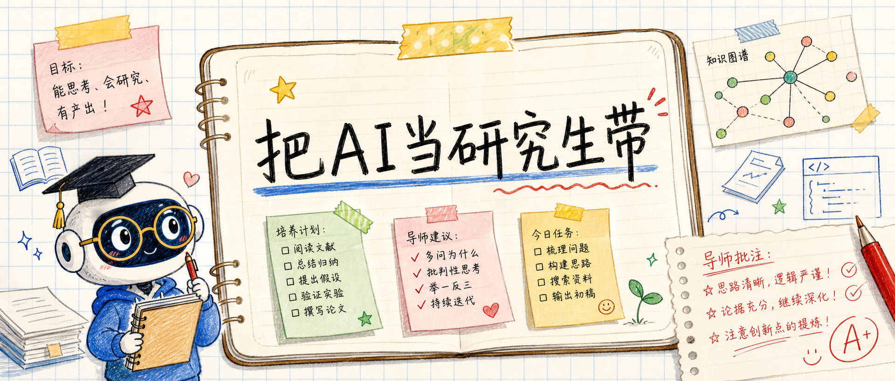
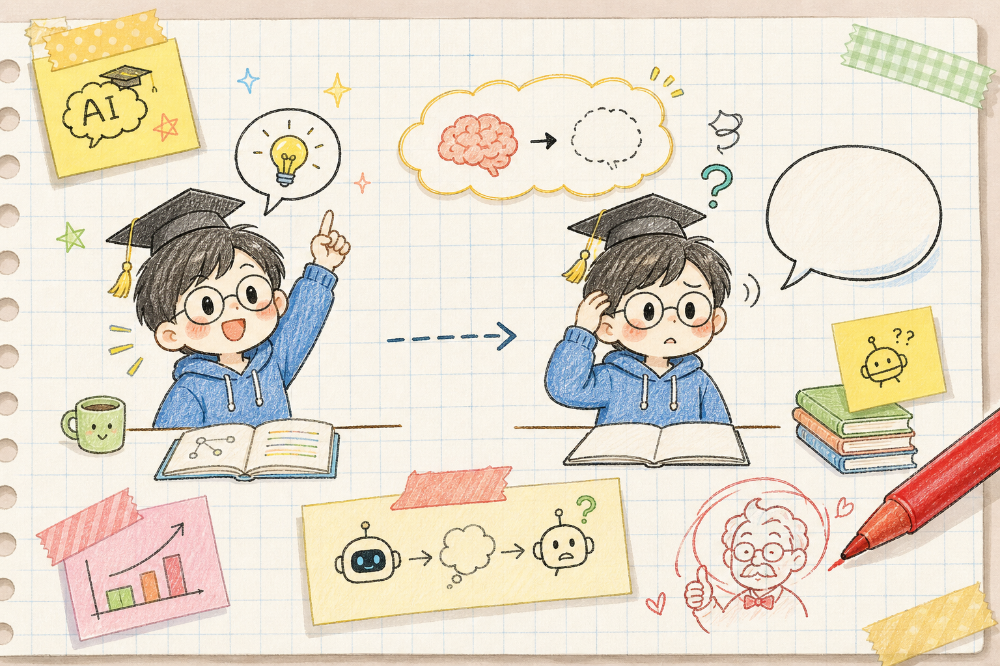
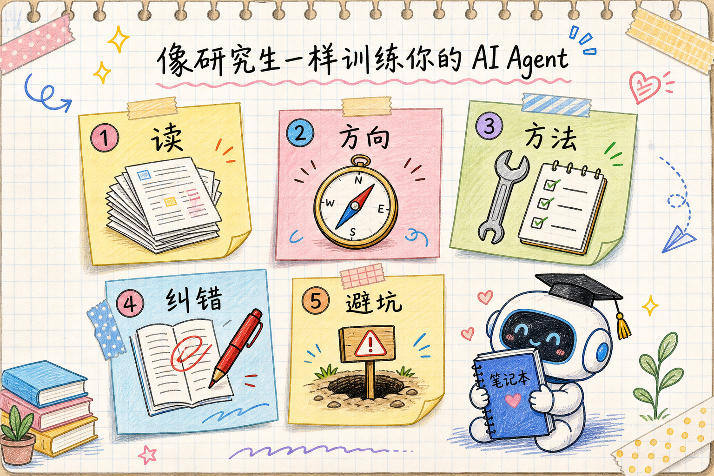
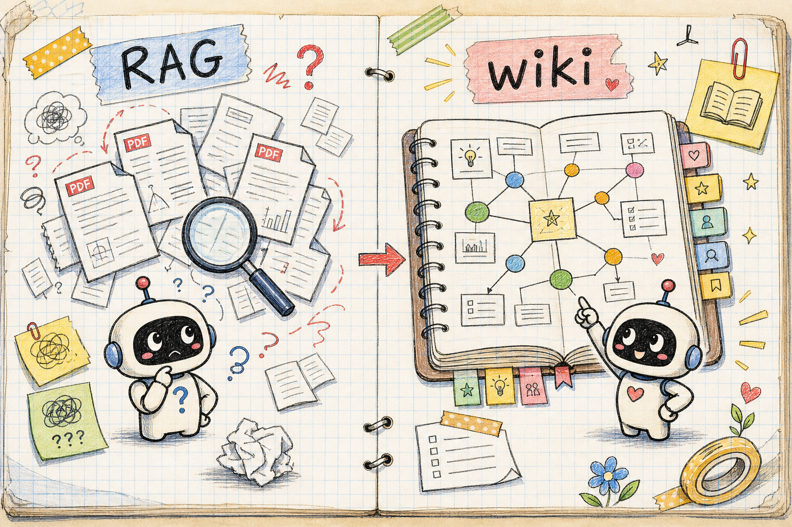
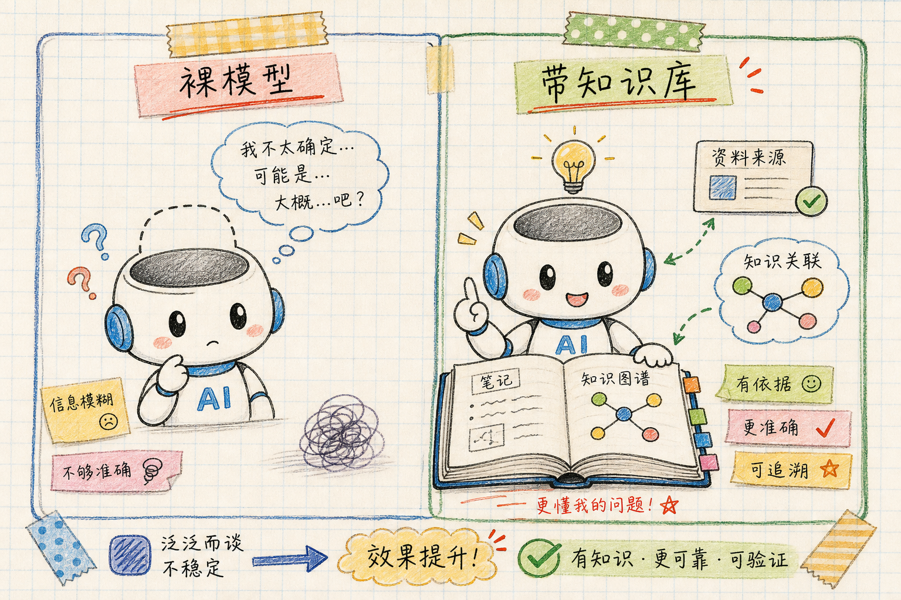
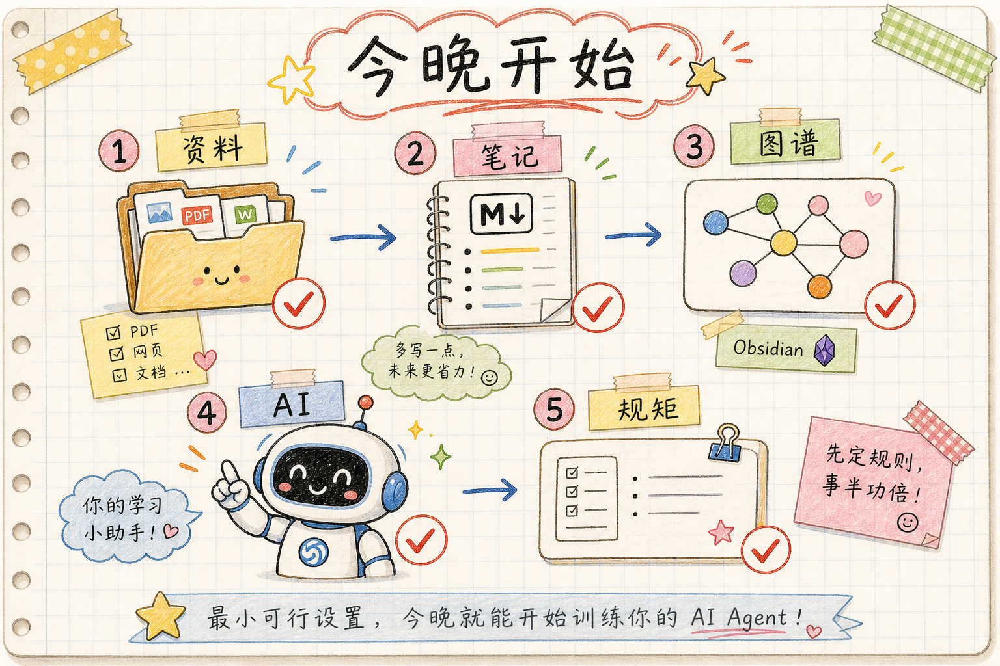

# 把AI当研究生带

我这次复旦 AI Agent 研讨会的报告，题目有点不像技术报告：

把 AI Agent 培养成你的研究生。

这个比喻不是为了好玩。它其实抓住了今天很多人用 AI 时最别扭的地方：AI 当面很聪明，换个对话就像不认识你。

你刚教过它你的课题、你的规矩、你读过的文献。下一次，它又开始讲人人都能听的标准答案。对随手聊天来说，这不算大问题。对科研、写作、长期项目来说，这就很烦了。

我想讲的，不是“AI 又能替人干什么”。那种话已经太多了。

我真正想讲的是：如果你一直把 AI 当一次性工具，它就永远是一个临时工。你要让它变成长期助手，就得像带研究生一样带它。

## 它不是笨，是每天都重新入学

今天的大模型并不笨。

它能读一大段文献，能写代码，能帮你整理思路。你给它一篇论文，它能十分钟内讲出结构。你给它一个报错，它能猜出问题在哪。很多时候，它的反应比一个刚进组的学生快得多。

麻烦在另一头：它没有长期记忆。

一次对话里，它反应很快。换一次对话，如果没有外部记忆，它就不知道你的研究方向，不知道你正在投哪些稿子，也不记得你昨天刚纠正过它什么。

这很像一个天资不错的新生。

上课反应快，问什么都能接。但他没有读过组里的论文，不知道老师的品味，也没写过实验记录。你让他马上接一个三年课题，他多半会给你一堆看上去合理、其实很空的建议。

裸用 AI 也是这样。

它会说很多正确的废话。比如你问“核反应里的光学势应该怎么理解”，它可以给一段教科书式说明。那段话可能没错，可它不知道你关心的是 CDCC、IAV，还是最近那篇 DREAM 贝叶斯校准。它回答的是“这个领域一般怎么说”，不是“你这里该怎么做”。

所以问题不只是模型能力。问题是你每次都让它从零入学。

## 好研究生不是天生的，是带出来的

带学生的人都知道，学生真正有用，不是因为他一开始多聪明。

他要读组里的文献，知道这个方向前人怎么做过。要理解老师的标准，知道什么叫“物理图像对”、什么只是数值拟合好看。要学会一套做事流程，读论文怎么记，算例怎么复现，图怎么画，稿子怎么改。

他还得挨批。

批一次，如果他下次还犯同样的错，那就没带出来。好的学生会把这次批评变成自己的习惯。再往后，他会积累失败经验，知道哪些想法已经走不通，哪些坑以前踩过。

把 AI 当研究生带，也是这几件事。

知识库的价值，不是把资料堆在一个地方。资料只是原料。真正有用的是，你把“怎么读、怎么判断、怎么做事、怎么记住错误”一层层写进去。

## 第一步：让它读文献，但别只留摘要

很多人让 AI 读论文，读完就结束了。

这就像让学生读完一篇文章，只交一张小卡片：这篇讲了什么、用了什么方法、结论是什么。卡片有用，但还不够。

真正该做的是让它把论文写进领域地图里。

比如一篇论文讲 CDCC，它不该只存在这篇论文自己的页面里，还要追加到 CDCC 方法页。它如果讨论阈异常，就要写进阈异常页面。它如果和另一篇论文结论冲突，就要写到争论页里。

这样读一篇，整个知识网就长一点。

时间久了，每个方法页底部都会有“用到它的论文”。每个概念页都会有来龙去脉。你再问“谁做过 X”，它不需要临时翻一堆 PDF，而是先看自己已经整理好的地图。

这和学生读文献很像。差学生读完只记得标题。好学生读完会说：这篇其实接在某条线后面，它改了一个假设，和另一篇的结果冲突。

## 第二步：告诉它你是谁

很多 AI 回答不好，并不是通用知识不够。它真正缺的，是关于你的那一层背景。

它不知道你现在最重要的稿子是哪篇，不知道你常用哪些代码，不知道你在论文里不用某些写法，也不知道哪些合作者的意见要特别当回事。

这些东西不该每次靠检索碰运气。它们应该每次对话都自动带上。

我自己的做法是写一份很小但很硬的个人档案。里面放研究方向、正在做的项目、论文写作规矩、算力资源、合作者关系，还有一些非常具体的偏好。

比如：

- 物理正确性优先，拟合好看不能压过物理图像。
- 能跑一个小测试，就不要先写十页计划。
- 画图必须走固定的绘图流程。
- 前导师和当前组长的意见，在判断里要加权。

这些不是“资料”。这是一个组的脾气。

一个学生进组以后，真正要学的也不只是知识，而是这个组怎么判断问题。AI 要长期帮你干活，也得先学这个。

## 第三步：把做事方法写成 skill

好导师不会每次都从头讲：“读论文要先看摘要，再看图，再看方法，再整理引用。”

他会慢慢形成一套组内规矩。学生以后照着做。

对 agent 来说，这套规矩就是 skill。

skill 可以理解成“给 AI 的操作规程”。它不是神秘东西，本质上就是一份写得很清楚的文本：遇到这种任务，先读哪些文件，查重用什么标准，出处写到哪里，哪些地方不能编。

比如 `literature-wiki` 这个 skill，管的是读论文入库。它会要求 agent 写 source 笔记，更新概念页，标出矛盾，必要时补文献。`research-profile` 管的是个人研究档案，记录项目、论文、想法、失败、合作者、算力资源。

这一步很关键。

没有 skill，AI 每次都即兴发挥。今天像个认真学生，明天像个热心网友。写了 skill，它就开始按流程干活。流程越清楚，输出越稳定。

## 第四步：批一次，要让它记住

AI 最让人火大的地方之一，是同样的错会反复犯。

你说：“不要把这个目录的改动同步到另一个目录。”它当时说好。下次换个对话，它又自作主张同步了一遍。

这不是它坏，是它没有长期批注本。

所以每次具体纠错，都应该写成一条记忆。别只写“下次注意”。要写清楚三件事：错在哪里，为什么错，以后遇到类似情况怎么做。

这很像导师在学生稿子上批红字。

红字不是为了发泄。红字的价值在于，学生下次写稿前会先翻一遍，知道这类错以前挨过批。

AI 也一样。把一次批评写成可加载的记忆，它下次就有机会避开。同一个模型，参数没变，但行为会变。原因很简单：它开工前多读了一页“老师以前骂过什么”。

## 第五步：失败库比成功库更省时间

很多人喜欢记录成功项目，不爱记录失败想法。

科研里，失败记录其实更值钱。

一个想法为什么走不通，常常比一个想法为什么成功更能省时间。因为人和 AI 都有一个毛病：隔几个月以后，会重新爱上一个已经被自己否掉的点子。

比如一个课题看起来很美：用某个机器学习模型给一个二体问题做贝叶斯后验。听起来完整，图也能画。但一算发现，二体正问题本来毫秒级就解完，根本没有“贵到必须用模拟器”的理由。这个题就该毙掉。

毙掉以后，别只在脑子里记。写进 `ideas/killed`，连复活条件也写进去。以后 AI 再提这个方向，它先翻到这条记录，就不会兴冲冲带你走回头路。

这就是知识库真正开始省时间的地方。

它不只是告诉你“做过什么”，也提醒你“别再做什么”。

## RAG 像临时翻书，wiki 像长期写本子

这里要讲一个容易混的词：RAG。

RAG 可以粗略理解成“问问题时临时翻资料”。你问一句，它去一堆 PDF 或网页里找几段相关内容，再拼一个答案。这个办法当然有用。很多场景里，它就是最省事的做法。

但它有一个弱点：很多 RAG 是开卷考试，不是读书成长。

今天翻完，明天还得再翻。读了五十篇论文，下次还是从碎片里现拼。你花几个月形成的判断，没长在系统里。

wiki 的思路不一样。

它让 AI 先把资料整理成互相链接的笔记，再在笔记上持续更新。原始 PDF 还在，代码和数据也还在，但中间多了一层“已经被读过的知识”。

人看这层，可以用 Obsidian 点开图谱。agent 看这层，可以直接读 Markdown 文件。git 看这层，可以告诉你每次改了什么。

一句话：PDF 是书架，wiki 是读书笔记。

只放书架，当然也能查。可真正改变你思考方式的，是那些越写越厚的读书笔记。

## 一个真实对比：同一个问题，回答完全不同

报告里我放了一个例子。

问题是：

“我读过的文献里，谁的结果和 KD 全局光学势对不上？”

如果不带知识库，AI 很可能会回答一段普通综述：KD 光学势是核反应里常用的全局光学势，很多计算都用它，整体表现良好，也存在适用范围。

这段话没什么大错，但没用。

因为它不知道“我读过的文献”是哪一批。它也不知道我真正关心的是哪条研究线。

带知识库以后，回答会具体很多。它可以翻到我的 DREAM 贝叶斯校准记录，指出 d+58Ni 数据要求氘核表面吸收比 KD 高约 36%，再给出对应 source 笔记。

这时，AI 不再像一个百科全书朗读器。它像一个知道组里材料的学生。

我自己的库里，现在有 571 篇精读文献，365 个实体页，195 个方法页。图谱里有 1425 个节点、6432 条链接。

这些数字不是为了炫耀规模。它们说明一件事：这个“学生”已经有一摞自己的课堂笔记。你问它问题，它先翻自己的本子，而不是开口就编。

## 底层其实只有五层

把这套系统拆开看，并不复杂。

第一层是纯文本。

所有重要东西都尽量写成 Markdown。人能读，agent 能读，git 能记录差异。二十年后换一个工具，也还能打开。

第二层是身份档案。

也就是每次对话都自动加载的 profile。它告诉 agent：你是谁，做什么，当前有哪些项目，哪些规矩不能破。

第三层是概念笔记。

论文读完以后，不能只躺在单篇摘要里，要写进方法页、体系页、争论页。统一词表也在这一层，防止同一个概念因为名字不同散成五页。

第四层是 skill。

它规定 agent 怎么读、怎么写、怎么查重、怎么更新。没有 skill，就靠临场发挥。有了 skill，才有稳定的组内流程。

第五层是记忆。

你每次纠正它，都写成可加载的规则。它下次开工前先读一遍，少犯老错。

这五层拼起来，就像一个学生的脑子：有身份，有笔记，有方法，有批语，还有走过的坑。

## 日常用起来，只有两句话

听起来像工程，其实日常使用很朴素。

第一句话：

把这篇论文加进文献库。

agent 应该做的，远不止总结。它要写一页 source 笔记，抽出关键数字和方法，更新相关概念页，和旧结论比对，再追加一条时间线。

第二句话：

我读过的材料里，谁支持或反对这个判断？

agent 先读索引和概念页，再给带出处的回答。如果这个回答质量不错，就把它写回库里，变成下一次可用的新材料。

这就是复利。

很多人用 AI，问完就走。聊天记录慢慢压到下面，过几天自己也找不到了。更好的做法是：问出好东西，就写回知识库。下一次再问，起点更高。

## 今晚就能开始，不用等系统完美

别把这事想成一个大工程。

最小可用版本，五个零件就够。

- 一个原始资料文件夹。PDF、代码、数据放这里，只存不改。
- 一个 Markdown 知识库。写论文笔记、概念页、项目页、想法页。
- 一个 Obsidian 或类似工具。人用它浏览图谱和链接。
- 一个能读写文件的 agent。Claude Code、Codex 这类都可以。
- 一份维护规矩。告诉 agent 文件怎么命名，重复概念怎么查，出处应该写到哪里。

第一天不用搭全套。

从今天读的一篇论文开始。先让 agent 写一页 source 笔记，再让它把这篇论文加到两个相关概念页。第二天再读一篇。一个月以后，你会发现自己已经不只是“保存了资料”。你是在养一个会长大的知识系统。

我放出来的 GitHub 项目叫 `research_LLM_wiki`，现在主要有两套 skill：

- `literature-wiki`：管读过的文献、概念页、方法页、争论记录。
- `research-profile`：管个人研究档案，包括项目、论文、想法、失败、合作者和算力资源。

项目地址是：

https://github.com/jinleiphys/research_LLM_wiki

它不是一个漂亮的 App。更准确地说，它是一套“带学生的规矩”。规矩写清楚了，agent 才知道每次该怎么入库、怎么回答、怎么把好答案写回去。

## 这套方法最适合谁

如果你只是偶尔问 AI 写一段文案，或者查一个小知识点，没必要搭这么重。

它适合的是长期积累型工作。

比如科研。你几年里读的文献、试过的代码、否掉的想法、投稿中的版本、合作者给过的意见，都需要留下来。

比如写作。你自己的观点、旧稿、素材、风格偏好、常犯问题，都不是一次对话能装下的。

比如复杂项目管理。一个项目做几个月，中间会有一堆决定、试验、失败路线。没有记录，AI 会和你一起失忆。

这种工作里，一次回答不算最贵。真正贵的是上下文。谁能攒住上下文，谁就赢一半。

## 丑话要说在前面

这东西不是魔法，也不是把脑子外包给 AI。

它有几个毛病，得承认。

摘要会丢细节。关键论文还得自己精读。AI 写的 source 笔记，只能帮你搭架子，不能替你做物理判断。

概念会分裂。同一个东西，可能因为别名不同被写成几页。这个要定期体检，把重复页合并，把断链补上。

维护有成本。每篇入库要花几分钟，每隔一段时间要整理一次。断粮以后，它就不长了。

单源会犯错。一个模型写进库里的结论，要标“单源”。重要判断要换另一个模型交叉检查，最后还是人负责。

还有保密问题。未发表稿件、审稿材料、合作者的私下意见，都要放在自己能控制的私有库里。能不能把材料交给某个 AI 工具，要看工具设置和期刊要求。别因为省事，把别人的未公开工作丢进不受控的地方。

把 AI 当研究生带，不是让它当老板。

它可以写组会纪要、整理文献、搭综述骨架、提醒你以前踩过的坑。真正的判断，尤其是物理判断、署名责任和投稿责任，还是在人这里。

## 这篇文章本身，就是一个小彩蛋

这次报告里我留了一个彩蛋。

你们看到的那套 slides，不是我从零手写每一页。大意是一句指令：给复旦 AI Agent 研讨会做一套 slides，讲个人知识库，用“把 agent 培养成研究生”打比方，素材从我的 wiki 里取。

agent 读了我的个人档案、文献库、项目记录和写作规矩，先搭结构，再写逐页讲稿。后面的判断、节奏和删改，还是我自己来。

这件事本身，就是方法的演示。

一个没有被带过的 AI，只能写一套通用的“AI 知识库介绍”。带过以后，它会先抓住几个和我有关的东西：我的研究线、报告习惯、真实例子，还有哪些地方不能乱编。

它不是替我思考。

它把我过去已经写下来的东西，拿出来重新组织了一遍。

## 一句话收住

个人知识库的价值，不在存档。

它是你对 agent 的培养。你读过的每一篇，纠正过的每一次，否掉过的每个想法，都会长在一个不毕业的研究生身上。
