# Vibe Research 在直接核反应理论中的实战

<div class="text-xl mt-5" style="color: var(--olive); letter-spacing: 0.01em;">
LLM-Assisted Research in Low-Energy Nuclear Theory
</div>

<div class="mt-12 text-base" style="color: var(--near-black);">

**Jin Lei (金磊)**<br>
同济大学物理科学与工程学院 / Tongji University

</div>

<div class="ui-label mt-4">
中国科学院近代物理研究所 · 2026 年 6 月 23 日
</div>

<div class="abs-bl m-6 text-xs" style="color: var(--stone); max-width: 420px; text-align: left; line-height: 1.5;">
Dec 2025 – Apr 2026 · 16 papers · 11 on arXiv · 3 published in Phys. Rev. C + 1 published in Phys. Lett. B + 2 accepted in Phys. Rev. C
</div>

<div class="abs-br m-6 text-xs" style="color: var(--color-gap); max-width: 320px; text-align: right; line-height: 1.55;">
⚠ 免责声明: 建议尚不具备独立科研能力的低年级研究生现在离场. 本报告的内容如果被没有 Expert Filter 的人照搬, 大概率会毁掉整个科研生涯.
</div>


---
layout: section
---

# 实战篇
## Vibe Research in Action

<div style="color: var(--olive);" class="text-lg mt-2">
四个月十六篇论文背后的 LLM 辅助研究工作流：先看做出了什么
</div>

---
layout: default
---

# <span style="color: var(--pencil-red)">●</span> 一个不对称的对照实验

<div class="grid grid-cols-2 gap-8 mt-8">

<div class="sketch-card sketch-card-red">
<div class="text-sm font-bold" style="color: var(--pencil-brown);">2024</div>
<div class="text-5xl font-bold mt-2">~3 months</div>
<div class="text-sm mt-4" style="color: var(--pencil-brown);">

单通道散射 emulator<br>
复杂度: <strong>1 channel</strong><br>
工具: GPT-4 网页版<br>
执行者: 同济博士生 (同济本校保研, GPA top), GPT-4 辅助

</div>
<div class="text-xs mt-3" style="color: var(--pencil-brown);">[Liu, Jin Lei, Ren, Phys. Lett. B <strong>858</strong>, 139070 (2024)]</div>
</div>

<div v-click class="sketch-card sketch-card-green">
<div class="text-sm font-bold" style="color: var(--pencil-brown);">2025-12</div>
<div class="text-5xl font-bold mt-2">4 days</div>
<div class="text-sm mt-4" style="color: var(--pencil-brown);">

CDCC reduced-basis emulator<br>
复杂度: <strong>37 channels, 18 parameters</strong><br>
执行者: 我 + Claude Code CLI (agentic)<br>
没有学生参与

</div>
<div class="text-xs mt-3" style="color: var(--pencil-brown);">[Jin Lei, Phys. Rev. C 113, 044610 (2026)]</div>
</div>

</div>

<v-click>

<div class="box-idea mt-6 text-center">

**同济保研博士生 3 个月 vs 我 + AI 4 天. 复杂度还高了一个量级.**<br>
<span class="text-sm" style="color: var(--pencil-brown);">学生: 反馈慢、不可控、需要情绪价值、push 狠了觉得你是法西斯.<br>AI: 花钱, tokens 够, 立刻出结果, 情绪价值还拉满.</span>

</div>

</v-click>

---
layout: default
---

# <span style="color: var(--pencil-red)">●</span> 计算物理的真实瓶颈

<v-clicks>

<div class="mt-6 text-lg">

一个计算物理项目的智力内核通常在<strong>几天到几周</strong>内结晶:

一个物理想法 · 一个新算法 · 一个数值不稳定性的来源 · 一个物理诠释

</div>

<div class="mt-4 text-lg">

把这个内核变成一篇发表的论文通常需要<strong>几个月到几年</strong>:

内存分配 debug · 库文档查阅 · 图表格式调整 · 论文撰写 · 审稿回复

</div>

<div class="box-gap mt-6">

**一个长期被回避的事实:** 一个研究者一辈子能做完的物理远少于他能想到的物理. 真正的约束从来不是"想什么", 而是"做完什么". Implementation overhead 占据了总工作量的绝大部分. 智力内核只是少数份额.

</div>

</v-clicks>

---
layout: default
---

# <span style="color: var(--pencil-red)">●</span> 直接反应: 一个极端案例

<v-clicks>

<div class="mt-2 text-base">

**理论骨架: 几十年前已定型**

DWBA · ADWA · CDCC · R-matrix · Faddeev · IAV breakup<br>
形式框架在 1960s 到 1990s 之间全部成形. 此后: 完善, 而非突破.

</div>

<div class="mt-4 text-base">

**实验数据: 增长速度超过理论家的处理能力**

FRIB · RIKEN · GANIL · HIAF · FAIR · NSCL<br>
全球 RIB 设施产出反应数据的速度远超理论端的消化能力.

</div>

<div class="mt-4 text-base">

**理论家: 停滞或萎缩**

低能核理论博士产出 20 年来持平. 资深理论家陆续退休.<br>
可用于将数据转化为物理的有效人力: 持平或下降.

</div>

<div class="box-gap mt-4">

**结构性后果:** 可以问的物理远多于能做完的物理. 传统的解法("培养更多学生")回报递减, 二十年来越填越窄.

</div>

</v-clicks>

---
layout: default
---

# <span style="color: var(--pencil-blue)">●</span> 两个极端, 都错了

<div class="grid grid-cols-2 gap-6 mt-6">

<div v-click class="sketch-card sketch-card-red">
<div class="font-bold text-lg mb-2">怀疑派</div>
<div class="text-sm" style="color: var(--pencil-brown);">

"LLM 摧毁科学严谨性."

虚构引用 · 错误物理 · 随机鹦鹉 · 不可验证.

<br><br>

<strong>对的:</strong> LLM 确实会犯错, 需要人工验证.<br>
<strong>错的:</strong> 把"需要监督"等同于"不能使用".

</div>
</div>

<div v-click class="sketch-card sketch-card-red">
<div class="font-bold text-lg mb-2">热情派</div>
<div class="text-sm" style="color: var(--pencil-brown);">

"AI Scientist 能做端到端研究."

自主生成论文 · 每篇 $15 · 不需要研究者.<br>
[Sakana AI, 2024]

<br>

<strong>对的:</strong> LLM 能起草代码和文章.<br>
<strong>错的:</strong> 把"能起草"等同于"能决策".

</div>
</div>

</div>

<v-click>

<div class="box-idea mt-8 text-center">

**中间立场: Vibe Research = 协作, 不是自动化.**<br>
<span class="text-sm" style="color: var(--pencil-brown);">人的判断始终居中. LLM 处理摩擦. Expert Filter 不可简化.</span>

</div>

</v-click>

---
layout: default
---

# <span style="color: var(--pencil-blue)">●</span> 先交代一下: "Vibe" 从哪来?

<div class="grid gap-6 mt-4" style="grid-template-columns: 3fr 2fr;">

<div v-click>

<div class="box-evidence">

<div class="text-lg" style="color: var(--pencil-blue); font-style: italic;">

"There's a new kind of coding I call <strong>vibe coding</strong>, where you fully give in to the vibes, embrace exponentials, and <strong>forget that the code even exists</strong>."

</div>

<div class="text-right text-sm mt-3" style="color: var(--pencil-brown);">

— Andrej Karpathy, 2025 年 2 月<br>
<span class="text-xs">OpenAI 联合创始人 · 前 Tesla AI 负责人</span>

</div>

</div>

<div class="mt-4 text-sm">

**Vibe Coding 的原味** (消费级):

- 自然语言描述需求, 语音也行
- 接受 AI 生成的代码, **不逐行审读**
- 出错就把报错丢回去继续改
- 写个周末小工具, "跑得起来就行"

</div>

</div>

<div v-click class="sketch-card sketch-card-blue">

<div class="font-bold mb-2">一年内进入主流词汇</div>
<div class="text-xs" style="color: var(--pencil-brown);">

- Collins 英语词典 **Word of the Year 2025**
- Merriam-Webster 2025 年 3 月收录
- 一条推特 → 行业术语

</div>

<div class="box-gap mt-4 text-sm">

**但科研不能照抄:**<br>
"forget the code" 在消费级 app 里可行, 在 Phys. Rev. 上不可行. 物理错误不会报错, LLM 会自信地给你一个看起来对的错结论.

</div>

</div>

</div>

<v-click>

<div class="box-idea mt-6 text-center">
所以今天讲的不是 Vibe Coding, 是 <strong>Vibe Research</strong> — 借 Karpathy 的加速直觉, 但把"放弃理解代码"换成"放弃手写代码"; 物理判断必须由研究者亲手把关.
</div>

</v-click>

---
layout: default
---

# <span style="color: var(--pencil-blue)">●</span> Vibe Research: 精确定义

<div class="text-center text-2xl mt-4" style="color: var(--pencil-blue);">

<strong>人的判断力 × LLM 实现速度</strong>

</div>

<div class="grid grid-cols-2 gap-6 mt-6">

<div v-click class="sketch-card sketch-card-blue">
<div class="font-bold mb-2">人保留的 (不可替代)</div>
<div class="text-sm" style="color: var(--pencil-brown);">

- 问题选择 (解决什么)
- 物理判断 (这合不合理)
- 数值直觉 (这对不对劲)
- 结果解释 (这意味着什么)
- 最终筛选 (什么进论文)

</div>
</div>

<div v-click class="sketch-card sketch-card-green">
<div class="font-bold mb-2">LLM 加速的</div>
<div class="text-sm" style="color: var(--pencil-brown);">

- 文献综合: 周 → 天
- 样板代码: 天 → 秒
- 算法实现: 周 → 小时
- Debug: 假设和诊断在秒级完成
- 图表和初稿: 天 → 小时
- 审稿回复: 天 → 小时

</div>
</div>

</div>

<v-click>

<div class="box-idea mt-6 text-center">
"Vibe Research 不是让 AI 替你做物理. 是把物理之外的一切交给 AI, 再把省下的时间用来做更多的物理."
</div>

</v-click>

---
layout: default
---

# <span style="color: var(--pencil-blue)">●</span> Expert Filter (专家过滤器)

<div class="grid gap-4 mt-2" style="grid-template-columns: 3fr 2fr;">

<div class="flex items-center justify-center">
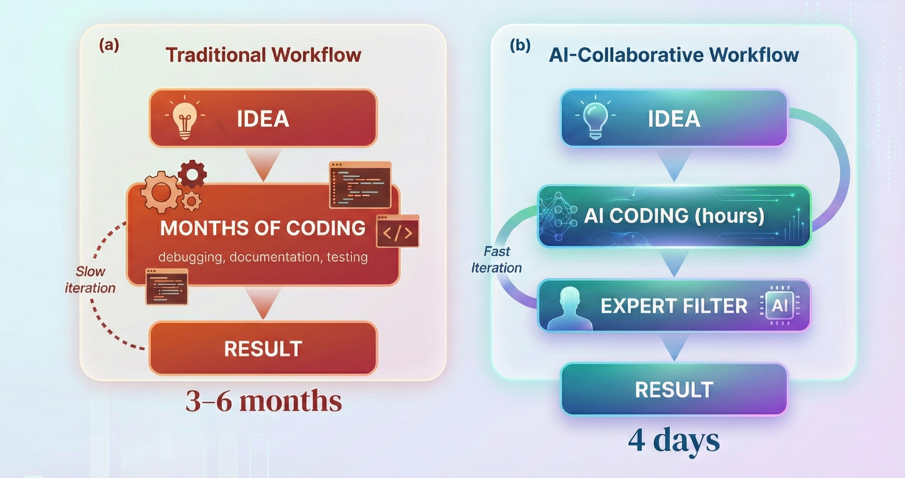
</div>

<div class="text-sm">

<v-clicks>

<div class="box-gap mt-0">

**传统流程:**<br>
Idea → 几个月 coding → 结果<br>
迭代缓慢. 90% 时间花在 implementation 上.

</div>

<div class="box-idea mt-3">

**AI 协作流程:**<br>
Idea → AI coding (小时) → **Expert Filter** → 结果<br>
快速迭代. 90% 时间花在判断上.

</div>

<div class="box-evidence mt-3">

**悖论:** LLM 不是民主化研究. Expert Filter 放大专家优势. 非专家得到同样的输出, 但无法区分信号与噪声.

</div>

</v-clicks>

</div>

</div>

---
layout: default
---

# <span style="color: var(--pencil-blue)">●</span> 案例一: DBMM, 问题
## Direct Boundary Matching Method

<div class="mt-4 text-lg">

核散射问题有一个长期存在的技术痛点: **边界条件处理是繁琐的.**

</div>

<v-clicks>

<div class="mt-4 text-base">

<strong>现有的绕行方案:</strong>

1. **R-matrix method** · Bloch operator 保证厄米性, 然后两步匹配 Coulomb 函数
2. **Complex Scaling** · 旋转 $r \to r e^{i\theta}$ 使散射态变为 $L^2$ 衰减函数
3. **Lorentz Integral Transform** · 通过 Lorentzian kernel 将连续谱转为束缚态, 再反演

</div>

<div class="box-gap mt-4">

**共同代价:** 每种方法都需要额外的形式化机器 (Bloch operator, 坐标旋转, kernel 反演). 代码复杂度和推导长度都增加. 应用到新系统意味着每次都要重新打通整套框架.<br>
**根本原因:** 散射态的振荡和不衰减渐近行为与束缚态的 $L^2$ 表示相冲突.

</div>

</v-clicks>

---
layout: default
---

# <span style="color: var(--pencil-blue)">●</span> 案例一: DBMM, 简洁的想法

<div class="mt-4 text-base">

**把出射波边界条件直接写进矩阵方程的最后一行.**<br>
不需要 Bloch operator. 不需要坐标旋转. 不需要 kernel 反演.

</div>

<v-click>

<div class="box-idea mt-4 text-sm">

**设定:** 径向 Schrödinger 方程在 $[0, R]$ 上, 用 Lagrange-Legendre 基 $\hat f_j(x)$ 在 Gauss-Legendre 网格点上展开.

**内部行** $i = 1, \dots, N-1$: $\sum_j M_{ij} c_j = b_i$, 标准离散化 Schrödinger.

**最后一行** ($i = N$) 直接编码出射波边界条件,

$$\sum_{j=1}^N B_j c_j = 0, \quad B_j = \left.\frac{d\hat f_j}{dx}\right|_{x=1} - R\gamma_s \hat f_j(1), \quad \gamma_s = k\frac{H_\ell^{+\prime}(\eta, kR)}{H_\ell^+(\eta, kR)}$$

一次矩阵求解. 无需后处理匹配步骤.

</div>

</v-click>

<v-click>

<div class="box-evidence mt-3 text-sm">

**形式上的推论:** 矩阵的每一行对应一个清晰的物理陈述. 内部行说 "Schrödinger 在此处成立." 最后一行说 "出射波在 $r = R$ 处成立." 形式本身自解释. 直接推广到耦合道, 不需要任何额外技巧.

</div>

</v-click>

---
layout: default
---

# <span style="color: var(--pencil-green)">●</span> 案例一: DBMM 验证
## p + ¹²C, E_lab = 30 MeV, 与 Numerov 对照

<div class="grid grid-cols-3 gap-3 mt-2">

<div>
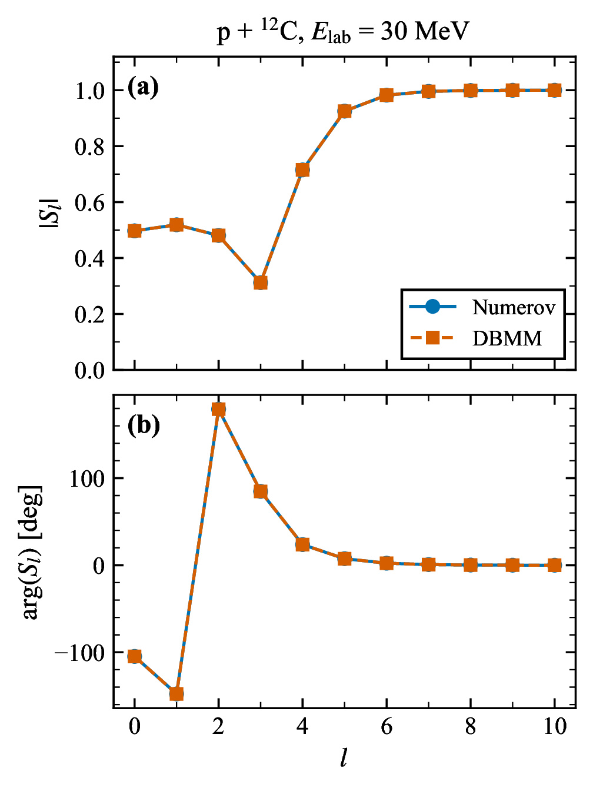
<div class="fig-caption">

$|S_\ell|$ 和 $\arg(S_\ell)$ 随 $\ell$ 变化

</div>
</div>

<div>
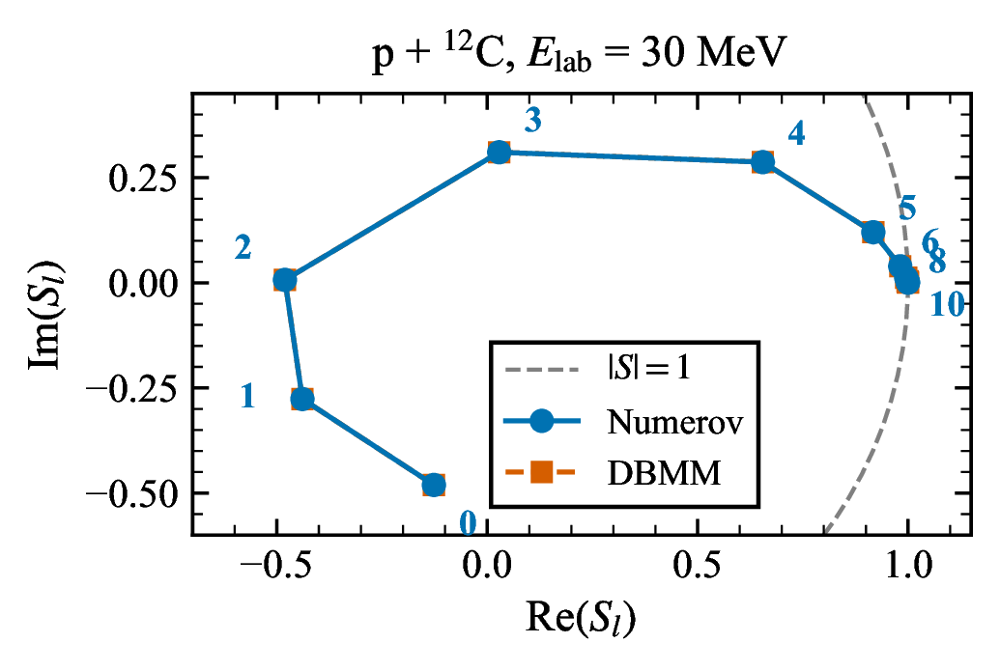
<div class="fig-caption">

复 $S_\ell$ 平面上的 Argand 图

</div>
</div>

<div>
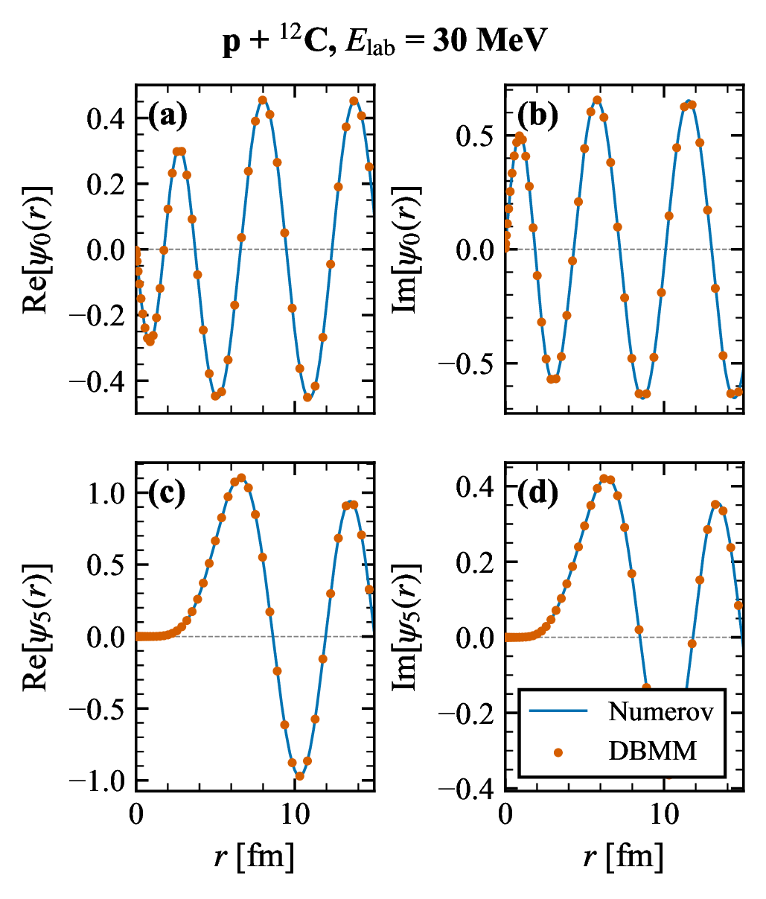
<div class="fig-caption">

径向波函数 $\psi_\ell(r)$, $\ell = 0, 5$

</div>
</div>

</div>

<v-click>

<div class="box-evidence mt-3">

**结论:** $|S_\ell|$ 与 Numerov 符合到 $2.5 \times 10^{-5}$, 相位符合优于 $0.01°$, 覆盖所有分波. 波函数在每个网格点上吻合, 从内部到渐近区. **矩阵的每一行对应一个清晰的物理陈述, 这种自解释结构正是让 POD-Galerkin 在案例二中保持简洁的关键.**

</div>

<div class="text-xs mt-2 text-right" style="color: var(--pencil-brown); opacity: 0.7;">
Jin Lei, Phys. Rev. C 113, 024614 (2026)
</div>

</v-click>

---
layout: default
---

# <span style="color: var(--pencil-blue)">●</span> 案例二: CDCC 计算瓶颈

<v-clicks>

<div class="mt-4 text-base">

**CDCC** (Continuum-Discretized Coupled-Channels): 直接反应的主力方法. 将三体散射转化为有限维耦合道. 严格处理 breakup 对弹性和反应截面的反馈.

</div>

<div class="mt-4 text-base">

**一次现代 CDCC 计算:**

- $N_{\mathrm{ch}} \sim 30$ 到 $50$ 个耦合道
- $J_{\mathrm{max}} \sim 30$ 个分波
- $\sim 10^4$ 维复线性系统
- **单次完整计算: 几十分钟到几小时**

</div>

<div class="box-gap mt-4">

**对 Bayesian UQ 来说, 这是一堵墙.** MCMC 和 nested sampling 需要 $10^4$ 到 $10^6$ 次 likelihood 评估. 几十分钟乘以几十万次等于 $O(10^6)$ CPU-hours. 不是慢, 是实际上不可行.

</div>

</v-clicks>

---
layout: default
---

# <span style="color: var(--pencil-blue)">●</span> 什么是 Emulator?

<v-clicks>

<div class="mt-4 text-lg">

**一句话:** 精确求解器的快速近似代理 (fast surrogate).

用少量精确解"学"出低维表示, 使新参数点的计算从**分钟级压缩到毫秒级**.

</div>

<div class="grid grid-cols-2 gap-6 mt-6">

<div class="sketch-card sketch-card-red">
<div class="text-sm font-bold" style="color: var(--pencil-brown);">Offline (一次性投入)</div>
<div class="text-base mt-2" style="color: var(--pencil-brown);">

1. 在参数空间采样 $N_s$ 个点<br>
2. 每个点运行完整求解器<br>
3. 从 $N_s$ 组精确解中提取低维结构

</div>
<div class="text-xs mt-2" style="color: var(--pencil-brown); opacity: 0.7;">代价高, 但只做一次</div>
</div>

<div class="sketch-card sketch-card-green">
<div class="text-sm font-bold" style="color: var(--pencil-brown);">Online (每次新参数)</div>
<div class="text-base mt-2" style="color: var(--pencil-brown);">

1. 投影到低维空间<br>
2. 求解 $n_b \times n_b$ 小系统 ($n_b \ll N$)<br>
3. 重建完整解

</div>
<div class="text-xs mt-2" style="color: var(--pencil-brown); opacity: 0.7;">毫秒级, 可重复 10⁶ 次</div>
</div>

</div>

<div class="box-idea mt-6 text-center">

**为什么核物理需要它?** Bayesian UQ 需要 $10^4$–$10^6$ 次 likelihood 评估.<br>
<span class="text-sm">Emulator 让每次评估从 30 min → 30 ms, 使贝叶斯推断从不可行变为常规操作.</span>

</div>

</v-clicks>

---
layout: default
---

# <span style="color: var(--pencil-blue)">●</span> 核物理 Emulator: 三条路线

<div class="mt-2">

<v-clicks>

<div class="sketch-card sketch-card-blue mt-3">
<div class="grid" style="grid-template-columns: 2fr 3fr; gap: 1rem;">
<div>

**Eigenvector Continuation**<br>
<span class="text-xs">Furnstahl, Garcia, Millican & Zhang (2020)</span>

</div>
<div class="text-sm" style="color: var(--pencil-brown);">

不同参数点的精确解构成非正交变分基, 通过 **Kohn 变分原理**求 K-matrix. 在 NN 散射和 $\alpha$-${}^{208}$Pb 中验证. 核结构领域 (NCSM) 也广泛使用.

</div>
</div>
</div>

<div class="sketch-card sketch-card-green mt-3">
<div class="grid" style="grid-template-columns: 2fr 3fr; gap: 1rem;">
<div>

**POD-Galerkin / RBM**<br>
<span class="text-xs">Liu, Jin Lei & Ren, PLB (2024)<br>**Jin Lei, PRC 113, 044610 (2026)** ← 今天的案例</span>

</div>
<div class="text-sm" style="color: var(--pencil-brown);">

SVD 提取主模式 (proper orthogonal decomposition), **Galerkin 投影**将耦合方程降维. 源自计算流体力学, 代数结构清晰, 天然适配矩阵求解器.

</div>
</div>
</div>

<div class="sketch-card mt-3" style="border-color: var(--pencil-brown);">
<div class="grid" style="grid-template-columns: 2fr 3fr; gap: 1rem;">
<div>

**机器学习代理**<br>
<span class="text-xs">GP emulators; BANNANE (2026)</span>

</div>
<div class="text-sm" style="color: var(--pencil-brown);">

Gaussian process, 神经网络等统计模型拟合输入-输出映射. BANNANE 首次实现跨核素 ($Z, N$) 仿真, 突破连续参数限制.

</div>
</div>
</div>

<div class="box-idea mt-4 text-center">

**共同点:** 都不是 black box. 都利用物理方程对参数的**连续依赖性**, 用数学降维而非暴力拟合.

</div>

</v-clicks>

</div>

---
layout: default
---

# <span style="color: var(--pencil-blue)">●</span> 案例二: 基于 DBMM 的 POD-Galerkin

<div class="grid gap-3 mt-2" style="grid-template-columns: 3fr 2fr;">

<div class="flex items-center justify-center">
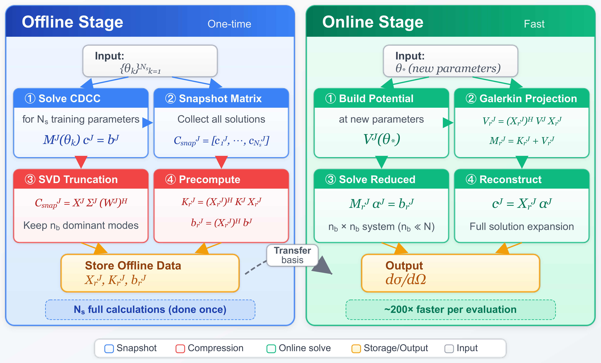
</div>

<div class="text-sm">

<v-clicks>

<div class="box-gap mt-0">

**Offline (一次性)**<br>
1. 在采样参数处求解 $N_s$ 次完整 CDCC<br>
2. 将 snapshot 收集到矩阵 $C_{\mathrm{snap}}$<br>
3. SVD 截断, 保留 $n_b$ 个主要模式<br>
4. 预计算与参数无关的矩阵

</div>

<div class="box-idea mt-3">

**Online (每组新参数)**<br>
1. 在 $\boldsymbol\theta_*$ 处构建势能矩阵<br>
2. Galerkin 投影到 $n_b$ 维基上<br>
3. 求解 $n_b \times n_b$ reduced system<br>
4. 重建完整解, 输出 $d\sigma/d\Omega$

</div>

<div class="box-evidence mt-3 text-xs">

**基石:** reduced system 继承了 DBMM 的矩阵结构. DBMM 不是一个平行项目, 而是让 POD-Galerkin 在耦合道问题上保持简洁的数值基础.

</div>

</v-clicks>

</div>

</div>

---
layout: default
---

# <span style="color: var(--pencil-blue)">●</span> 案例二: 测试问题

<div class="text-base">

**体系:** $d + {}^{58}\mathrm{Ni}$ 弹性散射和 breakup, $E_d = 21.6$ MeV

</div>

<div class="grid grid-cols-2 gap-4 mt-3">

<div class="text-sm">

<strong>物理设定</strong>

- 氘核作为 $n+p$, 连续谱离散化为 $s, p, d$ 波到 12 MeV
- $J_{\mathrm{max}} = 30$ 个分波, $N_{\mathrm{ch}} = 37$ 个耦合道
- 每个 $J$ 的矩阵大小 $\sim 5000 \times 5000$ 复数

<strong>参数空间</strong>

- 18 个光学势参数同时变化
- 9 个 $p + {}^{58}\mathrm{Ni}$, 9 个 $n + {}^{58}\mathrm{Ni}$
- Woods-Saxon volume, surface 和 Coulomb
- 在 KD02 全局参数化基础上变化 10% 到 50% [Koning-Delaroche, NPA 713, 231 (2003)]

</div>

<div class="text-sm">

<strong>训练</strong>

- $N_s = 200$ 个样本, Latin hypercube 采样
- 每个 $J$ 独立 reduced basis ($n_b \sim 5$ 到 $50$, 随 $J$ 变化)
- SVD 容差 $\epsilon_{\mathrm{tol}} = 10^{-6}$
- Offline 代价 ≈ 11 小时, 48 核 (Xeon Gold 6248R)
- 摊到 $10^5$ 到 $10^6$ 次 Bayesian 评估上, offline 代价可忽略

<strong>为什么这是真正的测试</strong>

18 维同时变化的参数空间正是 naive surrogate 方法 (RBF, 少参数 EIM) 崩溃的区域. 也是 halo nuclei 光学势 UQ 真正需要的维度.

</div>

</div>

---
layout: default
---

# <span style="color: var(--pencil-green)">●</span> 案例二: 结果
## 220× 加速, 亚 0.1% 精度

<div class="grid grid-cols-2 gap-3 mt-2">

<div>
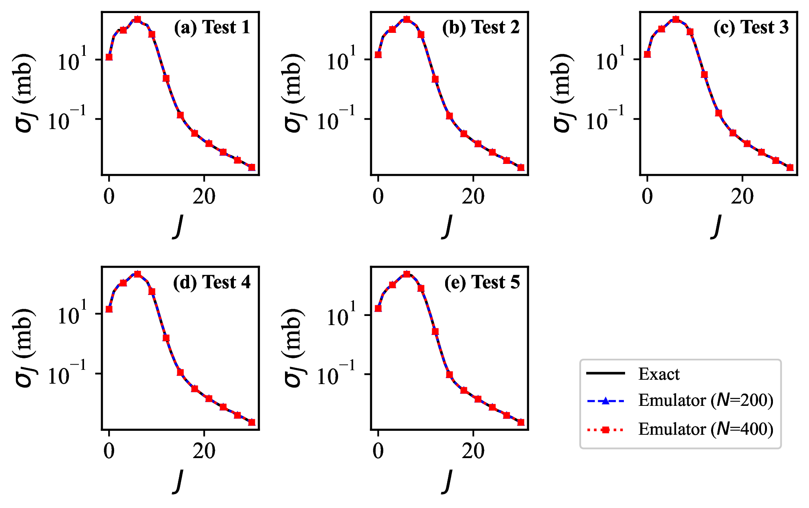
<div class="fig-caption">

分波弹性 $\sigma_J$ 随 $J$ 变化, 5 组测试. Exact (黑) 与 emulator ($N_s=200$ 蓝, $N_s=400$ 红) 完全重合.

</div>
</div>

<div>
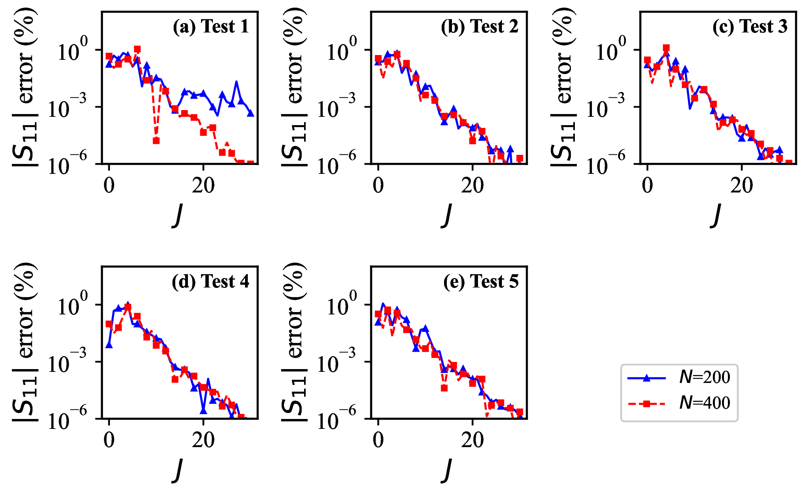
<div class="fig-caption">

$|S_{11}^J|$ 相对误差随 $J$ 变化. 大多数 $J$ 低于 0.1%, 典型 $10^{-4}$ 到 $10^{-2}$%.

</div>
</div>

</div>

<v-click>

<div class="box-evidence mt-2 text-sm">

**结论:** 对 5 组独立测试参数, **37 channels, 18 parameters**: emulator 在分波截面, S-matrix 元素, 波函数系数 $c_1(r)$ 和角分布上与完整 CDCC 吻合. 总截面误差: **0.005 到 0.043 %**. 时间: **6.5 s → 30 ms 每分波**, ≈220× 加速.

</div>

</v-click>

---
layout: default
---

# <span style="color: var(--pencil-green)">●</span> 案例二: 外部对比
## 同一时间窗口, 同一 LLM 时代, 同一子领域

<div class="mt-4 sketch-table">

| | **Catacora-Rios et al.** | **Liao et al.** | **This work** |
|---|:---:|:---:|:---:|
| **arXiv** | 2512.08097 | 2512.09429 | 2512.17687 |
| **Method** | Petrov-Galerkin + EIM (on FRESCO) | Eigenvector Continuation, RBM (on CCFULL) | POD + Galerkin + DBMM |
| **Target** | $^{48}$Ca / $^{208}$Pb inelastic (n,n') | $^{16}$O + Sm, W sub-barrier fusion | $d + {}^{58}$Ni, full CDCC |
| **Channels** | 2 to ~5 | 2, 3, 4 (three systems) | **37** |
| **Parameters** | 10 (WS + one $\beta$) | **2** ($\beta_2$, $\beta_4$) | **18** (full OP) |
| **Speedup** | ~30× | 200 to 400× | ~220× |
| **Accuracy** | ~1% median | matches exact curves | **< 0.1%** |

</div>

<v-click>

<div class="box-idea mt-4">

**同样四个月. 同一 LLM 时代. 同一子领域. 产出截然不同.**<br>
差别不在谁能用 LLM. 所有人都能用. 差别在工作流.

</div>

</v-click>

---
layout: default
---

# <span style="color: var(--pencil-green)">●</span> 那四天
## Git commit 历史, 2025 年 12 月 16 日至 19 日

<div class="flex items-center justify-center mt-4">
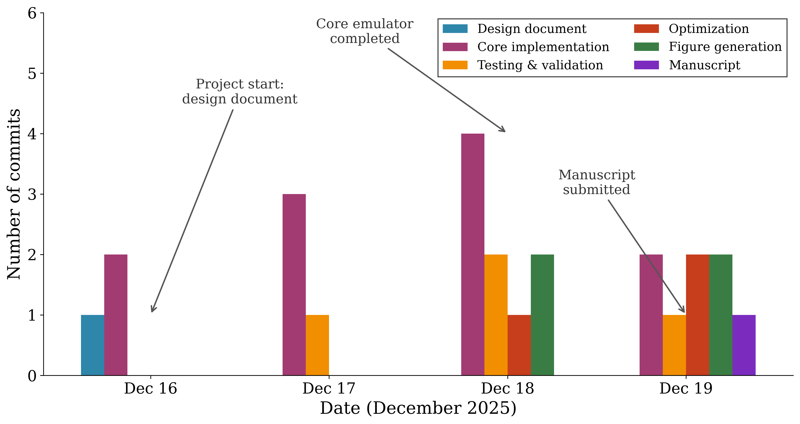
</div>

<v-click>

<div class="box-evidence mt-2 text-sm">

**时间线显示:** 设计文档 → 核心实现 → 测试与优化 → 图表生成 → 论文提交. **四个自然日.** 几千行代码. 每个 prompt, 每次代码迭代, 每个 debug 步骤都在本地 git 历史里.

</div>

</v-click>

---
layout: default
---

# <span style="color: var(--pencil-green)">●</span> 内部对比
## 2024 vs 2025: 同济保研博士生 vs 我 + AI

<div class="mt-4 sketch-table">

| | **2024 项目** | **2025 项目** |
|---|:---:|:---:|
| **内容** | 单通道散射 emulator | 耦合道 CDCC emulator |
| **通道数** | 1 | 37 |
| **参数数** | 少量 | 18 |
| **复杂度** | 基线 | **~10× 更难** |
| **执行者** | 博士生 (同济本校保研, GPA top) + GPT-4 网页版 | 我 + Claude Code CLI (agentic) |
| **工作模式** | 学生写代码, 复制粘贴问 LLM | LLM 直接写代码、运行、调试 |
| **提交用时** | ~3 个月 | **4 天** |
| **加速** | 1× | **~20×** |
| **发表** | Phys. Lett. B 858, 139070 | Phys. Rev. C 113, 044610 (2026) |

</div>

<v-click>

<div class="box-idea mt-4 text-center">

**复杂度 × 10, 时间 ÷ 20, 等效加速 ≈ 200.**<br>
<span class="text-sm" style="color: var(--pencil-brown);">同一套物理. 同一个导师. 变的是谁在写代码.</span>

</div>

</v-click>

---
layout: default
---

# <span style="color: var(--pencil-green)">●</span> 不是偶然
## 4 个月 16 篇论文, 3 个子领域, 5 位合作者

<div class="grid grid-cols-3 gap-4 mt-4 text-xs">

<div class="sketch-card sketch-card-blue">
<div class="font-bold text-sm mb-2">数值方法与求解器 (5)</div>
<div style="color: var(--pencil-brown);">

· DBMM [2512.07111] ⭐ PRC<br>
· RB emulator CDCC [2512.17687] ⭐ PRC<br>
· HPRMAT GPU R-matrix [2512.11590]<br>
· ECS PINN scattering [2602.04553]<br>
· BiLNN global optical model [2512.22500]

</div>
</div>

<div class="sketch-card sketch-card-green">
<div class="font-bold text-sm mb-2">反应理论与机制 (6)</div>
<div style="color: var(--pencil-brown);">

· Coherent Absorption [2601.08245] <span class="text-xs">w/ Liu, Ren</span><br>
· Deletion Does Not Measure [2603.24253] <span class="text-xs">w/ Liu</span><br>
· Exact CC Green function [2604.00471] <span class="text-xs">w/ Liu, Ren</span><br>
· Channel couplings redirect [2604.05600] <span class="text-xs">w/ Liu, Ren</span><br>
· Knockout quenching [2602.12690]<br>
· IAV breakup generalization [draft]

</div>
</div>

<div class="sketch-card sketch-card-purple">
<div class="font-bold text-sm mb-2">统计推断与 EFT (3)</div>
<div style="color: var(--pencil-brown);">

· Intrinsic Info Limit OP [draft]<br>
· Bayesian Calibration [draft] <span class="text-xs">w/ Furnstahl</span><br>
· Info Geometry of EFT [draft] <span class="text-xs">w/ Hu, Phillips, Furnstahl</span>

</div>
</div>

</div>

<v-click>

<div class="box-idea mt-4 text-center text-sm">

**工作流可泛化.** 不只是一个方向上多发论文, 而是横跨纯理论 (Green function), 计算工具 (GPU solver), 统计方法 (Bayesian calibration), EFT (information geometry). **三个子领域, 五位合作者, 同一条 pipeline.**

</div>

</v-click>

---
layout: default
---

# <span style="color: var(--pencil-red)">●</span> LLM 在哪里失败
## Coulomb phase 的故事

<v-clicks>

<div class="mt-4 text-base">

**在开发 DBMM 期间, Claude 曾生成了一段 Coulomb phase-shift 符号约定错误的代码.**

</div>

<div class="mt-3 text-base">

<strong>LLM 的表现:</strong> 代码整洁, 注释完整, 数值不崩溃, 自信地声称"已对照标准约定验证过".

</div>

<div class="mt-3 text-base">

<strong>我怎么发现的:</strong> 跑 benchmark, 发现低分波偏了约 $\pi$, 几分钟内知道问题在哪. 因为我知道物理正确的 Argand 图长什么样.

</div>

<div class="box-gap mt-4">

**反事实:** 如果我是一个对 Coulomb phase 约定不熟的学生, 我会接受那个自信的断言, 继续工作两到三天, 然后在某个下游结果明显不对时才回头. 那两三天就白费了.

</div>

<div class="box-idea mt-3">

**这就是 Expert Filter 在起作用.** LLM 的错误不是随机 bug, 而是自信且看起来合理的错误. 只有领域知识能过滤它们. 这决定了谁能安全地使用 vibe research.

</div>

</v-clicks>

---
layout: default
---

# <span style="color: var(--pencil-red)">●</span> 四种失败模式

<v-clicks>

<div class="mt-3 text-sm">

<strong>1. 虚构引用.</strong><br>
LLM 生成看似合理但不存在的 citation. 期刊名对, 作者名对, 年份接近, DOI 格式正确, 但论文不存在. <strong>每条 citation 必须手工验证. 这不能外包.</strong>

</div>

<div class="mt-3 text-sm">

<strong>2. 自信的错误.</strong><br>
LLM 不标注不确定性. 错误代码和错误推导的语气与正确的完全一样. Coulomb phase 的故事就是如此. <strong>只有领域知识能过滤.</strong>

</div>

<div class="mt-3 text-sm">

<strong>3. 过度工程化.</strong><br>
LLM 偏好复杂方案 (可能因为训练数据中复杂代码库过度代表). 它会提议 design pattern, 抽象层, 不必要的灵活性. <strong>简洁性必须由人主动强制执行.</strong>

</div>

<div class="mt-3 text-sm">

<strong>4. 上下文漂移.</strong><br>
即使有长 context, LLM 也会遗忘早期的设计决定, 在 session 后期产生不一致. <strong>需要显式的 session 管理, 关键约束需周期性重申.</strong>

</div>

</v-clicks>

---
layout: default
---

# <span style="color: var(--pencil-blue)">●</span> AI 辅助研究的五条原则

<v-clicks>

<div class="mt-3 text-base">

**1. 一切纳入版本控制.**<br>
Git 历史 (包括 commit messages) 作为可重复性和可追溯性的保障. 所有代码, prompt, 迭代都保留.

</div>

<div class="mt-2 text-base">

**2. 一切都要验证.**<br>
LLM 输出视为需要人工验证的草稿. 代码, citation, 方程, 数值结果全部过关.

</div>

<div class="mt-2 text-base">

**3. 保存对话记录.**<br>
当 LLM 交互包含实质性科学讨论 (方法权衡, debug 推理) 时, 将 log 存档作为研究记录的一部分.

</div>

<div class="mt-2 text-base">

**4. 披露 AI 辅助.**<br>
在论文和致谢中明确说明: 哪个 LLM, 哪个环节, 谁验证的. 透明度让学术社区自行校准信任.

</div>

<div class="mt-2 text-base">

**5. 执行同样的严谨标准.**<br>
AI 辅助的论文应满足与传统工作同样的审稿标准. 加速不是降低标准的理由.

</div>

</v-clicks>

<v-click>

<div class="box-idea mt-3 text-center text-sm">
这五条不是 best practices 提案. 是我每天在做的事.
</div>

</v-click>

<v-click>

<div class="mt-3 text-sm" style="border-left: 4px solid var(--pencil-red, #c0392b); padding-left: 12px; background: rgba(192,57,43,0.06); padding: 8px 12px; border-radius: 4px;">

**⚠ 前提: 你必须已经具备独立科研能力.**<br>
Vibe research 放大的是已有的判断力, 不是替代它. 如果你还不能独立判断一个结果对不对, LLM 只会帮你更快地生产无法自我纠正的错误. 这与年级无关 — 有些高年级研究生同样缺乏这种判断力. 没有 Expert Filter 的 vibe research 不是加速器, 是学术垃圾生产线.

</div>

</v-click>

---
layout: default
---

# <span style="color: var(--pencil-blue)">●</span> Vibe Research 作为基础设施
## 是 pipeline, 不是用法

<div class="text-sm mt-2">

16 篇论文不是 16 次即兴发挥. 每篇都通过同一条 pipeline.<br>
下面是我实际使用的 skill 工具箱. 个人品味的蒸馏, 不可复制.

</div>

<div class="grid grid-cols-3 gap-3 mt-3 text-xs">

<div class="sketch-card sketch-card-blue">
<div class="font-bold text-sm mb-1">规划 · 档案</div>
<div style="color: var(--pencil-brown);">

<strong>research-planning</strong><br>
每个项目的入口. 生成 CLAUDE.md (祈使式项目规范) + README.md + TODO.md (Phase 0 文献 → Phase 4 论文, 带 checkboxes).

<strong>research-profile</strong><br>
个人研究档案 wiki. 项目 / 论文 / 想法 / 失败 / 方法 / 合作者结构化互链, 自动注入每个新 session.

<strong>todo</strong><br>
跨 session 任务追踪. "每天结束时, 更新所有 md, commit push."

</div>
</div>

<div class="sketch-card sketch-card-green">
<div class="font-bold text-sm mb-1">文献 · Debug</div>
<div style="color: var(--pencil-brown);">

<strong><a href="graph.html" target="_blank">literature-wiki ↗</a></strong><br>
个人文献知识库. 读过的每篇论文结构化互链, 可跨文献查询、发现矛盾、做综合. <span style="color: var(--pencil-brown);">(点开看关系图谱: 1301 节点 · 5814 链接)</span>

<strong>literature-search</strong><br>
对接 INSPIRE-HEP / arXiv / CrossRef / Semantic Scholar 实时核对, 先查 literature-wiki, 再补外部发现.

<strong>debug-physics-first</strong><br>
Expert Filter 自动化. Rule Zero: 在任何复杂假设之前先做 5 行 invariance 测试. 对称性是 ground truth.

</div>
</div>

<div class="sketch-card sketch-card-purple">
<div class="font-bold text-sm mb-1">写作与报告</div>
<div style="color: var(--pencil-brown);">

<strong>prc-writing, prl-writing</strong><br>
期刊专用起草, INSPIRE-HEP 检索引用, 严格遵守格式和风格.

<strong>review-writing</strong><br>
Hallmarks-style 综述框架, literature-wiki 优先的文献支撑.

<strong>slidev-talk</strong><br>
这份 slides 就是用这个 skill 生成的. 房间里的 meta-evidence.

</div>
</div>

</div>

<v-click>

<div class="box-idea mt-3 text-sm">

**关键观察:** Vibe Research 不是一种使用方式, 而是一套基础设施. "4 个月 16 篇" 是一条 pipeline 跑了 16 次, 不是 16 次独立的即兴创作. 四个月来 pipeline 一直在自我升级.

</div>

</v-click>

---
layout: default
---

# <span style="color: var(--pencil-blue)">●</span> 从直接反应到整个核物理

<v-clicks>

<div class="mt-4 text-base">

**案例是直接反应的. 结构性诊断不是.**

</div>

<div class="mt-3 text-base">

| 子领域 | 共同处境 |
|---|---|
| **Ab initio 结构** | NCSM, IMSRG, CC, Gorkov 框架成熟. 瓶颈: basis 和 channel scaling |
| **大基壳模型** | 形式成熟. 瓶颈: Hamiltonian fitting + Lanczos 运行时间 |
| **核天体物理网络** | r-process/rp-process 成熟. 瓶颈: rate 汇编 + 不确定性传播 |
| **裂变与聚变动力学** | TDHF/TDDFT 成熟. 瓶颈: adiabatic 和 dynamic coupling 通量 |
| **EDF 泛函开发** | DFT 框架成熟. 瓶颈: 参数 fitting + validation |

</div>

<div class="box-gap mt-3">

**共同结构:** 理论骨架几十年前已定型, 数据持续增长, 理论家人数停滞. 所有方向的真正约束都是"做不完", 而非"想不出".

</div>

<div class="box-idea mt-3">

**共同机遇:** 当 implementation 的摩擦在每个子领域同时下降, 那些因"人手不够"而被集体搁置的问题第一次变得可以完成.

</div>

</v-clicks>

---
layout: center
class: text-center
---

# <span style="color: var(--pencil-blue)">●</span> 留给这个房间的问题

<div class="max-w-4xl mx-auto mt-6 text-lg leading-relaxed">

核物理长期被称为一门"成熟"的学科, 言外之意是它的黄金时代已经过去.

<br>

<v-click>

但"成熟"从来不是指物理问题都被回答了. 而是指<strong>这个领域没有足够的人去回答它们.</strong>

</v-click>

<v-click>

<div class="mt-6 text-xl" style="color: var(--pencil-blue);">

如果这个领域产出的真正约束从来不是想象力而是劳动力,<br>
那么当一个放大劳动力的工具第一次出现时,<br>
这个领域面对的不是"多几篇论文",<br>
而是整个学科的重新定位.

</div>

</v-click>

<v-click>

<div class="box-idea mt-8 text-xl max-w-3xl mx-auto">
核物理会继续作为一门越来越精致的<strong>守成学科</strong>,<br>
还是会在我们这一代人手里, 重新成为一个<strong>主动设问的前沿</strong>,<br>
在低能量子多体、元素起源和 Standard Model 精密检验上?
</div>

</v-click>

<v-click>

<div class="mt-6 text-base" style="color: var(--pencil-brown);">

我四个月的 16 篇论文不是答案. 只是一个早期证据.<br>
它已经在一个子领域开始了. 剩下的问题是, 它会不会从这个房间扩散到核物理的每一个角落.

</div>

</v-click>

</div>

<div class="mt-10 text-xl" style="color: var(--pencil-blue);">
这个问题先留在这里 — 接下来，我给你看这件事是怎么做出来的。
</div>

---
layout: default
---

# <span style="color: var(--pencil-red)">●</span> 给年轻研究者

<div class="text-sm" style="border-left: 4px solid var(--pencil-red, #c0392b); padding-left: 12px; background: rgba(192,57,43,0.06); padding: 8px 12px; border-radius: 4px; margin-bottom: 8px;">

**⚠ 免责声明:** 以下建议仅针对**已具备独立科研能力**的研究者 — 能独立判断结果的物理合理性, 能识别 LLM 的自信错误, 能对自己的论文负全责. 与年级无关: 不具备这些能力的研究生使用 vibe research 工作流, 大概率只会更高效地产出无法自我纠正的学术垃圾. **先把 Expert Filter 练出来, 再谈加速.**

</div>

<div class="text-base mt-2">

**今天就能开始做的三件事:**

</div>

<v-clicks>

<div class="mt-4 text-base">

**1. 挑一个半成品项目, 这个月做完.**<br>
每个博后和学生都有一个"等有时间再做"的清单. 挑一个物理上有意义、技术上定义明确的. 用 LLM 辅助在一个月内完成并提交. 不要挑最有野心的. 挑最站得住脚的.

</div>

<div class="mt-4 text-base">

**2. 显式地构建你的 Expert Filter.**<br>
在你的领域, 列出你能检查的东西 (数值范围, 极限行为, 量纲, 对称性). 把每个 LLM 输出通过这个 checklist. 几个月后就会变成本能.

</div>

<div class="mt-4 text-base">

**3. 把参考答案记在脑子里.**<br>
对你烂熟于心的 benchmark 问题, 记住关键数字. 当 LLM 给出的结果和记忆不符时, 立刻停下. 记忆是最快的 filter.

</div>

<div class="box-idea mt-6 text-center text-base">
你不需要成为最好的程序员. 你需要成为最好的验证者.
</div>

</v-clicks>


---
layout: section
---

# 方法篇
## Under the Hood

<div style="color: var(--olive);" class="text-lg mt-2">
前面讲了"做出了什么"，现在揭开盖子：把 AI 当研究生培养，搭一个跟你一辈子的个人知识库
</div>

---
layout: section
---

# 第一幕　把 agent 当研究生来带
## Act 1: Train your agent like a student

<div style="color: var(--olive);" class="text-lg mt-2">
为什么要带，怎么带，带好了对科研有什么好处
</div>

<!--
过渡：第一幕是故事和动机，全部用带学生的常识来讲。
-->

---
layout: default
---

# <span style="color: var(--color-gap); font-size: 1.05em;">当面什么都懂，转头就不认识你</span>
## Brilliant in the moment, a stranger the next session

<div class="text-lg mt-3">

今天的 AI agent，就像这么一个新生：

</div>

<v-clicks>

<div class="grid grid-cols-2 gap-3 mt-3 text-base">
<div class="kami-card"><strong>当面交流反应极快</strong>：上百页文献、复杂推理都跟得上</div>
<div class="kami-card"><strong>但换一个对话</strong>，就不认识你的课题组</div>
<div class="kami-card">不记得你做什么方向、读过谁</div>
<div class="kami-card">不记得昨天教过他什么、纠正过什么</div>
</div>

<div class="box-gap mt-4">
<strong>他的记性只撑一次对话。你不写下来，下次他就全忘光。</strong>聪明不等于有用——<strong>攒得住东西</strong>，才算真有用。
</div>

</v-clicks>

<!--
Central message: AI agent 当面交流时反应极快，但换个会话如果没有外部记忆，就不认识你，所以聪明不等于有用，能跨会话积累才有用。

讲点：这正是今天大模型的真相：当面这次交流里它反应极快，上百页都跟得上；可换一个会话，如果没有外部记忆，它对你和你的课题就一无所知。一个这次讨论很聪明、下次又要从头交代背景的学生，你很难把长期课题交给他。今天大多数人用 AI，就是在反复接待这样一个永远的新生。

Time target: 1:00-2:30
过渡：那好导师是怎么把一个新生，带成能独当一面的骨干的？
-->

---
layout: default
---

# <span style="color: var(--ink-blue)">●</span> 培养，不是换一个更聪明的学生
## You don't swap in a smarter student, you train this one

<div class="text-base mt-1">

让学生变有用，靠的不是换一个更聪明的（换模型），而是天天给他<strong>上下文</strong>。这套培养攒下来，就是一个<strong>个人知识库</strong>：

</div>

<div class="mt-3">

| 培养一个好研究生 | 搭一个 agent 知识库 |
|---|---|
| ① 让他读文献，建立领域全景 | 文献库 / 概念页 |
| ② 告诉他方向和你的标准 | 常驻身份层 profile |
| ③ 教他方法，定下标准流程 | 技能 skills |
| ④ 及时反馈，纠错记住 | 记忆 memory |
| ⑤ 让他积累，不重复踩坑 | 失败库 / 想法库 |
| 终点：独当一面、经验可传 | 复利闭环 + 攒下的纯文本家底 |

</div>

<!--
Central message: 让 agent 有用靠的是持续给上下文，这套培养沉淀下来就是知识库；下面五步逐一展开。

讲点：这张表是全场的地图。左边是任何一个好导师都会做的事，右边是它在知识库里对应的零件。接下来五步，每步都先讲"不培养会怎样"，再讲"培养好了对科研有什么用"。第二幕我再把右边这些零件拆开讲实现。

Time target: 2:30-4:30
过渡：第一步，也是最基础的一步：读文献。
-->

---
layout: default
---

<div class="ui-label">第一步 · STEP 1</div>

# <span style="color: var(--color-evidence)">●</span> 让他读文献，建立领域全景
## Make him read until he has a map of the field

<div class="text-base mt-1" style="color: var(--olive)">
好导师都这样干：让学生精读经典、跟踪前沿，脑子里建一张领域地图。
</div>

<div class="grid gap-5 mt-3" style="grid-template-columns: 3fr 2fr;">

<div>

<v-clicks>

<div class="box-gap">
<strong>不培养：</strong>agent 靠 RAG 现查，每次提问从 PDF 里现翻，读完就忘，给你的是一地碎片，拼不出全景。
</div>

<div class="box-evidence mt-3">
<strong>培养好：</strong>每读一篇，就把它写进对应的概念页。三年下来，每个方法 / 体系页，都是一篇<strong>自动长出来的小综述</strong>。
</div>

<div class="box-idea mt-3">
<span class="takeaway">科研收益：</span>一句"谁做过 X""我读过的谁和谁矛盾"，答案早就攒好了。
</div>

</v-clicks>

</div>

<div>

```text
# methods/threshold-anomaly.md
阈异常 (TA)：重离子光学势在
库仑位垒附近的局域能量依赖…

## 用到它的论文 (12)
- [1987] Satchler, NPA 472
- [1991] Satchler, Phys. Rep. 199
- [2011] Deshmukh, EPJA 47
- …每读一篇，自动追加一行
```

<div class="fig-caption">一个真实概念页：12 篇文献自动汇成一页小综述</div>

</div>

</div>

<div class="mt-2 text-center">
<span class="tag">571 篇精读</span> &nbsp; <span class="tag">365 实体页</span> &nbsp; <span class="tag">195 方法页</span> &nbsp; <a href="graph.html" target="_blank" class="tag" style="border-bottom: none;">点开看图谱 ↗ 1425 节点 · 6432 链接</a>
</div>

<!--
Central message: 像要求学生建立领域地图一样，知识库把每篇论文写进概念页，使领域综述随阅读自动累积。

讲点：571 篇精读不是躺在 571 个 PDF 里，而是沉淀成 365 个实体页、195 个方法页。我真有一个 debates 页记着 post-prior 那个三十年的争论。好学生和复读机的区别：好学生读完会更新他的领域认知，RAG 读完什么都没留下。

现场演示：点"点开看图谱"那个链接，新标签页打开真实的 wiki 关系图谱（1301 节点 · 5814 链接），可以搜索、拖拽、点节点看摘要，给大家看这个"学生的脑子"长什么样，看完关掉标签页回到 slides。

Time target: 4:30-7:00（含现场点开图谱）
过渡：光会读还不够，他得知道往哪读、按什么标准判断好坏。第二步。
-->

---
layout: default
---

<div class="ui-label">第二步 · STEP 2</div>

# <span style="color: var(--color-evidence)">●</span> 告诉他方向和你的标准
## Give him direction and your taste

<div class="text-base mt-1" style="color: var(--olive)">
好导师都这样干：让学生清楚课题组在做什么、好的工作长什么样、规矩在哪。
</div>

<div class="grid gap-5 mt-3" style="grid-template-columns: 3fr 2fr;">

<div>

<v-clicks>

<div class="box-gap">
<strong>不培养：</strong>每次对话都得从头讲一遍背景，agent 给的全是大路货建议，抓不住你真正在意什么。
</div>

<div class="box-evidence mt-3">
<strong>培养好：</strong>一份个人档案<strong>每次对话自动带上</strong>：你的研究方向、硬规矩、有哪些机器和代码、合作者的分量。
</div>

<div class="box-idea mt-3">
<span class="takeaway">科研收益：</span>开口就<strong>进入工作状态</strong>，按你的标准和品味干活，不用每次都从头教。
</div>

</v-clicks>

</div>

<div>

```text
# profile.md（每个会话自动加载）
方向: 核反应理论
  CDCC · 光学势 · 三体 · ML
硬规矩: 物理优先 · 先跑再想 ·
  不用 em-dash · 画图必须走 skill
算力: heliumx 2×5090 ·
  alpha 集群 16×3090 · BSCC
合作者: Moro (博导) · Ren (组长)
  二位的意见加权
```

<div class="fig-caption">真实档案摘录：agent 开口之前就知道这些</div>

</div>

</div>

<!--
Central message: 像让学生理解课题组方向和标准一样，常驻身份层把你的方向、规矩、资源每次对话自动带上。

讲点：一个好学生值钱，不只在于他会的多，更在于他知道"我们组在乎什么、什么算好工作"。这份品味，对 agent 就是一份常驻的个人档案，每次对话第一行就加载。

Time target: 7:00-9:00
过渡：知道方向了，还得会干活的方法。第三步：教他方法、定下标准流程。
-->

---
layout: default
---

<div class="ui-label">第三步 · STEP 3</div>

# <span style="color: var(--color-evidence)">●</span> 教他方法，定下标准流程
## Teach the method, write the procedure

<div class="text-base mt-1" style="color: var(--olive)">
好导师都这样干：教学生科学的方法——怎么读、怎么复现、怎么写——形成一套可复用的流程。
</div>

<v-clicks>

<div class="box-gap mt-3">
<strong>不培养：</strong>每次让 agent 干活都得从头交代步骤，干成什么样全凭它即兴发挥，时好时坏。
</div>

<div class="box-evidence mt-3">
<strong>培养好：</strong>把"怎么做"写成可复用的<strong>技能（skill）</strong>：读一篇论文怎么入库、记一个项目怎么归档，连引用格式、查重、出处都规定死。一句话触发，按固定流程执行。
</div>

<div class="box-idea mt-3">
<span class="takeaway">科研收益：</span>agent <strong>自己按流程维护知识库</strong>，你只管把关和提问，脏活它全包了。
</div>

</v-clicks>

<!--
Central message: 像给学生定标准流程一样，技能把维护知识库的流程写成可复用的规范。

讲点：好导师不是每个任务都手把手，而是教会一套方法，学生以后自己照着做。技能就是这套方法的文本化，它本身也是纯文本，存在库里，可以版本管理、不断迭代，就像实验室的操作规程文档。

Time target: 9:00-10:30
过渡：再好的学生也会犯错，关键看犯错之后。第四步。
-->

---
layout: default
---

<div class="ui-label">第四步 · STEP 4</div>

# <span style="color: var(--color-evidence)">●</span> 及时反馈，纠错，让他记住
## Correct him once, and he never forgets

<div class="text-base mt-1" style="color: var(--olive)">
好导师都这样干：给具体反馈，指出问题，学生改了以后记住，下回不再犯。
</div>

<div class="grid gap-6 mt-3" style="grid-template-columns: 3fr 2fr;">

<div>

<v-clicks>

<div class="box-gap">
<strong>不培养：</strong>同样的错犯了一遍又一遍，你纠正一百次，它第一百零一次还那样。
</div>

<div class="box-evidence mt-3">
<strong>培养好：</strong>每次"不对，应该这样"，都存成一条规则、自动加载。犯过一次的错，<strong>不再犯第二次</strong>。
</div>

<div class="box-idea mt-3">
<span class="takeaway">科研收益：</span>agent 越用越像你，<strong>不用重训模型</strong>，这份默契谁也拿不走。
</div>

</v-clicks>

</div>

<div>

```text
---
name: 不要在目录间预先镜像
type: feedback
---
不要把一个 talk 的改动
镜像到另一个，除非明确点名。

Why: 自作主张同步，被打回。
How: "给 A 加 X" 就只动 A。
```

<div class="fig-caption">一条真实的"批语"：犯错一次，从此改正</div>

</div>

</div>

<!--
Central message: 像学生被纠正后记住一样，记忆机制把每次反馈固化成自动加载的规则。

讲点：这条记忆是真的。某次 agent 自作主张把一个报告的改动同步到另外两个目录，我当场打回。现在这条"批语"以一个文件常驻，它再也不会犯。注意它还记了"为什么"，能迁移到新情境。

Time target: 10:30-12:30
过渡：第五步，是好学生和普通学生最大的分水岭：会不会积累。
-->

---
layout: default
---

<div class="ui-label">第五步 · STEP 5</div>

# <span style="color: var(--color-evidence)">●</span> 让他积累，不重复踩坑
## Keep a lab notebook, never fall into the same pit twice

<div class="text-base mt-1" style="color: var(--olive)">
好导师都这样干：让学生记实验记录、记下走不通的路、管好时间线。
</div>

<v-clicks>

<div class="box-gap mt-3">
<strong>不培养：</strong>开题容易撞墙，做了一半发现别人早做过，或者重新捡起一个你半年前就否决过的想法。
</div>

<div class="grid gap-4 mt-3" style="grid-template-columns: 2fr 3fr;">

<div class="flex flex-col gap-2 text-sm text-center">
<div class="kami-card"><strong>失败库</strong> <code>failures/</code><br>走不通的路，登记在案</div>
<div class="kami-card"><strong>想法库</strong> <code>ideas/killed</code><br>已否决的，不再捡回</div>
<div class="kami-card"><strong>时间线</strong> <code>log.md</code><br>什么时候做过什么</div>
</div>

<div>

```text
# ideas/killed/2body-bilnn-hmc.md
status: killed (2026-05-27)
想法: BiLNN + HMC，"水"一篇
  全局光学势的贝叶斯后验
为何毙: 二体正问题毫秒级就解完,
  "贵到必须用模拟器"不成立;
  KDUQ / ELM 已经做过
复活条件: 自由形式 O(100) 参数
  的非参数化光学势
```

<div class="fig-caption">一条真实的已毙想法：连复活条件都登记好了</div>

</div>

</div>

<div class="box-idea mt-3">
<span class="takeaway">科研收益：</span>每次开新题，都站在你<strong>全部历史判断</strong>之上，agent 提方案前先读这些，不让你撞同一堵墙。
</div>

</v-clicks>

<!--
Central message: 像要求学生记录失败和节点一样，失败库、想法库和时间线让每次开题都建立在全部历史判断上。

讲点：科研里最浪费的就是重复踩坑、重复想已经否决的点子。failures 和 ideas/killed 这两栏，是防止你和 AI 一起兴冲冲走回头路的安全带。

Time target: 12:30-14:30
过渡：五步走完，这个学生该出师了。出师意味着什么？
-->

---
layout: default
---

<div class="ui-label">终点 · THE PAYOFF</div>

# <span style="color: var(--ink-blue)">●</span> 出师：独当一面，而且经验不随人走
## Graduation: independent, and the training stays

<v-clicks>

<div class="box-evidence mt-2">
<strong>独当一面：</strong>读完就干 → 干完写回库 → 下次起点更高。带得越久越省力，还能帮你起草论文，你读过的相关文献<strong>一篇不漏</strong>。
</div>

<div class="box-gap mt-3">
<strong>但真的研究生会毕业，把经验带走。</strong>三年心血，人一走，课题组又从头带新人。
</div>

<div class="box-idea mt-3">
<span class="takeaway">知识库不会走：</span>它是<strong>本地纯文本 + git</strong>，换电脑、换 agent、换模型都只是一次 <code>git clone</code>。你培养的，是一个<strong>永远不毕业、经验永久沉淀</strong>的研究生。
</div>

<div class="text-center mt-3 text-lg" style="color: var(--ink-blue)">
模型说换就换；<strong>知识库是你攒下的家底，跟你一辈子</strong>。
</div>

</v-clicks>

<!--
Central message: 培养好的 agent 能独当一面并帮你写作不漏引，而且不像真学生会毕业带走经验，知识库是永久沉淀、不被锁定的长期资产。

讲点：这是比喻最有力的一击。带学生最心酸的是好不容易带出来，毕业走了，你又从零带新人。知识库把这件事永久解决了：它是纯文本加 git，一个永远不毕业的学生。

Time target: 14:30-16:00
过渡：空口无凭。先看一个最简单的对比：同一个问题，培养前后差多少。
-->

---
layout: default
---

<div class="ui-label">培养前后 · BEFORE / AFTER</div>

# <span style="color: var(--color-evidence)">●</span> 同一个问题，培养前 vs 培养后
## Same model, with and without the training

<div class="kami-card mt-3 text-base">
<strong>问：</strong>"我读过的文献里，谁的结果和 KD 全局光学势对不上？"
</div>

<div class="grid grid-cols-2 gap-4 mt-3 text-sm">

<div v-click class="box-gap">
<strong>培养前（裸模型）：</strong>不知道你读过什么，只能给教科书式综述："KD 是广泛使用的全局核子光学势，总体表现良好……"再追问具体文献，一本正经编引用的风险就上来了。
</div>

<div v-click class="box-evidence">
<strong>培养后（带知识库）：</strong>先翻索引和概念页，回答带出处："你 5 月入库的 DREAM 校准：d+⁵⁸Ni 数据要求氘核表面吸收比 KD 高约 36% → <code>sources/2026-dream…</code>"；库里没有的，明说没读过。
</div>

</div>

<v-click>

<div class="box-idea mt-4">
<span class="takeaway">注意：</span>两边是<strong>同一个模型</strong>。差别全在上下文，而上下文就是那五步培养攒下来的。
</div>

</v-click>

<!--
Central message: 同一个模型，带不带知识库的回答天差地别，证明价值在培养攒下的上下文，不在模型本身。

讲点：左边不是贬低模型，它说的都对，但都是教科书，跟"我"无关，而且追问引用容易编。右边的回答来自我库里真实的一条：DREAM 贝叶斯校准发现 d+58Ni 数据要求氘核表面吸收比 KD 高约 36%，出处直接指向 source 笔记。重音：模型相同，差别全在上下文。

Time target: 16:00-17:30
过渡：静态的对比看完了，再看动起来的：一句真实指令，让他写一篇综述（录屏）。
-->

---
layout: default
---

<div class="ui-label">实战演示 · LIVE DEMO</div>

# <span style="color: var(--color-evidence)">●</span> 一句话，让"学生"写出一篇综述
## review-writing in action

<div class="grid gap-5" style="grid-template-columns: 3fr 2fr;">

<div>

<video controls class="kami-img" style="height: auto; width: 100%; max-height: 21rem; object-fit: contain;" src="./figures/review-writing-demo.mp4"></video>

<div class="fig-caption">真实录屏：调用 review-writing 技能，agent 自动起草一篇综述</div>

</div>

<div class="flex flex-col justify-center">

<v-clicks>

<div class="box-evidence">
<strong>它先查我的文献库</strong>，框定论点、定好该引谁，再补检索，最后成文。我读过的相关文献<strong>一篇不漏</strong>。
</div>

<div class="box-idea mt-3">
<span class="takeaway">这就是"出师"：</span>你给一句指令，培养好的"学生"交回一篇初稿。
</div>

</v-clicks>

</div>

</div>

<!--
Central message: 一段真实录屏证明，培养好的 agent 调用 review-writing 技能，能先查文献库再自动起草一篇不漏引的综述。

讲点：这段视频是现场实拍，不是演示文稿。注意它的动作顺序：先去翻我的文献库，把该引的、我读过的先列出来，再补检索，最后成文。这正好印证前面所有的层：文献库出综述素材，技能管写作流程，身份层定我的标准。讲的时候可以暂停，指出它在查哪些概念页。

视频时长约 3 分钟，现场按需播放片段即可。

Time target: 17:30-19:30
过渡：那它最后交出来的成品长什么样？就在这里，可以直接翻。
-->

---
layout: default
---

<div class="ui-label">实战演示 · 成品 OUTPUT</div>

# <span style="color: var(--color-evidence)">●</span> 它交出来的成品：一篇 14 页综述初稿

<div class="grid grid-cols-7 gap-2 mt-2">

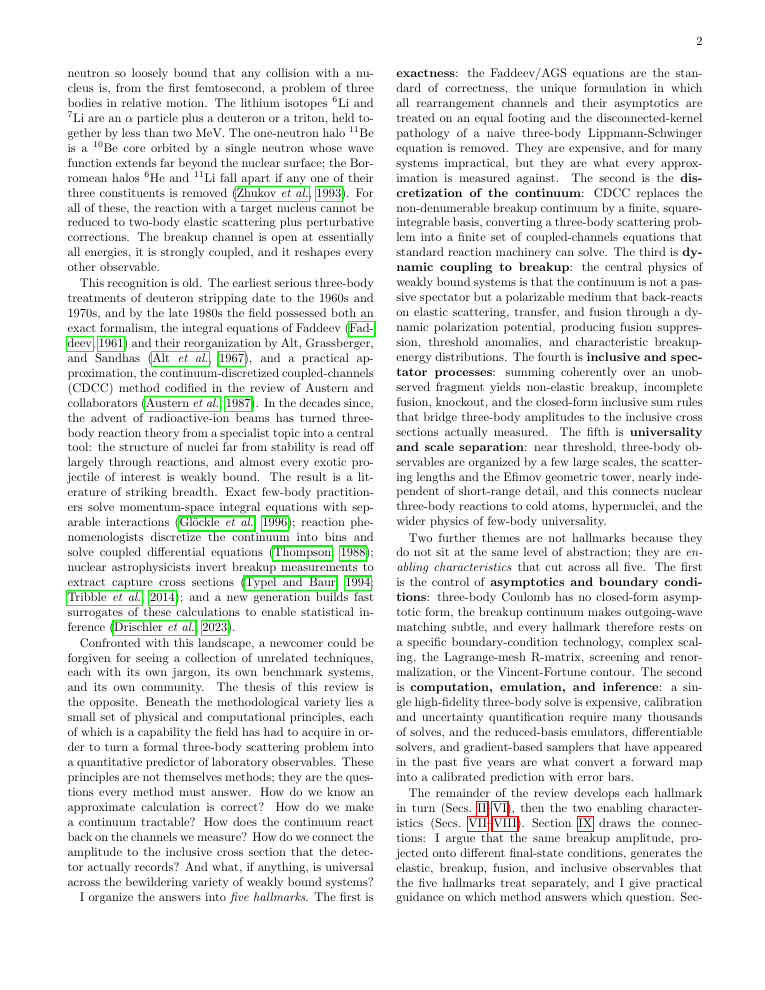
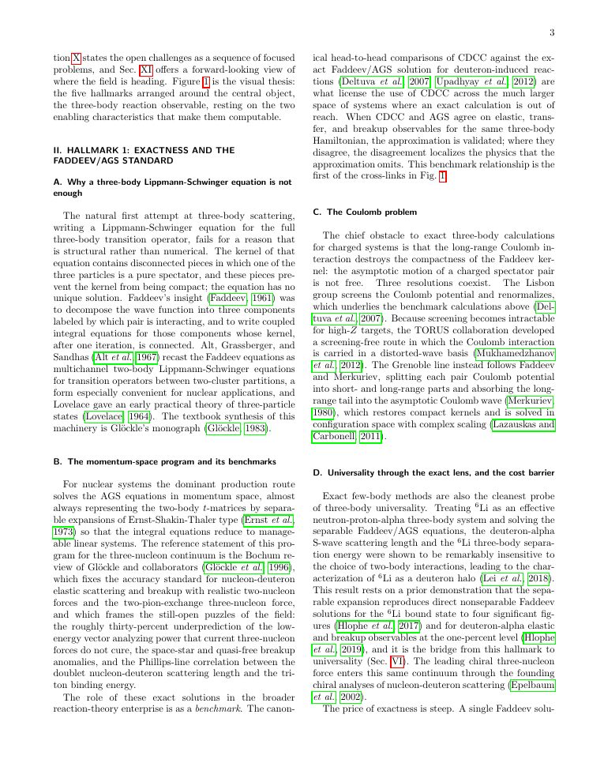

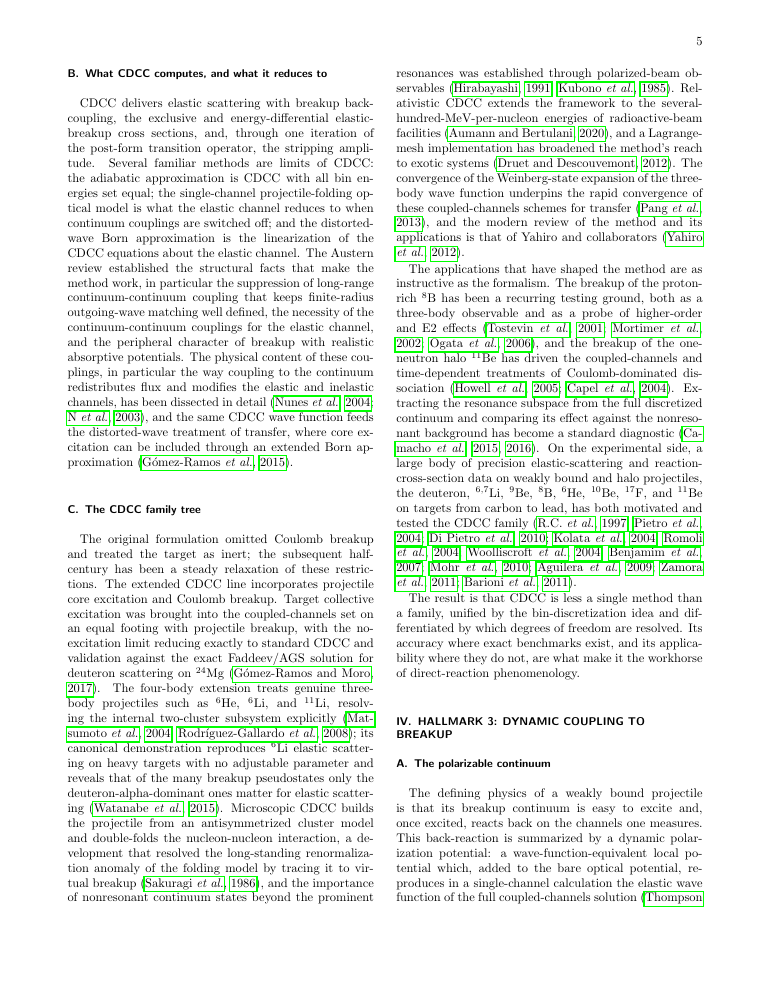

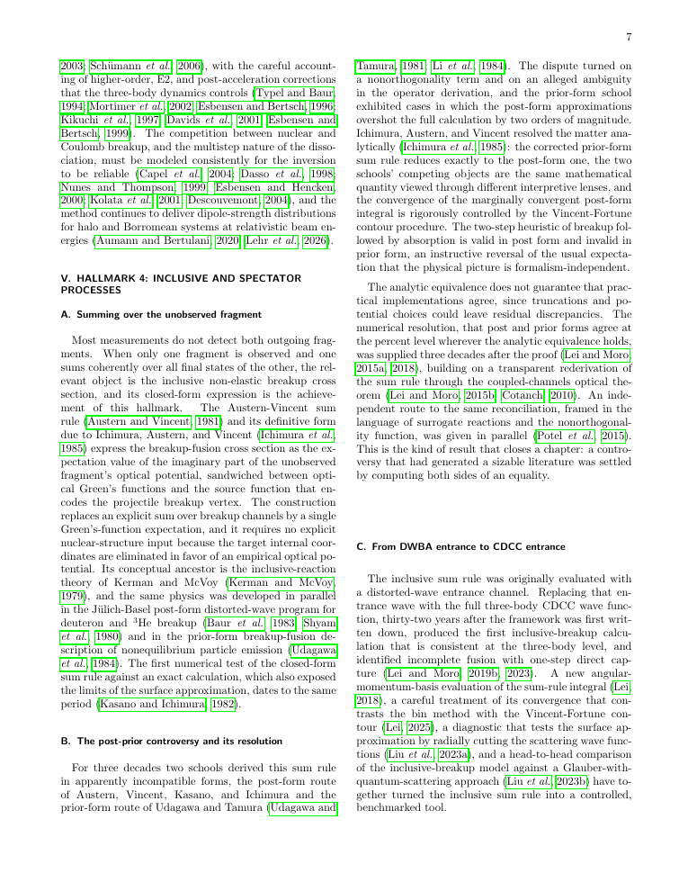
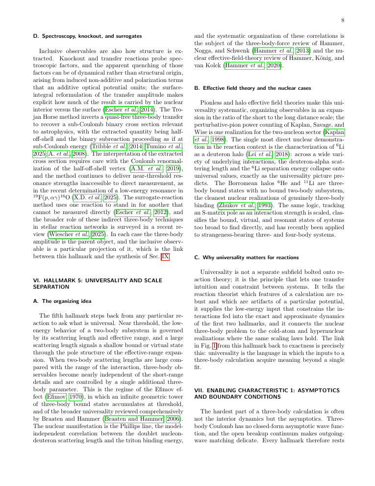
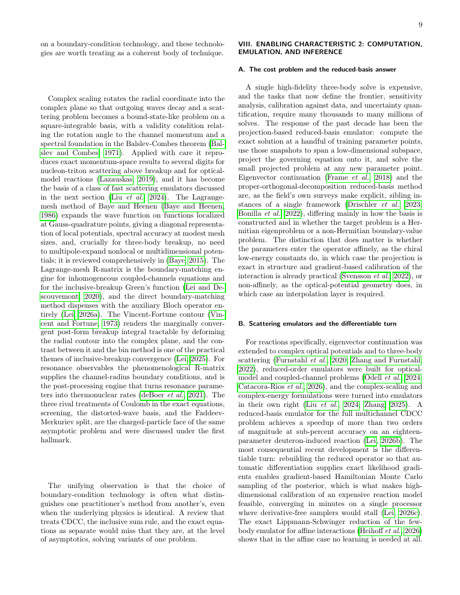
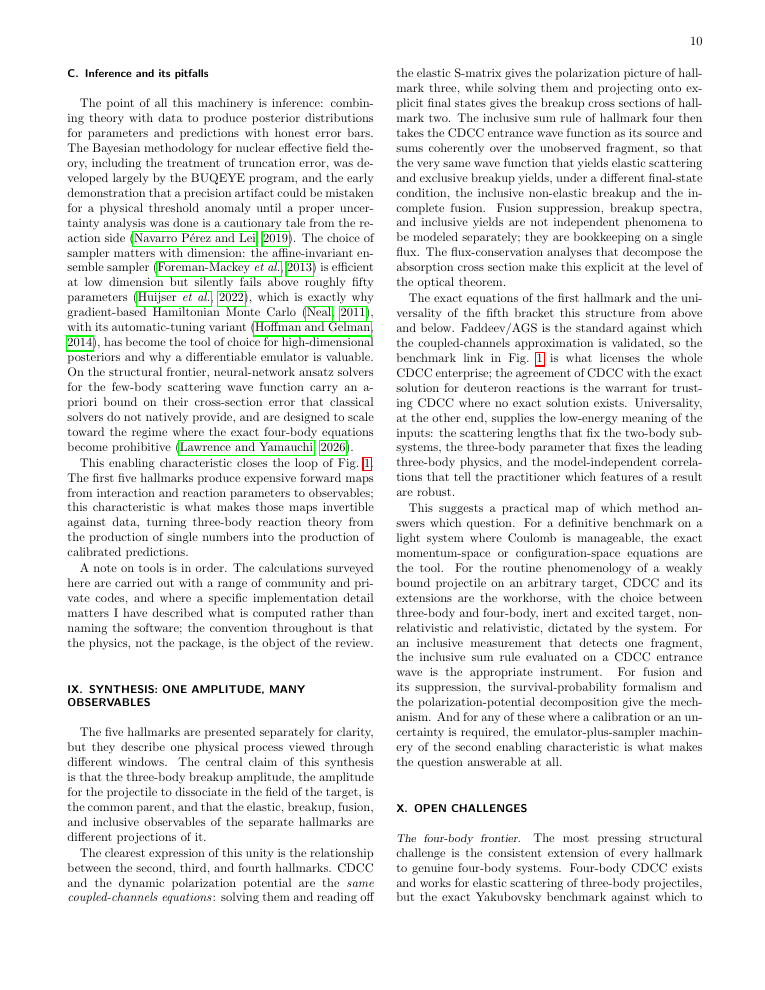
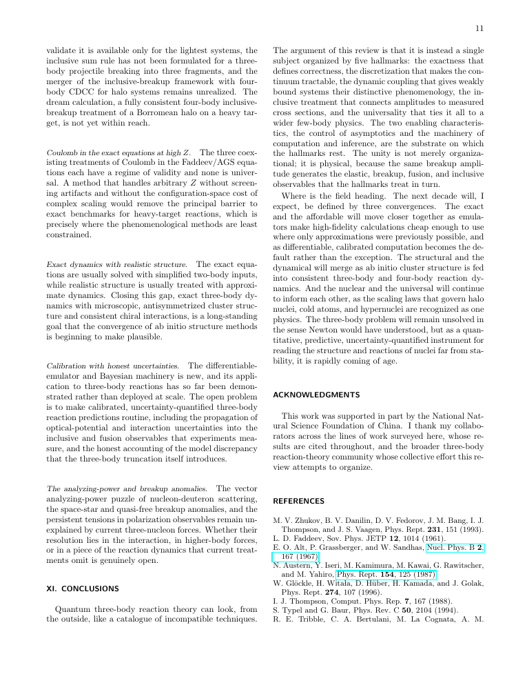
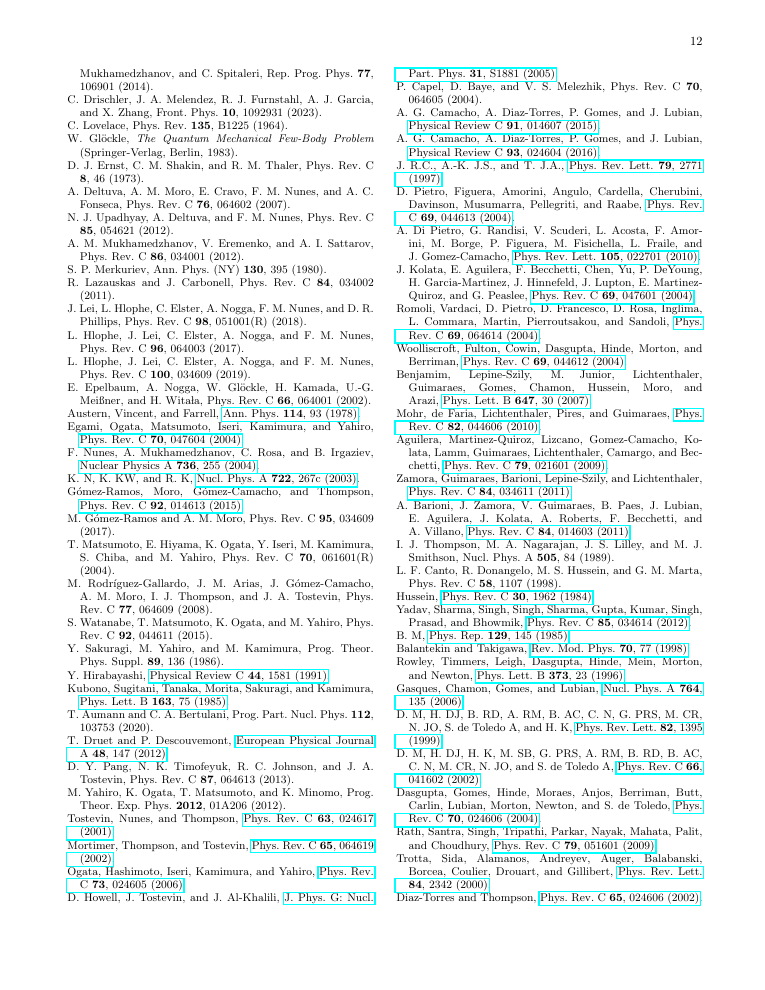
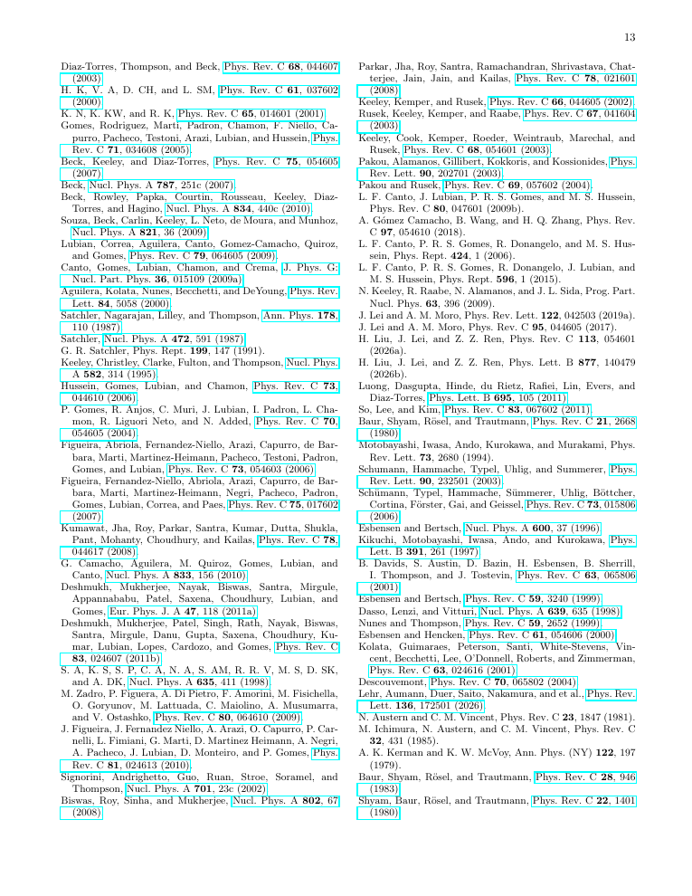
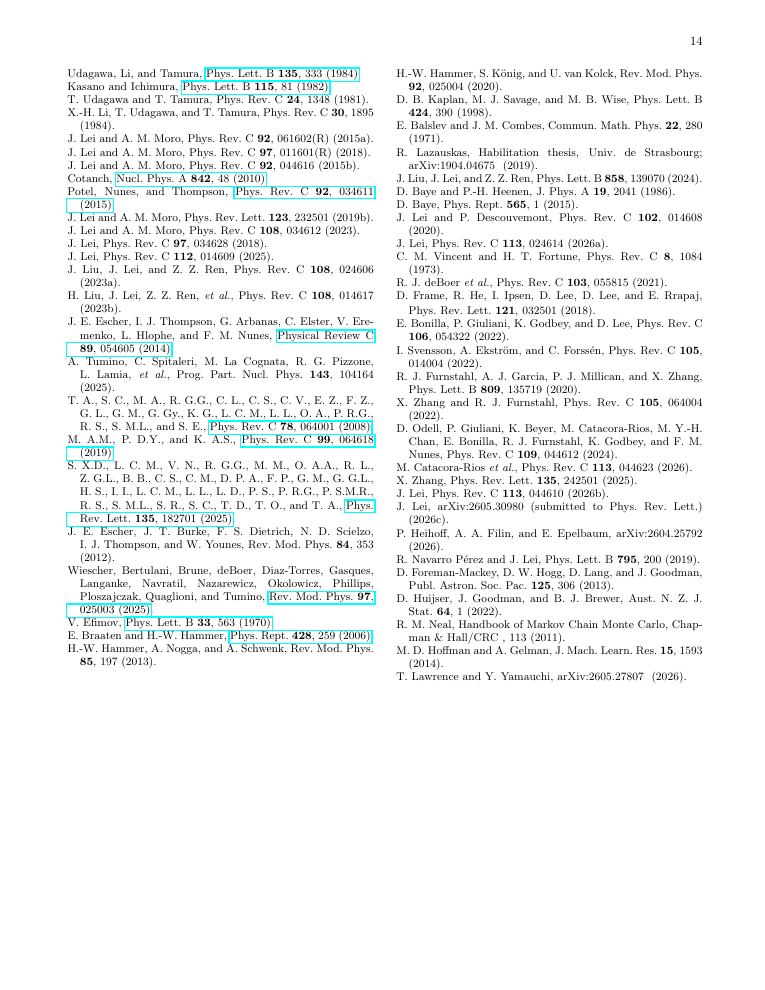
</div>

<div class="fig-caption mt-2">三体核反应综述初稿，14 页 · <a href="./threebody-review.pdf" target="_blank">打开完整 PDF</a></div>

<v-click>

<div class="box-evidence mt-3">
<span class="takeaway">关键：</span>结构、论点、引用骨架都搭好了；引文只从我<strong>已入库</strong>的论文里取，库里没有的就标出来或再补查，不硬编。这是初稿，物理判断和润色还得我自己来。
</div>

</v-click>

<!--
Central message: 演示产出的是一份铺满全宽、14 页的综述初稿，引用受限于已入库论文，输出可追溯、不硬编，而非模型臆造。

讲点：这就是上一页那段录屏的产出物，我把 14 页直接铺出来给大家看个规模。强调一点：引文不是模型随口编的，我要求它只从我读过、已入库的论文里取，库里没有的就标出来或再补查。这正是知识库相对裸用大模型最大的差别，输出可追溯。当然这是初稿，物理判断和润色还得我自己来，但它把最累的搭架子和铺引用做完了。现场想细看，可以点"打开完整 PDF"。

Time target: 19:30-20:30
过渡：把这五步的收益归到一张表上。
-->

---
layout: default
---

# <span style="color: var(--ink-blue)">●</span> 一个好研究生需要什么，知识库就给什么
## What a good student needs, the knowledge base provides

<div class="mt-2">

| 一个好研究生需要 | 知识库对应 | 对科研的帮助 |
|---|---|---|
| 读文献、建全景 | 概念页 / debates | 综述自动累积，随时可查 |
| 知道方向和标准 | 常驻身份 profile | 开口进入工作状态 |
| 一套做事方法 | 技能 skills | agent 自己按流程维护 |
| 挨批能改、记得住 | 记忆 memory | 不重复犯错，越用越像你 |
| 记录、不踩坑 | 失败库 / 想法库 | 开题不重复劳动 |
| 出师、能传承 | 复利闭环 + git | 写作不漏引，攒下的家底带得走 |

</div>

<v-click>

<div class="text-center mt-3 text-lg" style="color: var(--ink-blue);">
一处培养，<strong>处处受益</strong>：同一个"学生"，喂饱了读、想、写、协作全流程。
</div>

</v-click>

<!--
Central message: 好研究生的每一项素质都对应知识库的一个部分，并转化为读、想、写、协作各环节的具体科研收益。

讲点：这张表把比喻和收益钉在一起。重点是这些收益来自同一个库，你只培养一次，它喂饱所有环节，这就是复利。第一幕到此结束。

Time target: 20:30-21:30
过渡：很多人会好奇，这个"学生的脑子"到底怎么搭的？第二幕揭开盖子。
-->

---
layout: section
---

# 第二幕　揭开盖子
## Act 2: Under the hood

<div style="color: var(--olive);" class="text-lg mt-2">
刚才讲的是"怎么带"，现在说说这个"学生的脑子"怎么搭的
</div>

<!--
过渡：第二幕给想动手的人，讲底层范式和五层架构的实现。
-->

---
layout: default
---

# <span style="color: var(--ink-blue)">●</span> 核心思路：不是检索，是养一个 wiki
## From RAG to a compounding wiki

<div class="text-base mt-2">

别等提问了才去原始文档里现翻。让 LLM <strong>一篇一篇建、长期维护一个 wiki</strong>，垫在你和原始资料之间。

</div>

<v-clicks>

<div class="grid grid-cols-3 gap-3 mt-3 text-center text-sm">
<div class="kami-card"><strong>raw sources</strong><br>原始资料，只读不改<br><span style="color: var(--olive)">一切以它为准</span></div>
<div class="kami-card"><strong>the wiki</strong><br>LLM 负责写和维护<br><span style="color: var(--olive)">互相链接的笔记</span></div>
<div class="kami-card"><strong>schema</strong><br>告诉 LLM 怎么维护<br><span style="color: var(--olive)">CLAUDE.md</span></div>
</div>

<div class="kami-card-accent mt-4">
知识<strong>只整理一次，往后持续更新</strong>，不必每次提问都从头推一遍。 &nbsp;<span style="color: var(--olive)">你负责找料、提问，脏活累活全归 LLM。</span>
</div>

<div class="box-evidence mt-3">
<span class="takeaway">一句话：</span>Obsidian 是 IDE，LLM 是程序员，<strong>wiki 是代码库</strong>。
</div>

</v-clicks>

<div class="abs-br m-4 text-xs" style="color: var(--stone);">
A. Karpathy, "LLM Wiki" (gist, 2026)
</div>

<!--
Central message: 用一个持久、可增量维护、能复利的 wiki 取代无状态 RAG，这是整套系统的基本想法。

讲点：诚实交代思想来源。核心区别就一句：RAG 是查询时才检索，wiki 是整理一次、持续更新。这个范式 Karpathy 在他的 LLM Wiki gist 里讲得很清楚，我在他基础上做成了一个科研系统。

Time target: 21:30-23:30
过渡：那这个 wiki，针对科研我拆成了五层，正好对应第一幕的五步。
-->

---
layout: default
---

# <span style="color: var(--ink-blue)">●</span> 培养的五步，拆开来看就是五层
## The five training steps become five layers

<div class="grid gap-2 mt-3">

<div v-click class="kami-card-accent"><span class="tag">L5</span> &nbsp;<strong>记忆 memory</strong> &nbsp;<span style="color: var(--olive)">对应第四步 · 反馈纠错</span></div>
<div v-click class="kami-card-accent"><span class="tag">L4</span> &nbsp;<strong>技能 skills（读写规矩）</strong> &nbsp;<span style="color: var(--olive)">对应第三步 · 标准流程</span></div>
<div v-click class="kami-card-accent"><span class="tag">L3</span> &nbsp;<strong>概念笔记 + 统一词表</strong> &nbsp;<span style="color: var(--olive)">对应第一步读文献 + 第五步积累</span></div>
<div v-click class="kami-card-accent"><span class="tag">L2</span> &nbsp;<strong>常驻身份层 profile</strong> &nbsp;<span style="color: var(--olive)">对应第二步 · 方向与标准</span></div>
<div v-click class="kami-card-accent"><span class="tag">L1</span> &nbsp;<strong>纯文本 + 链接</strong> &nbsp;<span style="color: var(--olive)">所有东西的壳子，人和 agent 共享</span></div>

</div>

<div v-click class="mt-4 text-center">
<span class="tag">1425 文献笔记</span> &nbsp; <span class="tag">571 篇精读</span> &nbsp; <span class="tag">97 篇个人档案</span> &nbsp; <span class="tag">38 位合作者</span>
</div>

<!--
Central message: 第一幕的五个培养步骤，在实现上对应知识库的五层架构，下面逐层拆开。

讲点：这是连接两幕的桥。左边的层号，右边标着它实现的是哪一步。底部数字是我两个 wiki 的真实规模。接下来五页，一层一层看实现。

Time target: 23:30-24:30
过渡：从最底下的载体讲起：为什么是纯文本。
-->

---
layout: default
---

# <span style="color: var(--ink-blue)">●</span> L1　纯文本 + 链接：人和 agent 读同一份文件
## Plain text and links, not an app

<div class="grid gap-6" style="grid-template-columns: 2fr 3fr;">

<div class="text-base">

<v-clicks>

- **人可读**：Obsidian 里是一张可点击的知识图谱
- **Agent 可读**：纯文件，`grep` / `read` 直接拿
- **可 diff**：git 记录每次改了什么，能回滚
- **不绑平台**：纯文本，二十年后还能打开

<div class="box-evidence mt-3">
<span class="takeaway">要点：</span>选纯文本，就是为了让人和 agent 读的<strong>是同一份文件</strong>，不搞两套数据。
</div>

</v-clicks>

</div>

<div>

```text
research-wiki-personal/
├── profile.md         # L2 常驻身份层
├── projects/          # active / paused / done
├── papers/            # 97
├── ideas/             # promising / killed
├── failures/          # 死路登记
├── methods-mine/      # 自有代码 (8)
├── collaborators/     # 38
└── index/             # by-topic / method ...
```

<div class="fig-caption">同一份目录：我在 Obsidian 浏览，agent 用文件系统读写</div>

</div>

</div>

<!--
Central message: 纯文本加链接加 git，让人和 agent 共享同一份能改、不被锁死的东西。

讲点：为什么不是 Notion、不是数据库？那些是给人的 UI 优化的，agent 抓不到。纯 Markdown，对人是图谱，对 agent 是一次 read，对 git 是一个 diff，三方看同一个字节。

Time target: 24:30-26:00
过渡：载体之上，第一块常驻内容是身份层。
-->

---
layout: default
---

# <span style="color: var(--ink-blue)">●</span> L2　常驻身份：profile.md 每次对话第一行
## The always-loaded identity layer

<div class="grid gap-6" style="grid-template-columns: 3fr 2fr;">

<div class="text-base">

一行 `@import`，让个人档案<strong>每次对话自动带上</strong>：

```text
# ~/.claude/CLAUDE.md
@~/research-wiki-personal/profile.md
```

<v-click>

<div class="kami-card mt-2">
档案里装着 agent 每次都得知道的"你"：<br>
· 研究方向、正在投的稿子<br>
· 硬规矩：不用 em-dash、物理优先、先跑再想<br>
· 算力清单、合作者权重
</div>

</v-click>

</div>

<div>

<v-click>

<div class="box-idea">
<strong>一页小而精的档案，每次对话都带着，比一大坨现查出来的零碎好用。</strong><br><br>
身份层是"一直带着"，不是"问到了才翻"。
</div>

</v-click>

</div>

</div>

<!--
Central message: 用 @import 把小而精的个人档案每次对话都带上，等于给 agent 一个你掌控的 system prompt。

讲点：注意它和检索的区别。研究方向、硬规矩、算力，这些每个任务都用得到，不该靠检索碰运气，要钉死在上下文最前面。

Time target: 26:00-27:00
过渡：身份之外，读过的几百篇怎么存？这是 L3，也是整套系统最值钱的一层。
-->

---
layout: default
---

# <span style="color: var(--ink-blue)">●</span> L3　概念笔记 + 统一词表：综述怎么长出来
## Atomic notes and a controlled vocabulary

<div class="grid gap-6" style="grid-template-columns: 3fr 2fr;">

<div>

```text
 raw/paper.pdf
      │ 读一遍，抽要点 + 关键数字
      ▼
 sources/<paper>.md   摘要·数字·tags·出处
      │ 按词表查重，自动追加引用
      ▼
 methods/  systems/  entities/
   每个概念页底部："用到它的论文 (N)"
```

</div>

<div>

```yaml
methods:
  threshold-anomaly:
    canonical: "Threshold anomaly (TA): ..."
    aliases: ["TA", "threshold anomaly",
      "dispersion-relation OMP"]
```

<v-click>

<div class="box-evidence mt-2 text-sm">
<span class="takeaway">关键：</span>统一词表让四种写法都归到<strong>同一页</strong>。先查重再新建，概念不散架，综述才攒得起来。这是 RAG 给不了的。
</div>

<div class="mt-3 text-center">
<a href="graph.html" target="_blank" class="tag" style="border-bottom: none;">点开真实图谱 ↗ 1425 节点 · 6432 链接</a>
</div>

</v-click>

</div>

</div>

<!--
Central message: 每篇论文被写进概念页，统一词表保证同一概念归并到一页，使综述随阅读自动累积。

讲点：关键动作是查重加追加。读完一篇讲 CDCC 的论文，去 methods/cdcc.md 底部追加一行。统一词表是综述能不能积累的技术前提，没有它，一个概念会因为五种写法散成五页。

Time target: 27:00-28:30
过渡：这些维护动作谁来做？L4：把方法写成技能。
-->

---
layout: default
---

# <span style="color: var(--ink-blue)">●</span> L4　技能：把标准流程变成一句话触发
## Skills are the read/write protocol

<v-clicks>

<div class="grid grid-cols-2 gap-3 mt-2">
<div class="kami-card-accent">
<strong>literature-wiki</strong><br>
读论文 → 写 source 笔记 → 更新概念页 → 标矛盾
</div>
<div class="kami-card-accent">
<strong>research-profile</strong><br>
记 project / paper / idea / failure，刷新 profile
</div>
</div>

<div class="box-idea mt-3">
<strong>四条硬规矩：</strong>统一 schema、每条声明带出处、不用 em-dash、<strong>先查重再新建</strong>。
</div>

<div class="kami-card mt-3" style="border-left: 3px solid var(--ink-blue);">
三类操作：<strong>ingest</strong>（入库）· <strong>query</strong>（提问，好答案归档回库）· <strong>lint</strong>（体检，找矛盾与孤儿页）。
</div>

</v-clicks>

<!--
Central message: 把维护知识库的流程写成可一句话触发的技能，agent 就按统一规范自动维护。

讲点：这是从 Karpathy 的 schema 文档再往前一步：不只写规则，而是封装成 ingest / query / lint 这类一句话触发的技能。技能本身也是纯文本，在库里，可版本管理、可迭代。

Time target: 28:30-29:30
过渡：最后一层，让系统记住你的脾气：L5 记忆，加上它带来的复利闭环。
-->

---
layout: default
---

# <span style="color: var(--ink-blue)">●</span> L5　记忆 + 闭环：越用越强
## Memory and the compounding loop

<div class="grid gap-6 mt-2" style="grid-template-columns: 2fr 3fr;">

<div class="text-base">

每个纠正 → 一个文件 → `MEMORY.md` 索引<strong>自动加载</strong>。模型一个参数没动，它却越来越懂你的规矩。

</div>

<div>

<div class="grid grid-cols-4 gap-2 text-center text-sm">
<div class="kami-card"><strong>① 读库</strong><br>身份+检索</div>
<div class="kami-card"><strong>② 干活</strong><br>读写画</div>
<div class="kami-card"><strong>③ 写回</strong><br>新笔记/记忆</div>
<div class="kami-card"><strong>④ 更高</strong><br>下次更省力</div>
</div>

<div class="text-center text-xl my-2" style="color: var(--ink-blue);">① → ② → ③ → ④ → ①</div>

</div>

</div>

<v-click>

<div class="box-evidence mt-2">
<span class="takeaway">复利：</span>关键是第三步"写回"。大多数人用 AI 是开环的——问完就走，什么都没留下。闭环就是把每次问出来的好东西写回库里，垫高下次的起点。
</div>

</v-click>

<!--
Central message: 记忆自动加载加上读、干、写回、更高起点的闭环，让 agent 越用越强。

讲点：复利的关键是写回。Karpathy 也强调，好答案应该归档回 wiki，而不是消失在聊天记录里。这样你的探索也在复利。

Time target: 29:30-31:00
过渡：五层拼起来，是这样一张全景。
-->

---
layout: default
---

# <span style="color: var(--ink-blue)">●</span> 全景：原始文件怎么变成 agent 的脑子
## The full stack, end to end

<div class="grid gap-2 mt-3 text-center">

<div class="kami-card-accent"><strong>AGENT</strong> &nbsp;<span style="color: var(--olive)">读 + 写，干活</span></div>
<div class="text-xl" style="color: var(--ink-blue)">▲ &nbsp; 始终加载 + 按需检索 &nbsp; ▼ &nbsp; 经 skill 写回</div>
<div class="grid grid-cols-2 gap-2">
<div class="kami-card"><strong>profile + memory</strong><br><span style="color: var(--olive)">L2 + L5　常驻身份 + 纠错记忆</span></div>
<div class="kami-card"><strong>skills</strong><br><span style="color: var(--olive)">L4　读写规矩</span></div>
</div>
<div class="kami-card"><strong>wiki：概念笔记 + 统一词表 + index</strong> &nbsp;<span style="color: var(--olive)">L3　综合，越攒越厚</span></div>
<div class="kami-card"><strong>raw files</strong>：PDF · 代码 · 数据 &nbsp;<span style="color: var(--olive)">L1　纯文本，git 管版本</span></div>

</div>

<div v-click class="text-center mt-4 text-lg" style="color: var(--ink-blue);">
人在 Obsidian 这头整理，agent 在文件那头读写，git 里存的是同一本账。
</div>

<!--
Central message: 五层拼成一条从原始文件到 agent 脑子的链路，人与 agent 在两侧操作同一份 git 管理的真相。

讲点：从下往上读：原始文件是地基，wiki 整理成概念，profile 和 memory 始终加载，skills 是规范，最上面 agent 干活。箭头双向：向下加载检索，向上经技能写回。

Time target: 31:00-32:00
过渡：架构讲完了。那我自己怎么开始带的？比你想的简单。
-->

---
layout: default
---

# <span style="color: var(--ink-blue)">●</span> 怎么起步：五个零件，今晚就能开始
## The minimum viable setup

<div class="grid grid-cols-5 gap-2 mt-4 text-center text-sm">
<div v-click class="kami-card"><strong>① 原始文件</strong><br>PDF · 笔记 · 数据<br><span style="color: var(--olive)">只存不改</span></div>
<div v-click class="kami-card"><strong>② Markdown 库</strong><br>纯文本 + 链接<br><span style="color: var(--olive)">agent 写，你读</span></div>
<div v-click class="kami-card"><strong>③ Obsidian</strong><br>人看的图谱<br><span style="color: var(--olive)">浏览、连线</span></div>
<div v-click class="kami-card"><strong>④ 一个 agent</strong><br>Claude Code / Codex<br><span style="color: var(--olive)">读写主力</span></div>
<div v-click class="kami-card"><strong>⑤ 一份 schema</strong><br>CLAUDE.md / 技能<br><span style="color: var(--olive)">怎么维护</span></div>
</div>

<v-click>

<div class="box-evidence mt-5">
<span class="takeaway">起步成本：</span>新建一个文件夹，写一份"培养规则"，从今天读的论文开始一篇篇喂。复利从第一篇就开始了。
</div>

</v-click>

<div class="abs-br m-4 text-xs" style="color: var(--stone);">
上手：A. Karpathy "LLM Wiki" (gist) · 我的 literature-wiki / research-profile 技能
</div>

<!--
Central message: 搭一个知识库只需五个零件，起步成本极低，从今天读的第一篇论文就能开始复利。

讲点：别被吓住，最小可行就五样。Karpathy 的 gist 可以直接复制给你的 agent，剩下的它会和你一起长出来。带学生第一天也不用万事俱备，先开始。

Time target: 32:00-33:30
过渡：那日常"带"起来长什么样？
-->

---
layout: default
---

# <span style="color: var(--ink-blue)">●</span> 日常长什么样：读一篇、问一句
## A day with your student: ingest one, ask one

<div class="grid grid-cols-2 gap-4 mt-3 text-sm">

<div>

**读一篇（教他入库）**

```text
你：把这篇加进文献库
agent：
  · 写一页摘要 + 关键数字 + 出处
  · 按词表查重，更新相关概念页
  · 与旧结论比对，标出矛盾
  · 追加一条时间线日志
```

</div>

<div>

**问一句（用他的积累）**

```text
你：我读过的谁在 d+58Ni 上
    和 KD 光学势不一致？
agent：
  · 读索引 + 相关概念页
  · 给出带出处的回答
  · 好答案归档回库，成为新页
```

</div>

</div>

<v-click>

<div class="box-idea mt-4">
<span class="takeaway">闭环：</span>读 → 干活 → 把成果<strong>写回库</strong> → 下次起点更高。跟带学生一样，每一次都让下一次更省力。
</div>

</v-click>

<!--
Central message: 日常使用就是教 agent 入库和用它的积累两个动作，加上把好结果写回库。

讲点：用起来非常朴素。读一篇就一句"加进文献库"。关键一步：好回答要归档回库，不要消失在聊天记录里，跟学生写组会纪要一个道理。

Time target: 33:30-35:00
过渡：好处讲完了，丑话也要说在前面。
-->

---
layout: default
---

# <span style="color: var(--color-gap); font-size: 1.05em;">丑话说在前面：这个学生也有毛病</span>
## Honest limitations

<v-clicks>

<div class="grid grid-cols-2 gap-3 mt-3 text-sm">
<div class="kami-card"><strong>摘要会丢细节：</strong>浅读条目就剩个元数据，我库里真有一批标着 "no summary available"。关键论文还得自己精读，浅读的必须老老实实标出来。</div>
<div class="kami-card"><strong>概念会分裂：</strong>词表拦不住所有别名，同一概念会散成几页。得定期 lint：找矛盾、并孤页、补断链。</div>
<div class="kami-card"><strong>维护有成本：</strong>每篇入库几分钟、每月做一次体检。复利的前提是持续喂，断粮它就停长了。</div>
<div class="kami-card"><strong>单源会犯错：</strong>一个模型写进库的结论标"单源"，要紧的换另一个模型交叉验证过再用。</div>
</div>

<div class="box-evidence mt-4">
<span class="takeaway">底线：</span>它不是魔法，是个需要管理的学生。但管理的成本，远低于他干活的收益。
</div>

</v-clicks>

<!--
Central message: 主动交代四个真实局限（浅读丢细节、概念分裂、维护成本、单源错误），知识库是需要管理的系统而非魔法。

讲点：在座懂行的人多，这些坑与其被问出来不如自己讲。每条都是我真踩过的："no summary available" 那批条目现在还在库里；概念分裂靠 lint 收拾；单源标记是我跨模型工作流的硬规矩。落点还是那句：像管学生，不像用魔法。

Time target: 35:00-36:30
过渡：毛病也交代完了，但还有个绕不开的问题：这么用，期刊认吗？
-->

---
layout: default
---

# <span style="color: var(--ink-blue)">●</span> 这么用，期刊认吗？APS 刚给了答案
## APS 期刊 AI 新政　·　2026 年 6 月 17 日

<v-clicks>

<div class="box-idea mt-2 text-sm">
<span class="takeaway">转向：</span>旧政策只许 AI 做"润色、精简、轻度编辑"；<strong>新政策允许实质性使用</strong>——文献综合、数据分析、科学推理、图表生成、代码、翻译——<strong>条件是披露</strong>。
</div>

<div class="grid grid-cols-2 gap-3 mt-3 text-sm">

<div class="kami-card-accent">
<strong style="color: var(--ink-blue)">作者（Authors）</strong>
<ul class="mt-1" style="line-height:1.5">
<li>AI 不能当作者；准确性、责任<strong>全在人</strong></li>
<li>实质性使用须披露：<strong>工具名 + 版本、如何协助、如何指导与核验</strong></li>
<li>图表由 AI 生成 → 在图注里说明并自验</li>
<li>纯语言润色不必披露</li>
</ul>
</div>

<div class="kami-card-accent">
<strong style="color: var(--color-evidence)">审稿人（Reviewers）</strong>
<ul class="mt-1" style="line-height:1.5">
<li>可用 AI 理顺思路、改语气、翻译</li>
<li><strong>禁止把稿件/报告上传到不受限的 AI 工具</strong>（保密：作者未同意未发表工作进训练集）</li>
<li>超出轻度编辑须在给编辑的note里披露</li>
</ul>
</div>

</div>

<div class="box-evidence mt-3 text-sm">
<span class="takeaway">落点：</span>今天这套工作流，正好踩在新政策的三条线内——<strong>人负责、要披露、护保密</strong>。Vibe Research 不是灰色地带，是被官方写进规范的做法。
</div>

</v-clicks>

<!--
Central message: 用 APS 2026-06-17 新政为整套 AI 工作流背书——实质性使用被明确允许，边界是披露+问责+保密，正好对上我前面演示的做法。

讲点：这是最近的新闻，时间点正好。旧政策只让 AI 润色，新政策放开到文献综合、数据分析、推理、图表、代码、翻译，前提是披露三件事：工具名版本、怎么帮的、怎么核验的。作者侧：AI 不能署名、责任全在人；审稿侧最硬的一条——不能把别人未发表的稿子喂给不受限的 AI，这是保密红线，我自己跨模型验证时也守这条。结论：在座要投 PRC/PRL 的，这条路是被写进规范的，不是钻空子。

Time target: 36:30-37:30
过渡：规范有了，收个尾。
-->

---
layout: default
---

# <span style="color: var(--ink-blue)">●</span> 总结
## Conclusions

<v-clicks>

1. <span style="color: var(--color-gap)">**为什么需要：**</span> 今天的 agent 当面很聪明，换个对话就全忘了；攒不下东西，长期课题里指望不上。

2. <span style="color: var(--ink-blue)">**怎么办：**</span> 像带研究生一样培养他——读文献、给方向、教方法、纠错、记录。这套培养拆开来看，就是纯文本 + 身份 + 笔记 + 技能 + 记忆的五层知识库。

3. <span style="color: var(--color-evidence)">**对科研的帮助：**</span>
   - 综述自动累积 · 开题不重复劳动 · 写作不漏引
   - agent 真正懂你 · 经验永久沉淀、带得走

</v-clicks>

<v-click>

<div class="box-evidence mt-5">
<strong>一句话：</strong>个人知识库不是存档，是你<strong>对 agent 的培养</strong>。你读过的每一篇、教过的每一次，都长在一个永远不毕业的研究生身上。
</div>

</v-click>

<!--
Central message: 为什么需要、怎么办、对科研有哪些帮助，三句话收束；知识库就是把对 agent 的培养永久沉淀下来。

讲点：回到比喻。agent 像个失忆的天才新生；你要做的是培养他，而不是等一个更聪明的；培养的成果，就是一个会帮你读、想、写、而且永不毕业的研究生。题眼是：知识库就是培养。

Time target: 36:30-38:00
过渡：最后一个小彩蛋。
-->

---
layout: center
class: text-center
---

# 一个小彩蛋 / One last thing

<div class="text-xl max-w-3xl mx-auto leading-relaxed mt-4">

你们刚看的这套 slides，<strong>就是我"带"出来的这个研究生，读我的知识库自动写的</strong>。

<div class="mt-3 text-left mx-auto" style="max-width: 36rem;">

```text
指令就一句（大意）：给近代物理研究所的报告做这套 slides，
讲个人知识库，用"把 agent 培养成研究生"打比方，素材从我的 wiki 取。
```

</div>

<div class="box-idea mt-4 text-left">
<strong>所以方法和演示是同一回事。</strong>先开始带你的"学生"，他会复利成长；模型只是随时可换的引擎。从今晚读的第一篇论文开始。
</div>

</div>

<div class="flex justify-center gap-12 mt-5">

<div class="text-center">

<div class="text-xs mt-1" style="color: var(--olive);">Karpathy "LLM Wiki" gist</div>
</div>

<div class="text-center">

<div class="text-xs mt-1" style="color: var(--olive);">这套 slides + 互动图谱</div>
</div>

</div>

<div class="mt-5 text-2xl">谢谢！ / Thank you!</div>

<div class="text-sm mt-2" style="color: var(--olive);">
金磊 · 同济大学 · jinl@tongji.edu.cn
</div>

<!--
Central message: 这套 slides 本身就是被培养出来的 agent 的产物，自我证明了"培养=知识库"的价值；呼吁听众从今天开始带自己的 agent。

结束语："今天这个报告，我没单独准备素材，是我那个一直在带的 agent，读它自己的知识库写出来的。先开始培养你的学生，他会复利，模型只是随时可换的引擎。谢谢大家。"

Time target: 38:00-39:00（留 Q&A）
-->

---
layout: default
---

# Backup B1: 完整 16 篇论文清单

<div class="text-xs">

| # | arXiv | Date | Title | Authors |
|---|---|---|---|---|
| 1 | 2512.07111 | 2025-12-07 | Direct Boundary Matching (DBMM) | Jin Lei ⭐ PRC 113, 024614 |
| 2 | 2512.11590 | 2025-12-12 | HPRMAT: GPU R-matrix solver | Jin Lei |
| 3 | 2512.17687 | 2025-12-19 | Reduced basis emulator for CDCC | Jin Lei ⭐ PRC 113, 044610 |
| 4 | 2512.22500 | 2025-12-27 | BiLNN Global Nucleon-Nucleus Optical Model | Jin Lei ⭐ PRC 已接收 |
| 5 | 2601.08245 | 2026-01-13 | Coherent Absorption Dynamics | Liu, Jin Lei, Ren ⭐ PRC 113, 054601 |
| 6 | 2602.04553 | 2026-02-04 | Exterior Complex Scaling PINN for scattering | Jin Lei ⭐ PRC 已接收 |
| 7 | 2602.12690 | 2026-02-13 | Dynamical Origin of Quenching (Knockout) | Jin Lei |
| 8 | 2603.24253 | 2026-03-25 | Deletion Does Not Measure (CC Dynamics) | Jin Lei, Liu |
| 9 | 2604.00471 | 2026-04-01 | Exact CC Green Function | Liu, Jin Lei, Ren |
| 10 | 2604.05600 | 2026-04-07 | Channel couplings redirect absorbed flux | Liu, Jin Lei, Ren ⭐ PLB 140479 |
| 11 | 2604.11226 | 2026-04-15 | IAV breakup generalization | Jin Lei |
| 12 | submitted | 2026-04-11 | Intrinsic Information Limit in OP Extraction | Jin Lei |
| 13 | draft | 2026-04-11 | High-Dim Bayesian Calibration | Jin Lei, Furnstahl |
| 14 | draft | 2026-04-11 | Info Geometry of Power Counting | Jin Lei, Hu, Phillips, Furnstahl |
| 15 | draft | 2026-04 | Inclusive breakup of three-body projectiles | Jin Lei |
| 16 | draft | 2026-04 | Dispersive CDCC elastic effective interaction | Liu, Jin Lei, Ren |

</div>

<div class="mt-4 text-sm" style="color: var(--pencil-brown);">
2025 年 12 月至 2026 年 4 月. 11 篇上 arXiv, 其中 3 篇已发表于 PRC、1 篇已发表于 PLB、2 篇 PRC 已接收; 另有 1 篇已投稿, 4 篇准备中. Solo × 9, 同济本地组 × 5, w/ Furnstahl × 2, w/ Hu+Phillips+Furnstahl × 1 (重叠计).
</div>

---
layout: default
---

# Backup B2: DBMM 数学细节

<div class="text-sm mt-4">

**Lagrange-Legendre 基** 在 $[0, R]$ 上, 网格点 $r_j = R \cdot x_j$, 其中 $P_N(2x_j - 1) = 0$:
$$\hat f_j(x) = (-1)^{N-j} \sqrt{\frac{1-x_j}{x_j}} \frac{x P_N(2x-1)}{x - x_j}$$

**边界值** 在 $x = 1$ 处:
$$\hat f_j(1) = \frac{(-1)^{N-j}}{\sqrt{x_j(1-x_j)}}, \qquad \left.\frac{d\hat f_j}{dx}\right|_{x=1} = \frac{(-1)^{N-j}}{\sqrt{x_j(1-x_j)}}\left[N(N+1) - \frac{x_j}{1-x_j}\right]$$

**矩阵方程** (内部行 $i = 1, \dots, N-1$):
$$\sum_{j=1}^N M_{ij} c_j = b_i, \quad M_{ij} = T_{ij} + \left[\frac{\ell(\ell+1)}{r_i^2} + U(r_i) - k^2\right] \delta_{ij}, \quad b_i = -U_{sr}(r_i) F_\ell(\eta, k r_i)\sqrt{R \lambda_i}$$

**最后一行** ($i = N$) 编码边界条件:
$$\sum_{j=1}^N B_j c_j = 0, \quad B_j = \left.\frac{d\hat f_j}{dx}\right|_{x=1} - R \gamma_s \hat f_j(1)$$

**S-matrix** 从 $r = R$ 处的散射波提取: $S_\ell = 1 + 2 i k f_\ell$, 其中 $f_\ell = \psi_\ell^{sc}(R) / [k H_\ell^+(\eta, kR)]$.

</div>

<div class="text-xs mt-4" style="color: var(--pencil-brown);">
Reference: Jin Lei, Phys. Rev. C 113, 024614 (2026). Full details in Section II.
</div>

---
layout: default
---

# Backup B3: POD-Galerkin 数学细节

<div class="text-sm mt-4">

**Snapshot 矩阵**, 来自 $N_s$ 次完整 CDCC 求解, 在采样参数 $\boldsymbol\theta_k$ 处:
$$C_{\mathrm{snap}}^J = [\mathbf{c}^J(\boldsymbol\theta_1), \mathbf{c}^J(\boldsymbol\theta_2), \dots, \mathbf{c}^J(\boldsymbol\theta_{N_s})]$$

**SVD 截断** (能量准则, $\epsilon_{\mathrm{tol}} = 10^{-6}$):
$$C_{\mathrm{snap}}^J = \mathbf{X}^J \mathbf{\Sigma}^J (\mathbf{W}^J)^H, \quad \mathbf{X}_r^J = \text{first } n_b \text{ columns of } \mathbf{X}^J$$

**Reduced ansatz**, 对新参数 $\boldsymbol\theta_*$:
$$\mathbf{c}^J(\boldsymbol\theta_*) \approx \mathbf{X}_r^J \boldsymbol\alpha^J(\boldsymbol\theta_*), \quad \boldsymbol\alpha^J \in \mathbb{C}^{n_b}$$

**Galerkin 投影** 得到 $n_b \times n_b$ reduced system:
$$\mathbf{M}_r^J(\boldsymbol\theta_*) \boldsymbol\alpha^J = \mathbf{b}_r^J, \quad \mathbf{M}_r^J = (\mathbf{X}_r^J)^H \mathbf{M}^J(\boldsymbol\theta_*) \mathbf{X}_r^J$$

**预计算 (与参数无关):**
$$\mathbf{K}_r^J = (\mathbf{X}_r^J)^H \mathbf{K}^J \mathbf{X}_r^J, \quad \mathbf{b}_r^J = (\mathbf{X}_r^J)^H \mathbf{b}^J$$

**仅势能项在预测时组装:**
$$\mathbf{M}_r^J(\boldsymbol\theta_*) = \mathbf{K}_r^J + (\mathbf{X}_r^J)^H \mathbf{V}^J(\boldsymbol\theta_*) \mathbf{X}_r^J$$

</div>

<div class="text-xs mt-4" style="color: var(--pencil-brown);">
Reference: Jin Lei, Phys. Rev. C 113, 044610 (2026). Full details in Section III.
</div>

---
layout: default
---

# Backup B4: 计算代价

<div class="text-sm mt-4">

**Table IV of Paper B:**

| Method | Time per partial wave | Speedup |
|---|:---:|:---:|
| Full CDCC (direct solve, DBMM) | 6.5 s | baseline |
| Emulator prediction (after training) | 30 ms | **≈220×** |

**训练代价 (offline, 一次性)**

- $N_s = 200$ 样本 × 31 分波 × 6.5 s ≈ 11 小时, 48 核 (Intel Xeon Gold 6248R, 3.0 GHz)
- SVD 截断: 秒级
- 预计算 $\mathbf{K}_r^J$ 和 $\mathbf{b}_r^J$: 分钟级

**预测代价 (online, 每次评估)**

- 势能构建 + 投影 + reduced 求解 + 重建 ≈ 1 s 每次完整散射计算 (所有 $J$ 合计)
- 对比完整 CDCC: 每次计算数小时

**摊销**

- 200 次评估: 训练代价回本
- $10^5$ 到 $10^6$ 次评估 (Bayesian inference): 训练代价 < 总量的 1%

</div>

---
layout: default
---

# Backup B5: 工具栈与 Protocol

<div class="text-sm mt-4">

**核心工具**

- **LLM:** Claude Opus 4.5 (Anthropic), 通过 **Claude Code** CLI 使用
- **集成:** 直接访问文件系统, git 集成, shell 执行
- **语言:** Fortran 90, DBMM 和 emulator (3,354 行)
- **数值库:** LAPACK (ZGESV, ZGEMM, ZGESVD), BLAS (ZGEMV)
- **版本控制:** Git, 完整历史在本地仓库

**Protocol (我实际怎么做的)**

1. **先写设计文档.** 写代码之前, 在 markdown 文件中写 1 到 2 页计划, 和 Claude 迭代直到架构干净.
2. **测试驱动.** 每个模块先写测试再实现. Claude 两者都生成.
3. **每步做物理 sanity check.** Unitarity, Hermiticity, 收敛性, 已知极限.
4. **每次迭代一个 commit.** 每个通过的测试变成一个带详细 message 的 commit.
5. **人工验证关卡.** 每个方程, citation 和数值声明在提交前重新检查.
6. **语言:** 中英文混合. Claude 无缝处理两种语言.

</div>

---
layout: default
---

# Backup: 隐私、安全与可移植

<v-clicks>

- **本地优先**：核心知识库是本地纯文本，不上云
- **版本可追溯**：git 记录每次改动，可回滚、可审计
- **分级**：未发表、评审意见放私有库，公开素材单独存
- **可移植**：纯 Markdown，不绑平台；换电脑、换 agent 都是一次 `git clone`
- **诚实标注**：浅读条目、单源结论显式标记，防止以讹传讹写进论文

<div class="box-evidence mt-3">
<span class="takeaway">底线：</span>你的东西，存在你自己管的硬盘和仓库里。
</div>

</v-clicks>

<!--
Backup：回答"上传给 AI 安不安全""会不会被锁定"。本地纯文本加 git 加分级，是相对 SaaS 工具的结构性优势。
-->

---
layout: default
---

# Backup: 多 agent 与跨模型验证

<div class="grid grid-cols-2 gap-4 text-base">

<div>

**工具栈**
- Markdown + git + Obsidian
- Claude Code：主力读写
- 一组自写技能：维护规范
- Codex / GPT：交叉验证

</div>

<div>

<div class="box-idea">
<strong>多 agent 工作流：</strong>Claude 提方案，Codex 交叉检查，我综合。单一模型审过的，标记为"单源"。
</div>

<div class="box-evidence mt-3">
<span class="takeaway">关键：</span>知识库就是一堆纯文本，谁来读都行，换 agent 不动数据。
</div>

</div>

</div>

<!--
Backup：回答"具体用什么工具""怎么保证可靠"。知识库与具体 agent 解耦，多个"老师"可以共用同一个"学生"、互相验证。
-->
