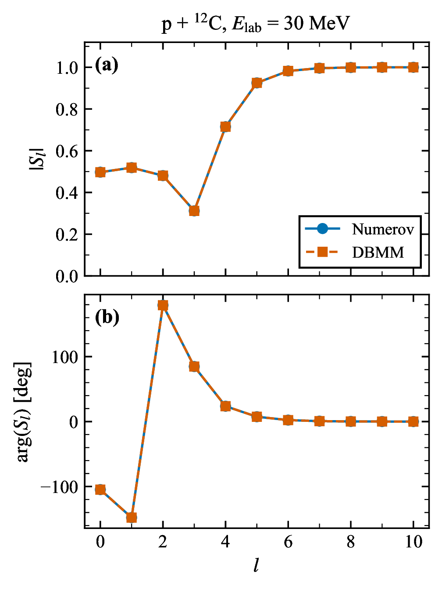
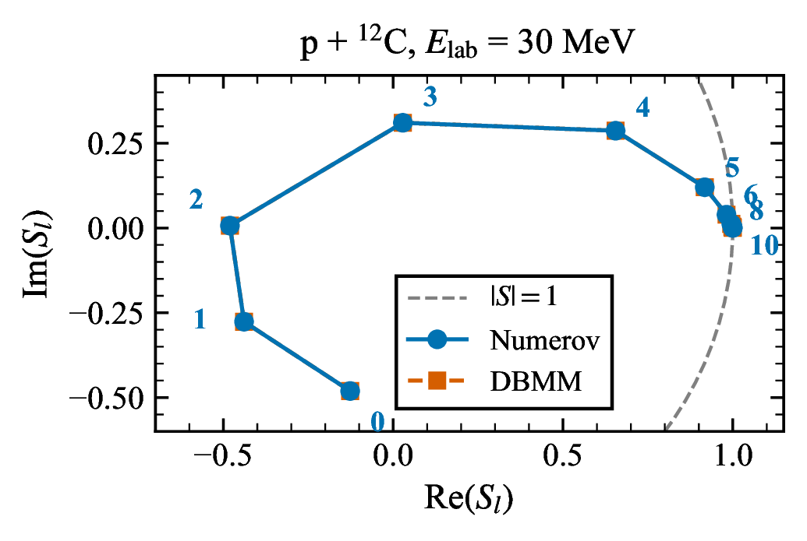
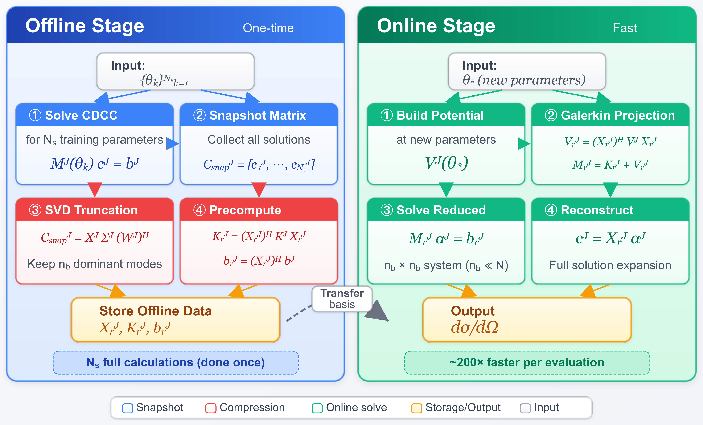
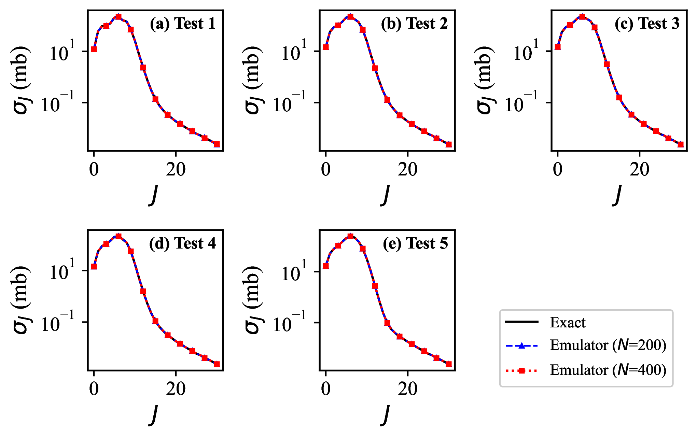

# Vibe Research 在直接核反应理论中的实战

LLM-Assisted Research in Low-Energy Nuclear Theory

**Jin Lei (金磊)** 
同济大学物理科学与工程学院 / Tongji University

北京大学物理学院 · 2026 年 5 月 8 日

Dec 2025 – Apr 2026 · 16 papers · 11 on arXiv · 3 published in Phys. Rev. C + 1 published in Phys. Lett. B

⚠ 免责声明: 建议尚不具备独立科研能力的低年级研究生现在离场. 本报告的内容如果被没有 Expert Filter 的人照搬, 大概率会毁掉整个科研生涯.

---
layout: default
---

# ● 一个不对称的对照实验

2024

~3 months

单通道散射 emulator 
复杂度: <strong>1 channel</strong> 
工具: GPT-4 网页版 
执行者: 同济博士生 (同济本校保研, GPA top), GPT-4 辅助

[Liu, Jin Lei, Ren, Phys. Lett. B <strong>858</strong>, 139070 (2024)]

2025-12

4 days

CDCC reduced-basis emulator 
复杂度: <strong>37 channels, 18 parameters</strong> 
执行者: 我 + Claude Code CLI (agentic) 
没有学生参与

[Jin Lei, Phys. Rev. C 113, 044610 (2026)]

<v-click>

**同济保研博士生 3 个月 vs 我 + AI 4 天. 复杂度还高了一个量级.** 
学生: 反馈慢、不可控、需要情绪价值、push 狠了觉得你是法西斯. AI: 花钱, tokens 够, 立刻出结果, 情绪价值还拉满.

</v-click>

---
layout: default
---

# ● 计算物理的真实瓶颈

<v-clicks>

一个计算物理项目的智力内核通常在<strong>几天到几周</strong>内结晶:

一个物理想法 · 一个新算法 · 一个数值不稳定性的来源 · 一个物理诠释

把这个内核变成一篇发表的论文通常需要<strong>几个月到几年</strong>:

内存分配 debug · 库文档查阅 · 图表格式调整 · 论文撰写 · 审稿回复

**一个长期被回避的事实:** 一个研究者一辈子能做完的物理远少于他能想到的物理. 真正的约束从来不是"想什么", 而是"做完什么". Implementation overhead 占据了总工作量的绝大部分. 智力内核只是少数份额.

</v-clicks>

---
layout: default
---

# ● 直接反应: 一个极端案例

<v-clicks>

**理论骨架: 几十年前已定型**

DWBA · ADWA · CDCC · R-matrix · Faddeev · IAV breakup 
形式框架在 1960s 到 1990s 之间全部成形. 此后: 完善, 而非突破.

**实验数据: 增长速度超过理论家的处理能力**

FRIB · RIKEN · GANIL · HIAF · FAIR · NSCL 
全球 RIB 设施产出反应数据的速度远超理论端的消化能力.

**理论家: 停滞或萎缩**

低能核理论博士产出 20 年来持平. 资深理论家陆续退休. 
可用于将数据转化为物理的有效人力: 持平或下降.

**结构性后果:** 可以问的物理远多于能做完的物理. 传统的解法("培养更多学生")回报递减, 二十年来越填越窄.

</v-clicks>

---
layout: default
---

# ● 两个极端, 都错了

怀疑派

"LLM 摧毁科学严谨性."

虚构引用 · 错误物理 · 随机鹦鹉 · 不可验证.

  

<strong>对的:</strong> LLM 确实会犯错, 需要人工验证. 
<strong>错的:</strong> 把"需要监督"等同于"不能使用".

热情派

"AI Scientist 能做端到端研究."

自主生成论文 · 每篇 $15 · 不需要研究者. 
[Sakana AI, 2024]

 

<strong>对的:</strong> LLM 能起草代码和文章. 
<strong>错的:</strong> 把"能起草"等同于"能决策".

<v-click>

**中间立场: Vibe Research = 协作, 不是自动化.** 
人的判断始终居中. LLM 处理摩擦. Expert Filter 不可简化.

</v-click>

---
layout: default
---

# ● 先交代一下: "Vibe" 从哪来?

"There's a new kind of coding I call <strong>vibe coding</strong>, where you fully give in to the vibes, embrace exponentials, and <strong>forget that the code even exists</strong>."

— Andrej Karpathy, 2025 年 2 月 
OpenAI 联合创始人 · 前 Tesla AI 负责人

**Vibe Coding 的原味** (消费级):

- 自然语言描述需求, 语音也行
- 接受 AI 生成的代码, **不逐行审读**
- 出错就把报错丢回去继续改
- 写个周末小工具, "跑得起来就行"

一年内进入主流词汇

- Collins 英语词典 **Word of the Year 2025**
- Merriam-Webster 2025 年 3 月收录
- 一条推特 → 行业术语

**但科研不能照抄:** 
"forget the code" 在消费级 app 里可行, 在 Phys. Rev. 上不可行. 物理错误不会报错, LLM 会自信地给你一个看起来对的错结论.

<v-click>

所以今天讲的不是 Vibe Coding, 是 <strong>Vibe Research</strong> — 借 Karpathy 的加速直觉, 但把"放弃理解代码"换成"放弃手写代码"; 物理判断必须由研究者亲手把关.

</v-click>

---
layout: default
---

# ● Vibe Research: 精确定义

<strong>人的判断力 × LLM 实现速度</strong>

人保留的 (不可替代)

- 问题选择 (解决什么)
- 物理判断 (这合不合理)
- 数值直觉 (这对不对劲)
- 结果解释 (这意味着什么)
- 最终筛选 (什么进论文)

LLM 加速的

- 文献综合: 周 → 天
- 样板代码: 天 → 秒
- 算法实现: 周 → 小时
- Debug: 假设和诊断在秒级完成
- 图表和初稿: 天 → 小时
- 审稿回复: 天 → 小时

<v-click>

"Vibe Research 不是让 AI 替你做物理. 是把物理之外的一切交给 AI, 再把省下的时间用来做更多的物理."

</v-click>

---
layout: default
---

# ● Expert Filter (专家过滤器)

<v-clicks>

**传统流程:** 
Idea → 几个月 coding → 结果 
迭代缓慢. 90% 时间花在 implementation 上.

**AI 协作流程:** 
Idea → AI coding (小时) → **Expert Filter** → 结果 
快速迭代. 90% 时间花在判断上.

**悖论:** LLM 不是民主化研究. Expert Filter 放大专家优势. 非专家得到同样的输出, 但无法区分信号与噪声.

</v-clicks>

---
layout: default
---

# ● 案例一: DBMM, 问题
## Direct Boundary Matching Method

核散射问题有一个长期存在的技术痛点: **边界条件处理是繁琐的.**

<v-clicks>

<strong>现有的绕行方案:</strong>

1. **R-matrix method** · Bloch operator 保证厄米性, 然后两步匹配 Coulomb 函数
2. **Complex Scaling** · 旋转 $r \to r e^{i\theta}$ 使散射态变为 $L^2$ 衰减函数
3. **Lorentz Integral Transform** · 通过 Lorentzian kernel 将连续谱转为束缚态, 再反演

**共同代价:** 每种方法都需要额外的形式化机器 (Bloch operator, 坐标旋转, kernel 反演). 代码复杂度和推导长度都增加. 应用到新系统意味着每次都要重新打通整套框架. 
**根本原因:** 散射态的振荡和不衰减渐近行为与束缚态的 $L^2$ 表示相冲突.

</v-clicks>

---
layout: default
---

# ● 案例一: DBMM, 简洁的想法

**把出射波边界条件直接写进矩阵方程的最后一行.** 
不需要 Bloch operator. 不需要坐标旋转. 不需要 kernel 反演.

<v-click>

**设定:** 径向 Schrödinger 方程在 $[0, R]$ 上, 用 Lagrange-Legendre 基 $\hat f_j(x)$ 在 Gauss-Legendre 网格点上展开.

**内部行** $i = 1, \dots, N-1$: $\sum_j M_{ij} c_j = b_i$, 标准离散化 Schrödinger.

**最后一行** ($i = N$) 直接编码出射波边界条件,

$$\sum_{j=1}^N B_j c_j = 0, \quad B_j = \left.\frac{d\hat f_j}{dx}\right|_{x=1} - R\gamma_s \hat f_j(1), \quad \gamma_s = k\frac{H_\ell^{+\prime}(\eta, kR)}{H_\ell^+(\eta, kR)}$$

一次矩阵求解. 无需后处理匹配步骤.

</v-click>

<v-click>

**形式上的推论:** 矩阵的每一行对应一个清晰的物理陈述. 内部行说 "Schrödinger 在此处成立." 最后一行说 "出射波在 $r = R$ 处成立." 形式本身自解释. 直接推广到耦合道, 不需要任何额外技巧.

</v-click>

---
layout: default
---

# ● 案例一: DBMM 验证
## p + ¹²C, E_lab = 30 MeV, 与 Numerov 对照

$|S_\ell|$ 和 $\arg(S_\ell)$ 随 $\ell$ 变化

复 $S_\ell$ 平面上的 Argand 图

径向波函数 $\psi_\ell(r)$, $\ell = 0, 5$

<v-click>

**结论:** $|S_\ell|$ 与 Numerov 符合到 $2.5 \times 10^{-5}$, 相位符合优于 $0.01°$, 覆盖所有分波. 波函数在每个网格点上吻合, 从内部到渐近区. **矩阵的每一行对应一个清晰的物理陈述, 这种自解释结构正是让 POD-Galerkin 在案例二中保持简洁的关键.**

Jin Lei, Phys. Rev. C 113, 024614 (2026)

</v-click>

---
layout: default
---

# ● 案例二: CDCC 计算瓶颈

<v-clicks>

**CDCC** (Continuum-Discretized Coupled-Channels): 直接反应的主力方法. 将三体散射转化为有限维耦合道. 严格处理 breakup 对弹性和反应截面的反馈.

**一次现代 CDCC 计算:**

- $N_{\mathrm{ch}} \sim 30$ 到 $50$ 个耦合道
- $J_{\mathrm{max}} \sim 30$ 个分波
- $\sim 10^4$ 维复线性系统
- **单次完整计算: 几十分钟到几小时**

**对 Bayesian UQ 来说, 这是一堵墙.** MCMC 和 nested sampling 需要 $10^4$ 到 $10^6$ 次 likelihood 评估. 几十分钟乘以几十万次等于 $O(10^6)$ CPU-hours. 不是慢, 是实际上不可行.

</v-clicks>

---
layout: default
---

# ● 什么是 Emulator?

<v-clicks>

**一句话:** 精确求解器的快速近似代理 (fast surrogate).

用少量精确解"学"出低维表示, 使新参数点的计算从**分钟级压缩到毫秒级**.

Offline (一次性投入)

1. 在参数空间采样 $N_s$ 个点 
2. 每个点运行完整求解器 
3. 从 $N_s$ 组精确解中提取低维结构

代价高, 但只做一次

Online (每次新参数)

1. 投影到低维空间 
2. 求解 $n_b \times n_b$ 小系统 ($n_b \ll N$) 
3. 重建完整解

毫秒级, 可重复 10⁶ 次

**为什么核物理需要它?** Bayesian UQ 需要 $10^4$–$10^6$ 次 likelihood 评估. 
Emulator 让每次评估从 30 min → 30 ms, 使贝叶斯推断从不可行变为常规操作.

</v-clicks>

---
layout: default
---

# ● 核物理 Emulator: 三条路线

<v-clicks>

**Eigenvector Continuation** 
Furnstahl, Garcia, Millican & Zhang (2020)

不同参数点的精确解构成非正交变分基, 通过 **Kohn 变分原理**求 K-matrix. 在 NN 散射和 $\alpha$-${}^{208}$Pb 中验证. 核结构领域 (NCSM) 也广泛使用.

**POD-Galerkin / RBM** 
Liu, Jin Lei & Ren, PLB (2024) **Jin Lei, PRC 113, 044610 (2026)** ← 今天的案例

SVD 提取主模式 (proper orthogonal decomposition), **Galerkin 投影**将耦合方程降维. 源自计算流体力学, 代数结构清晰, 天然适配矩阵求解器.

**机器学习代理** 
GP emulators; BANNANE (2026)

Gaussian process, 神经网络等统计模型拟合输入-输出映射. BANNANE 首次实现跨核素 ($Z, N$) 仿真, 突破连续参数限制.

**共同点:** 都不是 black box. 都利用物理方程对参数的**连续依赖性**, 用数学降维而非暴力拟合.

</v-clicks>

---
layout: default
---

# ● 案例二: 基于 DBMM 的 POD-Galerkin

<v-clicks>

**Offline (一次性)** 
1. 在采样参数处求解 $N_s$ 次完整 CDCC 
2. 将 snapshot 收集到矩阵 $C_{\mathrm{snap}}$ 
3. SVD 截断, 保留 $n_b$ 个主要模式 
4. 预计算与参数无关的矩阵

**Online (每组新参数)** 
1. 在 $\boldsymbol\theta_*$ 处构建势能矩阵 
2. Galerkin 投影到 $n_b$ 维基上 
3. 求解 $n_b \times n_b$ reduced system 
4. 重建完整解, 输出 $d\sigma/d\Omega$

**基石:** reduced system 继承了 DBMM 的矩阵结构. DBMM 不是一个平行项目, 而是让 POD-Galerkin 在耦合道问题上保持简洁的数值基础.

</v-clicks>

---
layout: default
---

# ● 案例二: 测试问题

**体系:** $d + {}^{58}\mathrm{Ni}$ 弹性散射和 breakup, $E_d = 21.6$ MeV

<strong>物理设定</strong>

- 氘核作为 $n+p$, 连续谱离散化为 $s, p, d$ 波到 12 MeV
- $J_{\mathrm{max}} = 30$ 个分波, $N_{\mathrm{ch}} = 37$ 个耦合道
- 每个 $J$ 的矩阵大小 $\sim 5000 \times 5000$ 复数

<strong>参数空间</strong>

- 18 个光学势参数同时变化
- 9 个 $p + {}^{58}\mathrm{Ni}$, 9 个 $n + {}^{58}\mathrm{Ni}$
- Woods-Saxon volume, surface 和 Coulomb
- 在 KD02 全局参数化基础上变化 10% 到 50% [Koning-Delaroche, NPA 713, 231 (2003)]

<strong>训练</strong>

- $N_s = 200$ 个样本, Latin hypercube 采样
- 每个 $J$ 独立 reduced basis ($n_b \sim 5$ 到 $50$, 随 $J$ 变化)
- SVD 容差 $\epsilon_{\mathrm{tol}} = 10^{-6}$
- Offline 代价 ≈ 11 小时, 48 核 (Xeon Gold 6248R)
- 摊到 $10^5$ 到 $10^6$ 次 Bayesian 评估上, offline 代价可忽略

<strong>为什么这是真正的测试</strong>

18 维同时变化的参数空间正是 naive surrogate 方法 (RBF, 少参数 EIM) 崩溃的区域. 也是 halo nuclei 光学势 UQ 真正需要的维度.

---
layout: default
---

# ● 案例二: 结果
## 220× 加速, 亚 0.1% 精度

分波弹性 $\sigma_J$ 随 $J$ 变化, 5 组测试. Exact (黑) 与 emulator ($N_s=200$ 蓝, $N_s=400$ 红) 完全重合.

$|S_{11}^J|$ 相对误差随 $J$ 变化. 大多数 $J$ 低于 0.1%, 典型 $10^{-4}$ 到 $10^{-2}$%.

<v-click>

**结论:** 对 5 组独立测试参数, **37 channels, 18 parameters**: emulator 在分波截面, S-matrix 元素, 波函数系数 $c_1(r)$ 和角分布上与完整 CDCC 吻合. 总截面误差: **0.005 到 0.043 %**. 时间: **6.5 s → 30 ms 每分波**, ≈220× 加速.

</v-click>

---
layout: default
---

# ● 案例二: 外部对比
## 同一时间窗口, 同一 LLM 时代, 同一子领域

| | **Catacora-Rios et al.** | **Liao et al.** | **This work** |
|---|:---:|:---:|:---:|
| **arXiv** | 2512.08097 | 2512.09429 | 2512.17687 |
| **Method** | Petrov-Galerkin + EIM (on FRESCO) | Eigenvector Continuation, RBM (on CCFULL) | POD + Galerkin + DBMM |
| **Target** | $^{48}$Ca / $^{208}$Pb inelastic (n,n') | $^{16}$O + Sm, W sub-barrier fusion | $d + {}^{58}$Ni, full CDCC |
| **Channels** | 2 to ~5 | 2, 3, 4 (three systems) | **37** |
| **Parameters** | 10 (WS + one $\beta$) | **2** ($\beta_2$, $\beta_4$) | **18** (full OP) |
| **Speedup** | ~30× | 200 to 400× | ~220× |
| **Accuracy** | ~1% median | matches exact curves | **< 0.1%** |

<v-click>

**同样四个月. 同一 LLM 时代. 同一子领域. 产出截然不同.** 
差别不在谁能用 LLM. 所有人都能用. 差别在工作流.

</v-click>

---
layout: default
---

# ● 那四天
## Git commit 历史, 2025 年 12 月 16 日至 19 日

<v-click>

**时间线显示:** 设计文档 → 核心实现 → 测试与优化 → 图表生成 → 论文提交. **四个自然日.** 几千行代码. 每个 prompt, 每次代码迭代, 每个 debug 步骤都在本地 git 历史里.

</v-click>

---
layout: default
---

# ● 内部对比
## 2024 vs 2025: 同济保研博士生 vs 我 + AI

| | **2024 项目** | **2025 项目** |
|---|:---:|:---:|
| **内容** | 单通道散射 emulator | 耦合道 CDCC emulator |
| **通道数** | 1 | 37 |
| **参数数** | 少量 | 18 |
| **复杂度** | 基线 | **~10× 更难** |
| **执行者** | 博士生 (同济本校保研, GPA top) + GPT-4 网页版 | 我 + Claude Code CLI (agentic) |
| **工作模式** | 学生写代码, 复制粘贴问 LLM | LLM 直接写代码、运行、调试 |
| **提交用时** | ~3 个月 | **4 天** |
| **加速** | 1× | **~20×** |
| **发表** | Phys. Lett. B 858, 139070 | Phys. Rev. C 113, 044610 (2026) |

<v-click>

**复杂度 × 10, 时间 ÷ 20, 等效加速 ≈ 200.** 
同一套物理. 同一个导师. 变的是谁在写代码.

</v-click>

---
layout: default
---

# ● 不是偶然
## 4 个月 16 篇论文, 3 个子领域, 5 位合作者

数值方法与求解器 (5)

· DBMM [2512.07111] ⭐ PRC 
· RB emulator CDCC [2512.17687] ⭐ PRC 
· HPRMAT GPU R-matrix [2512.11590] 
· ECS PINN scattering [2602.04553] 
· BiLNN global optical model [2512.22500]

反应理论与机制 (6)

· Coherent Absorption [2601.08245] w/ Liu, Ren 
· Deletion Does Not Measure [2603.24253] w/ Liu 
· Exact CC Green function [2604.00471] w/ Liu, Ren 
· Channel couplings redirect [2604.05600] w/ Liu, Ren 
· Knockout quenching [2602.12690] 
· IAV breakup generalization [draft]

统计推断与 EFT (3)

· Intrinsic Info Limit OP [draft] 
· Bayesian Calibration [draft] w/ Furnstahl 
· Info Geometry of EFT [draft] w/ Hu, Phillips, Furnstahl

<v-click>

**工作流可泛化.** 不只是一个方向上多发论文, 而是横跨纯理论 (Green function), 计算工具 (GPU solver), 统计方法 (Bayesian calibration), EFT (information geometry). **三个子领域, 五位合作者, 同一条 pipeline.**

</v-click>

---
layout: default
---

# ● LLM 在哪里失败
## Coulomb phase 的故事

<v-clicks>

**在开发 DBMM 期间, Claude 曾生成了一段 Coulomb phase-shift 符号约定错误的代码.**

<strong>LLM 的表现:</strong> 代码整洁, 注释完整, 数值不崩溃, 自信地声称"已对照标准约定验证过".

<strong>我怎么发现的:</strong> 跑 benchmark, 发现低分波偏了约 $\pi$, 几分钟内知道问题在哪. 因为我知道物理正确的 Argand 图长什么样.

**反事实:** 如果我是一个对 Coulomb phase 约定不熟的学生, 我会接受那个自信的断言, 继续工作两到三天, 然后在某个下游结果明显不对时才回头. 那两三天就白费了.

**这就是 Expert Filter 在起作用.** LLM 的错误不是随机 bug, 而是自信且看起来合理的错误. 只有领域知识能过滤它们. 这决定了谁能安全地使用 vibe research.

</v-clicks>

---
layout: default
---

# ● 四种失败模式

<v-clicks>

<strong>1. 虚构引用.</strong> 
LLM 生成看似合理但不存在的 citation. 期刊名对, 作者名对, 年份接近, DOI 格式正确, 但论文不存在. <strong>每条 citation 必须手工验证. 这不能外包.</strong>

<strong>2. 自信的错误.</strong> 
LLM 不标注不确定性. 错误代码和错误推导的语气与正确的完全一样. Coulomb phase 的故事就是如此. <strong>只有领域知识能过滤.</strong>

<strong>3. 过度工程化.</strong> 
LLM 偏好复杂方案 (可能因为训练数据中复杂代码库过度代表). 它会提议 design pattern, 抽象层, 不必要的灵活性. <strong>简洁性必须由人主动强制执行.</strong>

<strong>4. 上下文漂移.</strong> 
即使有长 context, LLM 也会遗忘早期的设计决定, 在 session 后期产生不一致. <strong>需要显式的 session 管理, 关键约束需周期性重申.</strong>

</v-clicks>

---
layout: default
---

# ● AI 辅助研究的五条原则

<v-clicks>

**1. 一切纳入版本控制.** 
Git 历史 (包括 commit messages) 作为可重复性和可追溯性的保障. 所有代码, prompt, 迭代都保留.

**2. 一切都要验证.** 
LLM 输出视为需要人工验证的草稿. 代码, citation, 方程, 数值结果全部过关.

**3. 保存对话记录.** 
当 LLM 交互包含实质性科学讨论 (方法权衡, debug 推理) 时, 将 log 存档作为研究记录的一部分.

**4. 披露 AI 辅助.** 
在论文和致谢中明确说明: 哪个 LLM, 哪个环节, 谁验证的. 透明度让学术社区自行校准信任.

**5. 执行同样的严谨标准.** 
AI 辅助的论文应满足与传统工作同样的审稿标准. 加速不是降低标准的理由.

</v-clicks>

<v-click>

这五条不是 best practices 提案. 是我每天在做的事.

</v-click>

<v-click>

**⚠ 前提: 你必须已经具备独立科研能力.** 
Vibe research 放大的是已有的判断力, 不是替代它. 如果你还不能独立判断一个结果对不对, LLM 只会帮你更快地生产无法自我纠正的错误. 这与年级无关 — 有些高年级研究生同样缺乏这种判断力. 没有 Expert Filter 的 vibe research 不是加速器, 是学术垃圾生产线.

</v-click>

---
layout: default
---

# ● Vibe Research 作为基础设施
## 是 pipeline, 不是用法

16 篇论文不是 16 次即兴发挥. 每篇都通过同一条 pipeline. 
下面是我实际使用的 skill 工具箱. 个人品味的蒸馏, 不可复制.

规划与文献

<strong>research-planning</strong> 
每个项目的入口. 生成 CLAUDE.md (祈使式项目规范) + README.md + TODO.md (Phase 0 文献 → Phase 4 论文, 带 checkboxes).

<strong>rag-review</strong> 
本地 AnythingLLM 知识库. 文献检索和 related-work 综合.

<strong>todo</strong> 
跨 session 任务追踪. "每天结束时, 更新所有 md, commit push."

物理与 Debug

<strong>debug-physics-first</strong> 
Expert Filter 自动化. Rule Zero: 在任何复杂假设之前先做 5 行 invariance 测试. 对称性是 ground truth.

<strong>jin</strong> 
蒸馏我自己的研究模式和审美. 让 AI 在任何项目里都按我的品味工作.

写作与报告

<strong>prc-writing, prl-writing</strong> 
期刊专用起草, INSPIRE-HEP 检索引用, 严格遵守格式和风格.

<strong>review-writing</strong> 
Hallmarks-style 综述框架, RAG 驱动的文献支撑.

<strong>slidev-talk</strong> 
这份 slides 就是用这个 skill 生成的. 房间里的 meta-evidence.

<v-click>

**关键观察:** Vibe Research 不是一种使用方式, 而是一套基础设施. "4 个月 16 篇" 是一条 pipeline 跑了 16 次, 不是 16 次独立的即兴创作. 四个月来 pipeline 一直在自我升级.

</v-click>

---
layout: default
---

# ● 从直接反应到整个核物理

<v-clicks>

**案例是直接反应的. 结构性诊断不是.**

| 子领域 | 共同处境 |
|---|---|
| **Ab initio 结构** | NCSM, IMSRG, CC, Gorkov 框架成熟. 瓶颈: basis 和 channel scaling |
| **大基壳模型** | 形式成熟. 瓶颈: Hamiltonian fitting + Lanczos 运行时间 |
| **核天体物理网络** | r-process/rp-process 成熟. 瓶颈: rate 汇编 + 不确定性传播 |
| **裂变与聚变动力学** | TDHF/TDDFT 成熟. 瓶颈: adiabatic 和 dynamic coupling 通量 |
| **EDF 泛函开发** | DFT 框架成熟. 瓶颈: 参数 fitting + validation |

**共同结构:** 理论骨架几十年前已定型, 数据持续增长, 理论家人数停滞. 所有方向的真正约束都是"做不完", 而非"想不出".

**共同机遇:** 当 implementation 的摩擦在每个子领域同时下降, 那些因"人手不够"而被集体搁置的问题第一次变得可以完成.

</v-clicks>

---
layout: center
class: text-center
---

# ● 留给这个房间的问题

核物理长期被称为一门"成熟"的学科, 言外之意是它的黄金时代已经过去.

 

<v-click>

但"成熟"从来不是指物理问题都被回答了. 而是指<strong>这个领域没有足够的人去回答它们.</strong>

</v-click>

<v-click>

如果这个领域产出的真正约束从来不是想象力而是劳动力, 
那么当一个放大劳动力的工具第一次出现时, 
这个领域面对的不是"多几篇论文", 
而是整个学科的重新定位.

</v-click>

<v-click>

核物理会继续作为一门越来越精致的<strong>守成学科</strong>, 
还是会在我们这一代人手里, 重新成为一个<strong>主动设问的前沿</strong>, 
在低能量子多体、元素起源和 Standard Model 精密检验上?

</v-click>

<v-click>

我四个月的 16 篇论文不是答案. 只是一个早期证据. 
它已经在一个子领域开始了. 剩下的问题是, 它会不会从这个房间扩散到核物理的每一个角落.

</v-click>

谢谢 · Thank you

jinl@tongji.edu.cn

---
layout: default
---

# ● 给年轻研究者

**⚠ 免责声明:** 以下建议仅针对**已具备独立科研能力**的研究者 — 能独立判断结果的物理合理性, 能识别 LLM 的自信错误, 能对自己的论文负全责. 与年级无关: 不具备这些能力的研究生使用 vibe research 工作流, 大概率只会更高效地产出无法自我纠正的学术垃圾. **先把 Expert Filter 练出来, 再谈加速.**

**今天就能开始做的三件事:**

<v-clicks>

**1. 挑一个半成品项目, 这个月做完.** 
每个博后和学生都有一个"等有时间再做"的清单. 挑一个物理上有意义、技术上定义明确的. 用 LLM 辅助在一个月内完成并提交. 不要挑最有野心的. 挑最站得住脚的.

**2. 显式地构建你的 Expert Filter.** 
在你的领域, 列出你能检查的东西 (数值范围, 极限行为, 量纲, 对称性). 把每个 LLM 输出通过这个 checklist. 几个月后就会变成本能.

**3. 把参考答案记在脑子里.** 
对你烂熟于心的 benchmark 问题, 记住关键数字. 当 LLM 给出的结果和记忆不符时, 立刻停下. 记忆是最快的 filter.

你不需要成为最好的程序员. 你需要成为最好的验证者.

</v-clicks>

---
layout: default
---

# Backup B1: 完整 16 篇论文清单

| # | arXiv | Date | Title | Authors |
|---|---|---|---|---|
| 1 | 2512.07111 | 2025-12-07 | Direct Boundary Matching (DBMM) | Jin Lei ⭐ PRC 113, 024614 |
| 2 | 2512.11590 | 2025-12-12 | HPRMAT: GPU R-matrix solver | Jin Lei |
| 3 | 2512.17687 | 2025-12-19 | Reduced basis emulator for CDCC | Jin Lei ⭐ PRC 113, 044610 |
| 4 | 2512.22500 | 2025-12-27 | BiLNN Global Nucleon-Nucleus Optical Model | Jin Lei |
| 5 | 2601.08245 | 2026-01-13 | Coherent Absorption Dynamics | Liu, Jin Lei, Ren ⭐ PRC 113, 054601 |
| 6 | 2602.04553 | 2026-02-04 | Exterior Complex Scaling PINN for scattering | Jin Lei |
| 7 | 2602.12690 | 2026-02-13 | Dynamical Origin of Quenching (Knockout) | Jin Lei |
| 8 | 2603.24253 | 2026-03-25 | Deletion Does Not Measure (CC Dynamics) | Jin Lei, Liu |
| 9 | 2604.00471 | 2026-04-01 | Exact CC Green Function | Liu, Jin Lei, Ren |
| 10 | 2604.05600 | 2026-04-07 | Channel couplings redirect absorbed flux | Liu, Jin Lei, Ren ⭐ PLB 140479 |
| 11 | 2604.11226 | 2026-04-15 | IAV breakup generalization | Jin Lei |
| 12 | submitted | 2026-04-11 | Intrinsic Information Limit in OP Extraction | Jin Lei |
| 13 | draft | 2026-04-11 | High-Dim Bayesian Calibration | Jin Lei, Furnstahl |
| 14 | draft | 2026-04-11 | Info Geometry of Power Counting | Jin Lei, Hu, Phillips, Furnstahl |
| 15 | draft | 2026-04 | Inclusive breakup of three-body projectiles | Jin Lei |
| 16 | draft | 2026-04 | Dispersive CDCC elastic effective interaction | Liu, Jin Lei, Ren |

2025 年 12 月至 2026 年 4 月. 11 篇上 arXiv, 3 篇已发表于 PRC, 1 篇已发表于 PLB, 1 篇已投稿, 4 篇准备中. Solo × 9, 同济本地组 × 5, w/ Furnstahl × 2, w/ Hu+Phillips+Furnstahl × 1 (重叠计).

---
layout: default
---

# Backup B2: DBMM 数学细节

**Lagrange-Legendre 基** 在 $[0, R]$ 上, 网格点 $r_j = R \cdot x_j$, 其中 $P_N(2x_j - 1) = 0$:
$$\hat f_j(x) = (-1)^{N-j} \sqrt{\frac{1-x_j}{x_j}} \frac{x P_N(2x-1)}{x - x_j}$$

**边界值** 在 $x = 1$ 处:
$$\hat f_j(1) = \frac{(-1)^{N-j}}{\sqrt{x_j(1-x_j)}}, \qquad \left.\frac{d\hat f_j}{dx}\right|_{x=1} = \frac{(-1)^{N-j}}{\sqrt{x_j(1-x_j)}}\left[N(N+1) - \frac{x_j}{1-x_j}\right]$$

**矩阵方程** (内部行 $i = 1, \dots, N-1$):
$$\sum_{j=1}^N M_{ij} c_j = b_i, \quad M_{ij} = T_{ij} + \left[\frac{\ell(\ell+1)}{r_i^2} + U(r_i) - k^2\right] \delta_{ij}, \quad b_i = -U_{sr}(r_i) F_\ell(\eta, k r_i)\sqrt{R \lambda_i}$$

**最后一行** ($i = N$) 编码边界条件:
$$\sum_{j=1}^N B_j c_j = 0, \quad B_j = \left.\frac{d\hat f_j}{dx}\right|_{x=1} - R \gamma_s \hat f_j(1)$$

**S-matrix** 从 $r = R$ 处的散射波提取: $S_\ell = 1 + 2 i k f_\ell$, 其中 $f_\ell = \psi_\ell^{sc}(R) / [k H_\ell^+(\eta, kR)]$.

Reference: Jin Lei, Phys. Rev. C 113, 024614 (2026). Full details in Section II.

---
layout: default
---

# Backup B3: POD-Galerkin 数学细节

**Snapshot 矩阵**, 来自 $N_s$ 次完整 CDCC 求解, 在采样参数 $\boldsymbol\theta_k$ 处:
$$C_{\mathrm{snap}}^J = [\mathbf{c}^J(\boldsymbol\theta_1), \mathbf{c}^J(\boldsymbol\theta_2), \dots, \mathbf{c}^J(\boldsymbol\theta_{N_s})]$$

**SVD 截断** (能量准则, $\epsilon_{\mathrm{tol}} = 10^{-6}$):
$$C_{\mathrm{snap}}^J = \mathbf{X}^J \mathbf{\Sigma}^J (\mathbf{W}^J)^H, \quad \mathbf{X}_r^J = \text{first } n_b \text{ columns of } \mathbf{X}^J$$

**Reduced ansatz**, 对新参数 $\boldsymbol\theta_*$:
$$\mathbf{c}^J(\boldsymbol\theta_*) \approx \mathbf{X}_r^J \boldsymbol\alpha^J(\boldsymbol\theta_*), \quad \boldsymbol\alpha^J \in \mathbb{C}^{n_b}$$

**Galerkin 投影** 得到 $n_b \times n_b$ reduced system:
$$\mathbf{M}_r^J(\boldsymbol\theta_*) \boldsymbol\alpha^J = \mathbf{b}_r^J, \quad \mathbf{M}_r^J = (\mathbf{X}_r^J)^H \mathbf{M}^J(\boldsymbol\theta_*) \mathbf{X}_r^J$$

**预计算 (与参数无关):**
$$\mathbf{K}_r^J = (\mathbf{X}_r^J)^H \mathbf{K}^J \mathbf{X}_r^J, \quad \mathbf{b}_r^J = (\mathbf{X}_r^J)^H \mathbf{b}^J$$

**仅势能项在预测时组装:**
$$\mathbf{M}_r^J(\boldsymbol\theta_*) = \mathbf{K}_r^J + (\mathbf{X}_r^J)^H \mathbf{V}^J(\boldsymbol\theta_*) \mathbf{X}_r^J$$

Reference: Jin Lei, Phys. Rev. C 113, 044610 (2026). Full details in Section III.

---
layout: default
---

# Backup B4: 计算代价

**Table IV of Paper B:**

| Method | Time per partial wave | Speedup |
|---|:---:|:---:|
| Full CDCC (direct solve, DBMM) | 6.5 s | baseline |
| Emulator prediction (after training) | 30 ms | **≈220×** |

**训练代价 (offline, 一次性)**

- $N_s = 200$ 样本 × 31 分波 × 6.5 s ≈ 11 小时, 48 核 (Intel Xeon Gold 6248R, 3.0 GHz)
- SVD 截断: 秒级
- 预计算 $\mathbf{K}_r^J$ 和 $\mathbf{b}_r^J$: 分钟级

**预测代价 (online, 每次评估)**

- 势能构建 + 投影 + reduced 求解 + 重建 ≈ 1 s 每次完整散射计算 (所有 $J$ 合计)
- 对比完整 CDCC: 每次计算数小时

**摊销**

- 200 次评估: 训练代价回本
- $10^5$ 到 $10^6$ 次评估 (Bayesian inference): 训练代价 < 总量的 1%

---
layout: default
---

# Backup B5: 工具栈与 Protocol

**核心工具**

- **LLM:** Claude Opus 4.5 (Anthropic), 通过 **Claude Code** CLI 使用
- **集成:** 直接访问文件系统, git 集成, shell 执行
- **语言:** Fortran 90, DBMM 和 emulator (3,354 行)
- **数值库:** LAPACK (ZGESV, ZGEMM, ZGESVD), BLAS (ZGEMV)
- **版本控制:** Git, 完整历史在本地仓库

**Protocol (我实际怎么做的)**

1. **先写设计文档.** 写代码之前, 在 markdown 文件中写 1 到 2 页计划, 和 Claude 迭代直到架构干净.
2. **测试驱动.** 每个模块先写测试再实现. Claude 两者都生成.
3. **每步做物理 sanity check.** Unitarity, Hermiticity, 收敛性, 已知极限.
4. **每次迭代一个 commit.** 每个通过的测试变成一个带详细 message 的 commit.
5. **人工验证关卡.** 每个方程, citation 和数值声明在提交前重新检查.
6. **语言:** 中英文混合. Claude 无缝处理两种语言.

