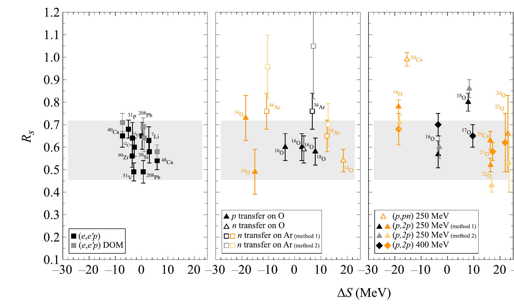
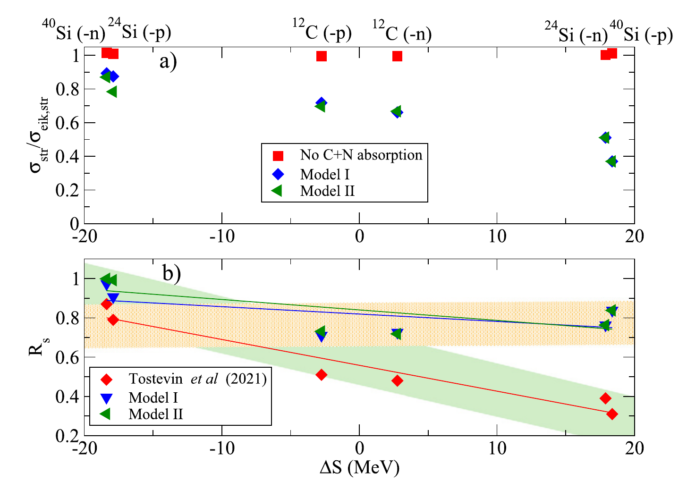

# How much of spectroscopic quenching belongs to the reaction model?

Jin Lei

School of Physics Science and Engineering, Tongji University, Shanghai 
Southern Center for Nuclear-Science Theory, Institute of Modern Physics, CAS, Huizhou

QFS-RB 2026 &nbsp;&middot;&nbsp; Takayama

NSFC 12475132 and 12535009 &nbsp;&middot;&nbsp; Fundamental Research Funds for the Central Universities

---

# Why single-particle structure?

<iframe src="./nuclides/nuclides.html?embed" class="kami-img" style="width: 100%; height: 23rem; border: 0; border-radius: 6px;" loading="eager"></iframe>

NUBASE2020: Kondev et al., Chin. Phys. C 45, 030001 (2021).

<b>Spectra show where shells break.</b>

N&nbsp;=&nbsp;20 and 28 dissolve, N&nbsp;=&nbsp;32 and 34 appear far from stability; knockout follows N&nbsp;=&nbsp;28 through 36,38,40Si.

<MiniIcon :size="72" mode="shells" />

<b>They do not show the orbitals.</b>

An energy or a spin belongs to the whole nucleus, not to the orbital a nucleon sits in.

<MiniIcon :size="72" mode="hidden" />

<b>Take one nucleon out.</b>

How often b is left in a given state measures how much of the nucleus is b plus one nucleon in an orbital.

<MiniIcon :size="72" mode="remove" />

To see an orbital, <b>remove a nucleon from it</b>.

---

# Knockout: a probe of single-particle structure

<ExperimentScene :height="300" />

how much 
cross section &sigma; &rarr; <b>spectroscopic factor</b> C2S

which orbital 
residue momentum p&#8741; &rarr; <b>orbital angular momentum</b> l

which final state 
&gamma; at the target &times; b at the focal plane &rarr; <b>state of b</b>

&sigma;th = &Sigma; C2S &times; &sigma;sp: structure times a reaction factor, with beams of <b>a few ions per second</b>.

---

# Deeply bound nucleons look twice as quenched

Heavy-ion knockout. Tostevin and Gade, PRC 103, 054610 (2021). Rs = &sigma;exp / &sigma;th.

<MiniIcon mode="weak" :size="44" />

weak, &Delta;S = &minus;18: <b>Rs &asymp; 0.9</b>

<MiniIcon mode="deep" :size="44" />

deep, &Delta;S = +18: <b>Rs &asymp; 0.3</b>

the other probes

Aumann et al., PPNP 118, 103847 (2021), Fig. 56(a) to (c).

(e,e'p), transfer, (p,2p): <b>flat</b> at 40 to 70%. Only knockout on Be and C falls, analysed with <b>one reaction model</b>.

Is this <b>structure</b>, or is it the <b>reaction model</b>?

---

# What the reaction model assumes

many-body

$H = T_R + T_r + H_A + H_a + V_{bA} + V_{xA}$

every nucleon; Ha = Hb + Vbx keeps the internal states of b

&darr;&ensp;exact projection: target in its ground state, b bound

three-body

$H_{\rm eff} = PHP + PHQ\,\dfrac{1}{E - QHQ}\,QHP$

&darr;&ensp;?&ensp;assumed: UbA, UxA fitted separately, nothing else

model

$H_3^{(0)} = T_R + T_r + V_{bx} + U_{bA} + U_{xA}$

&darr;&ensp;eikonal, sudden: straight lines, b a spectator

eikonal

$\sigma_{\rm str} = \int d^2b\,\langle\phi|\,|S_b|^2(1-|S_x|^2)\,|\phi\rangle$

$\sigma_{\rm th} = \sum C^2S\,\sigma_{sp}$

<KnockoutScene mode="spectator" :height="230" />

Every &sigma;sp behind the systematics takes <b>Heff = H3(0)</b>. Does it hold?

This work: what the optical reduction leaves out of Heff, and how much of the trend it carries.

---

# Where three-body forces come from

<MiniIcon mode="nnp" :size="104" />

three nucleons <b>n + n + p</b>

$H = T + \sum V_{NN} + V_{3N}$

V3N: &Delta; and pion excitations projected out Fujita, Miyazawa 1957

<MiniIcon mode="dA" :size="104" />

deuteron + target <b>n + p + A</b>

$H = T + V_{np} + U_{nA} + U_{pA} + V_{3B}$

UnA, UpA: the target excited by <b>one</b> nucleon. V3B: one excites it, <b>the other</b> de-excites it. 40Ca(d,p): &minus;20 to &minus;40% Austern, Richards 1968; Polyzou, Redish 1979; Johnson, Timofeyuk 2014; Dinmore et al. 2019

<MiniIcon mode="bxA" :size="104" />

composite + target <b>b + x + A</b>

$H = H_3^{(0)} + \;?$

The same shared target excitation, <b>plus</b> the internal states of b and x: a second elimination. <b>Not derived before this work.</b>

Knockout is the <b>x = N</b> limit: only b&rsquo;s internal states are projected out, yet the fitted UbA, UxA keep none of it.

---

# What Heff is: two eliminations

b bound &nbsp;Pb

b excited or broken &nbsp;Qb

target g.s. PA

<b>P</b> = PAPb
model space elastic, diffraction

<b>C</b> = PAQb
b excited &rarr; U(pol)

target excited QA <b style="color: var(--near-black);">stripping</b>

<b>R</b> = QAPb
<b>b bound</b> measured

<b>D</b> = QAQb
<b>b lost</b> &rarr; GA of U(nonadd)

R, C, D are eliminated exactly. The spectator model counts <b>both</b> R and D:

<OutcomeScene :width="350" :height="110" />

1 &nbsp;target excitation out

<MiniIcon mode="elimA" :size="96" />

$U^{(\rm nonadd)} = \langle\phi_A|\,\Delta V\,Q_A\,G_A\,Q_A\,\Delta V\,|\phi_A\rangle$

&Delta;V = &Delta;vbA + &Delta;vxA, GA = (E &minus; QAHQA)&minus;1. Picture: <b>x excites</b> the target, <b>b de-excites</b> it, the cross term no UxA or UbA holds.

2 &nbsp;excited b out

<MiniIcon mode="elimB" :size="96" />

$U^{(\rm pol)} = P_b\,H^{(A)} Q_b\,\dfrac{1}{E - Q_bH^{(A)}Q_b}\,Q_b H^{(A)} P_b$

H(A) = H3(0) + U(nonadd). Target in its ground state, the <b>x-b coupling</b> lifts b to b* and back. UbA, fitted to a free b, knows b excited by the target, <b>not by x</b>.

$H_{\rm eff} = H_3^{(0)} + U^{(\rm nonadd)} + U^{(\rm pol)}$

exact for the cluster Hamiltonian; no single term's absorption is the measured yield

Standard practice keeps H3(0) and deletes both. That deletion <b>is</b> the spectator assumption.

---

# What happens to b during stripping

$U^{(\rm nonadd)} = \langle\phi_A|\,\Delta V\,Q_A\,G_A\,Q_A\,\Delta V\,|\phi_A\rangle$

start The term of Heff from the previous slide. Reference: UH, folding over the target and b ground states, absorption-free. &Delta;viA = ViA &minus; UHiA carries <b>all</b> coupling to target excitation.

$U^{(\rm nonadd)} = \underbrace{U_{xx}}_{\text{N in, N out}} + \underbrace{U_{bb}}_{\text{b in, b out}} + \underbrace{U_{xb} + U_{bx}}_{\text{three-body force}}$

expand Uxx: N excites the target, N de-excites it. Ubb: b excites, b de-excites. Uxb, Ubx: one excites, the other de-excites, the <b>three-body force</b>.

$U_{xx} = P\,\Delta v_{xA}\,R\,[G_A]_{RR}\,R\,\Delta v_{xA}\,P$

split QA = R + D, the target-excited row of the table. &Delta;vxA does not touch b, so N enters and leaves through R.

$[G_A]_{RR} = \big(E - RHR - U_R^{(D)}\big)^{-1}$

fold GA still contains D. Folding D back into R is the same Feshbach step, one level down: <b>b is not frozen</b> while the target is excited.

$U_R^{(D)} = RHD\,\dfrac{1}{E - DHD}\,DHR$

meaning b leaves its bound state into D and comes back. Exact at the cluster level.

$-\mathrm{Im}\,U_{xx} = \text{flux in } R + \langle\psi_R|W_R^{(bA)} + W_R^{(bx)}|\psi_R\rangle$

count All stripping = <b style="color: var(--color-evidence);">b bound</b> (measured) + <b style="color: var(--color-gap);">b lost</b>: broken by the target (standard, the same in &sigma;surv and &sigma;sp) or by the <b>N-b coupling</b> (new).

The spectator model freezes b (Vbx &rarr; PbVbxPb): WR(bx) = 0 and every b is counted. <b>WR(bx)</b> is the one new term.

---

# Where "b excited or broken" sits in Heff

It depends on what the <b>target</b> is doing at that moment.

target excited (after stripping)

b broken there is the sector D = QAQb. Eliminating the target first, it is integrated out <b>inside GA of U(nonadd)</b>, together with QA.

<b>The new term:</b> WR(bx) in the N-target term.

target in its ground state

b excited there is the sector C = PAQb: this is <b>U(pol)</b>. It holds three things:

<b>a.</b> b broken in diffraction: the same N-b coupling, target in its ground state. 
<b>b.</b> core-first stripping (b excited, then the target): dropped by the sudden target, in both &sigma;surv and &sigma;sp. 
<b>c.</b> b* admixed in the projectile: a normalization, not a yield.

<b>U(nonadd), Ubb:</b> b excites the target, b de-excites it. The same in &sigma;surv and &sigma;sp.

<b>U(nonadd), Uxb + Ubx:</b> N excites the target, b de-excites it, or the reverse: the induced three-body force of slide 6.

The direct sequence, strip first and then break b, never passes through C: it is in U(nonadd), not U(pol).

---

# What decides how much b is disturbed: where x sits

<OrbitalCloud :height="300" />

<b style="color: var(--color-gap);">deeply bound x</b>: lives inside b, strongly coupled to it

<b style="color: var(--ink-blue);">weakly bound x</b>: lives outside b, b nearly a spectator

Prediction: the deep channel loses more of b, and the effect <b>fades as the binding goes to zero</b>.

---

# The term evaluated: Gomez-Ramos <i>et al.</i> 2023

Gomez-Ramos, Gomez-Camacho, Moro, PLB 847, 138284 (2023), Fig. 4. Models I, II: return from PACE, GEMINI.

<b>(a)</b> Stripping with the N-core absorption, over the standard eikonal: the <b>deep</b> channels lose most.

<b>(b)</b> The slope of Rs: &minus;0.013 &rarr; &minus;0.004 (I), &minus;0.005 (II) MeV&minus;1, <b>less than half</b>. Close to the (p,pN) trend.

The size rests on the N-core absorption and the compound-nucleus return.

In Heff, this is WR(bx): the non-spectator dynamics of b, evaluated.

---

# What is open

1 <b class="ml-2">The return from the framework</b>

Flux that leaves bound b and comes back is a D &rarr; R path. Compute it instead of borrowing a decay code.

2 <b class="ml-2">Diffraction</b>

The same N-b coupling with the target in its ground state, in U(pol).

3 <b class="ml-2">Beam energy</b>

The trend is the same from 80 MeV/nucleon to 1.6 GeV/nucleon; the correction must be too.

4 <b class="ml-2">The real N-b interaction</b>

Dropped in the published calculation.

<b>A direct test.</b> b broken by the x-b coupling leaves b &minus; 1, b &minus; 2, &hellip;: it feeds <b>multi-nucleon removal</b> of the same beam.
The yield beyond the target breaking b directly is the flux the spectator formula counts as survival.
First attempt: 14O on C, 60 MeV/nucleon, 13O* &rarr; p + 12N and 2p + 11C below 7.5 MeV: &lt; 4.6(20) mb, against 16.8 mb for &minus;1n. Higher 13O* not measured. Sun et al., PRC 93, 044607 (2016).

---

# Summary

<b>1.</b> The quenching systematics rests on treating the residue as a <b>spectator</b>. Inside a composite projectile it is not.

<b>2.</b> Heff names what the spectator model drops: the <b>N-b coupling during stripping</b>, WR(bx), from the same elimination that gives the induced three-body force in d + A.

<b>3.</b> Evaluated by Gomez-Ramos <i>et al.</i>, it suppresses <b>deeply bound</b> removal more and halves the slope; its size rests on the N-b absorption and the compound-nucleus return.

---
layout: center
class: text-center
---

# Thank you

Jin Lei &nbsp;&middot;&nbsp; Tongji University &nbsp;&middot;&nbsp; jinl@tongji.edu.cn

---
backup: true
---

---

# Backup: isn't this already in the optical potential?

$U^{(\rm nonadd)} = \langle\phi_A|\,\Delta V\,Q_A\,G_A\,Q_A\,\Delta V\,|\phi_A\rangle$

$\Delta V = \Delta v_{bA} + \Delta v_{xA}$

UxA projects out the target excitations of <b>x alone</b>. With two fragments on one target, the projection gives the four terms above.

<b>Diagonal terms</b> (x in, x out; b in, b out) only <b>resemble</b> UxA, UbA: GA still contains the other fragment, so each fragment meets the target at a shifted energy (Austern and Richards, Ann. Phys. 49, 309 (1968)).

<b>Cross terms</b> (x in, b out and the reverse) are in <b>neither</b> potential: the induced three-body force, established for d + A (Johnson and Timofeyuk, PRC 89, 024605 (2014); Dinmore <i>et al.</i>, PRC 99, 064612 (2019)).

---

# Backup: where do Sb and Sx come from?

$$\langle\phi_\xi|\langle\phi_A|\,V_{\xi A}\,|\phi_A\rangle|\phi_\xi\rangle = U^{\rm H}_{\xi A}$$

<b>Reference potential:</b> Hartree folding over the target and fragment ground states.
Real and absorption-free: &Delta;v carries <b>all</b> coupling to target excitation.

With UH alone, |Sb| = |Sx| = 1. All target-excitation absorption sits in U(nonadd).

<b>In practice</b> Sb, Sx come from Glauber with complex NN amplitudes, or from a fitted optical potential: UH plus the <b>free-fragment</b> Ubb, Uxx.

<b>b broken by the target</b> after stripping (WR(bA)) sits in the same factor under the eikonal step, identically in &sigma;surv and &sigma;sp.

<b>Order of elimination:</b> names move (U(nonadd) or U(pol)), the physics does not.

---

# Backup: the grey band in Aumann <i>et al.</i> Fig. 56

Not defined in the caption or text of Fig. 56. It spans about 0.45 to 0.72, roughly the range of the (e,e'p) points in panel (a).

Fig. 29 of the same review uses a grey band for the mean &plusmn; 2&sigma; of (e,e'p) data, but at 0.40 to 0.68: a different band.
Aumann <i>et al.</i>, Prog. Part. Nucl. Phys. 118, 103847 (2021).

