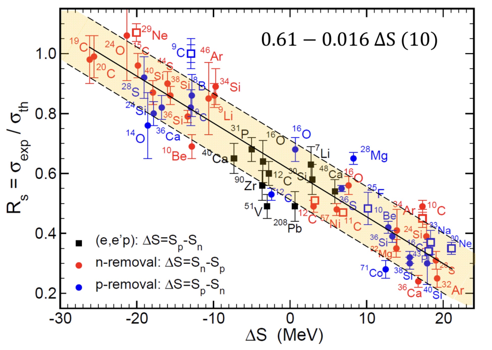
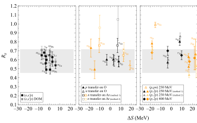
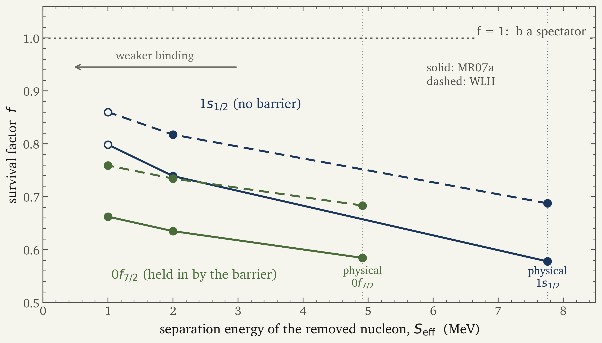
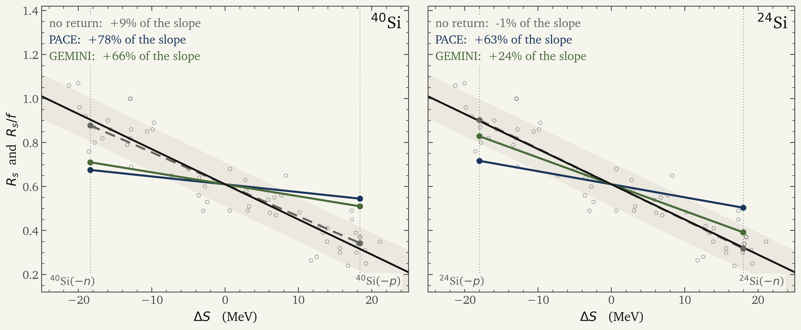

# How much of spectroscopic quenching belongs to the reaction model?

Jin Lei

School of Physics Science and Engineering, Tongji University, Shanghai 
Southern Center for Nuclear-Science Theory, Institute of Modern Physics, CAS, Huizhou

QFS-RB 2026 &nbsp;&middot;&nbsp; Takayama

NSFC 12475132 and 12535009 &nbsp;&middot;&nbsp; Fundamental Research Funds for the Central Universities

---

# Why single-particle structure?

<iframe src="./nuclides/nuclides.html?embed" class="kami-img" style="width: 100%; height: 23rem; border: 0; border-radius: 6px;" loading="eager"></iframe>

NUBASE2020: Kondev et al., Chin. Phys. C 45, 030001 (2021).

<b>Spectra show where shells break.</b>

N&nbsp;=&nbsp;20 and 28 dissolve, N&nbsp;=&nbsp;32 and 34 appear far from stability; knockout follows N&nbsp;=&nbsp;28 through 36,38,40Si.

<MiniIcon :size="72" mode="shells" />

<b>They do not show the orbitals.</b>

An energy or a spin belongs to the whole nucleus, not to the orbital a nucleon sits in.

<MiniIcon :size="72" mode="hidden" />

<b>Take one nucleon out.</b>

How often b is left in a given state measures how much of the nucleus is b plus one nucleon in an orbital.

<MiniIcon :size="72" mode="remove" />

To see an orbital, <b>remove a nucleon from it</b>.

---

# Knockout: a probe of single-particle structure

<ExperimentScene :height="300" />

how much 
cross section &sigma; &rarr; <b>spectroscopic factor</b> C2S

which orbital 
residue momentum p&#8741; &rarr; <b>orbital angular momentum</b> l

which final state 
&gamma; at the target &times; b at the focal plane &rarr; <b>state of b</b>

&sigma;th = &Sigma; C2S &times; &sigma;sp: structure times a reaction factor, with beams of <b>a few ions per second</b>.

---

# Deeply bound nucleons look twice as quenched

Heavy-ion knockout. Tostevin and Gade, PRC 103, 054610 (2021). Rs = &sigma;exp / &sigma;th.

<MiniIcon mode="weak" :size="44" />

weak, &Delta;S = &minus;18: <b>Rs &asymp; 0.9</b>

<MiniIcon mode="deep" :size="44" />

deep, &Delta;S = +18: <b>Rs &asymp; 0.3</b>

the other probes

Aumann et al., PPNP 118, 103847 (2021), Fig. 56(a) to (c).

(e,e'p), transfer, (p,2p): <b>flat</b> at 40 to 70%. Only knockout on Be and C falls, analysed with <b>one reaction model</b>.

Is this <b>structure</b>, or is it the <b>reaction model</b>?

<!--
Grey band: not defined in the caption or text of Fig. 56. It spans about 0.45 to 0.72, roughly the range of the
(e,e'p) points in panel (a). Fig. 29 of the same review uses a grey band for the mean +- 2 sigma of (e,e'p) data,
but at 0.40 to 0.68, so it is not the same band. Do not assign it a meaning on stage.
-->

---

# What the reaction model assumes

many-body

$H = T_R + T_r + H_A + H_a + V_{bA} + V_{xA}$

every nucleon; Ha = Hb + Vbx keeps the internal states of b

&darr;&ensp;exact projection: target in its ground state, b bound

three-body

$H_{\rm eff} = PHP + PHQ\,\dfrac{1}{E - QHQ}\,QHP$

&darr;&ensp;?&ensp;assumed: UbA, UxA fitted separately, nothing else

model

$H_3^{(0)} = T_R + T_r + V_{bx} + U_{bA} + U_{xA}$

&darr;&ensp;eikonal, sudden: straight lines, b a spectator

eikonal

$\sigma_{\rm str} = \int d^2b\,\langle\phi|\,|S_b|^2(1-|S_x|^2)\,|\phi\rangle$

$\sigma_{\rm th} = \sum C^2S\,\sigma_{sp}$

<KnockoutScene mode="spectator" :height="230" />

Every &sigma;sp behind the systematics takes <b>Heff = H3(0)</b>. Does it hold?

This work: what the optical reduction leaves out of Heff, and how much of the trend it carries.

---

# What Heff is: two eliminations

b bound &nbsp;Pb

b excited or broken &nbsp;Qb

target g.s. PA

<b>P</b>: the model space elastic, diffraction

core excited &rarr; U(pol)

target excited QA

stripping, <b>b survives</b> what is measured

stripping, <b>b lost</b> &rarr; inside GA of U(nonadd)

P = PAPb; the other three sectors are eliminated exactly. The spectator model keeps P and
lets the stripped flux count as surviving, whatever state b is in.

1 &nbsp;target excitation out

$U^{(\rm nonadd)} = \langle\phi_A|\,\Delta V\,Q_A\,G_A\,Q_A\,\Delta V\,|\phi_A\rangle$

&Delta;V = &Delta;vbA + &Delta;vxA, GA = (E &minus; QAHQA)&minus;1: the target excited and de-excited by the fragments; the cross terms (one in, the other out) are three-body.

2 &nbsp;excited b out

$U^{(\rm pol)} = P_b\,H^{(A)} Q_b\,\dfrac{1}{E - Q_bH^{(A)}Q_b}\,Q_b H^{(A)} P_b$

H(A) = H3(0) + U(nonadd): b lifted out of its bound state and back, with the target in its ground state.

$H_{\rm eff} = H_3^{(0)} + U^{(\rm nonadd)} + U^{(\rm pol)}$

exact for the cluster Hamiltonian; no single term's absorption is the measured yield

Standard practice keeps H3(0) and deletes both. That deletion <b>is</b> the spectator assumption.

---

# What H3(0) leaves out

1 &nbsp;target excitation &nbsp;&rarr; U(nonadd)

<ElimScene mode="target" :height="205" />

<b>Why not in H3(0):</b> UxA is fitted to a <b>free</b> x on the target: only x de-excites
the target, and no b is coupled to x while A* lives. Excited by x, de-excited by b needs both fragments:
no potential in one coordinate holds it.

2 &nbsp;excited b &nbsp;&rarr; U(pol)

<ElimScene mode="core" :height="205" />

<b>Why not in H3(0):</b> UbA is fitted to a <b>free</b> b, so it knows b excited by the
target, not by x. Vbx in H3(0) acts on b's ground state only: b is frozen, and every b
that comes out is counted as surviving.

UbA and UxA each know one fragment: what needs <b>both at once</b> is dropped, and b is counted in
every state while the experiment counts <b>b bound</b>.

---

# What decides how much b is disturbed: where x sits

<OrbitalCloud :height="300" />

<b style="color: var(--color-gap);">deeply bound x</b>: lives inside b, strongly coupled to it

<b style="color: var(--ink-blue);">weakly bound x</b>: lives outside b, b nearly a spectator

Prediction: the deep channel loses more of b, and the effect <b>fades as the binding goes to zero</b>.

---

# The test: two nuclei with opposite asymmetry

<svg viewBox="0 0 580 350" width="100%" style="font-family: Newsreader, Georgia, serif;">
<line x1="10" y1="50" x2="570" y2="50" stroke="#8a8981" stroke-width="1" stroke-dasharray="4 4"/>
<text x="14" y="42" style="font-size:15px" fill="#66655f">E = 0</text>
<polygon points="32.1,73.5 32.1,73.9 32.5,75.6 33.0,77.4 33.4,79.4 33.8,81.4 34.2,83.6 34.6,85.9 35.1,88.3 35.5,90.9 35.9,93.6 36.3,96.4 36.7,99.4 37.2,102.5 37.6,105.8 38.0,109.2 38.4,112.7 38.8,116.4 39.3,120.2 39.7,124.2 40.1,128.2 40.5,132.4 40.9,136.7 41.4,141.2 41.8,145.7 42.2,150.2 42.6,154.9 43.0,159.6 43.5,164.4 43.9,169.1 44.3,173.9 44.7,178.8 45.1,183.5 45.6,188.3 46.0,193.0 46.4,197.7 46.8,202.3 47.2,206.9 47.7,211.3 48.1,215.7 48.5,219.9 48.9,224.0 49.3,228.1 49.8,231.9 50.2,235.7 50.6,239.3 51.0,242.7 51.4,246.1 51.9,249.3 52.3,252.3 52.7,255.2 53.1,258.0 53.5,260.6 54.0,263.1 54.4,265.4 54.8,267.6 55.2,269.8 55.6,271.7 56.1,273.6 56.5,275.4 56.9,277.0 57.3,278.6 57.7,280.0 58.2,281.4 58.6,282.7 59.0,283.9 59.4,285.0 59.8,286.1 60.3,287.0 60.7,288.0 61.1,288.8 61.5,289.6 61.9,290.3 62.4,291.0 62.8,291.7 63.2,292.3 63.6,292.8 64.0,293.3 64.5,293.8 64.9,294.3 65.3,294.7 65.7,295.1 66.1,295.4 66.6,295.8 67.0,296.1 67.4,296.4 67.8,296.6 68.2,296.9 68.7,297.1 69.1,297.3 69.5,297.5 69.9,297.7 70.3,297.9 70.8,298.0 71.2,298.2 71.6,298.3 72.0,298.4 72.4,298.5 72.9,298.6 73.3,298.7 73.7,298.8 74.1,298.9 74.5,299.0 75.0,299.1 75.4,299.1 75.8,299.2 76.2,299.3 76.6,299.3 77.1,299.4 77.5,299.4 77.9,299.5 78.3,299.5 78.7,299.5 79.2,299.6 79.6,299.6 80.0,299.6 80.4,299.6 80.8,299.6 81.3,299.5 81.7,299.5 82.1,299.5 82.5,299.4 82.9,299.4 83.4,299.3 83.8,299.3 84.2,299.2 84.6,299.1 85.0,299.1 85.5,299.0 85.9,298.9 86.3,298.8 86.7,298.7 87.1,298.6 87.6,298.5 88.0,298.4 88.4,298.3 88.8,298.2 89.2,298.0 89.7,297.9 90.1,297.7 90.5,297.5 90.9,297.3 91.3,297.1 91.8,296.9 92.2,296.6 92.6,296.4 93.0,296.1 93.4,295.8 93.9,295.4 94.3,295.1 94.7,294.7 95.1,294.3 95.5,293.8 96.0,293.3 96.4,292.8 96.8,292.3 97.2,291.7 97.6,291.0 98.1,290.3 98.5,289.6 98.9,288.8 99.3,288.0 99.7,287.0 100.2,286.1 100.6,285.0 101.0,283.9 101.4,282.7 101.8,281.4 102.3,280.0 102.7,278.6 103.1,277.0 103.5,275.4 103.9,273.6 104.4,271.7 104.8,269.8 105.2,267.6 105.6,265.4 106.0,263.1 106.5,260.6 106.9,258.0 107.3,255.2 107.7,252.3 108.1,249.3 108.6,246.1 109.0,242.7 109.4,239.3 109.8,235.7 110.2,231.9 110.7,228.1 111.1,224.0 111.5,219.9 111.9,215.7 112.3,211.3 112.8,206.9 113.2,202.3 113.6,197.7 114.0,193.0 114.4,188.3 114.9,183.5 115.3,178.8 115.7,173.9 116.1,169.1 116.5,164.4 117.0,159.6 117.4,154.9 117.8,150.2 118.2,145.7 118.6,141.2 119.1,136.7 119.5,132.4 119.9,128.2 120.3,124.2 120.7,120.2 121.2,116.4 121.6,112.7 122.0,109.2 122.4,105.8 122.8,102.5 123.3,99.4 123.7,96.4 124.1,93.6 124.5,90.9 124.9,88.3 125.4,85.9 125.8,83.6 126.2,81.4 126.6,79.4 127.0,77.4 127.5,75.6 127.9,73.9 127.9,73.5" fill="#E4ECF5"/><polyline points="17.0,51.6 17.4,51.8 17.8,51.9 18.3,52.1 18.7,52.2 19.1,52.4 19.5,52.6 19.9,52.8 20.4,53.0 20.8,53.3 21.2,53.5 21.6,53.8 22.0,54.1 22.5,54.4 22.9,54.8 23.3,55.1 23.7,55.5 24.1,56.0 24.6,56.4 25.0,56.9 25.4,57.5 25.8,58.1 26.2,58.7 26.7,59.4 27.1,60.1 27.5,60.8 27.9,61.7 28.3,62.6 28.8,63.5 29.2,64.5 29.6,65.6 30.0,66.8 30.4,68.0 30.9,69.3 31.3,70.8 31.7,72.3 32.1,73.9 32.5,75.6 33.0,77.4 33.4,79.4 33.8,81.4 34.2,83.6 34.6,85.9 35.1,88.3 35.5,90.9 35.9,93.6 36.3,96.4 36.7,99.4 37.2,102.5 37.6,105.8 38.0,109.2 38.4,112.7 38.8,116.4 39.3,120.2 39.7,124.2 40.1,128.2 40.5,132.4 40.9,136.7 41.4,141.2 41.8,145.7 42.2,150.2 42.6,154.9 43.0,159.6 43.5,164.4 43.9,169.1 44.3,173.9 44.7,178.8 45.1,183.5 45.6,188.3 46.0,193.0 46.4,197.7 46.8,202.3 47.2,206.9 47.7,211.3 48.1,215.7 48.5,219.9 48.9,224.0 49.3,228.1 49.8,231.9 50.2,235.7 50.6,239.3 51.0,242.7 51.4,246.1 51.9,249.3 52.3,252.3 52.7,255.2 53.1,258.0 53.5,260.6 54.0,263.1 54.4,265.4 54.8,267.6 55.2,269.8 55.6,271.7 56.1,273.6 56.5,275.4 56.9,277.0 57.3,278.6 57.7,280.0 58.2,281.4 58.6,282.7 59.0,283.9 59.4,285.0 59.8,286.1 60.3,287.0 60.7,288.0 61.1,288.8 61.5,289.6 61.9,290.3 62.4,291.0 62.8,291.7 63.2,292.3 63.6,292.8 64.0,293.3 64.5,293.8 64.9,294.3 65.3,294.7 65.7,295.1 66.1,295.4 66.6,295.8 67.0,296.1 67.4,296.4 67.8,296.6 68.2,296.9 68.7,297.1 69.1,297.3 69.5,297.5 69.9,297.7 70.3,297.9 70.8,298.0 71.2,298.2 71.6,298.3 72.0,298.4 72.4,298.5 72.9,298.6 73.3,298.7 73.7,298.8 74.1,298.9 74.5,299.0 75.0,299.1 75.4,299.1 75.8,299.2 76.2,299.3 76.6,299.3 77.1,299.4 77.5,299.4 77.9,299.5 78.3,299.5 78.7,299.5 79.2,299.6 79.6,299.6 80.0,299.6 80.4,299.6 80.8,299.6 81.3,299.5 81.7,299.5 82.1,299.5 82.5,299.4 82.9,299.4 83.4,299.3 83.8,299.3 84.2,299.2 84.6,299.1 85.0,299.1 85.5,299.0 85.9,298.9 86.3,298.8 86.7,298.7 87.1,298.6 87.6,298.5 88.0,298.4 88.4,298.3 88.8,298.2 89.2,298.0 89.7,297.9 90.1,297.7 90.5,297.5 90.9,297.3 91.3,297.1 91.8,296.9 92.2,296.6 92.6,296.4 93.0,296.1 93.4,295.8 93.9,295.4 94.3,295.1 94.7,294.7 95.1,294.3 95.5,293.8 96.0,293.3 96.4,292.8 96.8,292.3 97.2,291.7 97.6,291.0 98.1,290.3 98.5,289.6 98.9,288.8 99.3,288.0 99.7,287.0 100.2,286.1 100.6,285.0 101.0,283.9 101.4,282.7 101.8,281.4 102.3,280.0 102.7,278.6 103.1,277.0 103.5,275.4 103.9,273.6 104.4,271.7 104.8,269.8 105.2,267.6 105.6,265.4 106.0,263.1 106.5,260.6 106.9,258.0 107.3,255.2 107.7,252.3 108.1,249.3 108.6,246.1 109.0,242.7 109.4,239.3 109.8,235.7 110.2,231.9 110.7,228.1 111.1,224.0 111.5,219.9 111.9,215.7 112.3,211.3 112.8,206.9 113.2,202.3 113.6,197.7 114.0,193.0 114.4,188.3 114.9,183.5 115.3,178.8 115.7,173.9 116.1,169.1 116.5,164.4 117.0,159.6 117.4,154.9 117.8,150.2 118.2,145.7 118.6,141.2 119.1,136.7 119.5,132.4 119.9,128.2 120.3,124.2 120.7,120.2 121.2,116.4 121.6,112.7 122.0,109.2 122.4,105.8 122.8,102.5 123.3,99.4 123.7,96.4 124.1,93.6 124.5,90.9 124.9,88.3 125.4,85.9 125.8,83.6 126.2,81.4 126.6,79.4 127.0,77.4 127.5,75.6 127.9,73.9 128.3,72.3 128.7,70.8 129.1,69.3 129.6,68.0 130.0,66.8 130.4,65.6 130.8,64.5 131.2,63.5 131.7,62.6 132.1,61.7 132.5,60.8 132.9,60.1 133.3,59.4 133.8,58.7 134.2,58.1 134.6,57.5 135.0,56.9 135.4,56.4 135.9,56.0 136.3,55.5 136.7,55.1 137.1,54.8 137.5,54.4 138.0,54.1 138.4,53.8 138.8,53.5 139.2,53.3 139.6,53.0 140.1,52.8 140.5,52.6 140.9,52.4 141.3,52.2 141.7,52.1 142.2,51.9 142.6,51.8 143.0,51.6" fill="none" stroke="#4d4c48" stroke-width="1.8"/><line x1="28.1" y1="73.5" x2="131.9" y2="73.5" stroke="#1B365D" stroke-width="3"/><text x="80" y="97.5" text-anchor="middle" style="font-size:18px" fill="#1B365D">S<tspan baseline-shift="sub" style="font-size:12px">n</tspan> = 4.7</text><text x="80" y="326.0" text-anchor="middle" style="font-size:17px" fill="#4d4c48">n</text>
<polygon points="175.6,165.5 175.6,165.5 176.0,170.0 176.4,174.4 176.8,178.8 177.2,183.1 177.7,187.3 178.1,191.4 178.5,195.4 178.9,199.3 179.3,203.1 179.8,206.8 180.2,210.3 180.6,213.7 181.0,216.9 181.4,220.1 181.9,223.0 182.3,225.9 182.7,228.6 183.1,231.1 183.5,233.5 184.0,235.8 184.4,238.0 184.8,240.1 185.2,242.0 185.6,243.8 186.1,245.5 186.5,247.1 186.9,248.6 187.3,249.9 187.7,251.2 188.2,252.4 188.6,253.6 189.0,254.6 189.4,255.6 189.8,256.5 190.3,257.3 190.7,258.1 191.1,258.8 191.5,259.5 191.9,260.1 192.4,260.6 192.8,261.1 193.2,261.6 193.6,262.0 194.0,262.4 194.5,262.8 194.9,263.1 195.3,263.4 195.7,263.7 196.1,264.0 196.6,264.2 197.0,264.4 197.4,264.6 197.8,264.8 198.2,265.0 198.7,265.1 199.1,265.2 199.5,265.3 199.9,265.5 200.3,265.6 200.8,265.6 201.2,265.7 201.6,265.8 202.0,265.9 202.4,265.9 202.9,266.0 203.3,266.0 203.7,266.1 204.1,266.1 204.5,266.1 205.0,266.2 205.4,266.2 205.8,266.2 206.2,266.3 206.6,266.3 207.1,266.3 207.5,266.4 207.9,266.4 208.3,266.4 208.7,266.4 209.2,266.5 209.6,266.5 210.0,266.5 210.4,266.5 210.8,266.5 211.3,266.4 211.7,266.4 212.1,266.4 212.5,266.4 212.9,266.3 213.4,266.3 213.8,266.3 214.2,266.2 214.6,266.2 215.0,266.2 215.5,266.1 215.9,266.1 216.3,266.1 216.7,266.0 217.1,266.0 217.6,265.9 218.0,265.9 218.4,265.8 218.8,265.7 219.2,265.6 219.7,265.6 220.1,265.5 220.5,265.3 220.9,265.2 221.3,265.1 221.8,265.0 222.2,264.8 222.6,264.6 223.0,264.4 223.4,264.2 223.9,264.0 224.3,263.7 224.7,263.4 225.1,263.1 225.5,262.8 226.0,262.4 226.4,262.0 226.8,261.6 227.2,261.1 227.6,260.6 228.1,260.1 228.5,259.5 228.9,258.8 229.3,258.1 229.7,257.3 230.2,256.5 230.6,255.6 231.0,254.6 231.4,253.6 231.8,252.4 232.3,251.2 232.7,249.9 233.1,248.6 233.5,247.1 233.9,245.5 234.4,243.8 234.8,242.0 235.2,240.1 235.6,238.0 236.0,235.8 236.5,233.5 236.9,231.1 237.3,228.6 237.7,225.9 238.1,223.0 238.6,220.1 239.0,216.9 239.4,213.7 239.8,210.3 240.2,206.8 240.7,203.1 241.1,199.3 241.5,195.4 241.9,191.4 242.3,187.3 242.8,183.1 243.2,178.8 243.6,174.4 244.0,170.0 244.4,165.5 244.4,165.5" fill="#f3e6e0"/><polyline points="147.0,39.2 147.4,39.2 147.8,39.3 148.3,39.3 148.7,39.4 149.1,39.5 149.5,39.6 149.9,39.7 150.4,39.8 150.8,40.0 151.2,40.2 151.6,40.3 152.0,40.5 152.5,40.8 152.9,41.0 153.3,41.3 153.7,41.6 154.1,41.9 154.6,42.3 155.0,42.7 155.4,43.1 155.8,43.6 156.2,44.1 156.7,44.6 157.1,45.2 157.5,45.9 157.9,46.6 158.3,47.3 158.8,48.2 159.2,49.0 159.6,50.0 160.0,51.0 160.4,52.2 160.9,53.3 161.3,54.6 161.7,56.0 162.1,57.5 162.5,59.0 163.0,60.7 163.4,62.5 163.8,64.4 164.2,66.4 164.6,68.6 165.1,70.8 165.5,73.2 165.9,75.7 166.3,78.4 166.7,81.2 167.2,84.2 167.6,87.2 168.0,90.5 168.4,93.8 168.8,97.3 169.3,100.9 169.7,104.7 170.1,108.5 170.5,112.5 170.9,116.6 171.4,120.8 171.8,125.1 172.2,129.4 172.6,133.9 173.0,138.3 173.5,142.8 173.9,147.4 174.3,151.9 174.7,156.5 175.1,161.0 175.6,165.5 176.0,170.0 176.4,174.4 176.8,178.8 177.2,183.1 177.7,187.3 178.1,191.4 178.5,195.4 178.9,199.3 179.3,203.1 179.8,206.8 180.2,210.3 180.6,213.7 181.0,216.9 181.4,220.1 181.9,223.0 182.3,225.9 182.7,228.6 183.1,231.1 183.5,233.5 184.0,235.8 184.4,238.0 184.8,240.1 185.2,242.0 185.6,243.8 186.1,245.5 186.5,247.1 186.9,248.6 187.3,249.9 187.7,251.2 188.2,252.4 188.6,253.6 189.0,254.6 189.4,255.6 189.8,256.5 190.3,257.3 190.7,258.1 191.1,258.8 191.5,259.5 191.9,260.1 192.4,260.6 192.8,261.1 193.2,261.6 193.6,262.0 194.0,262.4 194.5,262.8 194.9,263.1 195.3,263.4 195.7,263.7 196.1,264.0 196.6,264.2 197.0,264.4 197.4,264.6 197.8,264.8 198.2,265.0 198.7,265.1 199.1,265.2 199.5,265.3 199.9,265.5 200.3,265.6 200.8,265.6 201.2,265.7 201.6,265.8 202.0,265.9 202.4,265.9 202.9,266.0 203.3,266.0 203.7,266.1 204.1,266.1 204.5,266.1 205.0,266.2 205.4,266.2 205.8,266.2 206.2,266.3 206.6,266.3 207.1,266.3 207.5,266.4 207.9,266.4 208.3,266.4 208.7,266.4 209.2,266.5 209.6,266.5 210.0,266.5 210.4,266.5 210.8,266.5 211.3,266.4 211.7,266.4 212.1,266.4 212.5,266.4 212.9,266.3 213.4,266.3 213.8,266.3 214.2,266.2 214.6,266.2 215.0,266.2 215.5,266.1 215.9,266.1 216.3,266.1 216.7,266.0 217.1,266.0 217.6,265.9 218.0,265.9 218.4,265.8 218.8,265.7 219.2,265.6 219.7,265.6 220.1,265.5 220.5,265.3 220.9,265.2 221.3,265.1 221.8,265.0 222.2,264.8 222.6,264.6 223.0,264.4 223.4,264.2 223.9,264.0 224.3,263.7 224.7,263.4 225.1,263.1 225.5,262.8 226.0,262.4 226.4,262.0 226.8,261.6 227.2,261.1 227.6,260.6 228.1,260.1 228.5,259.5 228.9,258.8 229.3,258.1 229.7,257.3 230.2,256.5 230.6,255.6 231.0,254.6 231.4,253.6 231.8,252.4 232.3,251.2 232.7,249.9 233.1,248.6 233.5,247.1 233.9,245.5 234.4,243.8 234.8,242.0 235.2,240.1 235.6,238.0 236.0,235.8 236.5,233.5 236.9,231.1 237.3,228.6 237.7,225.9 238.1,223.0 238.6,220.1 239.0,216.9 239.4,213.7 239.8,210.3 240.2,206.8 240.7,203.1 241.1,199.3 241.5,195.4 241.9,191.4 242.3,187.3 242.8,183.1 243.2,178.8 243.6,174.4 244.0,170.0 244.4,165.5 244.9,161.0 245.3,156.5 245.7,151.9 246.1,147.4 246.5,142.8 247.0,138.3 247.4,133.9 247.8,129.4 248.2,125.1 248.6,120.8 249.1,116.6 249.5,112.5 249.9,108.5 250.3,104.7 250.7,100.9 251.2,97.3 251.6,93.8 252.0,90.5 252.4,87.2 252.8,84.2 253.3,81.2 253.7,78.4 254.1,75.7 254.5,73.2 254.9,70.8 255.4,68.6 255.8,66.4 256.2,64.4 256.6,62.5 257.0,60.7 257.5,59.0 257.9,57.5 258.3,56.0 258.7,54.6 259.1,53.3 259.6,52.2 260.0,51.0 260.4,50.0 260.8,49.0 261.2,48.2 261.7,47.3 262.1,46.6 262.5,45.9 262.9,45.2 263.3,44.6 263.8,44.1 264.2,43.6 264.6,43.1 265.0,42.7 265.4,42.3 265.9,41.9 266.3,41.6 266.7,41.3 267.1,41.0 267.5,40.8 268.0,40.5 268.4,40.3 268.8,40.2 269.2,40.0 269.6,39.8 270.1,39.7 270.5,39.6 270.9,39.5 271.3,39.4 271.7,39.3 272.2,39.3 272.6,39.2 273.0,39.2" fill="none" stroke="#4d4c48" stroke-width="1.8"/><line x1="171.6" y1="165.5" x2="248.4" y2="165.5" stroke="#b53333" stroke-width="3"/><text x="210" y="189.5" text-anchor="middle" style="font-size:15px" fill="#b53333">S<tspan baseline-shift="sub" style="font-size:12px">p</tspan> = 23.1</text><text x="210" y="326.0" text-anchor="middle" style="font-size:17px" fill="#4d4c48">p</text>
<polygon points="333.0,156.5 333.0,159.6 333.5,164.4 333.9,169.1 334.3,173.9 334.7,178.8 335.1,183.5 335.6,188.3 336.0,193.0 336.4,197.7 336.8,202.3 337.2,206.9 337.7,211.3 338.1,215.7 338.5,219.9 338.9,224.0 339.3,228.1 339.8,231.9 340.2,235.7 340.6,239.3 341.0,242.7 341.4,246.1 341.9,249.3 342.3,252.3 342.7,255.2 343.1,258.0 343.5,260.6 344.0,263.1 344.4,265.4 344.8,267.6 345.2,269.8 345.6,271.7 346.1,273.6 346.5,275.4 346.9,277.0 347.3,278.6 347.7,280.0 348.2,281.4 348.6,282.7 349.0,283.9 349.4,285.0 349.8,286.1 350.3,287.0 350.7,288.0 351.1,288.8 351.5,289.6 351.9,290.3 352.4,291.0 352.8,291.7 353.2,292.3 353.6,292.8 354.0,293.3 354.5,293.8 354.9,294.3 355.3,294.7 355.7,295.1 356.1,295.4 356.6,295.8 357.0,296.1 357.4,296.4 357.8,296.6 358.2,296.9 358.7,297.1 359.1,297.3 359.5,297.5 359.9,297.7 360.3,297.9 360.8,298.0 361.2,298.2 361.6,298.3 362.0,298.4 362.4,298.5 362.9,298.6 363.3,298.7 363.7,298.8 364.1,298.9 364.5,299.0 365.0,299.1 365.4,299.1 365.8,299.2 366.2,299.3 366.6,299.3 367.1,299.4 367.5,299.4 367.9,299.5 368.3,299.5 368.7,299.5 369.2,299.6 369.6,299.6 370.0,299.6 370.4,299.6 370.8,299.6 371.3,299.5 371.7,299.5 372.1,299.5 372.5,299.4 372.9,299.4 373.4,299.3 373.8,299.3 374.2,299.2 374.6,299.1 375.0,299.1 375.5,299.0 375.9,298.9 376.3,298.8 376.7,298.7 377.1,298.6 377.6,298.5 378.0,298.4 378.4,298.3 378.8,298.2 379.2,298.0 379.7,297.9 380.1,297.7 380.5,297.5 380.9,297.3 381.3,297.1 381.8,296.9 382.2,296.6 382.6,296.4 383.0,296.1 383.4,295.8 383.9,295.4 384.3,295.1 384.7,294.7 385.1,294.3 385.5,293.8 386.0,293.3 386.4,292.8 386.8,292.3 387.2,291.7 387.6,291.0 388.1,290.3 388.5,289.6 388.9,288.8 389.3,288.0 389.7,287.0 390.2,286.1 390.6,285.0 391.0,283.9 391.4,282.7 391.8,281.4 392.3,280.0 392.7,278.6 393.1,277.0 393.5,275.4 393.9,273.6 394.4,271.7 394.8,269.8 395.2,267.6 395.6,265.4 396.0,263.1 396.5,260.6 396.9,258.0 397.3,255.2 397.7,252.3 398.1,249.3 398.6,246.1 399.0,242.7 399.4,239.3 399.8,235.7 400.2,231.9 400.7,228.1 401.1,224.0 401.5,219.9 401.9,215.7 402.3,211.3 402.8,206.9 403.2,202.3 403.6,197.7 404.0,193.0 404.4,188.3 404.9,183.5 405.3,178.8 405.7,173.9 406.1,169.1 406.5,164.4 407.0,159.6 407.0,156.5" fill="#f3e6e0"/><polyline points="307.0,51.6 307.4,51.8 307.8,51.9 308.3,52.1 308.7,52.2 309.1,52.4 309.5,52.6 309.9,52.8 310.4,53.0 310.8,53.3 311.2,53.5 311.6,53.8 312.0,54.1 312.5,54.4 312.9,54.8 313.3,55.1 313.7,55.5 314.1,56.0 314.6,56.4 315.0,56.9 315.4,57.5 315.8,58.1 316.2,58.7 316.7,59.4 317.1,60.1 317.5,60.8 317.9,61.7 318.3,62.6 318.8,63.5 319.2,64.5 319.6,65.6 320.0,66.8 320.4,68.0 320.9,69.3 321.3,70.8 321.7,72.3 322.1,73.9 322.5,75.6 323.0,77.4 323.4,79.4 323.8,81.4 324.2,83.6 324.6,85.9 325.1,88.3 325.5,90.9 325.9,93.6 326.3,96.4 326.7,99.4 327.2,102.5 327.6,105.8 328.0,109.2 328.4,112.7 328.8,116.4 329.3,120.2 329.7,124.2 330.1,128.2 330.5,132.4 330.9,136.7 331.4,141.2 331.8,145.7 332.2,150.2 332.6,154.9 333.0,159.6 333.5,164.4 333.9,169.1 334.3,173.9 334.7,178.8 335.1,183.5 335.6,188.3 336.0,193.0 336.4,197.7 336.8,202.3 337.2,206.9 337.7,211.3 338.1,215.7 338.5,219.9 338.9,224.0 339.3,228.1 339.8,231.9 340.2,235.7 340.6,239.3 341.0,242.7 341.4,246.1 341.9,249.3 342.3,252.3 342.7,255.2 343.1,258.0 343.5,260.6 344.0,263.1 344.4,265.4 344.8,267.6 345.2,269.8 345.6,271.7 346.1,273.6 346.5,275.4 346.9,277.0 347.3,278.6 347.7,280.0 348.2,281.4 348.6,282.7 349.0,283.9 349.4,285.0 349.8,286.1 350.3,287.0 350.7,288.0 351.1,288.8 351.5,289.6 351.9,290.3 352.4,291.0 352.8,291.7 353.2,292.3 353.6,292.8 354.0,293.3 354.5,293.8 354.9,294.3 355.3,294.7 355.7,295.1 356.1,295.4 356.6,295.8 357.0,296.1 357.4,296.4 357.8,296.6 358.2,296.9 358.7,297.1 359.1,297.3 359.5,297.5 359.9,297.7 360.3,297.9 360.8,298.0 361.2,298.2 361.6,298.3 362.0,298.4 362.4,298.5 362.9,298.6 363.3,298.7 363.7,298.8 364.1,298.9 364.5,299.0 365.0,299.1 365.4,299.1 365.8,299.2 366.2,299.3 366.6,299.3 367.1,299.4 367.5,299.4 367.9,299.5 368.3,299.5 368.7,299.5 369.2,299.6 369.6,299.6 370.0,299.6 370.4,299.6 370.8,299.6 371.3,299.5 371.7,299.5 372.1,299.5 372.5,299.4 372.9,299.4 373.4,299.3 373.8,299.3 374.2,299.2 374.6,299.1 375.0,299.1 375.5,299.0 375.9,298.9 376.3,298.8 376.7,298.7 377.1,298.6 377.6,298.5 378.0,298.4 378.4,298.3 378.8,298.2 379.2,298.0 379.7,297.9 380.1,297.7 380.5,297.5 380.9,297.3 381.3,297.1 381.8,296.9 382.2,296.6 382.6,296.4 383.0,296.1 383.4,295.8 383.9,295.4 384.3,295.1 384.7,294.7 385.1,294.3 385.5,293.8 386.0,293.3 386.4,292.8 386.8,292.3 387.2,291.7 387.6,291.0 388.1,290.3 388.5,289.6 388.9,288.8 389.3,288.0 389.7,287.0 390.2,286.1 390.6,285.0 391.0,283.9 391.4,282.7 391.8,281.4 392.3,280.0 392.7,278.6 393.1,277.0 393.5,275.4 393.9,273.6 394.4,271.7 394.8,269.8 395.2,267.6 395.6,265.4 396.0,263.1 396.5,260.6 396.9,258.0 397.3,255.2 397.7,252.3 398.1,249.3 398.6,246.1 399.0,242.7 399.4,239.3 399.8,235.7 400.2,231.9 400.7,228.1 401.1,224.0 401.5,219.9 401.9,215.7 402.3,211.3 402.8,206.9 403.2,202.3 403.6,197.7 404.0,193.0 404.4,188.3 404.9,183.5 405.3,178.8 405.7,173.9 406.1,169.1 406.5,164.4 407.0,159.6 407.4,154.9 407.8,150.2 408.2,145.7 408.6,141.2 409.1,136.7 409.5,132.4 409.9,128.2 410.3,124.2 410.7,120.2 411.2,116.4 411.6,112.7 412.0,109.2 412.4,105.8 412.8,102.5 413.3,99.4 413.7,96.4 414.1,93.6 414.5,90.9 414.9,88.3 415.4,85.9 415.8,83.6 416.2,81.4 416.6,79.4 417.0,77.4 417.5,75.6 417.9,73.9 418.3,72.3 418.7,70.8 419.1,69.3 419.6,68.0 420.0,66.8 420.4,65.6 420.8,64.5 421.2,63.5 421.7,62.6 422.1,61.7 422.5,60.8 422.9,60.1 423.3,59.4 423.8,58.7 424.2,58.1 424.6,57.5 425.0,56.9 425.4,56.4 425.9,56.0 426.3,55.5 426.7,55.1 427.1,54.8 427.5,54.4 428.0,54.1 428.4,53.8 428.8,53.5 429.2,53.3 429.6,53.0 430.1,52.8 430.5,52.6 430.9,52.4 431.3,52.2 431.7,52.1 432.2,51.9 432.6,51.8 433.0,51.6" fill="none" stroke="#4d4c48" stroke-width="1.8"/><line x1="329.0" y1="156.5" x2="411.0" y2="156.5" stroke="#b53333" stroke-width="3"/><text x="370" y="180.5" text-anchor="middle" style="font-size:15px" fill="#b53333">S<tspan baseline-shift="sub" style="font-size:12px">n</tspan> = 21.3</text><text x="370" y="326.0" text-anchor="middle" style="font-size:17px" fill="#4d4c48">n</text>
<polygon points="454.6,66.5 454.6,68.6 455.1,70.8 455.5,73.2 455.9,75.7 456.3,78.4 456.7,81.2 457.2,84.2 457.6,87.2 458.0,90.5 458.4,93.8 458.8,97.3 459.3,100.9 459.7,104.7 460.1,108.5 460.5,112.5 460.9,116.6 461.4,120.8 461.8,125.1 462.2,129.4 462.6,133.9 463.0,138.3 463.5,142.8 463.9,147.4 464.3,151.9 464.7,156.5 465.1,161.0 465.6,165.5 466.0,170.0 466.4,174.4 466.8,178.8 467.2,183.1 467.7,187.3 468.1,191.4 468.5,195.4 468.9,199.3 469.3,203.1 469.8,206.8 470.2,210.3 470.6,213.7 471.0,216.9 471.4,220.1 471.9,223.0 472.3,225.9 472.7,228.6 473.1,231.1 473.5,233.5 474.0,235.8 474.4,238.0 474.8,240.1 475.2,242.0 475.6,243.8 476.1,245.5 476.5,247.1 476.9,248.6 477.3,249.9 477.7,251.2 478.2,252.4 478.6,253.6 479.0,254.6 479.4,255.6 479.8,256.5 480.3,257.3 480.7,258.1 481.1,258.8 481.5,259.5 481.9,260.1 482.4,260.6 482.8,261.1 483.2,261.6 483.6,262.0 484.0,262.4 484.5,262.8 484.9,263.1 485.3,263.4 485.7,263.7 486.1,264.0 486.6,264.2 487.0,264.4 487.4,264.6 487.8,264.8 488.2,265.0 488.7,265.1 489.1,265.2 489.5,265.3 489.9,265.5 490.3,265.6 490.8,265.6 491.2,265.7 491.6,265.8 492.0,265.9 492.4,265.9 492.9,266.0 493.3,266.0 493.7,266.1 494.1,266.1 494.5,266.1 495.0,266.2 495.4,266.2 495.8,266.2 496.2,266.3 496.6,266.3 497.1,266.3 497.5,266.4 497.9,266.4 498.3,266.4 498.7,266.4 499.2,266.5 499.6,266.5 500.0,266.5 500.4,266.5 500.8,266.5 501.3,266.4 501.7,266.4 502.1,266.4 502.5,266.4 502.9,266.3 503.4,266.3 503.8,266.3 504.2,266.2 504.6,266.2 505.0,266.2 505.5,266.1 505.9,266.1 506.3,266.1 506.7,266.0 507.1,266.0 507.6,265.9 508.0,265.9 508.4,265.8 508.8,265.7 509.2,265.6 509.7,265.6 510.1,265.5 510.5,265.3 510.9,265.2 511.3,265.1 511.8,265.0 512.2,264.8 512.6,264.6 513.0,264.4 513.4,264.2 513.9,264.0 514.3,263.7 514.7,263.4 515.1,263.1 515.5,262.8 516.0,262.4 516.4,262.0 516.8,261.6 517.2,261.1 517.6,260.6 518.1,260.1 518.5,259.5 518.9,258.8 519.3,258.1 519.7,257.3 520.2,256.5 520.6,255.6 521.0,254.6 521.4,253.6 521.8,252.4 522.3,251.2 522.7,249.9 523.1,248.6 523.5,247.1 523.9,245.5 524.4,243.8 524.8,242.0 525.2,240.1 525.6,238.0 526.0,235.8 526.5,233.5 526.9,231.1 527.3,228.6 527.7,225.9 528.1,223.0 528.6,220.1 529.0,216.9 529.4,213.7 529.8,210.3 530.2,206.8 530.7,203.1 531.1,199.3 531.5,195.4 531.9,191.4 532.3,187.3 532.8,183.1 533.2,178.8 533.6,174.4 534.0,170.0 534.4,165.5 534.9,161.0 535.3,156.5 535.7,151.9 536.1,147.4 536.5,142.8 537.0,138.3 537.4,133.9 537.8,129.4 538.2,125.1 538.6,120.8 539.1,116.6 539.5,112.5 539.9,108.5 540.3,104.7 540.7,100.9 541.2,97.3 541.6,93.8 542.0,90.5 542.4,87.2 542.8,84.2 543.3,81.2 543.7,78.4 544.1,75.7 544.5,73.2 544.9,70.8 545.4,68.6 545.4,66.5" fill="#E4ECF5"/><polyline points="437.0,39.2 437.4,39.2 437.8,39.3 438.3,39.3 438.7,39.4 439.1,39.5 439.5,39.6 439.9,39.7 440.4,39.8 440.8,40.0 441.2,40.2 441.6,40.3 442.0,40.5 442.5,40.8 442.9,41.0 443.3,41.3 443.7,41.6 444.1,41.9 444.6,42.3 445.0,42.7 445.4,43.1 445.8,43.6 446.2,44.1 446.7,44.6 447.1,45.2 447.5,45.9 447.9,46.6 448.3,47.3 448.8,48.2 449.2,49.0 449.6,50.0 450.0,51.0 450.4,52.2 450.9,53.3 451.3,54.6 451.7,56.0 452.1,57.5 452.5,59.0 453.0,60.7 453.4,62.5 453.8,64.4 454.2,66.4 454.6,68.6 455.1,70.8 455.5,73.2 455.9,75.7 456.3,78.4 456.7,81.2 457.2,84.2 457.6,87.2 458.0,90.5 458.4,93.8 458.8,97.3 459.3,100.9 459.7,104.7 460.1,108.5 460.5,112.5 460.9,116.6 461.4,120.8 461.8,125.1 462.2,129.4 462.6,133.9 463.0,138.3 463.5,142.8 463.9,147.4 464.3,151.9 464.7,156.5 465.1,161.0 465.6,165.5 466.0,170.0 466.4,174.4 466.8,178.8 467.2,183.1 467.7,187.3 468.1,191.4 468.5,195.4 468.9,199.3 469.3,203.1 469.8,206.8 470.2,210.3 470.6,213.7 471.0,216.9 471.4,220.1 471.9,223.0 472.3,225.9 472.7,228.6 473.1,231.1 473.5,233.5 474.0,235.8 474.4,238.0 474.8,240.1 475.2,242.0 475.6,243.8 476.1,245.5 476.5,247.1 476.9,248.6 477.3,249.9 477.7,251.2 478.2,252.4 478.6,253.6 479.0,254.6 479.4,255.6 479.8,256.5 480.3,257.3 480.7,258.1 481.1,258.8 481.5,259.5 481.9,260.1 482.4,260.6 482.8,261.1 483.2,261.6 483.6,262.0 484.0,262.4 484.5,262.8 484.9,263.1 485.3,263.4 485.7,263.7 486.1,264.0 486.6,264.2 487.0,264.4 487.4,264.6 487.8,264.8 488.2,265.0 488.7,265.1 489.1,265.2 489.5,265.3 489.9,265.5 490.3,265.6 490.8,265.6 491.2,265.7 491.6,265.8 492.0,265.9 492.4,265.9 492.9,266.0 493.3,266.0 493.7,266.1 494.1,266.1 494.5,266.1 495.0,266.2 495.4,266.2 495.8,266.2 496.2,266.3 496.6,266.3 497.1,266.3 497.5,266.4 497.9,266.4 498.3,266.4 498.7,266.4 499.2,266.5 499.6,266.5 500.0,266.5 500.4,266.5 500.8,266.5 501.3,266.4 501.7,266.4 502.1,266.4 502.5,266.4 502.9,266.3 503.4,266.3 503.8,266.3 504.2,266.2 504.6,266.2 505.0,266.2 505.5,266.1 505.9,266.1 506.3,266.1 506.7,266.0 507.1,266.0 507.6,265.9 508.0,265.9 508.4,265.8 508.8,265.7 509.2,265.6 509.7,265.6 510.1,265.5 510.5,265.3 510.9,265.2 511.3,265.1 511.8,265.0 512.2,264.8 512.6,264.6 513.0,264.4 513.4,264.2 513.9,264.0 514.3,263.7 514.7,263.4 515.1,263.1 515.5,262.8 516.0,262.4 516.4,262.0 516.8,261.6 517.2,261.1 517.6,260.6 518.1,260.1 518.5,259.5 518.9,258.8 519.3,258.1 519.7,257.3 520.2,256.5 520.6,255.6 521.0,254.6 521.4,253.6 521.8,252.4 522.3,251.2 522.7,249.9 523.1,248.6 523.5,247.1 523.9,245.5 524.4,243.8 524.8,242.0 525.2,240.1 525.6,238.0 526.0,235.8 526.5,233.5 526.9,231.1 527.3,228.6 527.7,225.9 528.1,223.0 528.6,220.1 529.0,216.9 529.4,213.7 529.8,210.3 530.2,206.8 530.7,203.1 531.1,199.3 531.5,195.4 531.9,191.4 532.3,187.3 532.8,183.1 533.2,178.8 533.6,174.4 534.0,170.0 534.4,165.5 534.9,161.0 535.3,156.5 535.7,151.9 536.1,147.4 536.5,142.8 537.0,138.3 537.4,133.9 537.8,129.4 538.2,125.1 538.6,120.8 539.1,116.6 539.5,112.5 539.9,108.5 540.3,104.7 540.7,100.9 541.2,97.3 541.6,93.8 542.0,90.5 542.4,87.2 542.8,84.2 543.3,81.2 543.7,78.4 544.1,75.7 544.5,73.2 544.9,70.8 545.4,68.6 545.8,66.4 546.2,64.4 546.6,62.5 547.0,60.7 547.5,59.0 547.9,57.5 548.3,56.0 548.7,54.6 549.1,53.3 549.6,52.2 550.0,51.0 550.4,50.0 550.8,49.0 551.2,48.2 551.7,47.3 552.1,46.6 552.5,45.9 552.9,45.2 553.3,44.6 553.8,44.1 554.2,43.6 554.6,43.1 555.0,42.7 555.4,42.3 555.9,41.9 556.3,41.6 556.7,41.3 557.1,41.0 557.5,40.8 558.0,40.5 558.4,40.3 558.8,40.2 559.2,40.0 559.6,39.8 560.1,39.7 560.5,39.6 560.9,39.5 561.3,39.4 561.7,39.3 562.2,39.3 562.6,39.2 563.0,39.2" fill="none" stroke="#4d4c48" stroke-width="1.8"/><line x1="450.6" y1="66.5" x2="549.4" y2="66.5" stroke="#1B365D" stroke-width="3"/><text x="500" y="90.5" text-anchor="middle" style="font-size:18px" fill="#1B365D">S<tspan baseline-shift="sub" style="font-size:12px">p</tspan> = 3.3</text><text x="500" y="326.0" text-anchor="middle" style="font-size:17px" fill="#4d4c48">p</text>
<text x="145" y="338" text-anchor="middle" style="font-size:24px" fill="#141413"><tspan baseline-shift="super" style="font-size:14px">40</tspan>Si</text>
<text x="435" y="338" text-anchor="middle" style="font-size:24px" fill="#141413"><tspan baseline-shift="super" style="font-size:14px">24</tspan>Si</text>
</svg>

In 40Si the deep nucleon is a <b>proton</b>; in 24Si it is a <b>neutron</b>.

Measure per channel the fraction of events in which b comes out bound:

f = &sigma;surv / &sigma;sp

To erase the whole trend: fdeep / fweak &asymp; 0.35.

---

# Result: the deep channel loses more, in both nuclei

40Si

deep = proton

0.39 to 0.53

fdeep / fweak

24Si

deep = neutron

0.58 to 0.71

fdeep / fweak

Six out of six, over three independent absorptions including a microscopic one. The direction is set by
<b>where the orbital sits</b>, not by its charge.

---

# Diffraction: b is lost there too, but less

| channel | f, stripping | f, diffraction |
|---|---|---|
| 40Si deep (&minus;p) | 0.23 to 0.33 | 0.43 to 0.49 |
| 40Si weak (&minus;n) | 0.58 to 0.68 | 0.74 to 0.77 |
| 24Si deep (&minus;n) | 0.32 to 0.46 | 0.52 to 0.58 |
| 24Si weak (&minus;p) | 0.56 to 0.65 | 0.75 to 0.76 |

MR07a, MR07b and WLH absorptions; no return.

Same x-b coupling, now with the target left in its ground state: it enters through U(pol).

Counting stripping alone loses <b>half</b> of the effect or more.

Scaling diffraction like stripping, as in the 2023 calculation, overstates the flattening by <b>15 to 20%</b>.

Diffraction included, no return: <b>+9% to +61%</b> of the slope in 40Si (WLH +33%).

---

# The halo limit: b becomes a spectator again

Only the binding of x is changed.

The s wave, which can leave b, climbs toward f = 1. The f wave, held inside by its barrier, moves least.

Exactly what the spectator picture needs in the halo limit, where data give Rs &asymp; 1.

---

# What sets the size: does the absorbed flux come back?

<svg viewBox="0 0 900 250" width="100%" style="font-family: Newsreader, Georgia, serif;">
  <defs>
    <marker id="aG" viewBox="0 0 10 10" refX="9" refY="5" markerWidth="7" markerHeight="7" orient="auto"><path d="M0 0 L10 5 L0 10 z" fill="#4d4c48"/></marker>
    <marker id="aM" viewBox="0 0 10 10" refX="9" refY="5" markerWidth="7" markerHeight="7" orient="auto"><path d="M0 0 L10 5 L0 10 z" fill="#4a6b3a"/></marker>
    <marker id="aR2" viewBox="0 0 10 10" refX="9" refY="5" markerWidth="7" markerHeight="7" orient="auto"><path d="M0 0 L10 5 L0 10 z" fill="#b53333"/></marker>
  </defs>
  <circle cx="110" cy="120" r="44" fill="#d9d6ca" stroke="#4d4c48" stroke-width="1.4"/>
  <text x="110" y="127" style="font-size:20px" text-anchor="middle">b</text>
  <circle cx="175" cy="105" r="12" fill="#1B365D"/>
  <text x="175" y="110" style="font-size:13px" text-anchor="middle" fill="#faf9f5">x</text>
  <text x="110" y="200" style="font-size:15px" text-anchor="middle" fill="#4d4c48">x-b flux removed by W</text>
  <line x1="200" y1="115" x2="322" y2="120" stroke="#4d4c48" stroke-width="2" marker-end="url(#aG)"/>
  <circle cx="400" cy="120" r="66" fill="#e8e6dc" stroke="#4d4c48" stroke-width="1.4" stroke-dasharray="5 3"/>
  <text x="400" y="118" style="font-size:18px" text-anchor="middle">(b + x)*</text>
  <text x="400" y="140" style="font-size:13px" text-anchor="middle" fill="#66655f">compound nucleus</text>
  <line x1="470" y1="95" x2="610" y2="55" stroke="#4a6b3a" stroke-width="2.4" marker-end="url(#aM)"/>
  <text x="640" y="48" style="font-size:16px" fill="#4a6b3a">emits a nucleon, leaves b bound:</text>
  <text x="640" y="70" style="font-size:16px" fill="#4a6b3a"><tspan font-weight="700">survives</tspan>, counted in the data</text>
  <line x1="470" y1="145" x2="610" y2="185" stroke="#b53333" stroke-width="2.4" marker-end="url(#aR2)"/>
  <text x="640" y="182" style="font-size:16px" fill="#b53333">breaks b: lost</text>
  <text x="640" y="204" style="font-size:13px" fill="#66655f">PACE or GEMINI decide the split</text>
</svg>

In the weakly bound channel the excited b + x system often <b>decays back</b> to a bound b. How often
decides how much of the trend this effect carries.

---

# With the return, the trend flattens

Shown for MR07a. Over both MR07 sets: <b>+20% to +66%</b> in 24Si; MR07b over-corrects 40Si (+105% to +114%).
The direction comes from the framework; the size rests on the x-b absorption and the return.

---

# Why the two 2023 papers disagree

<KnockoutScene mode="nonspectator" :height="240" />

<b style="color: var(--ink-blue);">A.</b> b disturbed <b>inside the composite</b>

+9% to +74%

picture of Gomez-Ramos, Gomez-Camacho, Moro; computed here

<KnockoutScene mode="kick" :height="240" />

<b style="color: var(--color-gap);">B.</b> x <b>kicked</b>, then crosses b

&minus;17% to +5%

picture of Bertulani; computed here

Same operators, potentials and bookkeeping (40Si, no return). They differ in <b>which picture</b>, not which numbers; the framework derives A.

---

# What is open

1 <b class="ml-2">The return from the framework</b>

Flux that leaves bound b and comes back is a Qbx &rarr; Pb path. Compute it instead of borrowing a decay code.

2 <b class="ml-2">Beam energy</b>

The trend is the same from 80 MeV/nucleon to 1.6 GeV/nucleon; the correction must be too.

3 <b class="ml-2">The real x-b interaction</b>

Dropped here, as in the published calculation.

4 <b class="ml-2">12C, the third pair</b>

Near &Delta;S = 0, where the two channels meet.

---

# Summary

<b>1.</b> The quenching systematics rests on treating the residue as a <b>spectator</b>. Inside a composite projectile it is not.

<b>2.</b> The non-spectator effect suppresses <b>deeply bound</b> removal more, in 40Si and 24Si, and weakens toward the <b>halo limit</b>.

<b>3.</b> How much of the trend it explains is set by the <b>x-b absorption and the compound-nucleus return</b>: from zero to all of it, and past it for one absorption.

---
layout: center
class: text-center
---

# Thank you

Jin Lei &nbsp;&middot;&nbsp; Tongji University &nbsp;&middot;&nbsp; jinl@tongji.edu.cn

