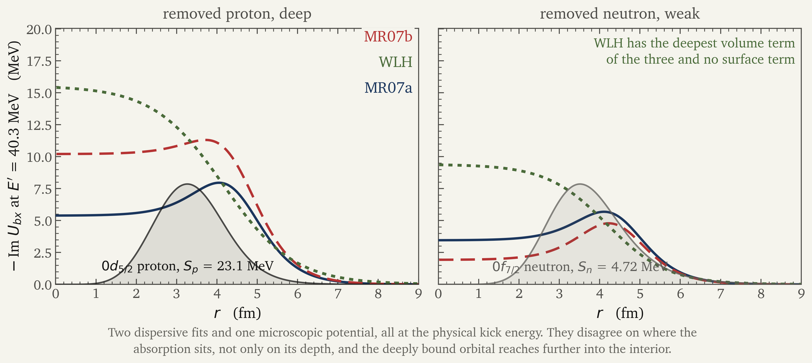
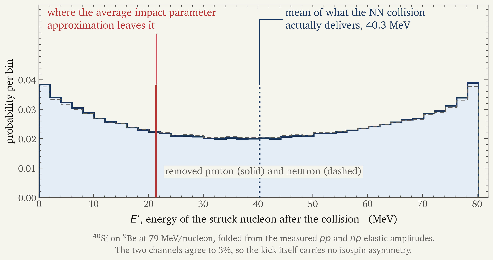

# How much of spectroscopic quenching<br>belongs to the reaction model?

<div class="text-xl mt-6" style="color: var(--olive);">
Jin Lei
</div>

<div class="text-sm mt-2" style="color: var(--stone); line-height: 1.5;">
School of Physics Science and Engineering, Tongji University, Shanghai<br>
Southern Center for Nuclear-Science Theory, Institute of Modern Physics, CAS, Huizhou
</div>

<div class="text-base mt-7" style="color: var(--stone);">
QFS-RB 2026 &nbsp;&middot;&nbsp; Takayama
</div>

<div class="text-xs mt-16" style="color: var(--stone);">
NSFC 12475132 and 12535009 &nbsp;&middot;&nbsp; Fundamental Research Funds for the Central Universities
</div>

---

# The slope you all use

<div class="grid grid-cols-5 gap-7 mt-1">
<div class="col-span-3">


<div class="fig-caption">
J. A. Tostevin and A. Gade, <b>Phys. Rev. C 103, 054610 (2021)</b>, Fig. 2.<br>
The band is the scatter of the compilation, half-width 0.1, <b>not a fit uncertainty</b>.
</div>

</div>
<div class="col-span-2 pt-2">

<div class="text-3xl" style="color: var(--ink-blue);">
R<sub>s</sub> = 0.61 &minus; 0.016 &Delta;S
</div>

<div class="text-sm mt-2" style="color: var(--stone);">
Deeply bound removal comes out about a factor of two lower than weakly bound removal.
</div>

<div class="box-gap mt-5">
<b>Structure.</b> Correlations deplete the deeply bound orbital more.
</div>

<div class="box-idea mt-3">
<b>Reaction.</b> The model is biased, and the bias tracks &Delta;S.
</div>

<div class="text-sm mt-5" style="color: var(--olive);">
<b><sup>40</sup>Si sits in this plot twice</b>, at both ends: (&minus;n) at &minus;18.4 MeV
and (&minus;p) at +18.4 MeV. One nucleus, both extremes. That is the pair I compute.
</div>

</div>
</div>

<div class="takeaway mt-4">
How much of that slope can <b>one specific reaction mechanism</b> carry?
</div>

---

# What R<sub>s</sub> is made of

<div class="mt-4 text-center text-2xl" style="color: var(--ink-blue);">
R<sub>s</sub> = &sigma;<sub>exp</sub> / &sigma;<sub>th</sub>
&nbsp;&nbsp;&nbsp; &sigma;<sub>th</sub> = C<sup>2</sup>S &times; &sigma;<sub>sp</sub>
</div>

<div class="grid grid-cols-2 gap-8 mt-8">
<div class="kami-card">
<span class="ui-label">C<sup>2</sup>S, structure</span>
<div class="mt-2">
Shell-model spectroscopic factor. If it is too large, the trend is a
<b>structure</b> statement about correlations.
</div>
</div>
<div class="kami-card">
<span class="ui-label">&sigma;<sub>sp</sub>, reaction</span>
<div class="mt-2">
Single-particle removal cross section from a reaction model. If it is too large, the trend is a
<b>reaction</b> statement.
</div>
</div>
</div>

<div class="takeaway mt-8">
Both factors are on the same side of the ratio, so <b>the systematics alone cannot separate them</b>.
Someone has to bound one of them from theory. I am going to bound a piece of the second.
</div>

---

# What everyone computes for &sigma;<sub>sp</sub>

<div class="mt-3">
Stripping, in the eikonal form used for essentially every point on that plot:
</div>

<div class="mt-4 text-center text-xl" style="color: var(--ink-blue);">
&sigma;<sub>str</sub> = &int; d<sup>2</sup>b &nbsp;
&#10216;&phi;| &nbsp; <span class="eq-highlight">(1 &minus; |S<sub>x</sub>|<sup>2</sup>)</span>
&nbsp; <span class="eq-highlight">|S<sub>c</sub>|<sup>2</sup></span> &nbsp; |&phi;&#10217;
</div>

<div class="grid grid-cols-3 gap-5 mt-7">
<div class="kami-card">
<span class="ui-label">&phi;</span><br>
the removed nucleon's orbital in the projectile
</div>
<div class="kami-card">
<span class="ui-label">1 &minus; |S<sub>x</sub>|<sup>2</sup></span><br>
the nucleon is <b>absorbed by the target</b>
</div>
<div class="kami-card">
<span class="ui-label">|S<sub>c</sub>|<sup>2</sup></span><br>
the residue <b>survives the target</b>
</div>
</div>

<div class="box-evidence mt-7">
Eikonal, fully quantum-mechanical and transfer-to-continuum implementations of this model give
<b>consistent &sigma;<sub>sp</sub></b>. So the trend is not an artifact of how the model is solved.
If it is reaction physics at all, it is in <b>what the model assumes</b>.
</div>

---

# The Hamiltonian behind that formula

<div class="mt-4 text-center text-xl" style="color: var(--ink-blue);">
H = T<sub>R</sub> + T<sub>r</sub> + H<sub>a</sub> + U<sub>bA</sub> + U<sub>xA</sub>
</div>

<div class="text-center text-sm mt-2" style="color: var(--stone);">
H<sub>a</sub> = H<sub>b</sub> + H<sub>x</sub> + V<sub>bx</sub>
</div>

<div class="grid grid-cols-2 gap-8 mt-8">
<div>

Three bodies: residue <b>b</b>, removed nucleon <b>x</b>, target <b>A</b>.

<div class="mt-4">
The residue and the nucleon meet the target only through
<b>two separately fitted optical potentials</b>, U<sub>bA</sub> and U<sub>xA</sub>.
Between themselves they have only V<sub>bx</sub>, the real potential that binds the orbital.
</div>

</div>
<div>

<div class="box-gap">
This is the <b>core-spectator</b> picture. b is a <b>structureless</b> particle: the target
enters only through one optical S<sub>b</sub>, which removes b from the elastic channel but carries
no internal states of b, and V<sub>bx</sub> never acts on b's internal coordinates. Nothing in this
Hamiltonian lets the knockout change what state b is in.
</div>

</div>
</div>

<div class="takeaway mt-7">
Everybody writes this down and nobody asks what it costs.
</div>

---

# What the spectator formula actually counts

<div class="grid grid-cols-2 gap-8 mt-3">
<div class="kami-card">
<span class="ui-label">the formula</span>
<div class="mt-2">
Spectator b, plus <b>closure</b> over the b&thinsp;+&thinsp;x final states.
<div class="mt-3">
Closure sums over <b>every internal state of b</b>: bound, excited, and broken up.
</div>
</div>
</div>
<div class="kami-card">
<span class="ui-label">the experiment</span>
<div class="mt-2">
Detects b <b>in its bound states</b>, identified in the spectrograph.
<div class="mt-3">
Events in which the reaction took b out of its bound states are <b>not in the data</b>.
</div>
</div>
</div>
</div>

<div class="mt-4 text-center text-xl" style="color: var(--ink-blue);">
&sigma;<sub>formula</sub> = &Sigma;<sub>all states of b</sub> &nbsp;&nbsp;&ne;&nbsp;&nbsp;
&sigma;<sub>measured</sub> = P<sub>b</sub>&thinsp;(b bound)
</div>

<div class="box-evidence mt-4">
The same statement for inclusive breakup: with a structureless, spectator b, the IAV cross section
is the <b>total</b> summed over b's internal states, not b detected in a given state.
<span class="text-sm" style="color: var(--stone);">&nbsp;J. Lei, Phys. Rev. C 114, 014632 (2026).</span>
</div>

<div class="takeaway" style="margin-top: 1.4rem;">
The gap between the two is <b>b not being a spectator</b>. "Core destruction" is the part
that leaves b outside its bound states.
</div>

---

# The equals sign is an assumption

<div class="mt-3">
Project the exact cluster problem onto what the experiment measures, the residue in its
bound state, eliminating target excitation first and residue excitation second. The result
is <b>exact</b> at this level of description:
</div>

<div class="mt-5 text-center text-2xl" style="color: var(--ink-blue);">
H<sub>eff</sub> = H<sub>3</sub><sup>(0)</sup>
&nbsp;+&nbsp; <span class="eq-highlight">U<sup>(nonadd)</sup></span>
&nbsp;+&nbsp; <span class="eq-highlight">U<sup>(pol)</sup></span>
</div>

<div class="grid grid-cols-2 gap-8 mt-6">
<div class="kami-card">
<span class="ui-label">U<sup>(nonadd)</sup></span><br>
What the target does to the <b>pair</b>, beyond the sum of what it does to each of them
separately.
</div>
<div class="kami-card">
<span class="ui-label">U<sup>(pol)</sup></span><br>
What the pair does to <b>itself</b> once the residue is allowed to leave its ground state.
</div>
</div>

<div class="takeaway mt-6">
Writing H = H<sub>3</sub><sup>(0)</sup> <b>deletes both</b>. That is not a model choice you can
check against data, it is a truncation of an exact Hamiltonian, and <b>nobody has put a bound
on what was deleted</b>.
</div>

---

# What is missing has a name

<div class="mt-4">
Ask, coupling by coupling, what can change the state the residue comes out in:
</div>

<div class="grid grid-cols-3 gap-6 mt-6">

<div class="box-evidence">
<span class="tag">in</span>
<b class="ml-2">U<sub>bA</sub></b>
<div class="mt-3 text-sm">
The <b>target</b> removes b from the elastic channel.<br>
This is |S<sub>c</sub>|<sup>2</sup>.
</div>
</div>

<div class="box-evidence">
<span class="tag">in</span>
<b class="ml-2">U<sub>xA</sub></b>
<div class="mt-3 text-sm">
The <b>target</b> absorbs the nucleon.<br>
This is 1 &minus; |S<sub>x</sub>|<sup>2</sup>, the stripping itself.
</div>
</div>

<div class="box-gap">
<span class="tag">out</span>
<b class="ml-2">V<sub>bx</sub> on b's structure</b>
<div class="mt-3 text-sm">
The <b>removed nucleon</b> changes b's internal state, and b ends outside its bound states.<br>
<b>No such coupling exists.</b>
</div>
</div>

</div>

<div class="mt-6 text-sm" style="color: var(--stone);">
In the additive model V<sub>bx</sub> never acts on b's internal coordinates, and both optical
potentials are fragment-on-target. So b's non-spectator response to x is not small there,
<b>it is absent</b>, and it has to sit in the two deleted terms. Which of the two carries it, and
how they interfere, <b>I do not claim here</b>.
</div>

---

# So what does the eikonal formula become?

<div class="text-sm mt-3" style="color: var(--stone);">what everyone uses</div>

<div class="mt-1 text-center" style="color: var(--charcoal); font-size: 1.35rem;">
&int;d<sup>3</sup>r &nbsp;&nbsp; |&phi;(r)|<sup>2</sup> &nbsp;&nbsp;
|S<sub>b</sub>|<sup>2</sup> &nbsp;&nbsp; (1 &minus; |S<sub>x</sub>|<sup>2</sup>)
</div>

<div class="text-sm mt-5" style="color: var(--ink-blue);">what H<sub>eff</sub> gives, with nothing else changed</div>

<div class="mt-1 text-center" style="color: var(--ink-blue); font-size: 1.35rem;">
&int;d<sup>3</sup>r<sub>1</sub>d<sup>3</sup>r<sub>2</sub> &nbsp;&nbsp;
&phi;(r<sub>1</sub>)&phi;*(r<sub>2</sub>) &nbsp;&nbsp;
S<sub>b</sub>(1)S<sub>b</sub>*(2) &nbsp;&nbsp;
<b>K(1,2)</b> &nbsp;&nbsp;
<b>&rho;<sub>surv</sub>(r<sub>1</sub>,r<sub>2</sub>)</b>
</div>

<div class="grid grid-cols-2 gap-8 mt-6">
<div class="box-idea">
<b>One point becomes two.</b> The two S matrices are evaluated at <b>different</b> positions,
so K(1,2) = &Sigma;<sub>j&ne;0</sub> S<sub>x</sub><sup>j</sup>(1) S<sub>x</sub><sup>j</sup>*(2)
is the closure over the target's excited states.
</div>
<div class="box-idea">
<b>Closure becomes a density matrix.</b> &rho;<sub>surv</sub> is the final-state density
restricted to b in its bound states. <b>This is where b stops being a spectator.</b>
</div>
</div>

<div class="takeaway mt-6">
Set &rho;<sub>surv</sub> &rarr; &delta;(r<sub>1</sub> &minus; r<sub>2</sub>) and the second line
becomes the first <b>identically</b>. That is "the residue is a spectator", written out.
</div>

---

# Two attempts, disagreeing on the one thing that matters

<div class="grid grid-cols-2 gap-8 mt-8">
<div>

<div class="kami-card">
<b>Gomez-Ramos, Gomez-Camacho and Moro</b><br>
<span class="ui-label">Phys. Lett. B 847, 138284 (2023)</span>
<div class="mt-3">
<b>&Delta;S dependent</b>: b leaves its bound states at a rate set by the x-b absorption
W(E' &minus; E<sub>F</sub>), and the two channels do not sample the same W.
<br><br>
Their slope falls from &minus;0.013 to <b>&minus;0.004 or &minus;0.005</b> MeV<sup>-1</sup>,
a <b>62% to 69%</b> reduction.
</div>
</div>

</div>
<div>

<div class="kami-card">
<b>Bertulani</b><br>
<span class="ui-label">Phys. Lett. B 846, 138250 (2023)</span>
<div class="mt-3">
The same effect, modeled as geometric rescattering with <b>free</b> NN cross sections, and
<b>&Delta;S independent</b>: it reduces the cross section without tilting the systematics.
<br><br>
No contribution to the slope.
</div>
</div>

</div>
</div>

<div class="takeaway mt-8">
Same year, same missing channel, <b>opposite answers on the only question the systematics
asks</b>. The framework has to produce a number, not a mechanism.
</div>

---

# The pair I will work on, and what it would take

<div class="grid grid-cols-2 gap-8 mt-5">
<div>

<div class="kami-card">
<span class="ui-label">the system</span><br>
<b><sup>40</sup>Si on <sup>9</sup>Be at 79 MeV/nucleon</b>
<div class="mt-3 text-sm">
deep: <b>0d<sub>5/2</sub> proton</b>, S<sub>p</sub> = 23.1 MeV &nbsp;&rarr;&nbsp; &Delta;S = +18.4<br>
weak: <b>0f<sub>7/2</sub> neutron</b>, S<sub>n</sub> = 4.72 MeV &nbsp;&rarr;&nbsp; &Delta;S = &minus;18.4
</div>
</div>

<div class="mt-5">
Write the correction as a factor on each channel,
<span class="eq-highlight">f = &sigma;<sub>surv</sub> / &sigma;<sub>sp</sub></span>.
The corrected ratio is R<sub>s</sub>/f.
</div>

</div>
<div>

<div class="box-gap">
<b>What would it take to remove the whole trend?</b>
<div class="mt-3">
Flattening the line completely requires
<div class="text-center text-2xl mt-3" style="color: var(--gap-red, #b53333);">
f<sub>deep</sub> / f<sub>weak</sub> = 0.35
</div>
<div class="mt-3 text-sm">
a factor of three between the two channels, from a single reaction mechanism.
</div>
</div>
</div>

<div class="mt-5 text-sm" style="color: var(--stone);">
That is the target to keep in mind for the rest of the talk. Everything now turns on how
asymmetric this one mechanism can be.
</div>

</div>
</div>

---

# What I hold fixed, and what is mine

<div class="grid grid-cols-2 gap-8 mt-7">
<div>

<div class="box-evidence">
<b>Held fixed, shared with the baseline</b>
<div class="mt-3">
The sudden approximation and the eikonal fragment-target S matrices. They are how
&sigma;<sub>sp</sub> itself is built, so they stay in the numerator and the denominator alike.
</div>
</div>

</div>
<div>

<div class="box-idea">
<b>Mine, and the only thing that changes</b>
<div class="mt-3">
The nucleon-residue coupling inside the composite: how x, moving inside the projectile,
changes the state b comes out in.
</div>
</div>

</div>
</div>

<div class="mt-8" style="color: var(--stone);">
This matters more than it sounds. Removing the sudden approximation in the numerator only
would import a different effect, the non-sudden physics on the nucleon side, and let me call
it this one. The comparison has to be one variable at a time or it means nothing.
</div>

---

# Ingredient 1: where the orbital samples the absorption

<div class="grid grid-cols-5 gap-7 mt-4">
<div class="col-span-3">



<div class="fig-caption">
each orbital meets a different part of W, and the three potentials disagree on where W sits
</div>

</div>
<div class="col-span-2 pt-3">

The correction is an overlap, not a number attached to a nucleus:

<div class="mt-3 text-sm" style="color: var(--stone);">
how much absorption the removed nucleon meets depends on <b>where its orbital was</b>.
</div>

<div class="box-idea mt-5">
The deeply bound proton is interior dominated. The weakly bound neutron is not. That alone
gives some channel asymmetry, and it is the part everyone expects.
</div>

<div class="mt-5 text-sm" style="color: var(--stone);">
Geometry from the same Woods-Saxon used in the published analyses of this system, so this
ingredient is not mine to choose.
</div>

</div>
</div>

---

# Ingredient 2: the absorption itself

<div class="mt-4">
W is an external input. Rather than pick one, I take <b>three independent constructions</b>
and report the spread:
</div>

<div class="grid grid-cols-3 gap-6 mt-6">

<div class="kami-card">
<span class="ui-label">Morillon-Romain, set a</span><br>
dispersive fit to nucleon elastic scattering
</div>

<div class="kami-card">
<span class="ui-label">Morillon-Romain, set b</span><br>
the same paper, a second published parameter set. The two differ by a factor of about 2.6
in the interior
</div>

<div class="box-idea">
<span class="ui-label">Whitehead, Lim and Holt</span><br>
chiral two- and three-body forces in nuclear matter plus LDA.
<b>No fit to elastic data anywhere in it.</b>
<br>
<span class="text-xs">PRL 127, 182502 (2021)</span>
</div>

</div>

<div class="box-evidence mt-7">
The point of the third one: if a microscopic potential and a phenomenological fit give the
same answer, the answer is not about the fit.
</div>

---

# Ingredient 3: at what energy does the nucleon cross the residue?

<div class="grid grid-cols-2 gap-10 mt-6">
<div>

<div class="box-gap">
<b>The published construction</b>
<div class="mt-3">
replaces the two impact parameters by <b>one average</b>, so that unitarity can be used.
That is their Eq. (7), and it is introduced for a <b>technical</b> reason, stated as such.
<br><br>
The struck nucleon is then left at an effective energy of about
<div class="text-center text-xl mt-2">E' &asymp; 21 MeV</div>
</div>
</div>

</div>
<div>

<div class="box-evidence">
<b>What the NN collision delivers</b>
<div class="mt-3">
Fold the measured <i>pp</i> and <i>np</i> amplitudes over the knockout kinematics at
79 MeV/nucleon:
<div class="text-center text-2xl mt-3" style="color: var(--ink-blue);">
&#10216;E'&#10217; = 40 MeV
</div>
</div>
</div>

</div>
</div>

<div class="takeaway mt-7">
Nobody discusses this number, and it is the one that decides the answer.
</div>

---

# Where that 40 MeV comes from

<div class="grid grid-cols-5 gap-7 mt-4">
<div class="col-span-3">



<div class="fig-caption">
the kick energy distribution, not a fitted parameter
</div>

</div>
<div class="col-span-2 pt-3">

The struck nucleon leaves with whatever the <i>NN</i> collision gave it. That distribution is
measured, through the elastic <i>pp</i> and <i>np</i> amplitudes, folded over the knockout
kinematics.

<div class="box-evidence mt-5">
Nothing here is fitted and nothing is stipulated. The kick is an <b>observable</b>, and putting
it in is not adding a model, it is removing an approximation.
</div>

</div>
</div>

---

# Why 21 MeV and 40 MeV are not the same physics

<div class="mt-4">
The absorption is measured from the Fermi surface, W(E' &minus; E<sub>F</sub>), and the two
channels have E<sub>F</sub> differing by about |&Delta;S|.
</div>

<div class="grid grid-cols-2 gap-8 mt-6">
<div class="box-gap">
<b>At E' &asymp; 21 MeV</b>
<div class="mt-3">
A kicked deeply bound nucleon is absorbed freely, a weakly bound one is Pauli blocked.
The <b>offset contrast between the channels is near its maximum</b>, so the mechanism looks
strongly &Delta;S dependent.
</div>
</div>
<div class="box-evidence">
<b>At E' &asymp; 40 MeV</b>
<div class="mt-3">
Both channels are well above their Fermi surfaces, W has saturated, and the contrast has
largely washed out.
</div>
</div>
</div>

<div class="takeaway mt-7">
The channel asymmetry of this mechanism lives at <b>low</b> struck-nucleon energy, and the
approximation that put it there was made for unitarity, not for physics.
</div>

---

# The two calculations, three potentials

<div class="mt-5">

| kick | MR07a | MR07b | WLH (microscopic) |
|---|---|---|---|
| **average impact parameter**, their Eq. (7) | +9.0% | +73.8% | **+36.0%** |
| **physical NN kick**, &#10216;E'&#10217; = 40 MeV | -17.1% | +4.9% | **-1.1%** |

<div class="fig-caption mt-2">
share of the empirical &Delta;S slope carried by core destruction. f<sub>weak</sub> is
C<sup>2</sup>S weighted over the four bound orbitals of <sup>39</sup>Si; f<sub>deep</sub> is the
0d<sub>5/2</sub> alone, which carries 77% of that channel's weight.
</div>

</div>

<div class="grid grid-cols-2 gap-8 mt-6">
<div class="box-gap">
Under their approximation the mechanism is large and strongly potential dependent.
</div>
<div class="box-evidence">
Put the physical kick energy back and the same construction gives <b>-17% to +5%</b>,
<b>consistent with zero</b>.
</div>
</div>

---

# The same numbers as survival factors

<div class="mt-5">

| kick | | f<sub>deep</sub> | f<sub>weak</sub> | f<sub>deep</sub>/f<sub>weak</sub> |
|---|---|---|---|---|
| their Eq. (7) | MR07a | 0.306 | 0.577 | 0.53 |
| | MR07b | 0.228 | 0.588 | 0.39 |
| | WLH | 0.332 | 0.681 | 0.49 |
| physical kick | MR07a | 0.524 | 0.700 | 0.75 |
| | MR07b | 0.464 | 0.729 | 0.64 |
| | WLH | 0.453 | 0.700 | 0.65 |

</div>

<div class="takeaway mt-6">
Remember the target: removing the whole trend needs
<b>f<sub>deep</sub>/f<sub>weak</sub> = 0.35</b>. With the physical kick this mechanism reaches
<b>0.64 to 0.75</b>. It is not close, and it does not get close by changing the potential.
</div>

---

# Is it the kick, or is it the potential?

<div class="grid grid-cols-2 gap-10 mt-6">
<div>

Both spreads measured on the same grid, in points of the empirical slope:

<div class="mt-5">

```
spread over three W, physical kick     21.9
spread between the two kicks, same W   26.1
```

</div>

<div class="mt-5">
The kick decides. And I will say the margin out loud: <b>4.1 points</b>, on a rule whose
thresholds were fixed at 15 and 25 before the runs.
</div>

</div>
<div>

<div class="box-evidence">
<b>The check that convinced me</b>
<div class="mt-3">
WLH is microscopic: chiral forces in nuclear matter, no elastic fit anywhere.
It lands <b>inside</b> the bracket set by the two phenomenological sets, on both kernels.
<br><br>
Leaving the dispersive-fit family entirely does not widen the spread.
</div>
</div>

<div class="mt-5 text-sm" style="color: var(--stone);">
And it is not because WLH is weaker: its volume absorption is <b>deeper</b>. What matters is
<b>where</b> W sits, not how deep it is.
</div>

</div>
</div>

---

# What about their 62 to 69%?

<div class="mt-4">
Their published reduction comes in two steps, and their own Supplement separates them:
</div>

<div class="grid grid-cols-3 gap-6 mt-6">
<div class="kami-card">
<span class="ui-label">baseline, their six systems</span>
<div class="text-2xl mt-2">&minus;0.013</div>
<div class="text-sm mt-2" style="color: var(--stone);">MeV<sup>-1</sup></div>
</div>
<div class="box-idea">
<span class="ui-label">core destruction, unmodified Morillon</span>
<div class="text-2xl mt-2">&minus;0.010</div>
<div class="text-sm mt-2">a <b>23%</b> reduction</div>
</div>
<div class="box-gap">
<span class="ui-label">plus the compound-nucleus return correction</span>
<div class="text-2xl mt-2">&minus;0.004 / &minus;0.005</div>
<div class="text-sm mt-2"><b>62 to 69%</b>, depending on the decay code</div>
</div>
</div>

<div class="takeaway mt-7">
Most of their &Delta;S dependence is carried by the <b>return correction</b>, not by the bare
absorption. It rescales the absorption only in the weakly bound channels and only below about
30 MeV, which widens the gap between the two channels by construction.
</div>

<div class="text-xs mt-3" style="color: var(--stone);">
At my kick energy their rescaling table is identically 1, so there our potentials coincide.
The return correction is an external input for them and for me, and I have not done it.
</div>

---

# What I can and cannot say about their result

<div class="grid grid-cols-2 gap-10 mt-7">
<div>

<div class="box-evidence">
<b>Can say</b>
<ul>
<li>Their Eq. (7) removes the struck nucleon's energy, and it was introduced for unitarity.</li>
<li>In this framework that energy is what carries the &Delta;S dependence.</li>
<li>Restoring it removes the effect, on three independent potentials.</li>
</ul>
</div>

</div>
<div>

<div class="box-gap">
<b>Cannot say</b>
<ul>
<li>That their number is wrong. I have not reproduced their calculation and I am not trying to.</li>
<li>That we agree or disagree numerically: different systems metric, and their return correction is not in my numbers.</li>
</ul>
</div>

</div>
</div>

<div class="takeaway mt-7">
The claim is about <b>an approximation</b>, not about a group's result.
</div>

---

# What this settles, and what it does not

<div class="grid grid-cols-2 gap-10 mt-6">
<div>

<div class="box-evidence">
<b>Settled</b>
<ul>
<li>With the physical kick this mechanism carries <b>none</b> of the &Delta;S slope, within its own spread.</li>
<li>Its apparent size is controlled by an approximation that is never discussed, and that is now measured rather than asserted.</li>
</ul>
</div>

</div>
<div>

<div class="box-gap">
<b>Not settled</b>
<ul>
<li>One mechanism out of several. The two deleted terms are still not bounded as a whole.</li>
<li>Diffraction is scaled like stripping, stated not derived.</li>
<li>One beam energy, two systems so far.</li>
<li>No return correction.</li>
</ul>
</div>

</div>
</div>

<div class="takeaway mt-7">
If you want to explain the quenching trend by reaction dynamics, <b>this particular door is
narrower than it looked</b>.
</div>

---

# What comes next

<div class="grid grid-cols-3 gap-6 mt-9">
<div class="kami-card">
<span class="tag">1</span>
<b class="ml-2">The real part</b>
<div class="mt-3 text-sm">
Restoring the real part of the nucleon-residue interaction does not change the total
unabsorbed flux, it only decides where it sits. Reported as a bracket, not a number.
</div>
</div>
<div class="kami-card">
<span class="tag">2</span>
<b class="ml-2">The return correction</b>
<div class="mt-3 text-sm">
Compound-nucleus decay back into the original channel. External input, and the largest single
lever in the published result.
</div>
</div>
<div class="kami-card">
<span class="tag">3</span>
<b class="ml-2">The other deleted term</b>
<div class="mt-3 text-sm">
This talk bounds one consequence. U<sup>(nonadd)</sup> as a whole is still open.
</div>
</div>
</div>

---

# Summary

<div class="mt-6">

<div class="box-idea">
<b>1.</b> Every &sigma;<sub>sp</sub> behind the quenching systematics assumes
H = H<sub>3</sub><sup>(0)</sup>. That is an exact Hamiltonian with two terms deleted, and the
deletion has never been bounded.
</div>

<div class="box-idea mt-4">
<b>2.</b> One consequence of the deletion is that b is a spectator: the removed nucleon cannot
change its internal state, and the formula counts all states of b while experiment counts b bound.
Putting that coupling back is what "core destruction" means.
</div>

<div class="box-evidence mt-4">
<b>3.</b> Its &Delta;S dependence is controlled by the <b>energy of the struck nucleon</b>, not by
the absorption. With the physical NN kick it contributes <b>&minus;17% to +5%</b> of the
empirical slope, consistent with zero, on three independent potentials.
</div>

</div>

<div class="takeaway mt-6">
Removing the whole trend would need f<sub>deep</sub>/f<sub>weak</sub> = 0.35.
This mechanism gives <b>0.64 to 0.75</b>.
</div>

---
layout: center
class: text-center
---

# Thank you

<div class="mt-8 text-lg" style="color: var(--stone);">
Jin Lei &nbsp;&middot;&nbsp; Tongji University &nbsp;&middot;&nbsp; jinl@tongji.edu.cn
</div>
