# 核反应研究中的代理模型
## Surrogate Models for Nuclear Reaction Studies

### 快速、精确的核反应计算：从模拟器到神经网络

**金 磊** (Jin Lei)

同济大学物理科学与工程学院

第十九届全国核物理大会 · 2026

J. Liu, <b>Jin Lei</b>, Z. Ren, PLB 858, 139070 (2024) 
<b>Jin Lei</b>, arXiv:2512.17687 
<b>Jin Lei</b>, arXiv:2512.22500

<!--
Central message: 我们发展了三种互补的代理模型方法，将核反应计算加速2-3个数量级，使贝叶斯不确定性量化成为可能。

开场白：核反应理论计算在核物理研究中至关重要，但计算代价高昂，严重制约了不确定性量化。今天我将介绍我们课题组发展的三种代理模型方法，系统地解决这一难题。
-->

---
layout: default
---

# 理论预言没有误差棒，还有意义吗？

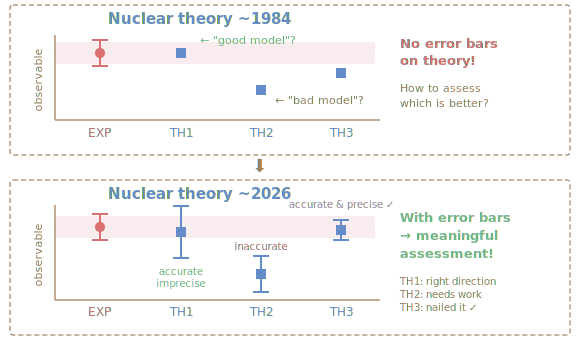

<v-clicks>

<strong>核反应也一样：</strong> 
你拟合的光学势 V0、r0、a0... 
误差棒是多少？参数间怎么关联？ 
外推到新核素，预言可信吗？

<strong>要给出误差棒，</strong>就需要用不同的参数反复跑求解器，看结果怎么变。跑得越多，答案越可靠。  
<strong>但求解器太慢了...</strong>

</v-clicks>

<!--
Central message: 用对比图直观展示：没有误差棒的理论预言无法被评判。核反应也面临同样的问题。

过渡：求解器慢到什么程度？模拟器怎么解决？
-->

---
layout: default
---

# ● 模拟器：求解器的快速替身
## Making 105 Evaluations Feasible

<v-clicks>

**问题有多严重？**

以 d+58Ni 的 CDCC 计算为例：
- 单个分波 *J*：**6.5 秒**
- 一组参数（31个 *J*）：**~3 分钟**
- 探索参数空间需要 105 组 → **约 200 天**

<strong>模拟器的思路：</strong>不每次都从头算，而是先学会"规律"，再快速预测。

**为什么可行？** 光学势参数变一点，波函数只是平滑地变一点。所以只需 ~200 次精确计算的"快照"，就能捕获所有参数下的解。

</v-clicks>

<v-click>

离线（一次性投入）

跑 200 次精确 CDCC → 收集"快照" 
→ 提取核心模式（约化基） 
计算代价：~11 小时

⬇

在线（反复调用）

新参数 → 投影到约化基 → <strong>30 ms</strong> 出结果 
105 次评估：<strong>50 分钟</strong>（不是 200 天！）

模拟器替代的是<strong>求解器</strong>，不是拟合实验数据 
[Duguet et al., Rev. Mod. Phys. 96, 031002 (2024)]

</v-click>

<!--
Central message: 用 d+58Ni CDCC 的具体数字让听众感受到模拟器的威力：200天 → 50分钟。

过渡：我们发展了三种互补的模拟器
-->

---
layout: fact
---

# ● 我们的方案
## Three Complementary Surrogate Models

我们发展了三种互补的代理模型，系统覆盖核反应计算的不同层次：

1

复标度模拟器

两体弹性散射 单一约化基覆盖所有角动量

[J. Liu, Jin Lei, Z. Ren, PLB 2024]

2

CDCC约化基模拟器

三体耦合道散射 POD + Galerkin投影

[Jin Lei, arXiv:2512.17687]

3

BiLNN神经网络

全局光学模型 可微分 · 泛化到新核素

[Jin Lei, arXiv:2512.22500]

<!--
Central message: 三种方法分别解决两体散射、多体耦合道、全局光学模型中的计算瓶颈问题，覆盖从简单到复杂的核反应体系。

过渡：让我依次介绍每种方法。
-->

---
layout: section
---

# 方法一：复标度散射模拟器
## Complex Scaling Scattering Emulator

J. Liu, Jin Lei, Z. Ren — Phys. Lett. B 858, 139070 (2024)

<!--
过渡到第一种方法的详细介绍
-->

---
layout: two-cols
---

# ● 复标度方法的核心思想

**问题：** 传统模拟器为什么需要对每个角动量 ℓ 构建独立的约化基？

<v-clicks>

因为不同 ℓ 的散射波函数有 **不同的振荡边界条件**

**复标度的妙处：**
- 将散射波函数的坐标旋转 r → reiθ
- 振荡边界 → **指数衰减边界**
- 所有 ℓ 的边界条件变得统一！

<strong>结果：</strong>一组约化基可以同时模拟所有角动量通道和势参数，存储量降低一个数量级。

</v-clicks>

::right::

$$
\psi_\ell^{\rm sc}(r) \to \psi_\ell^{\rm sc,\theta}(r) = e^{i\theta/2}\psi_\ell^{\rm sc}(re^{i\theta})
$$

<v-click>

**模拟器构建流程：**

1. 选取 Ns 组训练参数 (LHS采样)
2. 对每组参数精确求解 → 获得快照解
3. PCA提取 n 维约化基
4. 新参数 → 投影到约化基 → 求解小方程

**复杂度降低：** O(Ns2) → O(n3)

</v-click>

<!--
Central message: 复标度消除了边界条件对角动量的依赖，使得单一约化基可以跨所有通道使用。

关键点：这不仅减少存储，还避免了KVP方法中的Kohn异常（数值奇点），因为不需要矩阵求逆。
-->

---
layout: default
---

# ● 复标度模拟器：验证结果

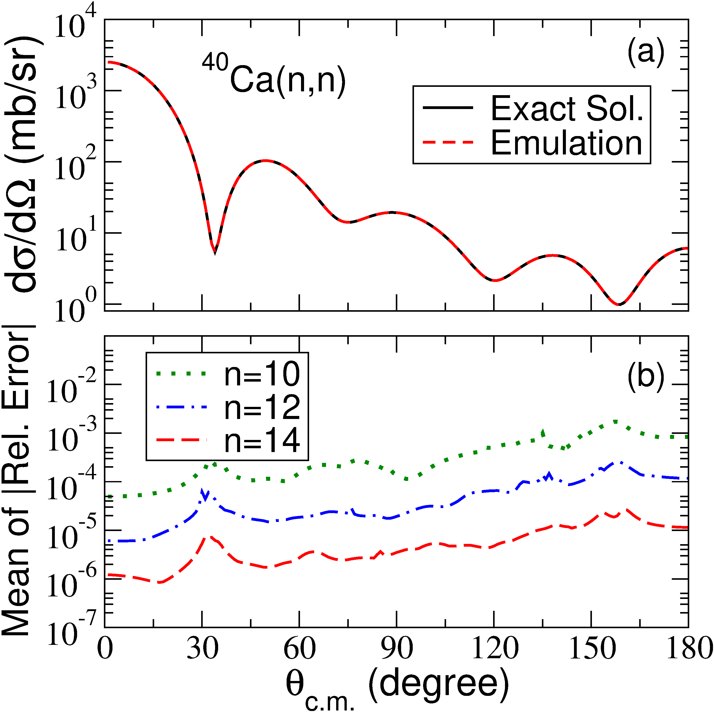

(a) n+40Ca 微分截面 (b) 相对误差随约化基维数的变化

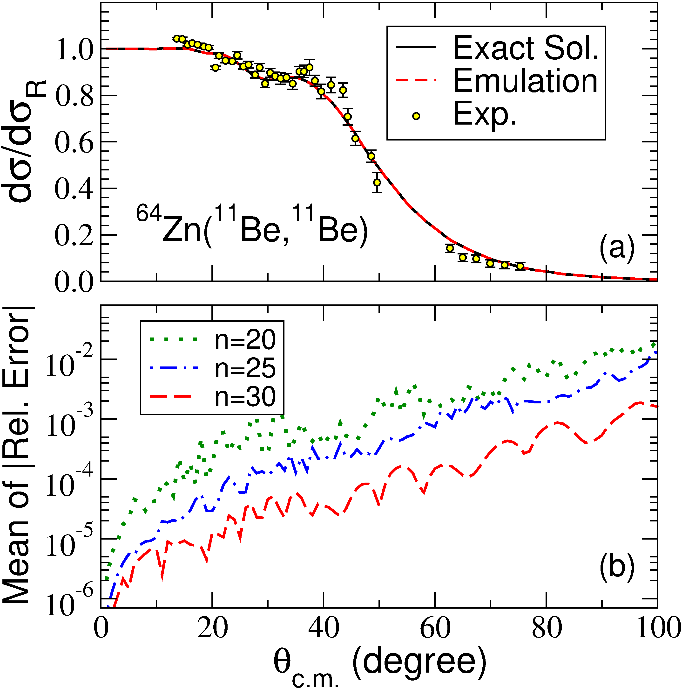

(a) 11Be+64Zn 微分截面（含实验数据） (b) 约化基收敛性

<v-click>

Takeaway: 14维约化基即可达到 10-5 精度；模拟器同时再现了 11Be+64Zn 的精确计算和实验数据，数值稳定无奇点。

</v-click>

<!--
Central message: 复标度模拟器在两个测试体系上展现了高精度和鲁棒性。

左图：n+40Ca 在 E_cm=20 MeV 的弹性散射微分截面。红色虚线（模拟器）与黑色实线（精确解）完全重合。下面板显示误差随约化基维数 n=10,12,14 迅速下降。

右图：11Be+64Zn 在 E_cm=24.5 MeV（约1.4倍库仑势垒）。这是一个halo核的散射，需要高达 ℓ_max=60 的角动量。30维约化基的误差 < 10^{-3}。黄色圆点是实验数据。

关键：传统方法需要 61 组独立的约化基（每个 ℓ 一组），我们只需要 1 组。
-->

---
layout: section
---

# 方法二：CDCC约化基模拟器
## Reduced Basis Emulator for CDCC

Jin Lei — arXiv:2512.17687

<!--
过渡到第二种方法
-->

---
layout: default
---

# ● CDCC模拟器的构建

**挑战：** CDCC计算涉及 30-50 个耦合道，系统维度 Ntot ≈ 5000–10000

<v-clicks>

**离线阶段（一次性）：**
1. 对 Ns 组参数求解完整CDCC
2. 构建快照矩阵（所有通道联合）
3. SVD截断 → 提取 nb 个POD模式

**在线阶段（快速重复）：**
1. 构建新参数处的势矩阵
2. Galerkin投影到约化基
3. 求解 nb × nb 小方程

</v-clicks>

<v-click>

<strong>关键创新：</strong>所有耦合道共享同一组约化基，基维度 nb 由奇异值衰减决定而非通道数。

</v-click>

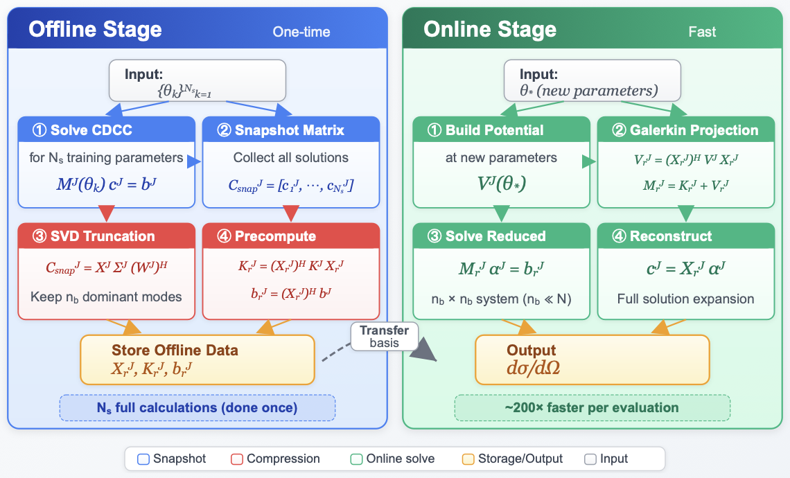

<!--
Central message: 通过联合所有通道构建快照矩阵并用SVD提取约化基，CDCC模拟器将维度从~5000降至~50。

右图是完整的模拟器工作流示意图。左侧（蓝色）是离线阶段：求解CDCC、构建快照矩阵、SVD截断、预计算。右侧（绿色）是在线阶段：构建势矩阵、Galerkin投影、求解约化方程、重构完整解。

关键技术点：
- POD = Proper Orthogonal Decomposition
- 利用势矩阵 V^J 的块对角结构加速计算
- 参数无关部分（K^J）在训练时预计算
-->

---
layout: default
---

# ● CDCC模拟器：d+58Ni 弹性散射

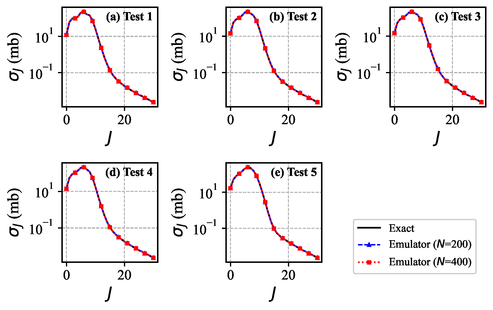

分波弹性截面 σJ vs J：五组测试参数

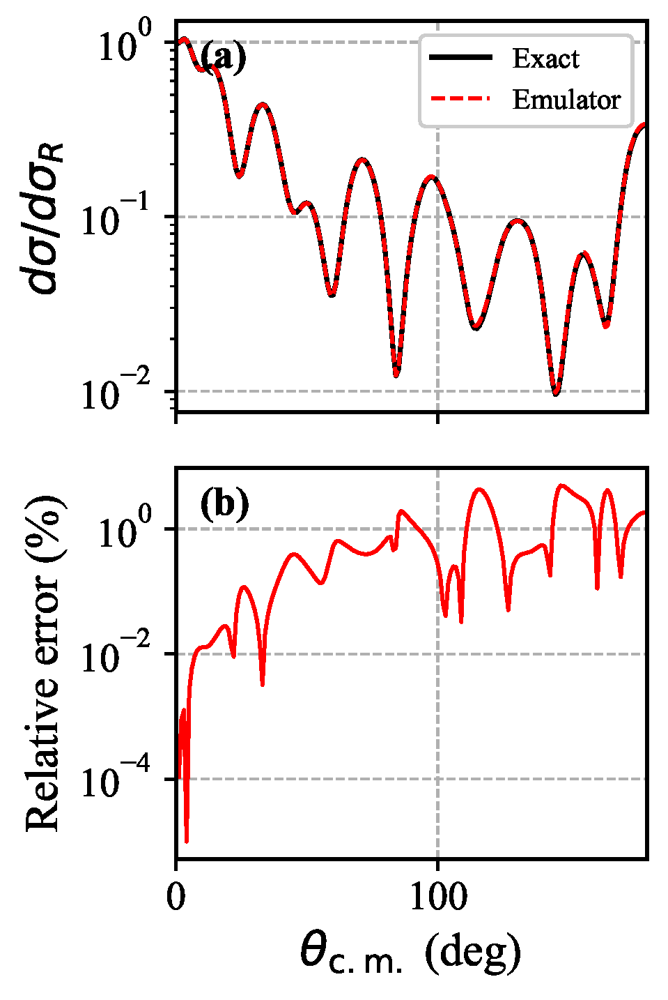

弹性道波函数（左）和角分布（右）

<v-click>

Takeaway: 在18维参数空间中，200个训练样本即可实现 &lt; 0.05% 的总截面误差，加速比约 220×。

</v-click>

<!--
Central message: CDCC模拟器在氘核+58Ni散射中验证了高精度和大幅加速。

左图：五组独立测试参数的分波截面 σ_J。黑实线=精确CDCC，蓝三角=200训练样本的模拟器，红方块=400训练样本。三条曲线完全重叠。

右上：J=0 的弹性道波函数系数 c_1(r)，实部和虚部。模拟器（红虚线）与精确解（黑实线）不可区分。

右下：弹性角分布 dσ/dσ_R。模拟器完美再现了衍射图案。相对误差 < 0.1%。

计算代价：完整CDCC（单个J）= 6.5秒，模拟器预测 = 30毫秒 → 220倍加速。
使贝叶斯推断成为可能：10^5次评估从数月缩短到数小时。
-->

---
layout: section
---

# 方法三：BiLNN神经网络模拟器
## Bidirectional Liquid Neural Network Emulator

Jin Lei — arXiv:2512.22500

<!--
过渡到第三种方法，最具创新性的神经网络方案
-->

---
layout: default
---

# ● BiLNN：可微分的散射求解器

**核心动机：** 不仅要快，还要 **可微分**

<v-clicks>

**两个关键创新：**

1. **相空间坐标** ρ = kr
   - 波函数波长恒为 2π（与能量无关）
   - 单一网络覆盖 1–200 MeV

2. **双向液态神经网络**（BiLNN）
   - Forward CfC: r=0 → rmax（左边界 ψ(0)=0）
   - Backward CfC: rmax → 0（右边界：渐近Coulomb行为）
   - 自然满足散射问题的双端边界条件

</v-clicks>

<v-click>

<strong>本质区别：</strong>这不是Numerov的替代品，而是一个可微分的代理模型，梯度可以从散射截面反向传播到势参数。

</v-click>

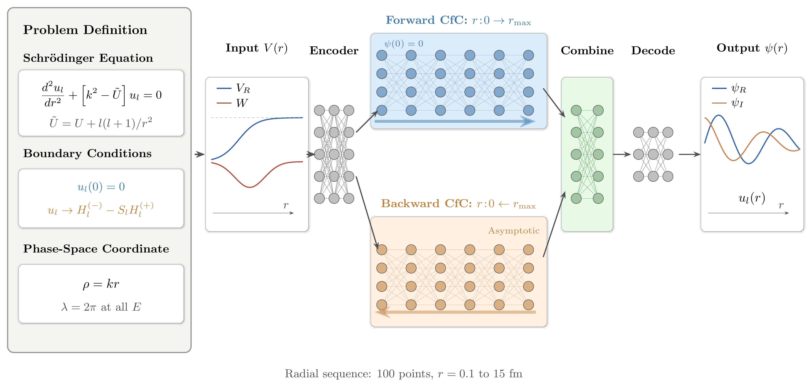

<!--
Central message: BiLNN通过相空间坐标和双向架构实现了横跨广泛参数空间的可微分散射波函数预测。

右图：BiLNN架构示意图。
- 左侧：薛定谔方程和边界条件的定义
- 中间：编码器将9维输入特征映射到高维空间
- 上方：前向CfC层（绿色）从 r=0 向外传播
- 下方：后向CfC层（橙色）从 r_max 向内传播
- 右侧：合并器 + 解码器输出波函数的实部和虚部

CfC = Closed-form Continuous-time（液态神经网络的一种）
训练数据：12个靶核 × 2种入射粒子 × 200个随机能量 × 31个分波 ≈ 148,800个样本
-->

---
layout: default
---

# ● BiLNN：波函数和散射截面

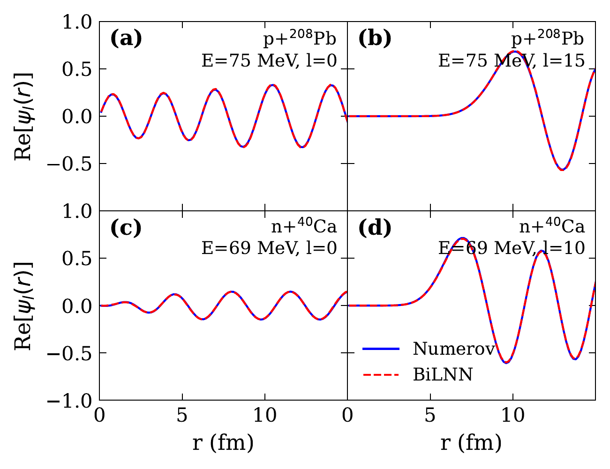

波函数比较：四种代表性体系（实线=Numerov，虚线=BiLNN）

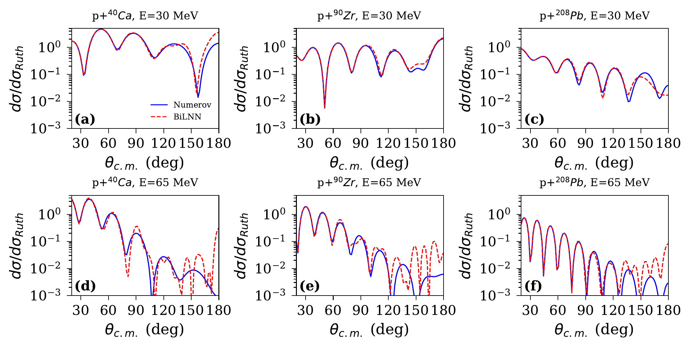

质子弹性散射角分布：40Ca, 90Zr, 208Pb

<v-click>

Takeaway: BiLNN波函数误差1.2%，S矩阵误差0.6%，角分布再现了跨4个数量级的衍射结构。

</v-click>

<!--
Central message: BiLNN准确预测了波函数、S矩阵和散射截面，覆盖从轻核到重核。

左图四个面板：
(a) p+208Pb, E=75 MeV, l=0: s波深入核内部，约5个振荡
(b) p+208Pb, E=75 MeV, l=15: 高分波，离心势垒抑制小r波函数
(c) n+40Ca, E=69 MeV, l=0: 中子散射，无库仑作用
(d) n+40Ca, E=69 MeV, l=10: 中间能量的离心势垒抑制

右图六个面板：三种靶核 × 两个能量。BiLNN（红虚线）再现了Numerov（蓝实线）的衍射极小值位置和深度。后角（>120°）偏差10-20%，这是由于小分波相位误差的相干放大。
-->

---
layout: default
---

# ● BiLNN：泛化到未训练的核素

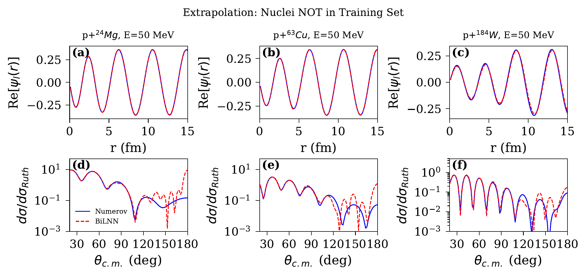

对未训练核素的预测：24Mg, 63Cu, 184W

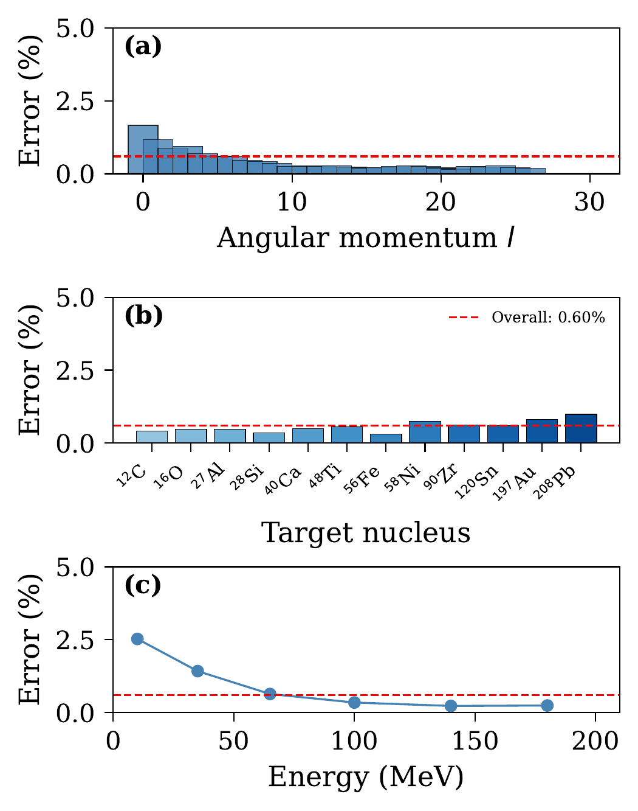

S矩阵误差分布：vs 角动量 l, 靶核, 入射能量

<v-click>

Takeaway: 网络成功泛化到训练集中未出现的核素（24Mg, 63Cu, 184W），证明它学到了KD02参数化中编码的光滑物理规律，而非记忆特定靶核的结果。

</v-click>

<!--
Central message: BiLNN的泛化能力证明它捕获了光学模型的系统物理趋势。

左图上排：三个未训练核素的 s 波波函数（l=0, E=50 MeV）。红=BiLNN，蓝=Numerov。
左图下排：对应的弹性散射角分布 dσ/dσ_Ruth。衍射结构被准确再现。

右图（误差总结）：
(a) 误差 vs 角动量 l：低分波 (~1-1.3%) 高于高分波 (~0.5%)
(b) 误差 vs 靶核：大多数0.3-0.8%，重核(197Au, 208Pb)略高 ~1%
(c) 误差 vs 能量：低能(10-20 MeV) ~2.5%，高能(>50 MeV) < 0.5%

整体S矩阵误差 = 0.6%。对于贝叶斯参数扫描等应用足够精确。
-->

---
layout: default
---

# ● 三种方法的比较
## Comparison of Three Approaches

| | 复标度模拟器 | CDCC约化基模拟器 | BiLNN神经网络 |
|---|:---:|:---:|:---:|
| **适用体系** | 两体弹性散射 | 三体耦合道(CDCC) | 核子-核弹性散射 |
| **参数维度** | ~10 | 18 | KD02全参数空间 |
| **靶核范围** | 单一体系 | 单一体系 | 12C – 208Pb |
| **能量范围** | 固定能量 | 固定能量 | 1 – 200 MeV |
| **精度** | < 10-5 | < 0.05% | ~0.6% (S矩阵) |
| **加速比** | ~100× | ~220× | ~实时 |
| **可微分** | 否 | 否 | **是** |
| **核心优势** | 无Kohn异常 | 多通道联合约化基 | 可微分+泛化 |

<v-click>

三种方法互补：约化基方法提供极高精度，神经网络提供可微分性和全局覆盖

</v-click>

<!--
Central message: 三种方法各有侧重，组合使用可覆盖核反应研究的不同需求。

约化基方法（方法1和2）：
- 精度极高（10^{-5} 到 0.05%）
- 每个体系需要独立训练
- 适合需要极高精度的贝叶斯推断

BiLNN（方法3）：
- 精度稍低但完全足够（0.6%）
- 全局覆盖多种靶核和能量
- 可微分 → 支持梯度优化、灵敏度分析
- 适合大规模参数扫描和全局光学势优化
-->

---
layout: default
---

# ● 总结
## Conclusions

<v-clicks>

1. **问题：** 核反应计算的高代价严重制约了不确定性量化和贝叶斯推断

2. **方案：** 三种互补的代理模型：复标度模拟器、CDCC约化基模拟器、BiLNN神经网络

3. **成果：**
   - 复标度模拟器消除了角动量依赖性和Kohn异常，单一约化基实现 < 10-5 精度
   - CDCC约化基模拟器首次实现了耦合道计算的 220× 加速，精度优于 0.05%
   - BiLNN构建了覆盖 12C–208Pb 的全局可微分散射求解器，S矩阵误差 0.6%

</v-clicks>

<v-click>

<strong>核心结论：</strong>代理模型将核反应研究从"单次精确计算"推进到"大规模统计推断"时代，使得光学势参数的完整后验分布探索成为可能。

</v-click>

<!--
Central message: 我们发展了三种互补的代理模型方法，系统地解决了核反应不确定性量化中的计算瓶颈。

总结三个关键信息：
1. 问题是真实而紧迫的（计算瓶颈）
2. 方案是系统而完整的（三种互补方法）
3. 成果是显著的（2-3个数量级加速，高精度）
-->

---
layout: center
class: text-center
---

# 展望：I have a DREAM!
## **D**ifferentiable **R**educed-basis **E**mulator with **A**utomatic gradient for **M**CMC

**核心思路：** 将约化基模拟器与神经网络融合，构建全链路可微分的推断框架。NN学习势矩阵的SVD系数，保留Galerkin求解保证物理精度，JAX自动微分提供梯度。

**关键指标：** 单次评估从 ~10 s 降至 ~1 ms（104× 加速），梯度驱动的NUTS采样器仅需 ~103 样本（替代随机游走的 105），推断时间从 ~12 天缩短至 ~1 秒。

**首个应用：** d+58Ni 弹性散射的18参数光学势贝叶斯推断，从实验数据提取完整后验分布。

**更广视角：** DREAM是一个通用框架，可扩展至耦合道(CC)、R-matrix、DWBA等任何参数化线性系统 M(Ω)c = b。

谢谢！

jinl@tongji.edu.cn

<!--
Central message: 代理模型为核反应研究开辟了从精确计算到统计推断的新方向。

结束语："代理模型不是要替代精确求解器，而是要解锁精确求解器在统计推断中的应用。我们的三种方法为不同复杂度的核反应体系提供了系统的解决方案。谢谢大家！"
-->

---
layout: default
---

# Backup: 复标度方法的数学细节

**复标度操作：** $r \to re^{i\theta}$，散射波函数变换为

$$
\psi_\ell^{\rm sc,\theta}(r) = e^{i\theta/2}\psi_\ell^{\rm sc}(re^{i\theta})
$$

修正的哈密顿量：$H^\theta = -\frac{\hbar^2}{2\mu}\frac{d^2}{dr^2} + \frac{\hbar^2\ell(\ell+1)}{2\mu r^2} + U_N(re^{i\theta};\boldsymbol{\omega})$

**约化基构建：**
1. 训练集：$\{\boldsymbol{\Omega}_i\}_{i=1}^{N_s}$（LHS采样），$\boldsymbol{\Omega} = \{\boldsymbol{\omega}, \ell\}$
2. 精确解：$\{c^{(i)}\}_{i=1}^{N_s}$
3. PCA降维：$\{x^{(k)}\}_{k=1}^n = {\rm PCA}[\{c^{(i)}\}]$
4. 约化基函数：$\phi_k(r) = \sum_i x_i^{(k)} g_i(r)$

**散射振幅的Born修正项：**
$$
f_\ell^{\rm sc} = -\frac{e^{-2i\sigma_\ell}}{E}\sum_i c_i(\boldsymbol{\Omega})b_i^\theta(\boldsymbol{\Omega})
$$

<!--
这个backup slide包含复标度方法的完整数学推导，用于回答关于方法细节的问题。
-->

---
layout: default
---

# Backup: CDCC模拟器的计算效率

**系统规模：** d+58Ni at $E_{\rm lab} = 21.6$ MeV
- $J_{\max} = 30$，$N_{\rm ch} \approx 37$（最大 $J$ 值）
- 径向网格：$N = 180$，$R_{\max} = 100$ fm
- 系统维度：$N_{\rm tot} = N_{\rm ch} \times N \approx 6660$

| 方法 | 时间（单个 $J$） | 加速比 |
|---|---|---|
| 完整CDCC | 6.5 s | — |
| 模拟器预测 | 30 ms | $\approx 220\times$ |

**训练代价：**
- $N_{\rm sample} = 200$，31个分波
- 总训练时间：$\approx 11$ 小时（48核服务器）
- 贝叶斯推断 $10^5$ 次评估：
  - 直接计算：$\sim 2$ 个月
  - 模拟器：$\sim 5$ 小时

**精度汇总（总截面相对误差）：**

| 测试 | $\sigma_{\rm exact}$ (mb) | 误差 ($N_s=200$) | 误差 ($N_s=400$) |
|---|---|---|---|
| Test 1 | 1245.50 | 0.0049% | 0.0245% |
| Test 2 | 1236.12 | 0.0074% | 0.0067% |
| 平均 | — | 0.016% | 0.018% |

<!--
这个backup slide提供CDCC模拟器的详细计算效率数据和精度统计。
-->

---
layout: default
---

# Backup: BiLNN训练细节与消融实验

**训练数据：**
- 12个靶核：12C, 16O, 27Al, 28Si, 40Ca, 48Ti, 56Fe, 58Ni, 90Zr, 120Sn, 197Au, 208Pb
- 质子 + 中子，$E \in [1, 200]$ MeV，$l \in [0, 30]$
- 总样本数：$\sim 148,800$

**网络参数：** $\sim 1,290,922$ 可调参数

**消融实验结果：**

| 实验 | 变化 | 误差 (%) |
|---|---|---|
| Baseline | 128 CfC units, 双向, 12核 | ~0.6 |
| 无Backward CfC | 仅单向 | 0.81 (+35%) |
| 无WKB特征 | 6维输入 | 0.62 (+3%) |
| 8个靶核 | 减少训练核素 | 0.69 |
| 50个径向点 | 粗网格 | 0.66 |
| CfC-256 | 更大网络 | 0.53 |

**关键发现：** 双向架构贡献最大（35%改善），WKB特征贡献适中（3%），因为CfC层可以隐式学习WKB相位累积。

<!--
这个backup slide提供BiLNN的训练细节和消融实验，用于回答关于网络设计选择的问题。
-->

---
layout: default
---

# Backup: 相关工作比较

**约化基/模拟器方法：**
- Furnstahl et al. (2020): 基于本征矢量延拓的散射模拟器 [PLB 809, 135719]
- König et al. (2020): 用于不确定性量化的模拟器 [PLB 810, 135814]
- Zhang & Furnstahl (2022): 三体快速模拟 [PRC 105, 064004]
- Drischler et al. (2021): KVP核反应模拟器 [PLB 823, 136777]
- Catacora-Rios et al. (2025): 耦合道波函数模拟器 [arXiv:2512.08097]

**神经网络方法：**
- PINN-ECS [Jin Lei, arXiv:2602.04553]: 基于物理信息神经网络+外部复标度
  - 优势：每道精度更高 ($\Delta\delta < 0.1$)
  - 劣势：每个 $(E, l)$ 需要独立训练
- BiLNN (本工作): 全局代理，单次训练覆盖全参数空间
  - PINN-ECS → 高精度单点计算
  - BiLNN → 快速参数扫描和贝叶斯推断

<!--
这个backup slide提供与相关工作的详细比较，用于回答"与XXX方法有何异同"的问题。
-->

---
layout: default
---

# Backup: 贝叶斯推断应用展望

**目标：** 从弹性散射实验数据提取光学势参数的后验分布

$$
P(\boldsymbol{\theta} | \mathbf{d}) \propto P(\mathbf{d} | \boldsymbol{\theta}) \cdot P(\boldsymbol{\theta})
$$

**工作流：**

实验数据 → 似然函数 → MCMC采样器 → 代理模型（快速预测） → 似然函数（循环 $10^5$ 次）→ 后验分布

**代理模型的角色：**
- 约化基模拟器：$220\times$ 加速，$10^5$ 次评估 ~5小时
- BiLNN：实时评估 + 梯度信息 → 支持HMC采样

**预期成果：**
- 光学势参数的完整后验分布（含参数关联）
- 散射截面的不确定性带
- 模型选择（不同势形式的证据比较）

<!--
这个backup slide展示贝叶斯推断的具体应用方案。
-->

